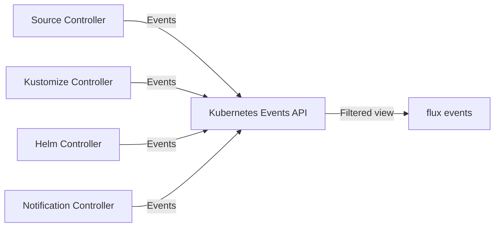

# How to Use flux events to View Recent Events

Author: [nawazdhandala](https://github.com/nawazdhandala)

Tags: Flux, Fluxcd, GitOps, Kubernetes, CLI, Events, Monitoring, Debugging, DevOps

Description: A practical guide to using the flux events command to view and analyze recent events from Flux CD resources in your Kubernetes cluster.

---

## Introduction

Flux CD generates events for every significant action it takes: fetching sources, applying manifests, reconciling resources, and reporting errors. The `flux events` command gives you a streamlined way to view these events, helping you understand what Flux has been doing and diagnose issues without digging through raw Kubernetes events.

This guide walks through every feature of `flux events`, from basic usage to advanced filtering and practical debugging workflows.

## Prerequisites

Before using `flux events`, ensure:

- A running Kubernetes cluster with Flux CD installed
- `kubectl` configured for your cluster
- The Flux CLI installed locally

Verify your setup:

```bash
# Confirm Flux is running
flux check
```

## How Flux Events Work

Flux controllers emit Kubernetes events whenever they perform actions or encounter issues. These events are standard Kubernetes events but are scoped to Flux custom resources.



The `flux events` command filters Kubernetes events to show only those related to Flux resources, presenting them in a readable format.

## Basic Usage

View all recent Flux events:

```bash
# Display recent events for Flux resources
flux events
```

Sample output:

```text
LAST SEEN   TYPE     REASON              OBJECT                          MESSAGE
2m ago      Normal   ReconciliationSucceeded   Kustomization/my-app     Reconciliation finished in 1.2s
3m ago      Normal   NewArtifact               GitRepository/my-repo    stored artifact for commit 'abc123'
5m ago      Normal   ReconciliationSucceeded   HelmRelease/nginx        release reconciliation succeeded
8m ago      Warning  ReconciliationFailed      Kustomization/staging    validation failed for resource
```

## Filtering by Resource

View events for a specific Flux resource:

```bash
# Events for a specific kustomization
flux events --for Kustomization/my-app

# Events for a specific Git repository
flux events --for GitRepository/my-repo

# Events for a specific Helm release
flux events --for HelmRelease/nginx-ingress

# Events for a specific Helm repository
flux events --for HelmRepository/bitnami
```

The format is `--for <Kind>/<Name>`.

## Filtering by Namespace

Target events in a specific namespace:

```bash
# Events for resources in the production namespace
flux events --namespace production

# Events for a specific resource in a specific namespace
flux events --for Kustomization/my-app --namespace my-team
```

By default, events are shown from the `flux-system` namespace.

## Filtering by Event Type

Show only specific types of events:

```bash
# Show only warning events (errors and issues)
flux events --types=Warning

# Show only normal events (successful operations)
flux events --types=Normal
```

This is useful for quickly identifying problems:

```bash
# Find all recent issues across Flux resources
flux events --types=Warning --all-namespaces
```

## Viewing Events Across All Namespaces

Get a cluster-wide view of Flux events:

```bash
# All Flux events across all namespaces
flux events --all-namespaces
```

This provides a comprehensive view of everything Flux is doing across your entire cluster.

## Watching Events in Real Time

Stream events as they happen:

```bash
# Watch for new events in real time
flux events --watch

# Watch events for a specific resource
flux events --watch --for Kustomization/my-app

# Watch warning events across all namespaces
flux events --watch --types=Warning --all-namespaces
```

## Understanding Event Types

### Normal Events

Normal events indicate successful operations:

| Reason | Description |
|--------|-------------|
| `ReconciliationSucceeded` | Resource was successfully reconciled |
| `NewArtifact` | A new artifact was fetched and stored |
| `InstallSucceeded` | Helm release was installed successfully |
| `UpgradeSucceeded` | Helm release was upgraded successfully |
| `TestSucceeded` | Helm release tests passed |

### Warning Events

Warning events indicate problems that need attention:

| Reason | Description |
|--------|-------------|
| `ReconciliationFailed` | Reconciliation encountered an error |
| `ArtifactFailed` | Failed to fetch or store an artifact |
| `InstallFailed` | Helm release installation failed |
| `UpgradeFailed` | Helm release upgrade failed |
| `ValidationFailed` | Resource validation failed |
| `DependencyNotReady` | A dependency has not been reconciled yet |
| `HealthCheckFailed` | Post-reconciliation health check failed |

## Practical Debugging Scenarios

### Scenario 1: Identifying Why a Deployment Failed

```bash
# Step 1: Check the kustomization status
flux get kustomization my-app

# Step 2: View events for the failing resource
flux events --for Kustomization/my-app

# Step 3: Look at the most recent warning events
flux events --for Kustomization/my-app --types=Warning

# Step 4: Check if the source is providing artifacts
flux events --for GitRepository/my-repo
```

### Scenario 2: Tracking a New Release Rollout

Monitor events as a new version is deployed:

```bash
# Start watching events for the release
flux events --watch --for HelmRelease/my-service

# In another terminal, trigger a reconciliation
flux reconcile helmrelease my-service
```

Expected event sequence for a successful Helm release:

```text
LAST SEEN   TYPE     REASON              OBJECT                    MESSAGE
1s ago      Normal   Progressing         HelmRelease/my-service    reconciliation in progress
5s ago      Normal   UpgradeSucceeded    HelmRelease/my-service    upgrade succeeded
8s ago      Normal   TestSucceeded       HelmRelease/my-service    test hooks succeeded
```

### Scenario 3: Investigating Source Fetch Issues

When Flux cannot fetch from a Git repository:

```bash
# Check events for the Git repository source
flux events --for GitRepository/my-repo

# Look for warning events
flux events --for GitRepository/my-repo --types=Warning
```

Common issues revealed by events:

```text
# Authentication failure
Warning  ArtifactFailed  GitRepository/my-repo  failed to checkout: authentication required

# Network issue
Warning  ArtifactFailed  GitRepository/my-repo  failed to clone: dial tcp: timeout

# Branch not found
Warning  ArtifactFailed  GitRepository/my-repo  failed to checkout: reference not found
```

### Scenario 4: Checking Dependency Chain Issues

When resources depend on each other:

```bash
# View events for the dependent resource
flux events --for Kustomization/apps

# Look for dependency-related warnings
flux events --for Kustomization/apps --types=Warning
```

If you see `DependencyNotReady`, check the dependency:

```bash
# Check the dependency status
flux events --for Kustomization/infrastructure
flux get kustomization infrastructure
```

## Combining Events with Logs

For comprehensive debugging, combine events with log analysis:

```bash
# Step 1: View events to identify the problem
flux events --for Kustomization/my-app --types=Warning

# Step 2: Get detailed logs for more context
flux logs --kind=Kustomization --name=my-app --level=error --since=10m

# Step 3: Check the resource status
flux get kustomization my-app
```

## Exporting Events

Save events to a file for analysis or sharing:

```bash
# Export all events to a file
flux events --all-namespaces > /tmp/flux-events.txt

# Export warning events
flux events --types=Warning --all-namespaces > /tmp/flux-warnings.txt

# Export events for a specific resource
flux events --for Kustomization/my-app > /tmp/my-app-events.txt
```

## Creating an Event Monitoring Script

Build a simple monitoring script that alerts on warning events:

```bash
#!/bin/bash
# flux-event-monitor.sh
# Monitors Flux events and highlights warnings

echo "Monitoring Flux events for warnings..."
echo "Press Ctrl+C to stop"
echo "---"

# Watch for warning events across all namespaces
flux events --watch --types=Warning --all-namespaces | while read -r line; do
    # Print timestamp and the event
    echo "[$(date '+%Y-%m-%d %H:%M:%S')] $line"

    # Optionally send to a notification system
    # curl -X POST -H 'Content-type: application/json' \
    #   --data "{\"text\":\"Flux Warning: $line\"}" \
    #   "$SLACK_WEBHOOK_URL"
done
```

## Common Flags Reference

| Flag | Description |
|------|-------------|
| `--for` | Filter events for a specific resource (Kind/Name) |
| `--namespace` | Target namespace for events |
| `--all-namespaces` | Show events from all namespaces |
| `--types` | Filter by event type (Normal, Warning) |
| `--watch`, `-w` | Watch for new events in real time |

## Event Retention

Kubernetes events have a limited retention period (typically 1 hour by default). If you need longer event history:

```bash
# For recent events, use flux events directly
flux events --for Kustomization/my-app

# For historical data, check controller logs which are retained longer
flux logs --kind=Kustomization --name=my-app --since=6h

# Consider setting up the Notification Controller to forward events
# to external systems for long-term storage
```

## Troubleshooting

### No Events Shown

If `flux events` returns nothing:

```bash
# Verify Flux is running
kubectl get pods -n flux-system

# Check if there are any Kubernetes events at all
kubectl get events -n flux-system --sort-by='.lastTimestamp'
```

### Events Are Missing for a Resource

If events for a specific resource are not appearing:

```bash
# Verify the resource exists
flux get kustomization my-app

# Check the resource namespace
flux get kustomization my-app --namespace my-team

# Try viewing events with kubectl for comparison
kubectl get events -n flux-system --field-selector involvedObject.name=my-app
```

## Best Practices

1. **Check events before logs** - Events give a quick high-level view before diving into detailed logs
2. **Use --types=Warning for triage** - Quickly find what is failing across your cluster
3. **Watch events during deployments** - Real-time monitoring catches issues immediately
4. **Combine with flux logs** - Events tell you what happened; logs tell you why
5. **Forward events externally** - Use the Notification Controller to send events to Slack, Teams, or other systems for persistent tracking

## Summary

The `flux events` command provides a focused view of what Flux CD is doing in your cluster. By filtering events by resource, type, and namespace, you can quickly understand the state of your GitOps pipeline and diagnose issues. Used alongside `flux logs`, it forms a powerful debugging toolkit that helps you maintain healthy Flux-managed clusters.
