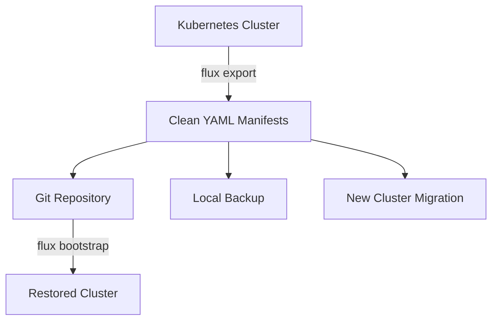

# How to Use flux export to Backup Flux Resources

Author: [nawazdhandala](https://github.com/nawazdhandala)

Tags: Flux, fluxcd, GitOps, Backup, Export, Kubernetes, Disaster-Recovery, CLI

Description: Learn how to use the flux export command to backup all your Flux CD resources for disaster recovery and migration purposes.

---

## Introduction

Backing up your Flux CD resources is a critical part of any disaster recovery strategy. The `flux export` command allows you to extract all Flux resource definitions from your cluster as YAML manifests. These exported resources can be stored in Git, used for migration, or applied to restore a cluster after a failure.

This guide covers practical usage of `flux export` across all supported Flux resource types.

## Prerequisites

- Flux CLI installed (v2.2.0 or later)
- A running Kubernetes cluster with Flux installed
- kubectl configured with cluster access
- A Git repository for storing backups (recommended)

## Understanding What flux export Does

The `flux export` command reads Flux custom resources from your cluster and outputs them as clean YAML manifests. These manifests are stripped of cluster-specific metadata like UIDs, creation timestamps, and status fields, making them portable and reusable.



## Exporting All Resources

The quickest way to backup everything is to export all Flux resources at once:

```bash
# Export all Flux resources across all namespaces
flux export source all --all-namespaces > sources-backup.yaml

# Export all Kustomization resources
flux export kustomization --all-namespaces > kustomizations-backup.yaml

# Export all HelmRelease resources
flux export helmrelease --all-namespaces > helmreleases-backup.yaml
```

## Exporting Git Sources

Git repositories are the foundation of most Flux deployments:

```bash
# Export all GitRepository sources
flux export source git --all-namespaces

# Export a specific GitRepository
flux export source git my-app-repo --namespace=flux-system

# Save to a file
flux export source git my-app-repo \
  --namespace=flux-system > my-app-repo.yaml
```

Example output:

```yaml
---
apiVersion: source.toolkit.fluxcd.io/v1
kind: GitRepository
metadata:
  name: my-app-repo
  namespace: flux-system
spec:
  interval: 1m0s
  ref:
    branch: main
  url: https://github.com/myorg/my-app
```

## Exporting Helm Sources

Helm repositories and charts can be exported similarly:

```bash
# Export all HelmRepository sources
flux export source helm --all-namespaces

# Export a specific HelmRepository
flux export source helm bitnami --namespace=flux-system

# Export all HelmChart sources
flux export source chart --all-namespaces
```

## Exporting OCI Sources

For OCI-based artifact sources:

```bash
# Export all OCIRepository sources
flux export source oci --all-namespaces

# Export a specific OCIRepository
flux export source oci my-oci-repo --namespace=flux-system
```

## Exporting Kustomizations

Kustomizations define how manifests are applied to the cluster:

```bash
# Export all Kustomizations
flux export kustomization --all-namespaces

# Export a specific Kustomization
flux export kustomization my-app --namespace=flux-system

# Example output
flux export kustomization infrastructure --namespace=flux-system
```

Expected output:

```yaml
---
apiVersion: kustomize.toolkit.fluxcd.io/v1
kind: Kustomization
metadata:
  name: infrastructure
  namespace: flux-system
spec:
  interval: 10m0s
  path: ./infrastructure
  prune: true
  sourceRef:
    kind: GitRepository
    name: flux-system
  timeout: 5m0s
```

## Exporting HelmReleases

HelmReleases manage Helm chart deployments:

```bash
# Export all HelmReleases
flux export helmrelease --all-namespaces

# Export a specific HelmRelease
flux export helmrelease nginx --namespace=default

# Export with values included
flux export helmrelease nginx --namespace=default > nginx-release.yaml
```

## Exporting Alert and Notification Resources

Do not forget to backup your alerting configuration:

```bash
# Export all Providers (notification destinations)
flux export alert-provider --all-namespaces > providers-backup.yaml

# Export all Alerts
flux export alert --all-namespaces > alerts-backup.yaml

# Export a specific alert
flux export alert critical-alerts --namespace=flux-system
```

## Exporting Image Automation Resources

If you use Flux image automation, export those resources too:

```bash
# Export ImageRepository resources
flux export image repository --all-namespaces > image-repos-backup.yaml

# Export ImagePolicy resources
flux export image policy --all-namespaces > image-policies-backup.yaml

# Export ImageUpdateAutomation resources
flux export image update --all-namespaces > image-updates-backup.yaml
```

## Complete Backup Script

Here is a comprehensive backup script that exports all Flux resources:

```bash
#!/bin/bash
# flux-backup.sh
# Complete backup of all Flux CD resources

set -euo pipefail

# Configuration
BACKUP_DIR="./flux-backup-$(date +%Y%m%d-%H%M%S)"
NAMESPACE_FLAG="--all-namespaces"

# Create backup directory structure
mkdir -p "${BACKUP_DIR}/sources"
mkdir -p "${BACKUP_DIR}/kustomizations"
mkdir -p "${BACKUP_DIR}/helmreleases"
mkdir -p "${BACKUP_DIR}/notifications"
mkdir -p "${BACKUP_DIR}/image-automation"

echo "Starting Flux backup to ${BACKUP_DIR}..."

# Export all source types
echo "Exporting sources..."
flux export source git ${NAMESPACE_FLAG} \
  > "${BACKUP_DIR}/sources/git-repositories.yaml" 2>/dev/null || true

flux export source helm ${NAMESPACE_FLAG} \
  > "${BACKUP_DIR}/sources/helm-repositories.yaml" 2>/dev/null || true

flux export source oci ${NAMESPACE_FLAG} \
  > "${BACKUP_DIR}/sources/oci-repositories.yaml" 2>/dev/null || true

flux export source chart ${NAMESPACE_FLAG} \
  > "${BACKUP_DIR}/sources/helm-charts.yaml" 2>/dev/null || true

flux export source bucket ${NAMESPACE_FLAG} \
  > "${BACKUP_DIR}/sources/buckets.yaml" 2>/dev/null || true

# Export Kustomizations
echo "Exporting kustomizations..."
flux export kustomization ${NAMESPACE_FLAG} \
  > "${BACKUP_DIR}/kustomizations/kustomizations.yaml" 2>/dev/null || true

# Export HelmReleases
echo "Exporting helm releases..."
flux export helmrelease ${NAMESPACE_FLAG} \
  > "${BACKUP_DIR}/helmreleases/helmreleases.yaml" 2>/dev/null || true

# Export notification resources
echo "Exporting notification resources..."
flux export alert-provider ${NAMESPACE_FLAG} \
  > "${BACKUP_DIR}/notifications/providers.yaml" 2>/dev/null || true

flux export alert ${NAMESPACE_FLAG} \
  > "${BACKUP_DIR}/notifications/alerts.yaml" 2>/dev/null || true

# Export image automation resources
echo "Exporting image automation resources..."
flux export image repository ${NAMESPACE_FLAG} \
  > "${BACKUP_DIR}/image-automation/repositories.yaml" 2>/dev/null || true

flux export image policy ${NAMESPACE_FLAG} \
  > "${BACKUP_DIR}/image-automation/policies.yaml" 2>/dev/null || true

flux export image update ${NAMESPACE_FLAG} \
  > "${BACKUP_DIR}/image-automation/update-automations.yaml" 2>/dev/null || true

# Remove empty files (resources that do not exist in the cluster)
find "${BACKUP_DIR}" -type f -empty -delete

echo "Backup complete."
echo "Files saved to: ${BACKUP_DIR}"

# Show summary
echo ""
echo "Backup contents:"
find "${BACKUP_DIR}" -type f -name "*.yaml" | while read -r f; do
  count=$(grep -c "^kind:" "$f" 2>/dev/null || echo "0")
  echo "  ${f}: ${count} resource(s)"
done
```

## Restoring from Backup

To restore Flux resources from a backup:

```bash
# Apply all backup files to the cluster
kubectl apply -f ./flux-backup-20260306-120000/sources/
kubectl apply -f ./flux-backup-20260306-120000/kustomizations/
kubectl apply -f ./flux-backup-20260306-120000/helmreleases/
kubectl apply -f ./flux-backup-20260306-120000/notifications/
kubectl apply -f ./flux-backup-20260306-120000/image-automation/
```

Order matters when restoring. Apply resources in this sequence:

1. Sources (GitRepository, HelmRepository, OCIRepository, Bucket)
2. Kustomizations
3. HelmReleases
4. Notification providers and alerts
5. Image automation resources

## Storing Backups in Git

A best practice is to commit your backups to a Git repository:

```bash
#!/bin/bash
# git-backup.sh
# Export and commit Flux resources to a backup repository

BACKUP_REPO="/path/to/flux-backups"
CLUSTER_NAME="production"

# Run the export
flux export source all --all-namespaces \
  > "${BACKUP_REPO}/${CLUSTER_NAME}/sources.yaml"

flux export kustomization --all-namespaces \
  > "${BACKUP_REPO}/${CLUSTER_NAME}/kustomizations.yaml"

flux export helmrelease --all-namespaces \
  > "${BACKUP_REPO}/${CLUSTER_NAME}/helmreleases.yaml"

# Commit and push
cd "${BACKUP_REPO}"
git add .
git commit -m "Backup ${CLUSTER_NAME} Flux resources - $(date +%Y-%m-%d)"
git push origin main
```

## Scheduling Automated Backups

Use a Kubernetes CronJob to automate backups:

```yaml
apiVersion: batch/v1
kind: CronJob
metadata:
  name: flux-backup
  namespace: flux-system
spec:
  schedule: "0 2 * * *"  # Run daily at 2 AM
  jobTemplate:
    spec:
      template:
        spec:
          serviceAccountName: flux-backup-sa
          containers:
            - name: backup
              image: ghcr.io/fluxcd/flux-cli:v2.4.0
              command:
                - /bin/sh
                - -c
                - |
                  # Export all resources to stdout
                  echo "--- Sources ---"
                  flux export source all --all-namespaces
                  echo "--- Kustomizations ---"
                  flux export kustomization --all-namespaces
                  echo "--- HelmReleases ---"
                  flux export helmrelease --all-namespaces
          restartPolicy: OnFailure
```

## Best Practices

### Export Regularly

Run exports before and after any major cluster changes:

```bash
# Before making changes
flux export source all --all-namespaces > pre-change-sources.yaml
flux export kustomization --all-namespaces > pre-change-kustomizations.yaml

# Make your changes...

# After changes are stable
flux export source all --all-namespaces > post-change-sources.yaml
flux export kustomization --all-namespaces > post-change-kustomizations.yaml
```

### Validate Exported Resources

Always validate your exports before relying on them for recovery:

```bash
# Dry-run apply to validate the exported resources
kubectl apply --dry-run=server -f sources-backup.yaml
kubectl apply --dry-run=server -f kustomizations-backup.yaml
kubectl apply --dry-run=server -f helmreleases-backup.yaml
```

### Namespace-Specific Exports

When managing multi-tenant clusters, export by namespace:

```bash
# Export resources for a specific team namespace
flux export source all --namespace=team-alpha > team-alpha-sources.yaml
flux export kustomization --namespace=team-alpha > team-alpha-kustomizations.yaml
flux export helmrelease --namespace=team-alpha > team-alpha-helmreleases.yaml
```

## Summary

The `flux export` command is your primary tool for backing up Flux CD resources. By regularly exporting and storing your Flux resource definitions, you ensure that your GitOps configuration can be recovered quickly in the event of a cluster failure. Combine exports with Git storage and automated scheduling for a robust disaster recovery strategy.
