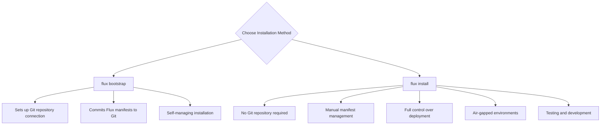

# How to Use flux install for Non-Bootstrap Installation

Author: [nawazdhandala](https://github.com/nawazdhandala)

Tags: Flux, Fluxcd, GitOps, Kubernetes, CLI, Install, Deployments, Setup

Description: Learn how to use the flux install command to deploy Flux CD components without the bootstrap process, giving you full control over the installation.

---

## Introduction

While `flux bootstrap` is the recommended way to set up Flux CD with a Git repository, there are scenarios where you need more control over the installation process. The `flux install` command deploys Flux controllers to your cluster without creating a Git repository connection or committing any manifests. This is useful for air-gapped environments, custom pipelines, testing, and advanced deployment workflows.

This guide covers practical usage of `flux install` and when to choose it over `flux bootstrap`.

## Prerequisites

- Flux CLI installed (v2.2.0 or later)
- A running Kubernetes cluster
- kubectl configured with cluster access
- Cluster admin permissions

## When to Use flux install vs flux bootstrap



Use `flux install` when:

- You manage Flux manifests through an external CI/CD system
- You are working in an air-gapped environment
- You want to generate manifests for review before applying
- You need to customize the installation beyond what bootstrap supports
- You are setting up a test or development environment

## Basic Installation

The simplest installation deploys all default components:

```bash
# Install Flux with default settings
flux install
```

This deploys the following controllers to the `flux-system` namespace:

- source-controller
- kustomize-controller
- helm-controller
- notification-controller

## Specifying Components

You can choose which components to install:

```bash
# Install only source and kustomize controllers
flux install --components=source-controller,kustomize-controller

# Install with image automation controllers (extra components)
flux install \
  --components-extra=image-reflector-controller,image-automation-controller
```

### Available Components

Core components (installed by default):

- `source-controller` - Manages source artifacts (Git, Helm, OCI, Bucket)
- `kustomize-controller` - Applies Kustomizations
- `helm-controller` - Manages HelmReleases
- `notification-controller` - Handles alerts and notifications

Extra components (must be explicitly requested):

- `image-reflector-controller` - Scans container image repositories
- `image-automation-controller` - Automates image updates in Git

```bash
# Install all components including image automation
flux install \
  --components=source-controller,kustomize-controller,helm-controller,notification-controller \
  --components-extra=image-reflector-controller,image-automation-controller
```

## Custom Namespace

By default, Flux installs into `flux-system`. You can change this:

```bash
# Install Flux into a custom namespace
flux install --namespace=gitops-system

# The namespace is created automatically if it does not exist
```

## Custom Registry

For air-gapped environments or private registries, you can specify a custom container registry:

```bash
# Install using a private registry mirror
flux install --registry=registry.internal.company.com/fluxcd

# Install with a specific image pull secret
flux install \
  --registry=registry.internal.company.com/fluxcd \
  --image-pull-secret=registry-credentials
```

### Setting Up a Private Registry Mirror

```bash
# Step 1: Pull and push Flux images to your private registry
FLUX_VERSION="v2.4.0"
PRIVATE_REGISTRY="registry.internal.company.com/fluxcd"

# List the images that Flux needs
flux install --export | grep "image:" | awk '{print $2}' | sort -u

# Pull and re-tag each image (example for source-controller)
docker pull ghcr.io/fluxcd/source-controller:v1.2.4
docker tag ghcr.io/fluxcd/source-controller:v1.2.4 \
  "${PRIVATE_REGISTRY}/source-controller:v1.2.4"
docker push "${PRIVATE_REGISTRY}/source-controller:v1.2.4"

# Step 2: Install from the private registry
flux install --registry="${PRIVATE_REGISTRY}"
```

## Exporting Manifests

The `--export` flag generates YAML without applying it:

```bash
# Export installation manifests to a file
flux install --export > flux-system.yaml

# Export with specific components
flux install \
  --components=source-controller,kustomize-controller \
  --export > flux-minimal.yaml

# Export with all components including image automation
flux install \
  --components-extra=image-reflector-controller,image-automation-controller \
  --export > flux-full.yaml
```

### Review Before Applying

```bash
# Generate the manifests
flux install --export > flux-system.yaml

# Review the manifest contents
cat flux-system.yaml | grep "kind:" | sort | uniq -c
#   1 kind: Namespace
#   4 kind: Deployment
#   4 kind: Service
#   4 kind: ServiceAccount
#   etc.

# Apply after review
kubectl apply -f flux-system.yaml
```

## Network Policy Configuration

Control network access for Flux controllers:

```bash
# Install with network policies enabled
flux install --network-policy=true

# Install without network policies (default)
flux install --network-policy=false
```

## Resource Limits and Tolerations

Customize resource allocation and scheduling:

```bash
# Install with custom tolerations (for dedicated nodes)
flux install --toleration-keys=dedicated,flux-system

# This adds tolerations for the specified keys to all controller deployments
```

## Cluster Domain Configuration

For clusters with custom DNS domains:

```bash
# Install with a custom cluster domain
flux install --cluster-domain=cluster.internal
```

## Log Level Configuration

Control the verbosity of controller logs:

```bash
# Install with debug logging
flux install --log-level=debug

# Available log levels: debug, info, error
# Default is info
```

## Watch Configuration

Control which namespaces Flux watches:

```bash
# Install with all-namespaces watch (default)
flux install --watch-all-namespaces=true

# Install to watch only the Flux namespace
flux install --watch-all-namespaces=false
```

## Complete Air-Gapped Installation

Here is a full workflow for an air-gapped installation:

```bash
#!/bin/bash
# airgap-install.sh
# Complete air-gapped Flux installation workflow

set -euo pipefail

PRIVATE_REGISTRY="registry.internal.company.com/fluxcd"
FLUX_NAMESPACE="flux-system"

# Step 1: On a machine with internet access, export the manifests
echo "Generating Flux manifests..."
flux install \
  --registry="${PRIVATE_REGISTRY}" \
  --namespace="${FLUX_NAMESPACE}" \
  --components-extra=image-reflector-controller,image-automation-controller \
  --network-policy=true \
  --export > flux-install-manifests.yaml

# Step 2: Transfer flux-install-manifests.yaml to the air-gapped environment

# Step 3: On the air-gapped cluster, apply the manifests
echo "Applying Flux manifests..."
kubectl apply -f flux-install-manifests.yaml

# Step 4: Wait for controllers to be ready
echo "Waiting for controllers to start..."
kubectl wait --for=condition=Available --timeout=300s \
  -n "${FLUX_NAMESPACE}" deployment --all

# Step 5: Verify the installation
echo "Verifying installation..."
flux check

echo "Air-gapped installation complete."
```

## Upgrading with flux install

You can also use `flux install` to upgrade an existing installation:

```bash
# Upgrade Flux components to the version matching your CLI
flux install

# Upgrade specific components
flux install --components=source-controller,kustomize-controller

# Verify the upgrade
flux version
flux check
```

## Managing Installation with External Tools

### Using Helm to Manage Flux

```bash
# Export manifests and convert to a Helm-compatible format
flux install --export > flux-system.yaml

# Or use the official Flux Helm chart
helm repo add fluxcd https://fluxcd-community.github.io/helm-charts
helm install flux fluxcd/flux2 \
  --namespace=flux-system \
  --create-namespace
```

### Using Terraform

```bash
# Export manifests for use with Terraform
flux install --export > flux-system.yaml

# Use the kubernetes_manifest resource or kubectl provider
# to apply the exported manifests
```

### Using Kustomize

```bash
# Create a kustomization overlay for Flux installation
mkdir -p flux-install/base

# Export base manifests
flux install --export > flux-install/base/flux-system.yaml

# Create a kustomization.yaml for overlays
cat > flux-install/base/kustomization.yaml <<'YAML'
apiVersion: kustomize.config.k8s.io/v1beta1
kind: Kustomization
resources:
  - flux-system.yaml
YAML

# Create a production overlay
mkdir -p flux-install/production
cat > flux-install/production/kustomization.yaml <<'YAML'
apiVersion: kustomize.config.k8s.io/v1beta1
kind: Kustomization
resources:
  - ../base
patches:
  - target:
      kind: Deployment
      namespace: flux-system
    patch: |
      - op: replace
        path: /spec/template/spec/containers/0/resources/limits/memory
        value: 512Mi
YAML

# Apply the production overlay
kubectl apply -k flux-install/production/
```

## Post-Installation Setup

After installing with `flux install`, you need to manually configure your sources:

```bash
# Step 1: Install Flux
flux install

# Step 2: Create a Git source
flux create source git my-repo \
  --url=https://github.com/myorg/my-cluster \
  --branch=main \
  --interval=1m

# Step 3: Create a Kustomization to apply manifests
flux create kustomization my-cluster \
  --source=GitRepository/my-repo \
  --path=./clusters/production \
  --prune=true \
  --interval=10m

# Step 4: Verify everything is working
flux get sources git
flux get kustomizations
```

## Uninstalling After flux install

To remove Flux installed via `flux install`:

```bash
# Uninstall Flux
flux uninstall

# Or remove manually using the exported manifests
kubectl delete -f flux-system.yaml
```

## Best Practices

1. **Always export first**: Generate manifests with `--export` and review before applying.
2. **Version-pin your installation**: Store the exported manifests in version control.
3. **Use network policies**: Enable network policies in production environments.
4. **Match CLI and cluster versions**: Use the same CLI version that matches your desired controller versions.
5. **Configure resource limits**: Adjust resources for controllers based on your cluster workload.
6. **Verify after installation**: Always run `flux check` after installing.

## Summary

The `flux install` command gives you complete control over how Flux CD is deployed to your cluster. Unlike `flux bootstrap`, it does not create Git repository connections or manage its own manifests, making it ideal for air-gapped environments, custom CI/CD pipelines, and advanced deployment scenarios. By combining `flux install --export` with your preferred deployment tool, you can integrate Flux into any existing infrastructure management workflow.
