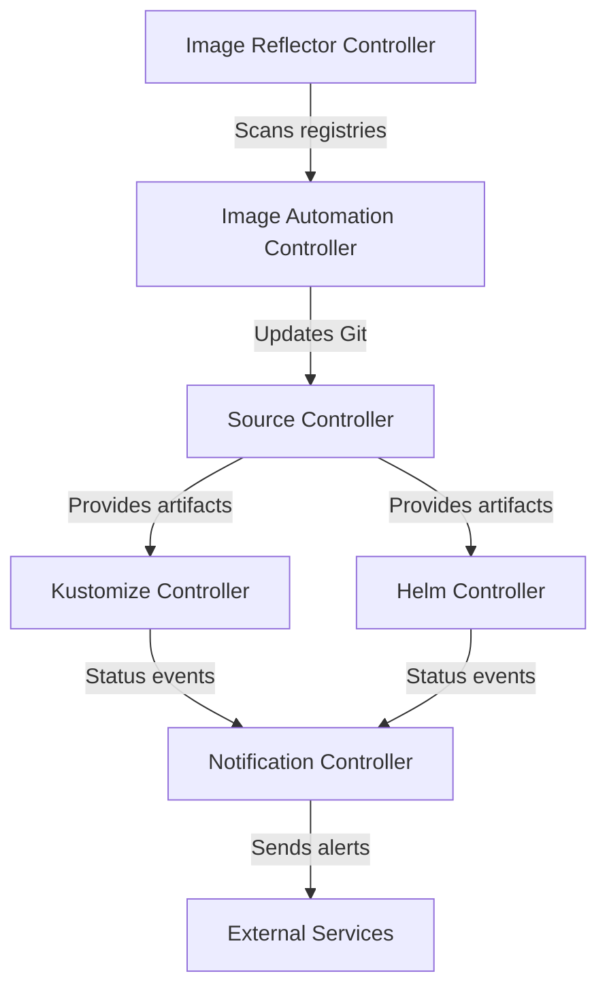

# How to Use flux logs to View Controller Logs

Author: [nawazdhandala](https://github.com/nawazdhandala)

Tags: flux, fluxcd, gitops, kubernetes, cli, logs, debugging, monitoring, devops

Description: A practical guide to using the flux logs command to view and filter Flux CD controller logs for debugging and monitoring.

---

## Introduction

When troubleshooting issues in a Flux CD-managed Kubernetes cluster, controller logs are your primary source of truth. The `flux logs` command provides a convenient way to access logs from all Flux controllers without needing to identify individual pod names or navigate complex `kubectl logs` commands.

This guide demonstrates how to use `flux logs` effectively, including filtering, streaming, and interpreting log output.

## Prerequisites

Ensure you have the following:

- A running Kubernetes cluster with Flux CD installed
- `kubectl` configured for your cluster
- The Flux CLI installed locally

Verify the Flux installation:

```bash
# Check Flux components are running
flux check
```

## Understanding Flux Controllers

Flux CD runs several controllers, each responsible for a specific aspect of the GitOps pipeline:



Each controller produces its own logs, and `flux logs` aggregates them into a single stream.

## Basic Usage

View logs from all Flux controllers:

```bash
# Display recent logs from all Flux controllers
flux logs
```

This outputs a combined log stream from all controllers running in the `flux-system` namespace. Each log line includes the controller name, timestamp, and message.

Sample output:

```
2026-03-06T10:15:32.123Z info source-controller - stored artifact for 'flux-system/my-repo'
2026-03-06T10:15:33.456Z info kustomize-controller - reconciliation finished in 1.2s
2026-03-06T10:15:34.789Z info helm-controller - release reconciliation succeeded
```

## Filtering by Log Level

Focus on specific log levels to narrow your investigation:

```bash
# Show only error-level logs
flux logs --level=error

# Show only warning-level logs
flux logs --level=warn

# Show info-level logs (default)
flux logs --level=info
```

When debugging issues, start with `--level=error` to quickly identify problems:

```bash
# Find errors across all controllers
flux logs --level=error
```

## Filtering by Controller Kind

Target logs from a specific Flux resource kind:

```bash
# View logs related to Kustomization resources
flux logs --kind=Kustomization

# View logs related to GitRepository resources
flux logs --kind=GitRepository

# View logs related to HelmRelease resources
flux logs --kind=HelmRelease

# View logs related to HelmRepository resources
flux logs --kind=HelmRepository

# View logs related to Bucket resources
flux logs --kind=Bucket
```

## Filtering by Resource Name

Narrow down to logs for a specific resource:

```bash
# View logs for a specific kustomization
flux logs --kind=Kustomization --name=my-app

# View logs for a specific Git repository source
flux logs --kind=GitRepository --name=my-repo

# View logs for a specific Helm release
flux logs --kind=HelmRelease --name=nginx-ingress
```

## Filtering by Namespace

View logs for resources in a specific namespace:

```bash
# View logs for resources in the "production" namespace
flux logs --flux-namespace=flux-system --namespace=production

# View logs for a specific resource in a specific namespace
flux logs --kind=Kustomization --name=my-app --namespace=my-team
```

## Streaming Logs in Real Time

Use the `--follow` flag to stream logs continuously:

```bash
# Stream all Flux controller logs in real time
flux logs --follow

# Stream logs for a specific resource type
flux logs --follow --kind=Kustomization

# Stream error logs only
flux logs --follow --level=error
```

This is particularly useful when you are waiting for a reconciliation to complete or monitoring a deployment in progress.

## Controlling Log Output

### Limiting the Number of Lines

```bash
# Show only the last 50 log lines
flux logs --tail=50

# Show the last 100 lines for a specific resource
flux logs --kind=Kustomization --name=my-app --tail=100
```

### Filtering by Time

```bash
# Show logs from the last 5 minutes
flux logs --since=5m

# Show logs from the last hour
flux logs --since=1h

# Show logs from the last 30 seconds
flux logs --since=30s
```

## Practical Debugging Scenarios

### Scenario 1: Diagnosing a Failed Kustomization

When a kustomization fails to reconcile:

```bash
# Step 1: Check the kustomization status
flux get kustomization my-app

# Step 2: View recent error logs for the kustomization
flux logs --kind=Kustomization --name=my-app --level=error

# Step 3: If no errors found, check info logs for clues
flux logs --kind=Kustomization --name=my-app --since=10m

# Step 4: Check source controller logs to see if the source is healthy
flux logs --kind=GitRepository --name=my-repo --since=10m
```

### Scenario 2: Investigating Helm Release Failures

When a Helm release is stuck or failing:

```bash
# Step 1: Check the Helm release status
flux get helmrelease nginx-ingress --namespace ingress

# Step 2: View Helm controller error logs
flux logs --kind=HelmRelease --name=nginx-ingress --level=error

# Step 3: Check if the Helm repository source is working
flux logs --kind=HelmRepository --name=bitnami --since=10m

# Step 4: Stream logs while forcing a reconciliation
flux logs --follow --kind=HelmRelease --name=nginx-ingress &
flux reconcile helmrelease nginx-ingress --namespace ingress
```

### Scenario 3: Monitoring a New Deployment

Watch logs in real time as you push a change to Git:

```bash
# Start streaming all relevant logs
flux logs --follow --kind=GitRepository --name=my-repo &
flux logs --follow --kind=Kustomization --name=my-app &

# Push your change to Git
# git push origin main

# Watch the output to see Flux detect and apply the change
# Press Ctrl+C when done
```

### Scenario 4: Checking Source Controller Health

Verify that Flux can reach your Git repositories:

```bash
# View all source controller logs
flux logs --kind=GitRepository --since=30m

# Look for authentication or network errors
flux logs --kind=GitRepository --level=error --since=1h
```

## Understanding Log Messages

Common log messages and their meanings:

### Source Controller Messages

```
# Successful artifact storage
stored artifact for 'flux-system/my-repo'

# Git fetch completed
fetched revision 'main@sha1:abc123'

# Authentication failure
failed to checkout and determine revision: authentication required
```

### Kustomize Controller Messages

```
# Successful reconciliation
reconciliation finished in 1.2s, next run in 10m0s

# Validation error
validation failed: error validating data

# Dependency not ready
dependency 'flux-system/infrastructure' is not ready
```

### Helm Controller Messages

```
# Successful release
release reconciliation succeeded

# Upgrade failure
Helm upgrade failed: timed out waiting for the condition

# Chart not found
chart not found in repository
```

## Combining Filters

Combine multiple filters for precise log queries:

```bash
# Error logs for a specific kustomization in the last 5 minutes
flux logs --kind=Kustomization --name=my-app --level=error --since=5m

# Stream info logs for all Git sources with a tail of 20
flux logs --follow --kind=GitRepository --level=info --tail=20

# All logs for a specific namespace in the last hour
flux logs --namespace=production --since=1h --tail=200
```

## Exporting Logs for Analysis

Redirect log output to a file for offline analysis:

```bash
# Save logs to a file
flux logs --since=1h > /tmp/flux-logs.txt

# Save error logs for all controllers
flux logs --level=error --since=24h > /tmp/flux-errors.txt

# Save logs with timestamps for a specific resource
flux logs --kind=Kustomization --name=my-app --since=6h > /tmp/my-app-logs.txt
```

## Common Flags Reference

| Flag | Description |
|------|-------------|
| `--follow`, `-f` | Stream logs in real time |
| `--tail` | Number of lines to show from the end |
| `--since` | Show logs newer than a relative duration (e.g., 5m, 1h) |
| `--level` | Filter by log level (info, warn, error) |
| `--kind` | Filter by resource kind (Kustomization, GitRepository, etc.) |
| `--name` | Filter by resource name |
| `--namespace` | Filter by resource namespace |
| `--flux-namespace` | Namespace where Flux is installed (default: flux-system) |

## Troubleshooting

### No Logs Returned

If `flux logs` returns nothing:

```bash
# Verify Flux controllers are running
kubectl get pods -n flux-system

# Check that the controller pods are not in CrashLoopBackOff
kubectl describe pod -l app=source-controller -n flux-system
```

### Logs Are Incomplete

If you suspect logs are being truncated:

```bash
# Increase the tail limit
flux logs --tail=500

# Extend the time window
flux logs --since=2h
```

## Best Practices

1. **Start broad, then narrow down** - Begin with all logs and progressively add filters
2. **Use --follow during active debugging** - Real-time streaming catches issues as they happen
3. **Check error level first** - Start with `--level=error` before reviewing info logs
4. **Correlate with events** - Use `flux events` alongside `flux logs` for a complete picture
5. **Export logs before escalating** - Save log output to files when sharing with team members

## Summary

The `flux logs` command is a powerful debugging tool that aggregates logs from all Flux controllers into a single, filterable stream. By combining filters for kind, name, level, and time range, you can quickly isolate and diagnose issues in your GitOps pipeline. Whether you are investigating a failed deployment or monitoring a new release, `flux logs` should be one of the first tools you reach for.
