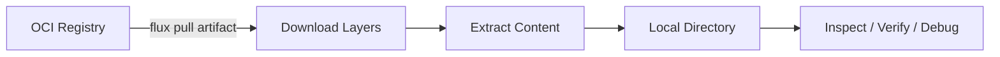

# How to Use flux pull artifact to Pull OCI Artifacts

Author: [nawazdhandala](https://github.com/nawazdhandala)

Tags: flux, fluxcd, OCI, Artifacts, pull, GitOps, Kubernetes, container-registry

Description: A practical guide to pulling OCI artifacts using the flux pull artifact command for local inspection and debugging.

---

## Introduction

The `flux pull artifact` command allows you to download OCI artifacts from container registries to your local filesystem. This is essential for inspecting artifact contents, debugging deployment issues, verifying what Flux will apply to your cluster, and recovering configurations from your registry.

This guide covers all aspects of pulling OCI artifacts with Flux, from basic usage to advanced scenarios involving authentication, verification, and automation.

## Prerequisites

Before getting started, make sure you have:

- Flux CLI installed (v2.0 or later)
- Access to an OCI-compatible container registry with existing artifacts
- Docker or another container runtime for registry authentication

```bash
# Verify Flux CLI is installed
flux version --client

# Ensure you have artifacts to pull
flux list artifacts oci://ghcr.io/myorg/app-config
```

## How OCI Artifact Pulling Works

When you pull an OCI artifact, Flux downloads the artifact layers from the registry and extracts them to a local directory.



## Basic Usage

### Pulling to a Specific Directory

```bash
# Pull an artifact and extract it to an output directory
# --output specifies where to extract the artifact contents
flux pull artifact oci://ghcr.io/myorg/app-config:v1.0.0 \
  --output ./pulled-manifests
```

### Pulling the Latest Tag

```bash
# Pull the latest version of an artifact
flux pull artifact oci://ghcr.io/myorg/app-config:latest \
  --output ./latest-manifests

# List the extracted contents
ls -la ./latest-manifests/
```

### Pulling by Digest

```bash
# Pull a specific artifact by its SHA256 digest
# This ensures you get exactly the artifact you expect
flux pull artifact oci://ghcr.io/myorg/app-config@sha256:abc123def456... \
  --output ./digest-manifests
```

## Authentication

### Using Docker Credentials

```bash
# First authenticate with your registry via Docker
docker login ghcr.io -u myuser

# Then pull the artifact (Flux will use Docker's credential store)
flux pull artifact oci://ghcr.io/myorg/app-config:v1.0.0 \
  --output ./manifests
```

### Using Inline Credentials

```bash
# Pass credentials directly to the pull command
flux pull artifact oci://docker.io/myuser/manifests:v1.0.0 \
  --output ./manifests \
  --creds="myuser:mypassword"
```

### AWS ECR Authentication

```bash
# Authenticate with AWS ECR first
aws ecr get-login-password --region us-east-1 | \
  docker login --username AWS --password-stdin 123456789.dkr.ecr.us-east-1.amazonaws.com

# Pull the artifact from ECR
flux pull artifact oci://123456789.dkr.ecr.us-east-1.amazonaws.com/manifests:v1.0.0 \
  --output ./ecr-manifests
```

### Google Container Registry

```bash
# Authenticate with GCR using gcloud
gcloud auth configure-docker

# Pull artifact from GCR
flux pull artifact oci://gcr.io/myproject/manifests:v1.0.0 \
  --output ./gcr-manifests
```

### Azure Container Registry

```bash
# Authenticate with ACR
az acr login --name myregistry

# Pull from ACR
flux pull artifact oci://myregistry.azurecr.io/manifests:v1.0.0 \
  --output ./acr-manifests
```

## Practical Use Cases

### Inspecting What Flux Will Deploy

```bash
# Pull the exact artifact that your OCIRepository references
flux pull artifact oci://ghcr.io/myorg/app-config:v2.1.0 \
  --output ./inspect

# Review the manifests
find ./inspect -name "*.yaml" -exec echo "--- {} ---" \; -exec cat {} \;

# Check for specific resources
grep -r "kind:" ./inspect/ | sort | uniq -c
```

### Comparing Two Versions

```bash
# Pull two different versions for comparison
flux pull artifact oci://ghcr.io/myorg/app-config:v1.0.0 \
  --output ./version-1

flux pull artifact oci://ghcr.io/myorg/app-config:v2.0.0 \
  --output ./version-2

# Compare the two versions
diff -r ./version-1 ./version-2

# For a more detailed comparison
diff -rq ./version-1 ./version-2
```

### Recovering Configurations

```bash
# If your Git repository is lost or corrupted, recover from the registry
# Pull the latest known good configuration
flux pull artifact oci://ghcr.io/myorg/app-config:production \
  --output ./recovered-config

# Initialize a new Git repository with the recovered content
cd ./recovered-config
git init
git add .
git commit -m "Recovered configuration from OCI registry"
```

### Validating Manifests Before Deployment

```bash
# Pull the artifact
flux pull artifact oci://ghcr.io/myorg/app-config:staging \
  --output ./validate

# Run kubectl dry-run to validate the manifests
for file in ./validate/*.yaml; do
  echo "Validating: $file"
  kubectl apply --dry-run=server -f "$file"
done

# Run kustomize build if it is a Kustomize directory
kustomize build ./validate/
```

### Auditing Artifact Contents

```bash
# Pull and audit artifact contents in a script
#!/bin/bash

ARTIFACT_URL="oci://ghcr.io/myorg/app-config"
OUTPUT_DIR="/tmp/artifact-audit"

# Clean up any previous audit
rm -rf "$OUTPUT_DIR"
mkdir -p "$OUTPUT_DIR"

# Pull the artifact
flux pull artifact "${ARTIFACT_URL}:latest" \
  --output "$OUTPUT_DIR"

# Count resources by kind
echo "=== Resource Summary ==="
grep -rh "kind:" "$OUTPUT_DIR" | sort | uniq -c | sort -rn

# Check for sensitive data patterns
echo "=== Potential Secrets Check ==="
grep -rl "password\|secret\|token\|key" "$OUTPUT_DIR" || echo "No sensitive patterns found"

# List all namespaces referenced
echo "=== Namespaces ==="
grep -rh "namespace:" "$OUTPUT_DIR" | sort -u

# Clean up
rm -rf "$OUTPUT_DIR"
```

## Scripting with flux pull artifact

### Automated Verification Pipeline

```bash
#!/bin/bash
# verify-artifact.sh
# Pulls an artifact and runs verification checks

set -euo pipefail

ARTIFACT_REF="${1:?Usage: verify-artifact.sh <oci-ref>}"
WORK_DIR=$(mktemp -d)

# Clean up on exit
trap "rm -rf $WORK_DIR" EXIT

echo "Pulling artifact: $ARTIFACT_REF"
flux pull artifact "$ARTIFACT_REF" --output "$WORK_DIR"

# Check that files were extracted
FILE_COUNT=$(find "$WORK_DIR" -type f | wc -l)
if [ "$FILE_COUNT" -eq 0 ]; then
  echo "ERROR: No files found in artifact"
  exit 1
fi

echo "Found $FILE_COUNT files in artifact"

# Validate YAML syntax
echo "Validating YAML syntax..."
YAML_ERRORS=0
for file in $(find "$WORK_DIR" -name "*.yaml" -o -name "*.yml"); do
  if ! python3 -c "import yaml; yaml.safe_load(open('$file'))" 2>/dev/null; then
    echo "  INVALID: $file"
    YAML_ERRORS=$((YAML_ERRORS + 1))
  fi
done

if [ "$YAML_ERRORS" -gt 0 ]; then
  echo "ERROR: $YAML_ERRORS YAML validation errors"
  exit 1
fi

echo "All files validated successfully"
```

### Batch Pull Multiple Artifacts

```bash
#!/bin/bash
# pull-all-artifacts.sh
# Pulls multiple artifacts for a complete environment view

REGISTRY="ghcr.io/myorg"
OUTPUT_BASE="./environment-snapshot"
TIMESTAMP=$(date +%Y%m%d-%H%M%S)

# List of artifacts to pull
ARTIFACTS=(
  "frontend-config:production"
  "backend-config:production"
  "database-config:production"
  "monitoring-config:production"
)

mkdir -p "${OUTPUT_BASE}/${TIMESTAMP}"

for artifact in "${ARTIFACTS[@]}"; do
  # Extract name from the artifact reference
  NAME=$(echo "$artifact" | cut -d: -f1)
  echo "Pulling ${artifact}..."

  mkdir -p "${OUTPUT_BASE}/${TIMESTAMP}/${NAME}"

  flux pull artifact "oci://${REGISTRY}/${artifact}" \
    --output "${OUTPUT_BASE}/${TIMESTAMP}/${NAME}"
done

echo "All artifacts pulled to: ${OUTPUT_BASE}/${TIMESTAMP}"
```

## Working with the Output

### Applying Pulled Manifests

```bash
# Pull and apply directly to a cluster
flux pull artifact oci://ghcr.io/myorg/app-config:v1.0.0 \
  --output ./apply-dir

# Apply all manifests in the directory
kubectl apply -f ./apply-dir/

# Or apply recursively if there are subdirectories
kubectl apply -R -f ./apply-dir/
```

### Using with Kustomize

```bash
# Pull a Kustomize overlay
flux pull artifact oci://ghcr.io/myorg/kustomize-app:v1.0.0 \
  --output ./kustomize-dir

# Build and review the Kustomize output
kustomize build ./kustomize-dir

# Apply the built output
kustomize build ./kustomize-dir | kubectl apply -f -
```

## Troubleshooting

### Common Issues

```bash
# Error: "artifact not found"
# Verify the artifact exists in the registry
flux list artifacts oci://ghcr.io/myorg/app-config

# Error: "unauthorized"
# Re-authenticate with the registry
docker login ghcr.io

# Error: "output directory already exists"
# Remove or specify a different output directory
rm -rf ./output-dir
flux pull artifact oci://ghcr.io/myorg/app-config:v1.0.0 \
  --output ./output-dir

# Debug with verbose output
flux pull artifact oci://ghcr.io/myorg/app-config:v1.0.0 \
  --output ./debug-output \
  --verbose
```

### Verifying Artifact Integrity

```bash
# Pull an artifact and verify its digest matches expectations
flux pull artifact oci://ghcr.io/myorg/app-config:v1.0.0 \
  --output ./verify-dir

# The digest is printed during the pull operation
# Compare it with the expected digest from your CI/CD pipeline
```

## Best Practices

1. **Use temporary directories** when pulling artifacts for inspection to avoid cluttering your workspace.
2. **Pull by digest** in production scripts to ensure you get exactly the artifact you expect.
3. **Clean up pulled artifacts** after inspection to avoid stale files.
4. **Automate verification** by integrating pull and validate steps in your CI/CD pipeline.
5. **Use diff comparisons** between versions to understand what changed before deploying.

## Summary

The `flux pull artifact` command is an essential tool for working with OCI-based GitOps workflows. It allows you to inspect, verify, compare, and recover Kubernetes configurations stored in OCI registries. Whether you are debugging a deployment issue, auditing configurations, or building an automated verification pipeline, `flux pull artifact` provides the foundation for interacting with your OCI artifacts locally.
