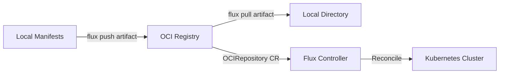

# How to Use flux push artifact to Push OCI Artifacts

Author: [nawazdhandala](https://github.com/nawazdhandala)

Tags: flux, fluxcd, oci, artifacts, push, gitops, kubernetes, container-registry

Description: A practical guide to pushing OCI artifacts using the flux push artifact command for GitOps workflows.

---

## Introduction

Flux CD supports OCI (Open Container Initiative) artifacts as a way to distribute Kubernetes manifests, Kustomize overlays, and Helm charts through container registries. The `flux push artifact` command allows you to package and push your configuration files to any OCI-compatible registry, making it easy to version and distribute your GitOps configurations.

This guide walks you through using `flux push artifact` with real-world examples, covering authentication, tagging strategies, and integration into CI/CD pipelines.

## Prerequisites

Before you begin, ensure you have the following:

- Flux CLI installed (v2.0 or later)
- Access to an OCI-compatible container registry (Docker Hub, GitHub Container Registry, AWS ECR, etc.)
- kubectl configured with access to your Kubernetes cluster
- Docker or another container runtime for registry authentication

```bash
# Verify Flux CLI installation
flux version --client

# Expected output:
# flux: v2.x.x
```

## Understanding OCI Artifacts in Flux

OCI artifacts allow you to store arbitrary content in container registries. Flux leverages this to store Kubernetes manifests alongside container images, using the same infrastructure and access controls.



## Basic Usage

The simplest form of `flux push artifact` packages a local directory and pushes it to a registry.

```bash
# Push a local directory to an OCI registry
# --path specifies the local directory containing manifests
# --source identifies the source repository for tracking
# --revision sets the version identifier
flux push artifact oci://ghcr.io/myorg/myapp-deploy:latest \
  --path="./deploy" \
  --source="$(git config --get remote.origin.url)" \
  --revision="$(git branch --show-current)@sha1:$(git rev-parse HEAD)"
```

## Authenticating with Registries

### Docker Hub

```bash
# Log in to Docker Hub using the Flux CLI
flux push artifact oci://docker.io/myuser/manifests:v1.0.0 \
  --path="./manifests" \
  --source="https://github.com/myorg/myrepo" \
  --revision="main@sha1:abc123" \
  --creds="myuser:mypassword"
```

### GitHub Container Registry

```bash
# Authenticate with GitHub Container Registry using a personal access token
echo $GITHUB_TOKEN | docker login ghcr.io -u USERNAME --password-stdin

# Push the artifact after authenticating via Docker
flux push artifact oci://ghcr.io/myorg/app-manifests:v1.0.0 \
  --path="./k8s" \
  --source="https://github.com/myorg/myrepo" \
  --revision="main@sha1:$(git rev-parse HEAD)"
```

### AWS Elastic Container Registry

```bash
# Authenticate with AWS ECR
# This retrieves a temporary token valid for 12 hours
aws ecr get-login-password --region us-east-1 | \
  docker login --username AWS --password-stdin 123456789.dkr.ecr.us-east-1.amazonaws.com

# Push to ECR
flux push artifact oci://123456789.dkr.ecr.us-east-1.amazonaws.com/manifests:v1.0.0 \
  --path="./deploy" \
  --source="https://github.com/myorg/myrepo" \
  --revision="v1.0.0@sha1:$(git rev-parse HEAD)"
```

### Azure Container Registry

```bash
# Authenticate with Azure Container Registry
az acr login --name myregistry

# Push to ACR
flux push artifact oci://myregistry.azurecr.io/manifests:v1.0.0 \
  --path="./deploy" \
  --source="https://github.com/myorg/myrepo" \
  --revision="v1.0.0"
```

## Tagging Strategies

### Semantic Versioning

```bash
# Push with a semantic version tag
flux push artifact oci://ghcr.io/myorg/app-config:1.2.3 \
  --path="./config" \
  --source="https://github.com/myorg/config-repo" \
  --revision="v1.2.3@sha1:$(git rev-parse HEAD)"
```

### Git SHA-Based Tags

```bash
# Use the short git SHA as the tag for precise tracking
GIT_SHA=$(git rev-parse --short HEAD)

flux push artifact oci://ghcr.io/myorg/app-config:${GIT_SHA} \
  --path="./config" \
  --source="https://github.com/myorg/config-repo" \
  --revision="main@sha1:$(git rev-parse HEAD)"
```

### Environment-Based Tags

```bash
# Tag by environment for promotion workflows
# Push to staging
flux push artifact oci://ghcr.io/myorg/app-config:staging \
  --path="./overlays/staging" \
  --source="https://github.com/myorg/config-repo" \
  --revision="main@sha1:$(git rev-parse HEAD)"

# Push to production
flux push artifact oci://ghcr.io/myorg/app-config:production \
  --path="./overlays/production" \
  --source="https://github.com/myorg/config-repo" \
  --revision="main@sha1:$(git rev-parse HEAD)"
```

## Pushing Different Content Types

### Kustomize Overlays

```bash
# Push a complete Kustomize directory structure
flux push artifact oci://ghcr.io/myorg/kustomize-base:v1.0.0 \
  --path="./kustomize" \
  --source="https://github.com/myorg/kustomize-repo" \
  --revision="v1.0.0@sha1:$(git rev-parse HEAD)"
```

### Helm Chart Values

```bash
# Push Helm values files as an OCI artifact
flux push artifact oci://ghcr.io/myorg/helm-values:v2.1.0 \
  --path="./helm-values" \
  --source="https://github.com/myorg/helm-config" \
  --revision="v2.1.0@sha1:$(git rev-parse HEAD)"
```

### Raw Kubernetes Manifests

```bash
# Push plain YAML manifests
flux push artifact oci://ghcr.io/myorg/k8s-manifests:latest \
  --path="./manifests" \
  --source="https://github.com/myorg/k8s-repo" \
  --revision="main@sha1:$(git rev-parse HEAD)"
```

## CI/CD Integration

### GitHub Actions

```yaml
# .github/workflows/push-manifests.yaml
name: Push OCI Artifact
on:
  push:
    branches: [main]
    paths:
      - 'deploy/**'

jobs:
  push:
    runs-on: ubuntu-latest
    permissions:
      packages: write
      contents: read
    steps:
      # Check out the repository
      - uses: actions/checkout@v4

      # Install the Flux CLI
      - uses: fluxcd/flux2/action@main

      # Authenticate with GHCR
      - name: Login to GHCR
        run: echo "${{ secrets.GITHUB_TOKEN }}" | docker login ghcr.io -u ${{ github.actor }} --password-stdin

      # Push the artifact with git metadata
      - name: Push artifact
        run: |
          flux push artifact oci://ghcr.io/${{ github.repository }}/deploy:$(git rev-parse --short HEAD) \
            --path="./deploy" \
            --source="${{ github.repositoryUrl }}" \
            --revision="${{ github.ref_name }}@sha1:${{ github.sha }}"

      # Also tag as latest for convenience
      - name: Tag as latest
        run: |
          flux tag artifact oci://ghcr.io/${{ github.repository }}/deploy:$(git rev-parse --short HEAD) \
            --tag=latest
```

### GitLab CI

```yaml
# .gitlab-ci.yml
push-manifests:
  stage: deploy
  image: ghcr.io/fluxcd/flux-cli:v2.0
  script:
    # Authenticate with the GitLab container registry
    - echo "$CI_REGISTRY_PASSWORD" | docker login $CI_REGISTRY -u $CI_REGISTRY_USER --password-stdin

    # Push the artifact
    - flux push artifact oci://$CI_REGISTRY_IMAGE/deploy:$CI_COMMIT_SHORT_SHA
        --path="./deploy"
        --source="$CI_PROJECT_URL"
        --revision="$CI_COMMIT_REF_NAME@sha1:$CI_COMMIT_SHA"
  only:
    changes:
      - deploy/**
```

## Consuming Pushed Artifacts in Flux

Once you have pushed an artifact, create an `OCIRepository` resource to consume it in your cluster.

```yaml
# oci-repository.yaml
apiVersion: source.toolkit.fluxcd.io/v1
kind: OCIRepository
metadata:
  name: app-manifests
  namespace: flux-system
spec:
  interval: 5m
  url: oci://ghcr.io/myorg/app-config
  ref:
    # Use semver to automatically pick up new versions
    semver: ">=1.0.0"
  provider: generic
```

```bash
# Apply the OCIRepository resource
kubectl apply -f oci-repository.yaml

# Verify it reconciled successfully
flux get sources oci
```

## Troubleshooting

### Common Errors

```bash
# Error: "unauthorized: authentication required"
# Solution: Ensure you are logged in to the registry
docker login ghcr.io

# Error: "artifact path not found"
# Solution: Verify the path exists and contains files
ls -la ./deploy/

# Error: "invalid reference format"
# Solution: Check that your OCI URL follows the correct format
# Correct format: oci://registry/repository:tag
# Wrong format: https://registry/repository:tag

# Debug with verbose output
flux push artifact oci://ghcr.io/myorg/test:v1.0.0 \
  --path="./deploy" \
  --source="local" \
  --revision="test" \
  --verbose
```

### Verifying a Push

```bash
# After pushing, verify the artifact exists in the registry
flux list artifacts oci://ghcr.io/myorg/app-config

# Pull the artifact back to verify its contents
flux pull artifact oci://ghcr.io/myorg/app-config:v1.0.0 \
  --output ./verify-output

# Compare the pulled content with the original
diff -r ./deploy ./verify-output
```

## Best Practices

1. **Always include source and revision metadata** to maintain traceability between artifacts and source code.
2. **Use semantic versioning** for production artifacts to enable automated version selection with semver ranges.
3. **Automate pushes in CI/CD** rather than pushing manually to ensure consistency.
4. **Use immutable tags** (like git SHAs) for production and mutable tags (like `latest`) only for development.
5. **Store credentials securely** using CI/CD secrets rather than embedding them in scripts.

## Summary

The `flux push artifact` command is a powerful tool for distributing Kubernetes configurations through OCI registries. By packaging your manifests as OCI artifacts, you gain the benefits of container registry infrastructure including versioning, access control, and global distribution. Combined with Flux's `OCIRepository` resource, this creates a robust GitOps pipeline that does not depend directly on Git repository access from within your clusters.
