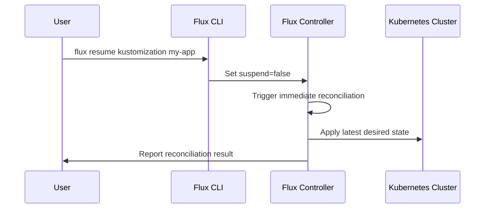

# How to Use flux resume to Resume Reconciliation

Author: [nawazdhandala](https://github.com/nawazdhandala)

Tags: Flux, Fluxcd, GitOps, Kubernetes, CLI, Resume, Reconciliation, DevOps

Description: A practical guide to using the flux resume command to resume reconciliation of previously suspended Flux CD resources.

---

## Introduction

After suspending Flux CD resources for debugging, maintenance, or manual intervention, you need a reliable way to bring them back online. The `flux resume` command re-enables the reconciliation loop for suspended resources, allowing Flux to resume syncing your desired state from Git to your Kubernetes cluster.

This guide covers the complete usage of `flux resume`, including syntax, examples, and strategies for safely resuming operations.

## Prerequisites

Before proceeding, ensure you have:

- A running Kubernetes cluster with Flux CD installed
- `kubectl` configured for your cluster
- The Flux CLI installed locally
- One or more previously suspended Flux resources

Verify your setup:

```bash
# Confirm Flux is operational
flux check

# List suspended resources to see what needs resuming
flux get kustomizations --all-namespaces
```

## How Resumption Works

When you resume a Flux resource, the following occurs:



The key point is that resuming a resource triggers an immediate reconciliation cycle, which means any changes that accumulated in Git while the resource was suspended will be applied right away.

## Basic Syntax

The general syntax for `flux resume` is:

```bash
# Resume a specific Flux resource
flux resume <resource-type> <resource-name> [flags]
```

The resource types supported by `flux resume` mirror those of `flux suspend`:

- `kustomization`
- `helmrelease`
- `source git`
- `source helm`
- `source bucket`
- `source oci`
- `image repository`
- `image policy`
- `image update`

## Resuming a Kustomization

The most common operation is resuming a suspended Kustomization:

```bash
# Resume a kustomization named "my-app"
flux resume kustomization my-app
```

Expected output:

```text
> resuming kustomization my-app in flux-system namespace
> kustomization resumed
> applied revision main@sha1:def456
```

Verify the resource is no longer suspended:

```bash
# Check the status after resuming
flux get kustomization my-app
```

Output:

```text
NAME    REVISION            SUSPENDED  READY  MESSAGE
my-app  main@sha1:def456    False      True   Applied revision: main@sha1:def456
```

## Resuming a Helm Release

Resume a previously suspended Helm release:

```bash
# Resume a Helm release
flux resume helmrelease nginx-ingress

# Resume a Helm release in a specific namespace
flux resume helmrelease nginx-ingress --namespace ingress
```

After resuming, the Helm controller will check for any pending chart updates and apply them:

```bash
# Verify the Helm release status
flux get helmrelease nginx-ingress --namespace ingress
```

## Resuming Source Resources

Resume suspended source resources to allow Flux to fetch updates again:

```bash
# Resume a Git repository source
flux resume source git my-repo

# Resume a Helm repository source
flux resume source helm bitnami

# Resume a Bucket source
flux resume source bucket my-bucket

# Resume an OCI repository source
flux resume source oci my-oci-repo
```

When you resume a source, Flux immediately fetches the latest content. All downstream resources that depend on this source will then reconcile with the new data.

## Resuming Image Automation Resources

Resume image automation resources to re-enable automatic image updates:

```bash
# Resume an image repository scan
flux resume image repository my-app

# Resume an image policy
flux resume image policy my-app-policy

# Resume image update automation
flux resume image update my-app-update
```

## Resuming Resources in a Specific Namespace

Target resources in namespaces other than the default `flux-system`:

```bash
# Resume a kustomization in a custom namespace
flux resume kustomization my-app --namespace my-team

# Resume a Helm release in the production namespace
flux resume helmrelease my-service --namespace production
```

## Resuming All Resources of a Type

Resume all suspended resources at once:

```bash
# Resume all kustomizations in the flux-system namespace
flux resume kustomization --all

# Resume all Helm releases across all namespaces
flux resume helmrelease --all --all-namespaces

# Resume all Git sources
flux resume source git --all
```

## Practical Use Cases

### Use Case 1: Post-Debugging Resumption

After finishing a debugging session where you suspended reconciliation:

```bash
# Step 1: Verify your fix is committed to Git
git log --oneline -3

# Step 2: Resume the kustomization
flux resume kustomization my-app

# Step 3: Watch the reconciliation happen
flux get kustomization my-app --watch

# Step 4: Confirm the deployment is healthy
kubectl rollout status deployment my-app -n my-app-namespace
```

### Use Case 2: Staged Resumption After Maintenance

Instead of resuming everything at once, resume resources in a controlled order:

```bash
# Step 1: Resume source resources first so they can fetch latest state
flux resume source git --all
echo "Waiting for sources to sync..."
sleep 30

# Step 2: Resume infrastructure kustomizations
flux resume kustomization infrastructure

# Step 3: Verify infrastructure is healthy
flux get kustomization infrastructure --watch

# Step 4: Resume application kustomizations
flux resume kustomization apps

# Step 5: Resume Helm releases last
flux resume helmrelease --all --all-namespaces
```

### Use Case 3: Resuming After a Failed Experiment

If you suspended a resource to test manual changes and want to revert:

```bash
# Resume the kustomization to let Flux restore the Git-defined state
flux resume kustomization my-app

# Flux will overwrite any manual changes with what is in Git
# Monitor the reconciliation
flux get kustomization my-app --watch
```

## Checking for Suspended Resources

Before resuming, identify all suspended resources:

```bash
# Find all suspended kustomizations
flux get kustomizations --all-namespaces | grep True

# Find all suspended Helm releases
flux get helmreleases --all-namespaces | grep True

# Find all suspended sources
flux get sources all --all-namespaces | grep True
```

You can create a simple script to find all suspended resources:

```bash
#!/bin/bash
# find-suspended.sh
# Lists all suspended Flux resources across all namespaces

echo "=== Suspended Kustomizations ==="
flux get kustomizations --all-namespaces 2>/dev/null | grep "True" || echo "None"

echo ""
echo "=== Suspended Helm Releases ==="
flux get helmreleases --all-namespaces 2>/dev/null | grep "True" || echo "None"

echo ""
echo "=== Suspended Sources ==="
flux get sources all --all-namespaces 2>/dev/null | grep "True" || echo "None"

echo ""
echo "=== Suspended Image Resources ==="
flux get image all --all-namespaces 2>/dev/null | grep "True" || echo "None"
```

## What to Expect After Resumption

When a resource is resumed:

1. The `spec.suspend` field is set to `false`
2. An immediate reconciliation cycle is triggered
3. The latest revision from the source is fetched and applied
4. If changes accumulated during suspension, they are all applied at once
5. Health checks resume and report the current state

Be aware that if many changes accumulated while the resource was suspended, the first reconciliation after resuming may take longer than usual.

## Common Flags Reference

| Flag | Description |
|------|-------------|
| `--namespace` | Target namespace for the resource |
| `--all` | Resume all resources of the specified type |
| `--all-namespaces` | Operate across all namespaces |

## Troubleshooting

### Resource Fails to Reconcile After Resumption

If a resource enters a failed state after being resumed:

```bash
# Check the detailed status
flux get kustomization my-app

# View controller logs for errors
flux logs --kind=Kustomization --name=my-app

# Check events for the resource
flux events --for Kustomization/my-app
```

### Resumption Does Not Trigger Reconciliation

If the resource does not reconcile after resuming, force a reconciliation:

```bash
# Force reconciliation after resuming
flux reconcile kustomization my-app
```

### Dependency Chain Issues

If your resources have dependencies, resume them in the correct order (sources first, then kustomizations):

```bash
# Resume sources first
flux resume source git my-repo

# Wait for the source to sync
flux get source git my-repo --watch

# Then resume the dependent kustomization
flux resume kustomization my-app
```

## Best Practices

1. **Resume in the correct order** - Resume sources before their dependent kustomizations and Helm releases
2. **Monitor after resuming** - Watch the reconciliation to catch any issues early
3. **Verify health after resuming** - Check that all deployments are healthy post-resumption
4. **Resume promptly** - Do not leave resources suspended longer than necessary
5. **Communicate with your team** - Notify team members when you resume suspended resources

## Summary

The `flux resume` command is the counterpart to `flux suspend` and is essential for restoring normal GitOps operations. Whether you are finishing a debugging session, completing a maintenance window, or re-enabling automation, `flux resume` gives you the control to bring resources back online in a deliberate and orderly manner. Always monitor your resources after resuming to ensure a smooth transition back to automated reconciliation.
