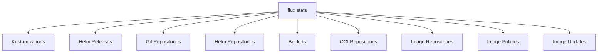

# How to Use flux stats to View Cluster Statistics

Author: [nawazdhandala](https://github.com/nawazdhandala)

Tags: flux, fluxcd, GitOps, Kubernetes, CLI, Stats, Statistics, Monitoring, DevOps

Description: A practical guide to using the flux stats command to view reconciliation statistics and health metrics for Flux CD resources in your cluster.

---

## Introduction

Understanding the health and performance of your Flux CD deployment requires visibility into reconciliation statistics. The `flux stats` command provides a summary of resource counts, reconciliation status, and readiness across all Flux resource types in your cluster.

This guide covers how to use `flux stats` to monitor your cluster, identify issues, and maintain a healthy GitOps pipeline.

## Prerequisites

Before using `flux stats`, ensure:

- A running Kubernetes cluster with Flux CD installed
- `kubectl` configured for your cluster
- The Flux CLI installed locally

Verify your installation:

```bash
# Check that Flux is installed and healthy
flux check
```

## What flux stats Shows

The `flux stats` command provides an overview of all Flux-managed resources, including:

- Total number of resources by type
- Number of ready resources
- Number of suspended resources
- Number of failing resources



## Basic Usage

View statistics for all Flux resources:

```bash
# Display stats for all Flux resource types
flux stats
```

Sample output:

```text
RECONCILERS             RUNNING   FAILING   SUSPENDED   STORAGE
Kustomization           12        1         2           -
HelmRelease             8         0         1           -
GitRepository           5         0         0           112.3 MiB
HelmRepository          3         0         0           45.7 MiB
HelmChart               8         0         0           23.1 MiB
Bucket                  1         0         0           5.2 MiB
OCIRepository           2         0         0           8.4 MiB
```

## Reading the Output

Each column in the stats output provides specific information:

| Column | Description |
|--------|-------------|
| `RECONCILERS` | The type of Flux resource |
| `RUNNING` | Number of resources actively reconciling |
| `FAILING` | Number of resources in a failed state |
| `SUSPENDED` | Number of resources that have been suspended |
| `STORAGE` | Total storage used by artifacts (for source types) |

## Filtering by Namespace

View statistics for a specific namespace:

```bash
# Stats for the default flux-system namespace
flux stats

# Stats for a specific namespace
flux stats --namespace production

# Stats across all namespaces
flux stats --all-namespaces
```

## Monitoring Cluster Health

### Quick Health Check

Use `flux stats` as a quick health indicator for your cluster:

```bash
# Run a quick health check
flux stats
```

If the `FAILING` column shows any non-zero values, investigate immediately:

```bash
# If kustomizations are failing, list them to find the problematic one
flux get kustomizations --all-namespaces --status-selector ready=false

# If Helm releases are failing, list those
flux get helmreleases --all-namespaces --status-selector ready=false
```

### Setting Up a Health Check Script

Create a script that uses `flux stats` for automated monitoring:

```bash
#!/bin/bash
# flux-health-check.sh
# Checks Flux stats and alerts if any resources are failing

# Capture flux stats output
STATS=$(flux stats 2>&1)

# Check for failing resources
FAILING=$(echo "$STATS" | awk 'NR>1 {sum += $3} END {print sum}')

if [ "$FAILING" -gt 0 ]; then
    echo "WARNING: $FAILING Flux resource(s) are failing!"
    echo ""
    echo "$STATS"
    echo ""
    echo "=== Failing Kustomizations ==="
    flux get kustomizations --all-namespaces --status-selector ready=false
    echo ""
    echo "=== Failing Helm Releases ==="
    flux get helmreleases --all-namespaces --status-selector ready=false
    echo ""
    echo "=== Failing Sources ==="
    flux get sources all --all-namespaces --status-selector ready=false
    exit 1
else
    echo "OK: All Flux resources are healthy"
    echo "$STATS"
    exit 0
fi
```

## Practical Use Cases

### Use Case 1: Pre-Deployment Health Verification

Before deploying new changes, verify the cluster is in a healthy state:

```bash
# Step 1: Check overall stats
flux stats

# Step 2: Ensure no resources are failing
# Look for zeros in the FAILING column

# Step 3: Check for any suspended resources that should be active
# Look for unexpected numbers in the SUSPENDED column

# Step 4: If everything looks good, proceed with deployment
git push origin main
```

### Use Case 2: Post-Maintenance Verification

After completing cluster maintenance, verify that all resources have recovered:

```bash
# Step 1: Resume any suspended resources
flux resume kustomization --all --all-namespaces
flux resume helmrelease --all --all-namespaces

# Step 2: Wait for reconciliation to complete
sleep 60

# Step 3: Check stats to verify everything is running
flux stats

# Step 4: Verify no resources are failing
flux stats --all-namespaces
```

### Use Case 3: Capacity Planning

Monitor storage usage over time to plan for resource allocation:

```bash
# Check current storage usage for source artifacts
flux stats
```

If storage values are growing large, consider:

```bash
# Check individual Git repositories for large artifacts
flux get sources git --all-namespaces

# Check Helm chart storage
flux get sources chart --all-namespaces

# Review artifact garbage collection settings
kubectl get gitrepository -n flux-system -o yaml | grep -A5 "spec:"
```

### Use Case 4: Team Dashboard Overview

Generate a summary report for your team:

```bash
#!/bin/bash
# flux-report.sh
# Generate a Flux status report

echo "=== Flux CD Cluster Report ==="
echo "Date: $(date)"
echo ""

echo "--- Resource Statistics ---"
flux stats --all-namespaces
echo ""

echo "--- Failing Resources ---"
FAILING_KS=$(flux get kustomizations --all-namespaces --status-selector ready=false 2>&1)
FAILING_HR=$(flux get helmreleases --all-namespaces --status-selector ready=false 2>&1)

if echo "$FAILING_KS" | grep -q "No resources found"; then
    echo "Kustomizations: All healthy"
else
    echo "Failing Kustomizations:"
    echo "$FAILING_KS"
fi

echo ""

if echo "$FAILING_HR" | grep -q "No resources found"; then
    echo "Helm Releases: All healthy"
else
    echo "Failing Helm Releases:"
    echo "$FAILING_HR"
fi

echo ""
echo "--- Suspended Resources ---"
echo "Kustomizations:"
flux get kustomizations --all-namespaces 2>/dev/null | grep "True" || echo "  None suspended"
echo ""
echo "Helm Releases:"
flux get helmreleases --all-namespaces 2>/dev/null | grep "True" || echo "  None suspended"
```

## Interpreting Statistics

### Healthy Cluster

A healthy cluster typically shows:

```text
RECONCILERS             RUNNING   FAILING   SUSPENDED   STORAGE
Kustomization           12        0         0           -
HelmRelease             8         0         0           -
GitRepository           5         0         0           112.3 MiB
```

All resources are running, none are failing, and none are unexpectedly suspended.

### Cluster with Issues

A cluster with problems might show:

```text
RECONCILERS             RUNNING   FAILING   SUSPENDED   STORAGE
Kustomization           10        2         0           -
HelmRelease             6         2         0           -
GitRepository           4         1         0           112.3 MiB
```

Investigate the failing resources immediately:

```bash
# Find failing kustomizations
flux get kustomizations --all-namespaces --status-selector ready=false

# Find failing Helm releases
flux get helmreleases --all-namespaces --status-selector ready=false

# Find failing sources
flux get sources all --all-namespaces --status-selector ready=false
```

### Cluster During Maintenance

During maintenance, expect to see suspended resources:

```text
RECONCILERS             RUNNING   FAILING   SUSPENDED   STORAGE
Kustomization           5         0         7           -
HelmRelease             3         0         5           -
GitRepository           2         0         3           112.3 MiB
```

After maintenance, all suspended counts should return to zero.

## Combining Stats with Other Commands

Use `flux stats` as a starting point and drill down with other commands:

```bash
# Step 1: Get the overview
flux stats

# Step 2: If there are failures, list the specific resources
flux get kustomizations --all-namespaces

# Step 3: Check events for failing resources
flux events --types=Warning --all-namespaces

# Step 4: View logs for more detail
flux logs --level=error --since=30m
```

## Common Flags Reference

| Flag | Description |
|------|-------------|
| `--namespace` | Target namespace for statistics |
| `--all-namespaces` | Show statistics across all namespaces |

## Troubleshooting

### Stats Command Returns Empty Output

If no statistics are displayed:

```bash
# Verify Flux controllers are running
kubectl get pods -n flux-system

# Check that Flux CRDs are installed
kubectl get crds | grep fluxcd
```

### Inaccurate Counts

If the counts seem incorrect:

```bash
# Compare with direct kubectl queries
kubectl get kustomizations --all-namespaces
kubectl get helmreleases --all-namespaces
kubectl get gitrepositories --all-namespaces
```

## Best Practices

1. **Run stats regularly** - Include `flux stats` in your daily cluster check routine
2. **Automate health checks** - Use scripts that parse stats output and alert on failures
3. **Monitor storage growth** - Keep an eye on artifact storage to prevent disk pressure
4. **Track trends** - Record stats over time to identify patterns and potential issues
5. **Zero tolerance for failures** - Investigate any non-zero value in the FAILING column immediately

## Summary

The `flux stats` command provides a high-level dashboard of your Flux CD deployment's health. By showing running, failing, and suspended resource counts alongside storage metrics, it gives you an immediate sense of your cluster's GitOps status. Use it as a first step in your monitoring workflow, then drill down with `flux get`, `flux events`, and `flux logs` to investigate any issues.
