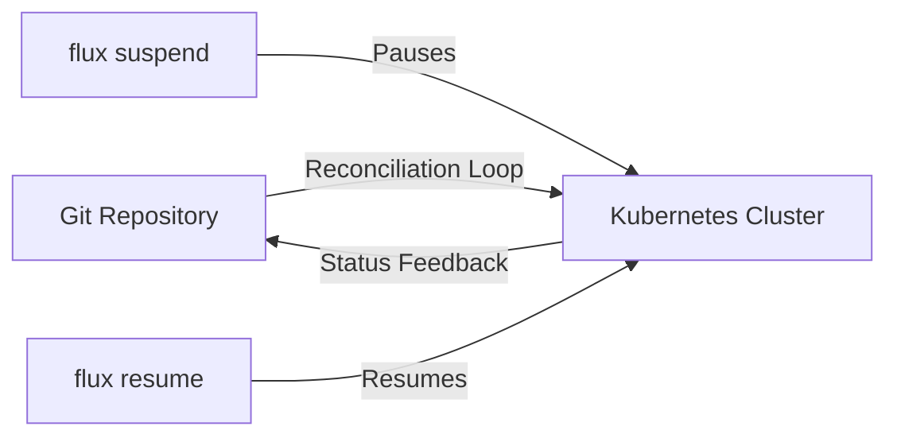

# How to Use flux suspend to Pause Reconciliation

Author: [nawazdhandala](https://github.com/nawazdhandala)

Tags: flux, fluxcd, GitOps, Kubernetes, CLI, Suspend, Reconciliation, DevOps

Description: A practical guide to using the flux suspend command to pause reconciliation of Flux CD resources in your Kubernetes cluster.

---

## Introduction

When managing Kubernetes clusters with Flux CD, there are situations where you need to temporarily pause the automatic reconciliation of resources. Whether you are debugging an issue, performing manual changes, or preparing for a maintenance window, the `flux suspend` command gives you precise control over which resources Flux should stop reconciling.

This guide walks you through every aspect of the `flux suspend` command, including syntax, practical examples, and best practices.

## Prerequisites

Before using `flux suspend`, ensure the following are in place:

- A running Kubernetes cluster with Flux CD installed
- `kubectl` configured to communicate with your cluster
- The Flux CLI installed on your local machine

You can verify your Flux installation with:

```bash
# Check that Flux is installed and running
flux check
```

## Understanding Reconciliation in Flux

Flux CD continuously reconciles the desired state (defined in your Git repository) with the actual state in your Kubernetes cluster. This reconciliation loop runs at a configurable interval. When you suspend a resource, Flux stops this loop for that specific resource until you explicitly resume it.



## Basic Syntax

The general syntax for the `flux suspend` command is:

```bash
# Suspend a specific Flux resource
flux suspend <resource-type> <resource-name> [flags]
```

Supported resource types include:

- `kustomization` - Kustomization resources
- `helmrelease` - Helm release resources
- `source git` - Git repository sources
- `source helm` - Helm repository sources
- `source bucket` - Bucket sources
- `source oci` - OCI repository sources
- `image repository` - Image repositories
- `image policy` - Image policies
- `image update` - Image update automations

## Suspending a Kustomization

The most common use case is suspending a Kustomization resource. This stops Flux from applying changes from the associated Git repository path.

```bash
# Suspend a kustomization named "my-app"
flux suspend kustomization my-app
```

Expected output:

```text
> suspending kustomization my-app in flux-system namespace
> kustomization suspended
```

You can verify the suspension:

```bash
# Check the status of the kustomization
flux get kustomization my-app
```

The output will show `True` in the `SUSPENDED` column:

```text
NAME    REVISION        SUSPENDED  READY  MESSAGE
my-app  main@sha1:abc   True       True   Applied revision: main@sha1:abc
```

## Suspending a Helm Release

If you are using Helm releases managed by Flux, you can suspend them in the same way:

```bash
# Suspend a Helm release named "nginx-ingress"
flux suspend helmrelease nginx-ingress
```

To suspend a Helm release in a specific namespace:

```bash
# Suspend a Helm release in the "ingress" namespace
flux suspend helmrelease nginx-ingress --namespace ingress
```

## Suspending Source Resources

You can also suspend source resources to prevent Flux from fetching updates from remote repositories:

```bash
# Suspend a Git repository source
flux suspend source git my-repo

# Suspend a Helm repository source
flux suspend source helm bitnami

# Suspend a Bucket source
flux suspend source bucket my-bucket

# Suspend an OCI repository source
flux suspend source oci my-oci-repo
```

When you suspend a source, all downstream resources that depend on it will effectively stop receiving updates, even though they remain in a non-suspended state themselves.

## Suspending Image Automation Resources

If you use Flux's image automation features, you can suspend those as well:

```bash
# Suspend an image repository scan
flux suspend image repository my-app

# Suspend an image policy
flux suspend image policy my-app-policy

# Suspend an image update automation
flux suspend image update my-app-update
```

## Suspending Resources in a Specific Namespace

By default, `flux suspend` operates in the `flux-system` namespace. Use the `--namespace` flag to target resources in other namespaces:

```bash
# Suspend a kustomization in a custom namespace
flux suspend kustomization my-app --namespace my-team

# Suspend a Helm release in the production namespace
flux suspend helmrelease my-service --namespace production
```

## Suspending All Resources of a Type

You can suspend all resources of a given type using the `--all` flag:

```bash
# Suspend all kustomizations in the flux-system namespace
flux suspend kustomization --all

# Suspend all Helm releases across all namespaces
flux suspend helmrelease --all --all-namespaces
```

This is particularly useful during cluster-wide maintenance windows.

## Practical Use Cases

### Use Case 1: Debugging a Failing Deployment

When a deployment is failing and Flux keeps reverting your manual fixes:

```bash
# Step 1: Suspend the kustomization to stop Flux from overwriting changes
flux suspend kustomization my-app

# Step 2: Make manual changes to debug the issue
kubectl edit deployment my-app -n my-app-namespace

# Step 3: Test your fix
kubectl rollout status deployment my-app -n my-app-namespace

# Step 4: Once fixed, commit the fix to Git and resume
flux resume kustomization my-app
```

### Use Case 2: Planned Maintenance Window

Before performing cluster maintenance:

```bash
# Suspend all reconciliation to prevent interference
flux suspend kustomization --all --all-namespaces
flux suspend helmrelease --all --all-namespaces
flux suspend source git --all

# Perform maintenance tasks
# ...

# Resume after maintenance
flux resume kustomization --all --all-namespaces
flux resume helmrelease --all --all-namespaces
flux resume source git --all
```

### Use Case 3: Preventing Automatic Image Updates

When you want to freeze the current image version:

```bash
# Suspend image update automation
flux suspend image update my-app-update

# The current image tag will remain pinned until resumed
flux get image update my-app-update
```

## Verifying Suspended Resources

After suspending resources, always verify the state:

```bash
# List all kustomizations and check suspended status
flux get kustomizations --all-namespaces

# List all Helm releases and check suspended status
flux get helmreleases --all-namespaces

# List all sources and check suspended status
flux get sources all --all-namespaces
```

## What Happens When a Resource Is Suspended

When a Flux resource is suspended:

1. The reconciliation loop stops for that resource
2. No new changes from Git or Helm repos are applied
3. The resource's status is updated to show `suspended: true`
4. Health checks for the resource continue to report the last known state
5. Dependent resources are not automatically suspended

It is important to note that suspending a resource does not roll back any previously applied changes. The cluster retains its current state.

## Common Flags Reference

| Flag | Description |
|------|-------------|
| `--namespace` | Target namespace for the resource |
| `--all` | Suspend all resources of the specified type |
| `--all-namespaces` | Operate across all namespaces |

## Troubleshooting

### Resource Not Found

If you receive a "not found" error, verify the resource name and namespace:

```bash
# List all kustomizations to find the correct name
flux get kustomizations --all-namespaces
```

### Suspension Not Taking Effect

If reconciliation continues after suspension, check that you are targeting the correct resource:

```bash
# Describe the resource to verify its suspension state
kubectl describe kustomization my-app -n flux-system
```

Look for the `spec.suspend: true` field in the output.

## Best Practices

1. **Document suspensions** - Keep a record of which resources you suspend and why
2. **Set reminders** - Suspended resources are easy to forget; set a reminder to resume them
3. **Communicate with your team** - Let team members know when resources are suspended
4. **Minimize suspension duration** - Keep the suspension window as short as possible
5. **Use targeted suspensions** - Suspend only the specific resources you need to, not entire clusters

## Summary

The `flux suspend` command is an essential tool for managing Flux CD reconciliation. It allows you to temporarily pause the GitOps loop for specific resources, giving you the flexibility to debug issues, perform maintenance, or make controlled changes. Always pair suspensions with a plan to resume reconciliation once your task is complete.
