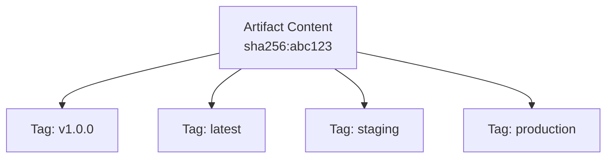
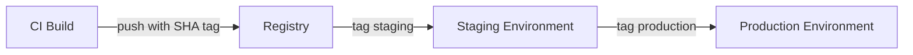

# How to Use flux tag artifact to Tag OCI Artifacts

Author: [nawazdhandala](https://github.com/nawazdhandala)

Tags: Flux, fluxcd, OCI, Artifacts, Tags, GitOps, Kubernetes, container-registry, Versioning

Description: A practical guide to tagging OCI artifacts with the flux tag artifact command for version management and promotion workflows.

---

## Introduction

The `flux tag artifact` command allows you to add additional tags to existing OCI artifacts in a container registry without re-uploading the artifact content. This is essential for promotion workflows, semantic versioning, and managing artifact lifecycle across environments.

Tagging is a lightweight operation that creates a new reference pointing to an existing artifact layer. This guide covers practical tagging strategies, promotion workflows, and automation patterns.

## Prerequisites

- Flux CLI v2.0 or later installed
- An OCI artifact already pushed to a container registry
- Write access to the target container registry

```bash
# Verify Flux CLI installation
flux version --client

# Ensure you have an artifact to tag
flux list artifacts oci://ghcr.io/myorg/app-config
```

## How OCI Tagging Works

When you tag an artifact, you create a new reference in the registry that points to the same content. No data is duplicated.



## Basic Usage

### Adding a Single Tag

```bash
# Add a new tag to an existing artifact
# The source artifact is identified by its current tag
flux tag artifact oci://ghcr.io/myorg/app-config:v1.0.0 \
  --tag=latest
```

### Adding Multiple Tags

```bash
# Add multiple tags to an artifact in separate commands
flux tag artifact oci://ghcr.io/myorg/app-config:v1.0.0 \
  --tag=stable

flux tag artifact oci://ghcr.io/myorg/app-config:v1.0.0 \
  --tag=production
```

### Tagging with a Git SHA

```bash
# Tag an artifact with its corresponding git commit SHA
GIT_SHA=$(git rev-parse --short HEAD)

flux tag artifact oci://ghcr.io/myorg/app-config:${GIT_SHA} \
  --tag=latest
```

## Environment Promotion Workflows

### Linear Promotion

A common pattern is to promote artifacts through environments: dev to staging to production.

```bash
# Step 1: Push artifact with a commit-based tag from CI
flux push artifact oci://ghcr.io/myorg/app-config:$(git rev-parse --short HEAD) \
  --path="./deploy" \
  --source="https://github.com/myorg/myrepo" \
  --revision="main@sha1:$(git rev-parse HEAD)"

# Step 2: After testing, promote to staging
flux tag artifact oci://ghcr.io/myorg/app-config:$(git rev-parse --short HEAD) \
  --tag=staging

# Step 3: After staging validation, promote to production
flux tag artifact oci://ghcr.io/myorg/app-config:$(git rev-parse --short HEAD) \
  --tag=production
```



### Multi-Environment Setup

```bash
# Tag for different environments with specific identifiers
ARTIFACT="oci://ghcr.io/myorg/app-config:abc1234"

# Development environment
flux tag artifact ${ARTIFACT} --tag=dev

# QA environment
flux tag artifact ${ARTIFACT} --tag=qa

# Staging environment
flux tag artifact ${ARTIFACT} --tag=staging

# Production environment (only after all validations pass)
flux tag artifact ${ARTIFACT} --tag=production
```

### Rollback by Re-tagging

```bash
# If production has a problem, roll back by re-tagging a previous version
# Find the previous good version
flux list artifacts oci://ghcr.io/myorg/app-config

# Re-tag the known good version as production
flux tag artifact oci://ghcr.io/myorg/app-config:v1.2.0 \
  --tag=production

# Flux will detect the tag change and reconcile
```

## Semantic Versioning Strategies

### Major.Minor.Patch Tagging

```bash
# After pushing v1.2.3, also update the major and minor tags
flux tag artifact oci://ghcr.io/myorg/app-config:v1.2.3 \
  --tag=v1.2

flux tag artifact oci://ghcr.io/myorg/app-config:v1.2.3 \
  --tag=v1

# This allows consumers to track at different granularity
# oci://ghcr.io/myorg/app-config:v1     -> latest v1.x.x
# oci://ghcr.io/myorg/app-config:v1.2   -> latest v1.2.x
# oci://ghcr.io/myorg/app-config:v1.2.3 -> exact version
```

### Release Channel Tags

```bash
# Maintain release channel tags
ARTIFACT="oci://ghcr.io/myorg/app-config:v2.0.0-rc.1"

# Tag as beta for early adopters
flux tag artifact ${ARTIFACT} --tag=beta

# When ready, tag the final release
flux push artifact oci://ghcr.io/myorg/app-config:v2.0.0 \
  --path="./deploy" \
  --source="https://github.com/myorg/myrepo" \
  --revision="v2.0.0@sha1:$(git rev-parse HEAD)"

# Update the stable channel
flux tag artifact oci://ghcr.io/myorg/app-config:v2.0.0 \
  --tag=stable
```

## CI/CD Integration

### GitHub Actions Promotion Workflow

```yaml
# .github/workflows/promote.yaml
name: Promote Artifact
on:
  workflow_dispatch:
    inputs:
      source_tag:
        description: 'Source artifact tag'
        required: true
      target_environment:
        description: 'Target environment'
        required: true
        type: choice
        options:
          - staging
          - production

jobs:
  promote:
    runs-on: ubuntu-latest
    permissions:
      packages: write
    steps:
      # Install Flux CLI
      - uses: fluxcd/flux2/action@main

      # Authenticate with the registry
      - name: Login to GHCR
        run: echo "${{ secrets.GITHUB_TOKEN }}" | docker login ghcr.io -u ${{ github.actor }} --password-stdin

      # Tag the artifact for the target environment
      - name: Promote artifact
        run: |
          flux tag artifact oci://ghcr.io/${{ github.repository }}/deploy:${{ inputs.source_tag }} \
            --tag=${{ inputs.target_environment }}

      # Verify the tag was applied
      - name: Verify promotion
        run: |
          flux list artifacts oci://ghcr.io/${{ github.repository }}/deploy
```

### Automated Tagging After Tests Pass

```yaml
# .github/workflows/auto-promote.yaml
name: Auto Promote on Test Success
on:
  workflow_run:
    workflows: ["Integration Tests"]
    types: [completed]

jobs:
  promote-to-staging:
    if: ${{ github.event.workflow_run.conclusion == 'success' }}
    runs-on: ubuntu-latest
    permissions:
      packages: write
    steps:
      - uses: fluxcd/flux2/action@main

      - name: Login to GHCR
        run: echo "${{ secrets.GITHUB_TOKEN }}" | docker login ghcr.io -u ${{ github.actor }} --password-stdin

      - name: Get commit SHA
        run: echo "SHA=$(echo ${{ github.event.workflow_run.head_sha }} | cut -c1-7)" >> $GITHUB_ENV

      - name: Promote to staging
        run: |
          flux tag artifact oci://ghcr.io/${{ github.repository }}/deploy:${{ env.SHA }} \
            --tag=staging
```

## Scripting Patterns

### Promotion Script

```bash
#!/bin/bash
# promote-artifact.sh
# Usage: ./promote-artifact.sh <registry> <artifact> <source-tag> <target-env>

set -euo pipefail

REGISTRY="${1:?Usage: promote-artifact.sh <registry> <artifact> <source-tag> <target-env>}"
ARTIFACT="${2:?Artifact name required}"
SOURCE_TAG="${3:?Source tag required}"
TARGET_ENV="${4:?Target environment required}"

OCI_REF="oci://${REGISTRY}/${ARTIFACT}"

# Verify the source artifact exists
echo "Verifying source artifact: ${OCI_REF}:${SOURCE_TAG}"
flux list artifacts "${OCI_REF}" | grep "${SOURCE_TAG}" || {
  echo "ERROR: Source artifact with tag '${SOURCE_TAG}' not found"
  exit 1
}

# Apply the environment tag
echo "Promoting ${OCI_REF}:${SOURCE_TAG} to ${TARGET_ENV}"
flux tag artifact "${OCI_REF}:${SOURCE_TAG}" \
  --tag="${TARGET_ENV}"

echo "Successfully promoted to ${TARGET_ENV}"

# Verify the tag was applied
flux list artifacts "${OCI_REF}" | grep "${TARGET_ENV}"
```

### Bulk Re-tagging Script

```bash
#!/bin/bash
# retag-all.sh
# Re-tag multiple artifacts with a new version

set -euo pipefail

REGISTRY="ghcr.io/myorg"
OLD_TAG="${1:?Old tag required}"
NEW_TAG="${2:?New tag required}"

# List of artifacts to re-tag
ARTIFACTS=(
  "frontend-config"
  "backend-config"
  "database-config"
  "monitoring-config"
)

for artifact in "${ARTIFACTS[@]}"; do
  echo "Tagging ${artifact}:${OLD_TAG} as ${NEW_TAG}..."
  flux tag artifact "oci://${REGISTRY}/${artifact}:${OLD_TAG}" \
    --tag="${NEW_TAG}"
done

echo "All artifacts re-tagged from ${OLD_TAG} to ${NEW_TAG}"
```

## Consuming Tagged Artifacts

### OCIRepository with Static Tag

```yaml
# Track a specific environment tag
apiVersion: source.toolkit.fluxcd.io/v1
kind: OCIRepository
metadata:
  name: app-config
  namespace: flux-system
spec:
  interval: 5m
  url: oci://ghcr.io/myorg/app-config
  ref:
    tag: production
```

### OCIRepository with Semver

```yaml
# Automatically pick up new semantic version tags
apiVersion: source.toolkit.fluxcd.io/v1
kind: OCIRepository
metadata:
  name: app-config
  namespace: flux-system
spec:
  interval: 5m
  url: oci://ghcr.io/myorg/app-config
  ref:
    semver: ">=1.0.0 <2.0.0"
```

## Troubleshooting

```bash
# Error: "tag not found"
# Verify the source artifact exists
flux list artifacts oci://ghcr.io/myorg/app-config

# Error: "unauthorized"
# Re-authenticate with the registry
docker login ghcr.io

# Error: "manifest unknown"
# The source tag may have been deleted; verify it exists
flux list artifacts oci://ghcr.io/myorg/app-config | grep "v1.0.0"

# Verify a tag was applied correctly
flux pull artifact oci://ghcr.io/myorg/app-config:production \
  --output /tmp/verify-tag
ls -la /tmp/verify-tag/
```

## Best Practices

1. **Use immutable tags for builds** (git SHA, build number) and mutable tags for environments (staging, production).
2. **Automate promotions** through CI/CD workflows rather than manual tagging.
3. **Keep a promotion log** by recording which SHA is tagged for each environment.
4. **Use semver tags** for artifacts consumed by external teams so they can control update velocity.
5. **Test before promoting** by pulling and validating artifacts before applying environment tags.

## Summary

The `flux tag artifact` command provides a lightweight and efficient way to manage OCI artifact lifecycle without re-uploading content. By using tagging for environment promotion, semantic versioning, and release channels, you can build robust deployment pipelines that are easy to audit and roll back. Combined with CI/CD automation, artifact tagging becomes the backbone of a reliable GitOps promotion workflow.
