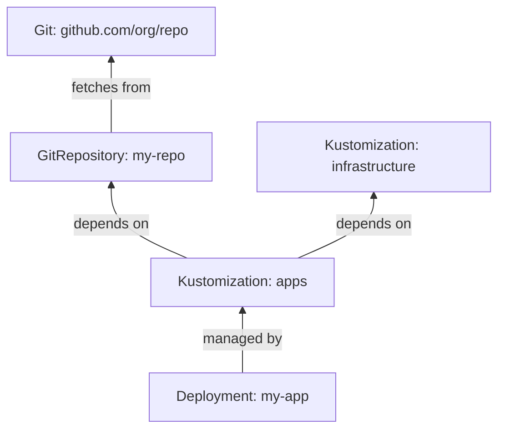

# How to Use flux trace to Trace Resource Dependencies

Author: [nawazdhandala](https://github.com/nawazdhandala)

Tags: Flux, fluxcd, GitOps, Kubernetes, CLI, Traces, Dependencies, Debugging, DevOps

Description: A practical guide to using the flux trace command to trace the dependency chain and ownership of Kubernetes resources managed by Flux CD.

---

## Introduction

In a Flux CD-managed cluster, resources are often part of complex dependency chains. A Deployment might be managed by a Kustomization, which depends on a GitRepository source, which fetches from a specific branch. When something goes wrong, understanding this chain is critical for effective debugging.

The `flux trace` command traces the complete ownership and dependency chain for any Kubernetes resource back to its Flux source, giving you full visibility into how a resource is managed.

## Prerequisites

Ensure you have the following:

- A running Kubernetes cluster with Flux CD installed
- `kubectl` configured for your cluster
- The Flux CLI installed locally
- Resources being managed by Flux CD

Verify your setup:

```bash
# Check Flux installation
flux check
```

## What flux trace Does

The `flux trace` command takes a standard Kubernetes resource (such as a Deployment, Service, or ConfigMap) and traces it back through the Flux resource chain to identify:

1. Which Kustomization or HelmRelease manages the resource
2. Which source (GitRepository, HelmRepository, etc.) provides the configuration
3. The current status of each resource in the chain



## Basic Syntax

The general syntax for `flux trace` is:

```bash
# Trace a Kubernetes resource
flux trace <resource-type> <resource-name> [flags]
```

Where `<resource-type>` is any standard Kubernetes resource type (deployment, service, configmap, etc.) and `<resource-name>` is the name of the resource.

## Tracing a Deployment

Trace the ownership chain for a Deployment:

```bash
# Trace a deployment named "my-app"
flux trace deployment my-app --namespace default
```

Sample output:

```yaml
Object:        Deployment/my-app
Namespace:     default
Status:        Managed by Flux
---
Kustomization: apps
Namespace:     flux-system
Path:          ./clusters/production/apps
Revision:      main@sha1:abc123def
Status:        Last reconciled at 2026-03-06T10:15:00Z
---
GitRepository:  my-repo
Namespace:      flux-system
URL:            https://github.com/myorg/my-repo.git
Branch:         main
Revision:       main@sha1:abc123def
Status:         Last fetched at 2026-03-06T10:14:30Z
```

## Tracing Different Resource Types

You can trace any Kubernetes resource managed by Flux:

```bash
# Trace a Service
flux trace service my-app-svc --namespace default

# Trace a ConfigMap
flux trace configmap my-app-config --namespace default

# Trace a Secret
flux trace secret my-app-secret --namespace default

# Trace a Namespace
flux trace namespace my-app-namespace

# Trace a ServiceAccount
flux trace serviceaccount my-app-sa --namespace default

# Trace an Ingress
flux trace ingress my-app-ingress --namespace default
```

## Tracing Helm-Managed Resources

Resources managed through Helm releases have a different chain:

```bash
# Trace a deployment managed by a Helm release
flux trace deployment nginx-controller --namespace ingress
```

Sample output for a Helm-managed resource:

```yaml
Object:         Deployment/nginx-controller
Namespace:      ingress
Status:         Managed by Flux
---
HelmRelease:    nginx-ingress
Namespace:      flux-system
Chart:          nginx-ingress
Version:        4.8.3
Status:         Last reconciled at 2026-03-06T09:45:00Z
---
HelmRepository: bitnami
Namespace:      flux-system
URL:            https://charts.bitnami.com/bitnami
Status:         Last fetched at 2026-03-06T09:30:00Z
```

## Using the API Version Flag

When multiple resource types share a name, specify the API version:

```bash
# Trace with an explicit API version
flux trace deployment my-app --namespace default --api-version apps/v1

# Trace a custom resource
flux trace certificate my-cert --namespace default --api-version cert-manager.io/v1
```

## Practical Debugging Scenarios

### Scenario 1: Finding Why a Deployment Is Outdated

When a deployment is not running the expected version:

```bash
# Step 1: Trace the deployment to find its source
flux trace deployment my-app --namespace production

# Step 2: Check if the Kustomization has reconciled the latest revision
# (compare the revision in the trace output with the latest Git commit)

# Step 3: If the revision is outdated, check the Git source
flux get source git my-repo

# Step 4: Force reconciliation if needed
flux reconcile source git my-repo
flux reconcile kustomization apps
```

### Scenario 2: Identifying the Source of a Misconfigured Resource

When a resource has unexpected configuration:

```bash
# Step 1: Trace the resource to find which Kustomization manages it
flux trace configmap my-app-config --namespace production

# Step 2: Note the path from the trace output (e.g., ./clusters/production/apps)

# Step 3: Check the Git repository at that path for the configuration
# Navigate to the path shown in the trace output

# Step 4: Verify the revision matches what you expect
flux get source git my-repo
```

### Scenario 3: Understanding Multi-Tier Dependencies

In complex setups with infrastructure and application layers:

```bash
# Trace an application deployment
flux trace deployment my-app --namespace production

# The output will show the full chain:
# Deployment -> Kustomization (apps) -> GitRepository
# And if the Kustomization has dependencies:
flux get kustomization apps
```

Check dependency status:

```bash
# See what the apps kustomization depends on
kubectl get kustomization apps -n flux-system -o jsonpath='{.spec.dependsOn}'

# Trace resources in the dependency chain
flux get kustomization infrastructure
flux events --for Kustomization/infrastructure
```

### Scenario 4: Verifying Resource Ownership After Migration

When migrating resources between Kustomizations:

```bash
# Verify a resource is managed by the expected Kustomization
flux trace deployment my-app --namespace production

# Confirm the Kustomization name and path match your expectations
# If the resource shows as unmanaged, it may not be included in any Kustomization
```

## Tracing Unmanaged Resources

If you trace a resource that Flux does not manage, the output will indicate this:

```bash
# Trace a resource not managed by Flux
flux trace deployment manual-deployment --namespace default
```

Output:

```yaml
Object:        Deployment/manual-deployment
Namespace:     default
Status:        Not managed by Flux
```

This is useful for verifying whether a resource is under GitOps control.

## Building a Dependency Map

Use `flux trace` across multiple resources to build a dependency map:

```bash
#!/bin/bash
# trace-all-deployments.sh
# Trace all deployments to map Flux ownership

NAMESPACE=${1:-default}

echo "=== Tracing all deployments in namespace: $NAMESPACE ==="
echo ""

# Get all deployment names in the namespace
DEPLOYMENTS=$(kubectl get deployments -n "$NAMESPACE" -o jsonpath='{.items[*].metadata.name}')

for DEPLOY in $DEPLOYMENTS; do
    echo "--- Deployment: $DEPLOY ---"
    flux trace deployment "$DEPLOY" --namespace "$NAMESPACE" 2>&1
    echo ""
done
```

## Combining Trace with Other Commands

Use trace output to guide further investigation:

```bash
# Step 1: Trace the resource
flux trace deployment my-app --namespace production
# Output shows: Kustomization/apps using GitRepository/my-repo

# Step 2: Check the Kustomization status
flux get kustomization apps

# Step 3: Check the source status
flux get source git my-repo

# Step 4: View events for the managing Kustomization
flux events --for Kustomization/apps

# Step 5: Check logs for any errors
flux logs --kind=Kustomization --name=apps --level=error
```

## Common Flags Reference

| Flag | Description |
|------|-------------|
| `--namespace` | Namespace of the resource being traced |
| `--api-version` | API version of the resource (e.g., apps/v1) |
| `--kind` | Kind of the resource (alternative to positional argument) |

## Troubleshooting

### Resource Not Found

If the resource cannot be found:

```bash
# Verify the resource exists
kubectl get deployment my-app --namespace production

# Check the resource name and namespace are correct
kubectl get all --namespace production
```

### Trace Shows Incorrect Owner

If the ownership chain looks wrong:

```bash
# Check Flux labels on the resource
kubectl get deployment my-app -n production -o jsonpath='{.metadata.labels}' | jq .

# Look for the kustomize.toolkit.fluxcd.io/name label
kubectl get deployment my-app -n production -o jsonpath='{.metadata.labels.kustomize\.toolkit\.fluxcd\.io/name}'
```

### Trace Does Not Show Complete Chain

If the chain appears incomplete:

```bash
# Verify all Flux controllers are running
kubectl get pods -n flux-system

# Check that the source controller is healthy
flux get sources all
```

## Best Practices

1. **Use trace as a first debugging step** - Understanding the ownership chain helps focus your investigation
2. **Verify ownership after changes** - After restructuring Kustomizations, trace resources to confirm correct ownership
3. **Map critical paths** - Document the dependency chains for your most important applications
4. **Compare revisions** - Use the revision information in trace output to verify resources are up to date
5. **Automate ownership audits** - Script traces across all resources to maintain an up-to-date dependency map

## Summary

The `flux trace` command is an invaluable tool for understanding how Flux CD manages your Kubernetes resources. By tracing any resource back through its Kustomization or HelmRelease to its original source, you gain full visibility into the GitOps chain. This understanding is essential for debugging issues, verifying configurations, and maintaining a well-organized cluster.
