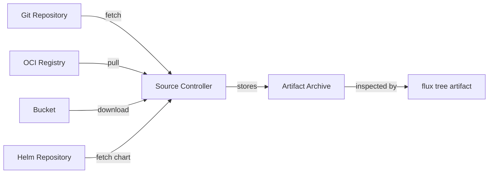

# How to Use flux tree artifact to View Artifact Tree

Author: [nawazdhandala](https://github.com/nawazdhandala)

Tags: flux, fluxcd, gitops, kubernetes, cli, tree, artifact, oci, source, devops

Description: A practical guide to using the flux tree artifact command to view and explore the contents of OCI artifacts stored by Flux CD sources.

---

## Introduction

Flux CD stores fetched configurations as artifacts, which are versioned snapshots of source content. The `flux tree artifact` command lets you inspect the contents of these artifacts without needing to manually extract or download them. This is invaluable for verifying that Flux is fetching the correct files, debugging path issues, and understanding what gets applied to your cluster.

This guide covers how to use `flux tree artifact` to explore artifact contents, verify source configurations, and troubleshoot deployment issues.

## Prerequisites

Ensure you have:

- A running Kubernetes cluster with Flux CD installed
- `kubectl` configured for your cluster
- The Flux CLI installed locally
- At least one source resource (GitRepository, OCIRepository, Bucket, or HelmChart)

Verify your setup:

```bash
# Check Flux installation
flux check

# List available sources
flux get sources all --all-namespaces
```

## What Are Flux Artifacts

When Flux fetches content from a Git repository, OCI registry, Helm repository, or bucket, it stores the content as an artifact. This artifact is a compressed archive of the fetched files.



The `flux tree artifact` command lets you see the file listing inside these artifacts.

## Basic Usage

View the contents of an artifact from a source:

```bash
# View the artifact tree for a Git repository source
flux tree artifact gitrepository my-repo
```

Sample output:

```
GitRepository/my-repo
├── clusters/
│   └── production/
│       ├── apps/
│       │   ├── kustomization.yaml
│       │   ├── deployment.yaml
│       │   ├── service.yaml
│       │   └── ingress.yaml
│       └── infrastructure/
│           ├── kustomization.yaml
│           ├── cert-manager.yaml
│           └── ingress-nginx.yaml
├── base/
│   ├── deployment.yaml
│   ├── service.yaml
│   └── kustomization.yaml
└── README.md
```

## Viewing Artifacts from Different Source Types

### Git Repository Artifacts

```bash
# View artifact contents from a GitRepository
flux tree artifact gitrepository my-repo

# Specify the namespace if not in flux-system
flux tree artifact gitrepository my-repo --namespace my-team
```

### OCI Repository Artifacts

```bash
# View artifact contents from an OCIRepository
flux tree artifact ocirepository my-oci-source

# With namespace
flux tree artifact ocirepository my-oci-source --namespace flux-system
```

### Bucket Artifacts

```bash
# View artifact contents from a Bucket source
flux tree artifact bucket my-bucket

# With namespace
flux tree artifact bucket my-bucket --namespace flux-system
```

### Helm Chart Artifacts

```bash
# View artifact contents from a HelmChart
flux tree artifact helmchart my-chart

# With namespace
flux tree artifact helmchart my-chart --namespace flux-system
```

## Understanding the Output

The tree output shows the complete file hierarchy inside the artifact:

```
GitRepository/my-repo
├── apps/                          # Directory
│   ├── base/                      # Nested directory
│   │   ├── deployment.yaml        # Kubernetes manifest
│   │   ├── service.yaml           # Kubernetes manifest
│   │   └── kustomization.yaml     # Kustomize configuration
│   └── overlays/
│       ├── staging/
│       │   ├── kustomization.yaml
│       │   └── patch.yaml
│       └── production/
│           ├── kustomization.yaml
│           └── patch.yaml
└── infrastructure/
    ├── cert-manager/
    │   ├── kustomization.yaml
    │   └── helmrelease.yaml
    └── ingress-nginx/
        ├── kustomization.yaml
        └── helmrelease.yaml
```

## Practical Use Cases

### Use Case 1: Verifying Source Content After Initial Setup

After configuring a new GitRepository source, verify Flux fetched the correct content:

```bash
# Step 1: Check that the source has reconciled
flux get source git my-repo

# Step 2: View the artifact contents
flux tree artifact gitrepository my-repo

# Step 3: Verify the expected files are present
# Compare the output with your Git repository structure
```

### Use Case 2: Debugging Path Issues in Kustomizations

When a Kustomization cannot find files at the specified path:

```bash
# Step 1: Check the Kustomization path configuration
kubectl get kustomization apps -n flux-system -o jsonpath='{.spec.path}'
# Output: ./clusters/production/apps

# Step 2: View the artifact tree to verify the path exists
flux tree artifact gitrepository my-repo

# Step 3: Look for the expected path in the output
flux tree artifact gitrepository my-repo | grep "clusters/production/apps"
```

If the path does not appear in the artifact tree, the issue is in the source configuration (wrong branch, wrong directory, or filtering).

### Use Case 3: Inspecting OCI Artifacts

When working with OCI-based delivery:

```bash
# Step 1: Check the OCI repository status
flux get source oci my-oci-source

# Step 2: View the artifact contents
flux tree artifact ocirepository my-oci-source

# Step 3: Verify the expected manifests are included
flux tree artifact ocirepository my-oci-source | grep "deployment"
```

### Use Case 4: Inspecting Helm Chart Contents

Examine what files are inside a Helm chart artifact:

```bash
# View the Helm chart artifact tree
flux tree artifact helmchart my-app-chart
```

Sample output for a Helm chart:

```
HelmChart/my-app-chart
├── Chart.yaml
├── values.yaml
├── templates/
│   ├── deployment.yaml
│   ├── service.yaml
│   ├── ingress.yaml
│   ├── serviceaccount.yaml
│   ├── hpa.yaml
│   ├── configmap.yaml
│   ├── _helpers.tpl
│   └── NOTES.txt
└── charts/
    └── redis/
        ├── Chart.yaml
        ├── values.yaml
        └── templates/
            ├── deployment.yaml
            └── service.yaml
```

### Use Case 5: Verifying Artifact After Source Update

When you push changes to Git and want to verify Flux picked them up:

```bash
# Step 1: Force reconciliation of the source
flux reconcile source git my-repo

# Step 2: Wait for the new artifact to be stored
flux get source git my-repo

# Step 3: View the artifact tree to confirm new files are present
flux tree artifact gitrepository my-repo

# Step 4: Look for the newly added files
flux tree artifact gitrepository my-repo | grep "new-file"
```

## Comparing Artifact Contents

Compare what Flux has fetched with what you expect:

```bash
#!/bin/bash
# compare-artifact.sh
# Compare Flux artifact contents with local Git repository

REPO_NAME=${1:-my-repo}
LOCAL_PATH=${2:-/path/to/local/repo}

echo "=== Flux Artifact Contents ==="
flux tree artifact gitrepository "$REPO_NAME" | sort > /tmp/flux-artifact.txt

echo "=== Local Repository Contents ==="
# Generate a similar tree from the local repo
find "$LOCAL_PATH" -type f | sed "s|$LOCAL_PATH/||" | sort > /tmp/local-repo.txt

echo "=== Differences ==="
diff /tmp/flux-artifact.txt /tmp/local-repo.txt
```

## Working with Filtered Sources

If your GitRepository uses `spec.include` or `spec.ignore` to filter content, the artifact tree reflects only the included files:

```bash
# Check the source configuration for filters
kubectl get gitrepository my-repo -n flux-system -o yaml | grep -A10 "spec:"

# View the artifact to see what was actually fetched
flux tree artifact gitrepository my-repo

# The tree will only show files that passed the include/ignore filters
```

## Artifact Storage and Revisions

Each artifact is associated with a specific revision:

```bash
# Check the current artifact revision
flux get source git my-repo

# Output shows the revision:
# NAME     REVISION            READY  MESSAGE
# my-repo  main@sha1:abc123    True   stored artifact for revision 'main@sha1:abc123'

# The artifact tree shows the contents at this specific revision
flux tree artifact gitrepository my-repo
```

## Common Flags Reference

| Flag | Description |
|------|-------------|
| `--namespace` | Namespace of the source resource |

## Troubleshooting

### No Artifact Available

If the command reports no artifact:

```bash
# Check if the source has successfully reconciled
flux get source git my-repo

# If not ready, check events for errors
flux events --for GitRepository/my-repo

# Force a reconciliation
flux reconcile source git my-repo
```

### Artifact Tree Is Empty

If the tree shows no files:

```bash
# Check the source branch configuration
kubectl get gitrepository my-repo -n flux-system -o jsonpath='{.spec.ref}'

# Check if ignore patterns are too aggressive
kubectl get gitrepository my-repo -n flux-system -o jsonpath='{.spec.ignore}'

# Verify the source URL is correct
kubectl get gitrepository my-repo -n flux-system -o jsonpath='{.spec.url}'
```

### Unexpected Files in the Artifact

If the artifact contains files you did not expect:

```bash
# Review the ignore configuration
kubectl get gitrepository my-repo -n flux-system -o yaml | grep -A10 "ignore"

# Update the .sourceignore file in your repository to exclude unwanted files
# Common patterns to add:
# *.md
# .github/
# docs/
# tests/
```

### Artifact Shows Old Content

If the artifact does not reflect recent changes:

```bash
# Check when the source was last fetched
flux get source git my-repo

# Force a fresh fetch
flux reconcile source git my-repo --with-source

# View the updated artifact
flux tree artifact gitrepository my-repo
```

## Best Practices

1. **Verify artifacts after source setup** - Always check that Flux fetched the expected content
2. **Use artifact trees for debugging** - When Kustomizations fail, check the artifact first
3. **Review after filter changes** - After modifying ignore or include patterns, verify the artifact
4. **Check Helm chart contents** - Verify chart artifacts include all expected templates
5. **Compare with source of truth** - Periodically compare artifact contents with your Git repository

## Summary

The `flux tree artifact` command gives you direct visibility into what Flux has fetched and stored from your sources. By inspecting artifact contents, you can verify that the correct files are being deployed, debug path issues in Kustomizations, and ensure your source configurations (branches, filters, paths) are working as expected. It is an essential tool for maintaining confidence in your GitOps pipeline.
