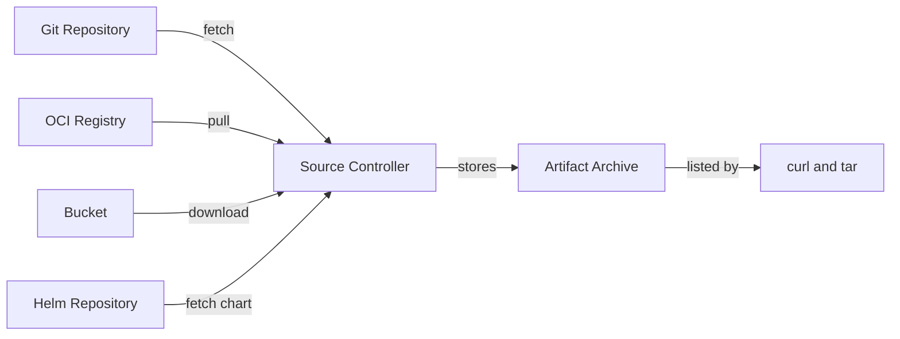

# How to Use flux tree artifact to View Artifact Tree

Author: [nawazdhandala](https://github.com/nawazdhandala)

Tags: Flux, Fluxcd, GitOps, Kubernetes, CLI, Tree, Artifact, OCI, Source, DevOps

Description: A practical guide to using the flux tree artifact command to view and explore the contents of OCI artifacts stored by Flux CD sources.

---

## Introduction

Flux CD stores fetched configurations as artifacts, which are versioned snapshots of source content. Flux exposes the current artifact on source resources in `.status.artifact`. You can inspect the contents of these artifacts without manually copying files out of the source-controller Pod by retrieving the artifact archive and listing it with `tar`. This is useful for verifying that Flux is fetching the correct files, debugging path issues, and understanding what gets applied to your cluster.

This guide covers how to explore artifact contents, verify source configurations, and troubleshoot deployment issues.

> Note: The Flux CLI command `flux tree artifact` does not list the files inside GitRepository, OCIRepository, Bucket, or HelmChart artifacts. In current Flux releases, `flux tree artifact` is a parent command for artifact inventory subcommands such as `flux tree artifact generator`.

## Prerequisites

Ensure you have:

- A running Kubernetes cluster with Flux CD installed
- `kubectl` configured for your cluster
- The Flux CLI installed locally
- `curl` and `tar` available locally
- At least one source resource (GitRepository, OCIRepository, Bucket, or HelmChart)

Verify your setup:

```bash
# Check Flux installation
flux check

# List available sources
flux get sources all --all-namespaces
```

## What Are Flux Artifacts

When Flux fetches content from a Git repository, OCI registry, Helm repository, or bucket, it stores the content as an artifact. This artifact is a gzip-compressed tar archive of the fetched files.


```mermaid
graph LR
    GR[Git Repository] -->|fetch| SC[Source Controller]
    OR[OCI Registry] -->|pull| SC
    B[Bucket] -->|download| SC
    HR[Helm Repository] -->|fetch chart| SC
    SC -->|stores| A[Artifact Archive]
    A -->|listed by| TL[curl and tar]
```

The artifact status includes fields such as `path`, `revision`, `digest`, `size`, and `url`, depending on the source type.

## Basic Usage

View the contents of an artifact from a source by port-forwarding the source-controller service and listing the current artifact archive:

```bash
# In one terminal, forward the source-controller service
kubectl -n flux-system port-forward svc/source-controller 8080:80

# In another terminal, get the artifact path for a GitRepository
ARTIFACT_PATH=$(kubectl get gitrepository my-repo -n flux-system -o jsonpath='{.status.artifact.path}')

# View the artifact tree for a GitRepository source
curl -sL "http://localhost:8080/${ARTIFACT_PATH}" | tar -tzf -
```

Sample output:

```text
clusters/production/apps/kustomization.yaml
clusters/production/apps/deployment.yaml
clusters/production/apps/service.yaml
clusters/production/apps/ingress.yaml
clusters/production/infrastructure/kustomization.yaml
clusters/production/infrastructure/cert-manager.yaml
clusters/production/infrastructure/ingress-nginx.yaml
base/deployment.yaml
base/service.yaml
base/kustomization.yaml
README.md
```

## Viewing Artifacts from Different Source Types

### Git Repository Artifacts

```bash
# View artifact contents from a GitRepository
ARTIFACT_PATH=$(kubectl get gitrepository my-repo -n flux-system -o jsonpath='{.status.artifact.path}')
curl -sL "http://localhost:8080/${ARTIFACT_PATH}" | tar -tzf -

# Specify the namespace if not in flux-system
ARTIFACT_PATH=$(kubectl get gitrepository my-repo -n my-team -o jsonpath='{.status.artifact.path}')
curl -sL "http://localhost:8080/${ARTIFACT_PATH}" | tar -tzf -
```

### OCI Repository Artifacts

```bash
# View artifact contents from an OCIRepository
ARTIFACT_PATH=$(kubectl get ocirepository my-oci-source -n flux-system -o jsonpath='{.status.artifact.path}')
curl -sL "http://localhost:8080/${ARTIFACT_PATH}" | tar -tzf -

# Check OCIRepository source status
flux get sources oci --namespace flux-system
```

### Bucket Artifacts

```bash
# View artifact contents from a Bucket source
ARTIFACT_PATH=$(kubectl get bucket my-bucket -n flux-system -o jsonpath='{.status.artifact.path}')
curl -sL "http://localhost:8080/${ARTIFACT_PATH}" | tar -tzf -

# Check Bucket source status
flux get sources bucket --namespace flux-system
```

### Helm Chart Artifacts

```bash
# View artifact contents from a HelmChart
ARTIFACT_PATH=$(kubectl get helmchart my-chart -n flux-system -o jsonpath='{.status.artifact.path}')
curl -sL "http://localhost:8080/${ARTIFACT_PATH}" | tar -tzf -

# Check HelmChart source status
flux get sources chart --namespace flux-system
```

## Understanding the Output

The `tar -tzf -` output shows the complete file hierarchy inside the artifact:

```text
apps/base/deployment.yaml
apps/base/service.yaml
apps/base/kustomization.yaml
apps/overlays/staging/kustomization.yaml
apps/overlays/staging/patch.yaml
apps/overlays/production/kustomization.yaml
apps/overlays/production/patch.yaml
infrastructure/cert-manager/kustomization.yaml
infrastructure/cert-manager/helmrelease.yaml
infrastructure/ingress-nginx/kustomization.yaml
infrastructure/ingress-nginx/helmrelease.yaml
```

## Practical Use Cases

### Use Case 1: Verifying Source Content After Initial Setup

After configuring a new GitRepository source, verify Flux fetched the correct content:

```bash
# Step 1: Check that the source has reconciled
flux get sources git --namespace flux-system

# Step 2: View the artifact contents
ARTIFACT_PATH=$(kubectl get gitrepository my-repo -n flux-system -o jsonpath='{.status.artifact.path}')
curl -sL "http://localhost:8080/${ARTIFACT_PATH}" | tar -tzf -

# Step 3: Verify the expected files are present
# Compare the output with your Git repository structure
```

### Use Case 2: Debugging Path Issues in Kustomizations

When a Kustomization cannot find files at the specified path:

```bash
# Step 1: Check the Kustomization path configuration
kubectl get kustomization apps -n flux-system -o jsonpath='{.spec.path}'
# Output: ./clusters/production/apps

# Step 2: View the artifact tree to verify the path exists
ARTIFACT_PATH=$(kubectl get gitrepository my-repo -n flux-system -o jsonpath='{.status.artifact.path}')
curl -sL "http://localhost:8080/${ARTIFACT_PATH}" | tar -tzf -

# Step 3: Look for the expected path in the output
curl -sL "http://localhost:8080/${ARTIFACT_PATH}" | tar -tzf - | grep "clusters/production/apps"
```

If the path does not appear in the artifact tree, the issue is in the source configuration (wrong branch, wrong directory, ignore rules, include rules, or sparse checkout).

### Use Case 3: Inspecting OCI Artifacts

When working with OCI-based delivery:

```bash
# Step 1: Check the OCI repository status
flux get sources oci --namespace flux-system

# Step 2: View the artifact contents
ARTIFACT_PATH=$(kubectl get ocirepository my-oci-source -n flux-system -o jsonpath='{.status.artifact.path}')
curl -sL "http://localhost:8080/${ARTIFACT_PATH}" | tar -tzf -

# Step 3: Verify the expected manifests are included
curl -sL "http://localhost:8080/${ARTIFACT_PATH}" | tar -tzf - | grep "deployment"
```

### Use Case 4: Inspecting Helm Chart Contents

Examine what files are inside a Helm chart artifact:

```bash
# View the Helm chart artifact tree
ARTIFACT_PATH=$(kubectl get helmchart my-app-chart -n flux-system -o jsonpath='{.status.artifact.path}')
curl -sL "http://localhost:8080/${ARTIFACT_PATH}" | tar -tzf -
```

Sample output for a Helm chart:

```text
Chart.yaml
values.yaml
templates/deployment.yaml
templates/service.yaml
templates/ingress.yaml
templates/serviceaccount.yaml
templates/hpa.yaml
templates/configmap.yaml
templates/_helpers.tpl
templates/NOTES.txt
charts/redis/Chart.yaml
charts/redis/values.yaml
charts/redis/templates/deployment.yaml
charts/redis/templates/service.yaml
```

### Use Case 5: Verifying Artifact After Source Update

When you push changes to Git and want to verify Flux picked them up:

```bash
# Step 1: Force reconciliation of the source
flux reconcile source git my-repo --namespace flux-system

# Step 2: Wait for the new artifact to be stored
flux get sources git --namespace flux-system

# Step 3: View the artifact tree to confirm new files are present
ARTIFACT_PATH=$(kubectl get gitrepository my-repo -n flux-system -o jsonpath='{.status.artifact.path}')
curl -sL "http://localhost:8080/${ARTIFACT_PATH}" | tar -tzf -

# Step 4: Look for the newly added files
curl -sL "http://localhost:8080/${ARTIFACT_PATH}" | tar -tzf - | grep "new-file"
```

## Comparing Artifact Contents

Compare what Flux has fetched with what you expect:

```bash
#!/bin/bash
# compare-artifact.sh
# Compare Flux artifact contents with local Git repository

REPO_NAME=${1:-my-repo}
NAMESPACE=${2:-flux-system}
LOCAL_PATH=${3:-/path/to/local/repo}

ARTIFACT_PATH=$(kubectl get gitrepository "$REPO_NAME" -n "$NAMESPACE" -o jsonpath='{.status.artifact.path}')

echo "=== Flux Artifact Contents ==="
curl -sL "http://localhost:8080/${ARTIFACT_PATH}" | tar -tzf - | sort > /tmp/flux-artifact.txt

echo "=== Local Repository Contents ==="
# Generate a similar file list from the local repo
find "$LOCAL_PATH" -type f | sed "s|$LOCAL_PATH/||" | sort > /tmp/local-repo.txt

echo "=== Differences ==="
diff /tmp/flux-artifact.txt /tmp/local-repo.txt
```

## Working with Filtered Sources

If your GitRepository uses `spec.include`, `spec.ignore`, or `spec.sparseCheckout` to filter content, the artifact reflects only the files included in the stored artifact:

```bash
# Check the source configuration for filters
kubectl get gitrepository my-repo -n flux-system -o yaml | grep -A10 "spec:"

# View the artifact to see what was actually fetched
ARTIFACT_PATH=$(kubectl get gitrepository my-repo -n flux-system -o jsonpath='{.status.artifact.path}')
curl -sL "http://localhost:8080/${ARTIFACT_PATH}" | tar -tzf -

# The output will only show files that are present in the stored artifact
```

## Artifact Storage and Revisions

Each artifact is associated with a specific revision:

```bash
# Check the current artifact revision
flux get sources git --namespace flux-system

# Output shows the revision:
# NAME     REVISION            SUSPENDED  READY  MESSAGE
# my-repo  main@sha1:abc123    False      True   stored artifact for revision 'main@sha1:abc123'

# The artifact archive contains the files at this specific revision
ARTIFACT_PATH=$(kubectl get gitrepository my-repo -n flux-system -o jsonpath='{.status.artifact.path}')
curl -sL "http://localhost:8080/${ARTIFACT_PATH}" | tar -tzf -
```

## Common Flags Reference

| Flag | Description |
|------|-------------|
| `--namespace` | Namespace of the source resource |
| `--all-namespaces` | List source statuses across all namespaces with `flux get sources` |

## Troubleshooting

### No Artifact Available

If the source does not report an artifact:

```bash
# Check if the source has successfully reconciled
flux get sources git --namespace flux-system

# If not ready, check events for errors
flux events --for GitRepository/my-repo --namespace flux-system

# Force a reconciliation
flux reconcile source git my-repo --namespace flux-system
```

### Artifact Tree Is Empty

If the artifact has no files:

```bash
# Check the source branch configuration
kubectl get gitrepository my-repo -n flux-system -o jsonpath='{.spec.ref}'

# Check if ignore patterns are too aggressive
kubectl get gitrepository my-repo -n flux-system -o jsonpath='{.spec.ignore}'

# Check if sparse checkout restricts the fetched paths
kubectl get gitrepository my-repo -n flux-system -o jsonpath='{.spec.sparseCheckout}'

# Verify the source URL is correct
kubectl get gitrepository my-repo -n flux-system -o jsonpath='{.spec.url}'
```

### Unexpected Files in the Artifact

If the artifact contains files you did not expect:

```bash
# Review the ignore configuration
kubectl get gitrepository my-repo -n flux-system -o yaml | grep -A10 "ignore"

# Update the .sourceignore file in your repository to exclude unwanted files
# Common patterns to add:
# *.md
# .github/
# docs/
# tests/
```

### Artifact Shows Old Content

If the artifact does not reflect recent changes:

```bash
# Check the current source status and revision
flux get sources git --namespace flux-system

# Force a fresh reconciliation
flux reconcile source git my-repo --namespace flux-system

# View the updated artifact
ARTIFACT_PATH=$(kubectl get gitrepository my-repo -n flux-system -o jsonpath='{.status.artifact.path}')
curl -sL "http://localhost:8080/${ARTIFACT_PATH}" | tar -tzf -
```

## Best Practices

1. **Verify artifacts after source setup** - Always check that Flux fetched the expected content
2. **Use artifact contents for debugging** - When Kustomizations fail, check the source artifact first
3. **Review after filter changes** - After modifying ignore, include, or sparse checkout settings, verify the artifact
4. **Check Helm chart contents** - Verify chart artifacts include all expected templates
5. **Compare with source of truth** - Periodically compare artifact contents with your Git repository

## Summary

Flux source artifacts give you direct visibility into what Flux has fetched and stored from your sources. By inspecting artifact contents, you can verify that the correct files are being deployed, debug path issues in Kustomizations, and ensure your source configurations (branches, filters, paths) are working as expected. It is an essential practice for maintaining confidence in your GitOps pipeline.
