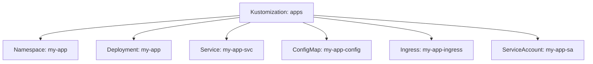

# How to Use flux tree kustomization to View Resource Tree

Author: [nawazdhandala](https://github.com/nawazdhandala)

Tags: flux, fluxcd, gitops, kubernetes, cli, tree, kustomization, visualization, devops

Description: A practical guide to using the flux tree kustomization command to visualize the resource hierarchy managed by a Flux CD Kustomization.

---

## Introduction

When managing Kubernetes resources through Flux CD Kustomizations, it can be challenging to understand which resources belong to which Kustomization, especially as your cluster grows. The `flux tree kustomization` command provides a tree view of all resources managed by a specific Kustomization, giving you a clear picture of the resource hierarchy.

This guide covers how to use `flux tree kustomization` to visualize, audit, and debug your Flux-managed resource trees.

## Prerequisites

Before using `flux tree kustomization`, ensure:

- A running Kubernetes cluster with Flux CD installed
- `kubectl` configured for your cluster
- The Flux CLI installed locally
- At least one Kustomization resource deployed

Verify your setup:

```bash
# Check Flux installation
flux check

# List existing kustomizations
flux get kustomizations --all-namespaces
```

## What flux tree kustomization Shows

The command displays a hierarchical tree of all Kubernetes resources that a Kustomization manages. This includes:

- Namespaces
- Deployments
- Services
- ConfigMaps
- Secrets
- Custom Resources
- Any other Kubernetes object applied by the Kustomization



## Basic Usage

View the resource tree for a Kustomization:

```bash
# Show the resource tree for a kustomization named "apps"
flux tree kustomization apps
```

Sample output:

```
Kustomization/apps
├── Namespace/my-app
├── ServiceAccount/my-app/my-app-sa
├── ConfigMap/my-app/my-app-config
├── Secret/my-app/my-app-secret
├── Deployment/my-app/my-app
├── Service/my-app/my-app-svc
├── Ingress/my-app/my-app-ingress
└── HorizontalPodAutoscaler/my-app/my-app-hpa
```

## Viewing Trees in Different Namespaces

If your Kustomization is not in the default `flux-system` namespace:

```bash
# View tree for a kustomization in a specific namespace
flux tree kustomization apps --namespace my-team

# View tree for the flux-system kustomization
flux tree kustomization flux-system --namespace flux-system
```

## Viewing Nested Kustomizations

Flux supports nested Kustomizations, where one Kustomization manages others. The tree command shows this hierarchy:

```bash
# View the tree including nested kustomizations
flux tree kustomization flux-system
```

Sample output with nested kustomizations:

```
Kustomization/flux-system
├── Kustomization/infrastructure
│   ├── Namespace/cert-manager
│   ├── HelmRelease/cert-manager
│   ├── Namespace/ingress-nginx
│   └── HelmRelease/ingress-nginx
├── Kustomization/apps
│   ├── Namespace/my-app
│   ├── Deployment/my-app/my-app
│   ├── Service/my-app/my-app-svc
│   └── Ingress/my-app/my-app-ingress
└── Kustomization/monitoring
    ├── Namespace/monitoring
    ├── HelmRelease/prometheus
    └── HelmRelease/grafana
```

## Including Resource Status

View the readiness status alongside the tree:

```bash
# Show resource tree with status information
flux tree kustomization apps --compact
```

Output with status:

```
Kustomization/apps
├── Namespace/my-app - Current
├── ServiceAccount/my-app/my-app-sa - Current
├── ConfigMap/my-app/my-app-config - Current
├── Deployment/my-app/my-app - Current (2/2 ready)
├── Service/my-app/my-app-svc - Current
└── Ingress/my-app/my-app-ingress - Current
```

## Practical Use Cases

### Use Case 1: Auditing Resources Managed by a Kustomization

Before making changes to a Kustomization, understand what it manages:

```bash
# Step 1: View the complete resource tree
flux tree kustomization apps

# Step 2: Count the resources
flux tree kustomization apps | wc -l

# Step 3: Check for unexpected resources
flux tree kustomization apps | grep -v "expected-namespace"
```

### Use Case 2: Verifying a Deployment Includes All Expected Resources

After adding new resources to your Git repository:

```bash
# Step 1: Force reconciliation
flux reconcile kustomization apps

# Step 2: View the tree to confirm new resources appear
flux tree kustomization apps

# Step 3: Look for the specific resources you added
flux tree kustomization apps | grep "my-new-resource"
```

### Use Case 3: Understanding Cluster Architecture

Map out your entire cluster structure:

```bash
# View the top-level kustomization tree
flux tree kustomization flux-system
```

This gives you a complete view of your cluster's resource hierarchy, from the top-level Kustomization down to individual Deployments and Services.

### Use Case 4: Identifying Resource Conflicts

When two Kustomizations might manage the same resource:

```bash
# Check tree for kustomization A
flux tree kustomization team-a | sort > /tmp/tree-a.txt

# Check tree for kustomization B
flux tree kustomization team-b | sort > /tmp/tree-b.txt

# Find any overlapping resources
comm -12 /tmp/tree-a.txt /tmp/tree-b.txt
```

### Use Case 5: Pre-Deletion Impact Analysis

Before deleting a Kustomization, understand what will be affected:

```bash
# View all resources that will be affected
flux tree kustomization legacy-app

# Count resources per namespace
flux tree kustomization legacy-app | grep "/" | awk -F'/' '{print $2}' | sort | uniq -c | sort -rn
```

## Working with Large Trees

For Kustomizations managing many resources, you can filter the output:

```bash
# Filter for specific resource types
flux tree kustomization apps | grep "Deployment"

# Filter for a specific namespace
flux tree kustomization apps | grep "production/"

# Count resources by type
flux tree kustomization apps | grep -oP '^\S+' | sort | uniq -c | sort -rn
```

## Comparing Trees Before and After Changes

Track changes to your resource tree:

```bash
#!/bin/bash
# compare-tree.sh
# Compare kustomization tree before and after a change

KUSTOMIZATION=${1:-apps}

# Save current tree
flux tree kustomization "$KUSTOMIZATION" > /tmp/tree-before.txt

echo "Tree saved. Make your changes and press Enter to compare..."
read -r

# Reconcile and save new tree
flux reconcile kustomization "$KUSTOMIZATION"
sleep 10
flux tree kustomization "$KUSTOMIZATION" > /tmp/tree-after.txt

# Show differences
echo "=== Changes ==="
diff /tmp/tree-before.txt /tmp/tree-after.txt
```

## Generating Resource Inventories

Create an inventory of all Flux-managed resources:

```bash
#!/bin/bash
# resource-inventory.sh
# Generate a complete inventory of Flux-managed resources

echo "=== Flux Resource Inventory ==="
echo "Date: $(date)"
echo ""

# Get all kustomizations
KUSTOMIZATIONS=$(flux get kustomizations --all-namespaces -o json | jq -r '.[] | .name')

for KS in $KUSTOMIZATIONS; do
    echo "--- Kustomization: $KS ---"
    flux tree kustomization "$KS" 2>/dev/null
    echo ""
done
```

## Understanding the Output Format

The tree output follows a consistent format:

```
ResourceKind/Namespace/Name
```

For cluster-scoped resources (like Namespaces), the format is:

```
ResourceKind/Name
```

The tree uses standard box-drawing characters:

- `├──` indicates a child resource with siblings below
- `└──` indicates the last child resource
- `│` indicates a continuation line from a parent

## Combining Tree with Other Commands

Use the tree output to guide further investigation:

```bash
# Step 1: View the tree
flux tree kustomization apps

# Step 2: Check the status of a specific resource from the tree
kubectl get deployment my-app -n my-app

# Step 3: Trace a resource from the tree back to its source
flux trace deployment my-app --namespace my-app

# Step 4: Check events for the kustomization
flux events --for Kustomization/apps
```

## Common Flags Reference

| Flag | Description |
|------|-------------|
| `--namespace` | Namespace of the Kustomization resource |
| `--compact` | Show compact tree with status information |

## Troubleshooting

### Empty Tree Output

If the tree is empty:

```bash
# Verify the Kustomization exists
flux get kustomization apps

# Check if the Kustomization has reconciled
flux get kustomization apps

# Force a reconciliation
flux reconcile kustomization apps
```

### Missing Resources in the Tree

If expected resources are not shown:

```bash
# Check the Kustomization path and source
kubectl get kustomization apps -n flux-system -o yaml | grep -A5 "spec:"

# Verify the resources exist in the Git repository at the specified path
# Compare the Git content with the tree output

# Check for reconciliation errors
flux events --for Kustomization/apps --types=Warning
```

### Tree Shows Stale Resources

If the tree shows resources that should have been removed:

```bash
# Check the prune setting on the Kustomization
kubectl get kustomization apps -n flux-system -o jsonpath='{.spec.prune}'

# Force reconciliation to clean up stale resources
flux reconcile kustomization apps --with-source
```

## Best Practices

1. **Review trees before major changes** - Understand the impact of Kustomization changes
2. **Use trees for onboarding** - Help new team members understand the cluster structure
3. **Audit regularly** - Periodically review trees to ensure resources are correctly organized
4. **Document your hierarchy** - Keep a record of your expected resource tree for comparison
5. **Check nested kustomizations** - View the top-level tree to understand the full dependency graph

## Summary

The `flux tree kustomization` command is an essential visualization tool for understanding which resources Flux manages and how they are organized. Whether you are auditing your cluster, preparing for changes, or debugging issues, the tree view provides immediate clarity on your resource hierarchy. Use it regularly to maintain visibility into your Flux-managed infrastructure.
