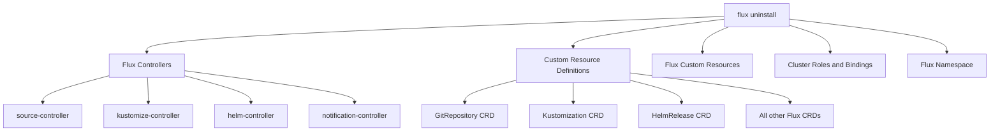

# How to Use flux uninstall to Remove Flux from Cluster

Author: [nawazdhandala](https://github.com/nawazdhandala)

Tags: Flux, Fluxcd, GitOps, Kubernetes, CLI, Uninstall, Cleanup, Cluster-management

Description: Learn how to use the flux uninstall command to safely and completely remove Flux CD from your Kubernetes cluster.

---

## Introduction

There are times when you need to remove Flux CD from a Kubernetes cluster, whether you are decommissioning a cluster, switching to a different GitOps tool, or cleaning up a test environment. The `flux uninstall` command provides a thorough removal process that cleans up controllers, CRDs, and associated resources.

This guide covers how to safely uninstall Flux while understanding the impact on your deployed workloads.

## Prerequisites

- Flux CLI installed
- A running Kubernetes cluster with Flux installed
- kubectl configured with cluster access
- Cluster admin permissions

## Understanding What Gets Removed

The `flux uninstall` command removes the following:



Critically, what is NOT removed:

- Workloads deployed by Flux (Deployments, Services, ConfigMaps, etc.)
- Helm releases installed by HelmRelease resources
- Namespaces created by your applications
- Secrets not in the Flux namespace

## Basic Uninstall

The simplest way to remove Flux:

```bash
# Uninstall Flux (with confirmation prompt)
flux uninstall
```

You will see a confirmation prompt:

```text
Are you sure you want to delete Flux and its custom resource definitions: y
```

After confirmation, the command proceeds:

```text
> deleting components in flux-system namespace
> Deployment/flux-system/helm-controller deleted
> Deployment/flux-system/kustomize-controller deleted
> Deployment/flux-system/notification-controller deleted
> Deployment/flux-system/source-controller deleted
> ...
> custom resource definitions deleted
> Namespace/flux-system deleted
> uninstall finished
```

## Silent Uninstall

Skip the confirmation prompt for automated workflows:

```bash
# Uninstall without confirmation
flux uninstall --silent
```

## Keeping Custom Resource Definitions

If you want to remove the controllers but keep the CRDs (useful for preserving resource definitions during migration):

```bash
# Uninstall controllers but keep CRDs
flux uninstall --keep-namespace
```

This removes the deployments, services, and service accounts but preserves the namespace and CRDs.

## Custom Namespace Uninstall

If Flux was installed in a custom namespace:

```bash
# Uninstall from a custom namespace
flux uninstall --namespace=gitops-system
```

## Pre-Uninstall Checklist

Before removing Flux, prepare by following this checklist:

```bash
#!/bin/bash
# pre-uninstall-checklist.sh
# Verify the state of your cluster before uninstalling Flux

set -euo pipefail

echo "=== Flux Pre-Uninstall Checklist ==="
echo ""

# 1. Check what Flux is managing
echo "1. Resources managed by Flux:"
echo "   Kustomizations:"
flux get kustomizations -A 2>/dev/null || echo "   None found"
echo ""
echo "   HelmReleases:"
flux get helmreleases -A 2>/dev/null || echo "   None found"
echo ""

# 2. Check for Kustomizations with prune enabled
echo "2. Kustomizations with prune enabled (these may delete resources):"
kubectl get kustomizations.kustomize.toolkit.fluxcd.io -A \
  -o jsonpath='{range .items[*]}{.metadata.namespace}/{.metadata.name}: prune={.spec.prune}{"\n"}{end}' \
  2>/dev/null || echo "   None found"
echo ""

# 3. Check for HelmReleases
echo "3. Active HelmReleases (Helm releases will be uninstalled):"
kubectl get helmreleases -A \
  -o jsonpath='{range .items[*]}{.metadata.namespace}/{.metadata.name}{"\n"}{end}' \
  2>/dev/null || echo "   None found"
echo ""

# 4. Export current configuration for backup
echo "4. Creating backup..."
mkdir -p /tmp/flux-backup-pre-uninstall
flux export source all -A > /tmp/flux-backup-pre-uninstall/sources.yaml 2>/dev/null || true
flux export kustomization -A > /tmp/flux-backup-pre-uninstall/kustomizations.yaml 2>/dev/null || true
flux export helmrelease -A > /tmp/flux-backup-pre-uninstall/helmreleases.yaml 2>/dev/null || true
echo "   Backup saved to /tmp/flux-backup-pre-uninstall/"
echo ""

echo "=== Checklist complete ==="
echo "Review the above before proceeding with: flux uninstall"
```

## Preserving Deployed Workloads

### Handling Kustomization Pruning

When Flux is uninstalled, Kustomizations with `prune: true` may trigger garbage collection. To prevent this:

```bash
# Step 1: Suspend all Kustomizations first
flux suspend kustomization --all --namespace=flux-system

# Step 2: Disable pruning on each Kustomization
for ks in $(kubectl get kustomizations.kustomize.toolkit.fluxcd.io -n flux-system \
  -o jsonpath='{.items[*].metadata.name}'); do
  kubectl patch kustomization "${ks}" -n flux-system \
    --type=merge -p '{"spec":{"prune":false}}'
  echo "Disabled prune for: ${ks}"
done

# Step 3: Now uninstall Flux
flux uninstall --silent
```

### Handling HelmReleases

HelmReleases may be uninstalled when Flux is removed. To keep the Helm releases:

```bash
# Step 1: Suspend all HelmReleases
for ns in $(kubectl get helmreleases -A -o jsonpath='{.items[*].metadata.namespace}' | tr ' ' '\n' | sort -u); do
  flux suspend helmrelease --all --namespace="${ns}" 2>/dev/null || true
done

# Step 2: Remove Flux finalizers from HelmReleases
for hr in $(kubectl get helmreleases -A -o jsonpath='{range .items[*]}{.metadata.namespace}/{.metadata.name}{"\n"}{end}'); do
  NS=$(echo "${hr}" | cut -d/ -f1)
  NAME=$(echo "${hr}" | cut -d/ -f2)
  kubectl patch helmrelease "${NAME}" -n "${NS}" \
    --type=json -p='[{"op":"remove","path":"/metadata/finalizers"}]' 2>/dev/null || true
  echo "Removed finalizers from: ${hr}"
done

# Step 3: Uninstall Flux
flux uninstall --silent
```

## Complete Safe Uninstall Script

Here is a comprehensive script that safely removes Flux while preserving workloads:

```bash
#!/bin/bash
# safe-uninstall.sh
# Safely uninstall Flux while preserving deployed workloads

set -euo pipefail

FLUX_NAMESPACE="${1:-flux-system}"

echo "=== Safe Flux Uninstall ==="
echo "Namespace: ${FLUX_NAMESPACE}"
echo ""

# Step 1: Backup all Flux resources
echo "Step 1: Creating backup..."
BACKUP_DIR="/tmp/flux-uninstall-backup-$(date +%Y%m%d-%H%M%S)"
mkdir -p "${BACKUP_DIR}"
flux export source all -A > "${BACKUP_DIR}/sources.yaml" 2>/dev/null || true
flux export kustomization -A > "${BACKUP_DIR}/kustomizations.yaml" 2>/dev/null || true
flux export helmrelease -A > "${BACKUP_DIR}/helmreleases.yaml" 2>/dev/null || true
flux export alert -A > "${BACKUP_DIR}/alerts.yaml" 2>/dev/null || true
flux export alert-provider -A > "${BACKUP_DIR}/providers.yaml" 2>/dev/null || true
echo "  Backup saved to: ${BACKUP_DIR}"
echo ""

# Step 2: Suspend all reconciliation
echo "Step 2: Suspending all reconciliation..."
flux suspend kustomization --all -n "${FLUX_NAMESPACE}" 2>/dev/null || true

for ns in $(kubectl get helmreleases -A -o jsonpath='{.items[*].metadata.namespace}' 2>/dev/null | tr ' ' '\n' | sort -u); do
  flux suspend helmrelease --all -n "${ns}" 2>/dev/null || true
done
echo "  All resources suspended."
echo ""

# Step 3: Disable pruning
echo "Step 3: Disabling Kustomization pruning..."
for ks in $(kubectl get kustomizations.kustomize.toolkit.fluxcd.io -A \
  -o jsonpath='{range .items[*]}{.metadata.namespace}/{.metadata.name}{" "}{end}' 2>/dev/null); do
  NS=$(echo "${ks}" | cut -d/ -f1)
  NAME=$(echo "${ks}" | cut -d/ -f2)
  kubectl patch kustomization "${NAME}" -n "${NS}" \
    --type=merge -p '{"spec":{"prune":false}}' 2>/dev/null || true
done
echo "  Pruning disabled."
echo ""

# Step 4: Remove finalizers from HelmReleases
echo "Step 4: Removing HelmRelease finalizers..."
for hr in $(kubectl get helmreleases -A \
  -o jsonpath='{range .items[*]}{.metadata.namespace}/{.metadata.name}{" "}{end}' 2>/dev/null); do
  NS=$(echo "${hr}" | cut -d/ -f1)
  NAME=$(echo "${hr}" | cut -d/ -f2)
  kubectl patch helmrelease "${NAME}" -n "${NS}" \
    --type=json -p='[{"op":"remove","path":"/metadata/finalizers"}]' 2>/dev/null || true
done
echo "  Finalizers removed."
echo ""

# Step 5: Uninstall Flux
echo "Step 5: Uninstalling Flux..."
flux uninstall --namespace="${FLUX_NAMESPACE}" --silent
echo ""

echo "=== Uninstall Complete ==="
echo ""
echo "Important notes:"
echo "  - Deployed workloads have been preserved"
echo "  - Helm releases remain installed but are no longer managed by Flux"
echo "  - Backup saved to: ${BACKUP_DIR}"
echo "  - To re-install Flux, run: flux install"
echo "  - To restore resources: kubectl apply -f ${BACKUP_DIR}/"
```

## Verifying Complete Removal

After uninstalling, verify that everything was cleaned up:

```bash
# Check that the Flux namespace is gone
kubectl get namespace flux-system
# Expected: Error from server (NotFound)

# Check that Flux CRDs are removed
kubectl get crds | grep fluxcd
# Expected: No output

# Check that Flux controllers are gone
kubectl get deployments -A | grep -E "(source|kustomize|helm|notification)-controller"
# Expected: No output

# Verify workloads are still running
kubectl get deployments -A
kubectl get services -A
kubectl get pods -A
```

## Cleaning Up Leftover Resources

Sometimes resources can be left behind. Clean them up:

```bash
# Remove any remaining Flux labels from resources
kubectl get all -A -l toolkit.fluxcd.io/namespace=flux-system \
  -o jsonpath='{range .items[*]}{.kind}/{.metadata.namespace}/{.metadata.name}{"\n"}{end}'

# Remove Flux labels from remaining resources
for resource in $(kubectl get all -A -l app.kubernetes.io/part-of=flux \
  -o jsonpath='{range .items[*]}{.kind}/{.metadata.namespace}/{.metadata.name}{" "}{end}' 2>/dev/null); do
  KIND=$(echo "${resource}" | cut -d/ -f1)
  NS=$(echo "${resource}" | cut -d/ -f2)
  NAME=$(echo "${resource}" | cut -d/ -f3)
  kubectl label "${KIND}" "${NAME}" -n "${NS}" \
    app.kubernetes.io/part-of- \
    toolkit.fluxcd.io/namespace- 2>/dev/null || true
done
```

## Re-Installing After Uninstall

If you need to re-install Flux after removing it:

```bash
# Option 1: Fresh bootstrap
flux bootstrap github \
  --owner=myorg \
  --repository=fleet-infra \
  --branch=main \
  --path=clusters/production \
  --personal

# Option 2: Manual install and restore from backup
flux install
kubectl apply -f /tmp/flux-uninstall-backup/sources.yaml
kubectl apply -f /tmp/flux-uninstall-backup/kustomizations.yaml
kubectl apply -f /tmp/flux-uninstall-backup/helmreleases.yaml
```

## Best Practices

1. **Always backup before uninstalling** using `flux export` to save all resource definitions.
2. **Suspend before removing** to prevent race conditions during cleanup.
3. **Disable pruning** on Kustomizations to prevent accidental workload deletion.
4. **Remove finalizers** from HelmReleases if you want to keep the Helm releases installed.
5. **Verify after uninstall** to ensure no leftover resources remain.
6. **Document the uninstall** so your team knows what was done and how to re-install if needed.

## Summary

The `flux uninstall` command provides a clean way to remove Flux CD from your cluster. However, an unthinking uninstall can lead to workload disruption if Kustomization pruning or HelmRelease finalizers are active. By following the safe uninstall process described in this guide -- suspending resources, disabling pruning, removing finalizers, and backing up before removal -- you can safely remove Flux while keeping your applications running.
