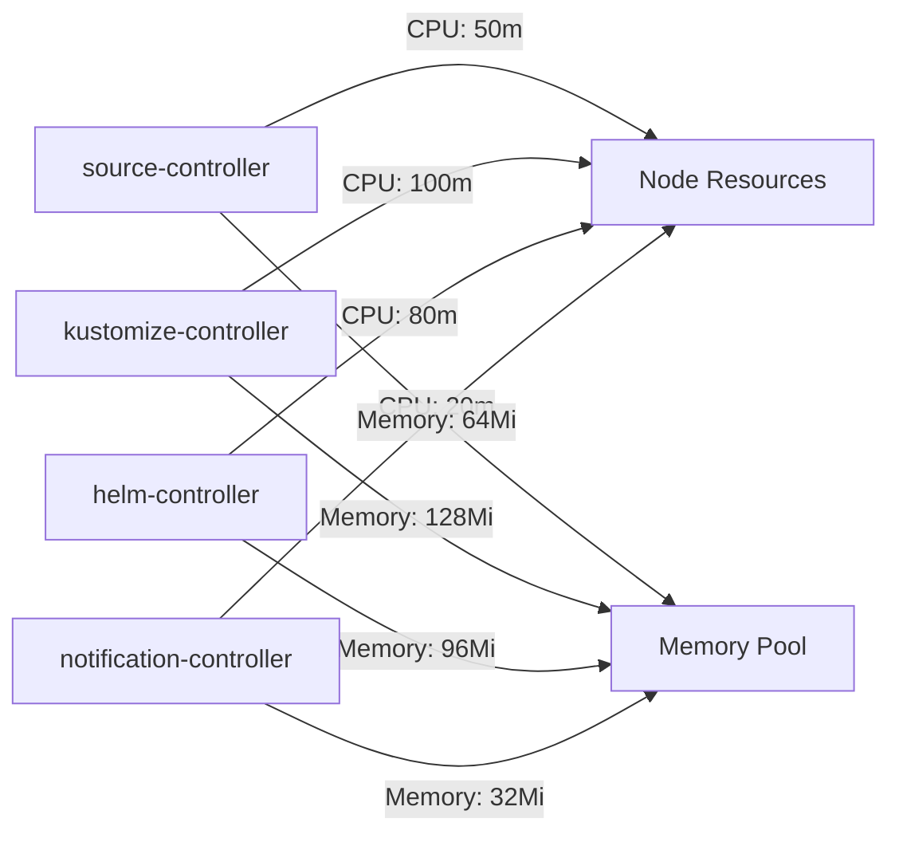

# How to Use Freelens with Flux CD for Cluster Management

Author: [nawazdhandala](https://github.com/nawazdhandala)

Tags: flux cd, freelens, kubernetes, cluster management, gitops, desktop, ide

Description: A practical guide to using Freelens as a desktop Kubernetes IDE alongside Flux CD for visual cluster management and GitOps monitoring.

---

## Introduction

Freelens is a free, open-source Kubernetes IDE that runs as a desktop application. It provides a rich graphical interface for managing Kubernetes clusters, and when combined with Flux CD, it becomes a powerful tool for monitoring GitOps workflows visually. Freelens lets you browse Flux custom resources, view pod logs, and troubleshoot deployments without leaving your desktop.

This guide shows you how to set up Freelens, configure it for Flux CD clusters, and use it effectively for day-to-day GitOps management.

## Prerequisites

Before you begin, ensure you have:

- A running Kubernetes cluster with Flux CD installed
- kubectl configured with a valid kubeconfig
- A desktop operating system (macOS, Linux, or Windows)
- The Flux CLI installed

Verify your cluster:

```bash
# Check cluster connectivity
kubectl cluster-info

# Verify Flux components
flux check
```

## Installing Freelens

### macOS

```bash
# Install via Homebrew
brew install freelens
```

### Linux

```bash
# Download the AppImage from the official releases
curl -L -o Freelens.AppImage \
  https://github.com/freelensapp/freelens/releases/latest/download/Freelens-linux-x86_64.AppImage

# Make it executable
chmod +x Freelens.AppImage

# Run Freelens
./Freelens.AppImage
```

### Windows

Download the installer from the Freelens GitHub releases page or use winget:

```bash
winget install Freelens
```

### Verify Installation

Launch Freelens and confirm that it detects your clusters from the kubeconfig file. You should see your clusters listed in the catalog view.

## Connecting Freelens to Your Cluster

### Automatic Detection

Freelens automatically reads clusters from your kubeconfig file at `~/.kube/config`. All configured contexts appear in the cluster catalog.

### Adding Clusters Manually

If your cluster is not in the default kubeconfig:

1. Open Freelens
2. Click the "+" button in the catalog
3. Paste your kubeconfig content or select a kubeconfig file
4. Click "Add Cluster"

### Managing Multiple Kubeconfig Files

Freelens supports multiple kubeconfig files:

```bash
# Set the KUBECONFIG environment variable with multiple files
export KUBECONFIG=~/.kube/config:~/.kube/staging-config:~/.kube/prod-config
```

Freelens will detect all clusters from all listed files.

## Navigating Flux Resources in Freelens

### Viewing Custom Resource Definitions

Flux resources are Kubernetes Custom Resources. In Freelens, navigate to them:

1. Open your cluster in Freelens
2. Go to **Custom Resources** in the left sidebar
3. Expand the Flux API groups:
   - `source.toolkit.fluxcd.io` for GitRepositories, HelmRepositories, etc.
   - `kustomize.toolkit.fluxcd.io` for Kustomizations
   - `helm.toolkit.fluxcd.io` for HelmReleases
   - `notification.toolkit.fluxcd.io` for Alerts and Providers

### Viewing GitRepositories

Navigate to Custom Resources and select GitRepositories:

```yaml
# Example GitRepository as seen in Freelens resource detail view
apiVersion: source.toolkit.fluxcd.io/v1
kind: GitRepository
metadata:
  name: flux-system
  namespace: flux-system
spec:
  interval: 1m
  url: https://github.com/myorg/fleet-infra
  ref:
    branch: main
status:
  conditions:
    - type: Ready
      status: "True"
      message: "stored artifact for revision main@sha1:abc123def"
  artifact:
    revision: "main@sha1:abc123def456"
    lastUpdateTime: "2026-03-06T10:00:00Z"
```

### Viewing Kustomizations

Select Kustomizations from the custom resources list to see all Flux Kustomizations:

```yaml
# Example Kustomization as seen in Freelens
apiVersion: kustomize.toolkit.fluxcd.io/v1
kind: Kustomization
metadata:
  name: apps
  namespace: flux-system
spec:
  interval: 10m
  sourceRef:
    kind: GitRepository
    name: flux-system
  path: ./apps/production
  prune: true
  healthChecks:
    - apiVersion: apps/v1
      kind: Deployment
      name: my-app
      namespace: default
status:
  conditions:
    - type: Ready
      status: "True"
      reason: ReconciliationSucceeded
```

### Viewing HelmReleases

Navigate to HelmReleases to see all Helm-based deployments:

```yaml
# Example HelmRelease detail in Freelens
apiVersion: helm.toolkit.fluxcd.io/v2
kind: HelmRelease
metadata:
  name: ingress-nginx
  namespace: ingress-system
spec:
  interval: 1h
  chart:
    spec:
      chart: ingress-nginx
      version: "4.x"
      sourceRef:
        kind: HelmRepository
        name: ingress-nginx
  values:
    controller:
      replicaCount: 2
```

## Monitoring Flux Controllers

### Checking Controller Health

In Freelens, navigate to **Workloads > Deployments** and filter by the `flux-system` namespace to see all Flux controllers:

- source-controller
- kustomize-controller
- helm-controller
- notification-controller

Click on each deployment to view:

- Pod status and restarts
- Resource consumption (CPU and memory)
- Container logs
- Environment variables

### Viewing Controller Logs

To troubleshoot Flux issues:

1. Navigate to **Workloads > Pods**
2. Filter by namespace `flux-system`
3. Click on a controller pod (e.g., `kustomize-controller-xxx`)
4. Select the **Logs** tab
5. Use the search bar to filter for specific resource names or error messages

### Monitoring Events

Navigate to **Events** and filter by namespace `flux-system` to see all Flux-related events:

- Reconciliation successes and failures
- Source fetch events
- Helm chart installation events
- Health check results

## Using Freelens Terminal

Freelens includes an integrated terminal. Open it from the bottom panel to run Flux commands:

```bash
# Get a summary of all Flux resources
flux get all -A

# Check a specific Kustomization
flux get kustomization apps -n flux-system

# Trigger a manual reconciliation
flux reconcile kustomization apps -n flux-system --with-source

# View Flux events for a specific resource
flux events --for Kustomization/apps
```

## Installing Freelens Extensions

Freelens supports extensions that can enhance your Flux CD workflow.

### Node and Pod Menu Extensions

```bash
# Extensions can be installed through the Freelens UI
# Navigate to Extensions in the menu bar
# Search for available extensions in the catalog
```

### Custom Resource Viewing Extensions

Some extensions improve the display of custom resources like Flux CRDs:

1. Open Freelens Preferences
2. Navigate to the Extensions tab
3. Browse or search for Kubernetes CRD viewer extensions
4. Install and restart Freelens

## Setting Up Resource Bookmarks

Freelens allows you to bookmark frequently accessed resources:

1. Navigate to any Flux resource (e.g., a Kustomization)
2. Click the bookmark icon in the resource detail view
3. Access bookmarked resources quickly from the sidebar

This is useful for keeping track of critical Flux resources you need to monitor regularly.

## Comparing Resource Configurations

Use Freelens to compare resource configurations across namespaces or clusters:

1. Open the resource YAML in one cluster
2. Copy it to your clipboard
3. Switch to another cluster
4. Open the same resource type
5. Use a diff tool to compare

For automated comparison, use the terminal:

```bash
# Export a Kustomization from the staging cluster
kubectl get kustomization apps -n flux-system -o yaml \
  --context staging > /tmp/staging-apps.yaml

# Export the same from production
kubectl get kustomization apps -n flux-system -o yaml \
  --context production > /tmp/prod-apps.yaml

# Compare the two
diff /tmp/staging-apps.yaml /tmp/prod-apps.yaml
```

## Resource Editing

Freelens lets you edit Flux resources directly:

1. Open the resource detail view
2. Click the edit button (pencil icon)
3. Modify the YAML
4. Save to apply changes

However, when using GitOps, direct edits will be overwritten on the next reconciliation. Instead, make changes through your Git repository:

```bash
# Preferred approach: edit in Git
cd /path/to/fleet-repo

# Edit the Kustomization
vim apps/production/kustomization.yaml

# Commit and push
git add -A
git commit -m "Update app configuration"
git push
```

## Monitoring Resource Usage

Freelens shows resource consumption for Flux controller pods:



Navigate to **Cluster > Nodes** to see overall resource utilization and verify that Flux controllers are not consuming excessive resources.

## Troubleshooting

### Freelens Not Connecting to Cluster

```bash
# Verify kubeconfig is valid
kubectl config view

# Test connectivity
kubectl get nodes

# Check if the API server is reachable
curl -k https://your-cluster-api:6443/healthz
```

### Custom Resources Not Appearing

If Flux CRDs are not listed:

1. Check that Flux CRDs are installed: `kubectl get crd | grep fluxcd`
2. Restart Freelens to refresh the CRD cache
3. Verify your service account has permissions to list CRDs

### High Memory Usage

Freelens can consume significant memory with large clusters:

1. Close unused cluster connections
2. Limit the number of visible namespaces
3. Disable auto-refresh for resources you are not monitoring

## Summary

Freelens provides a full-featured desktop IDE for Kubernetes that works well alongside Flux CD for GitOps management. Its ability to browse Flux custom resources, view controller logs, and run Flux CLI commands from an integrated terminal makes it a valuable tool for developers and operators who prefer a graphical interface. While direct editing is possible, the recommended workflow is to use Freelens for monitoring and troubleshooting while making all changes through your Git repository.
