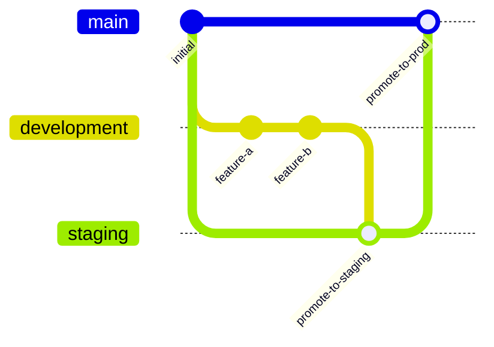

# How to Use Git Branches for Environment Promotion with Flux CD

Author: [nawazdhandala](https://github.com/nawazdhandala)

Tags: flux cd, gitops, kubernetes, git branches, environment promotion, ci/cd

Description: Learn how to use Git branches as the mechanism for promoting deployments across development, staging, and production environments with Flux CD.

---

## Introduction

One of the most intuitive ways to manage environment promotion with Flux CD is through Git branches. Each branch represents an environment, and promoting a change means merging from one branch to another. This approach maps cleanly to existing Git workflows that most teams are already familiar with.

This guide explains how to set up a branch-based promotion strategy with Flux CD, including the repository structure, Flux configuration, and automation patterns.

## How Branch-Based Promotion Works

The concept is straightforward:

1. Changes are committed to the `development` branch
2. After testing, changes are merged (or cherry-picked) into the `staging` branch
3. After staging validation, changes are merged into the `main` (production) branch
4. Each cluster watches its designated branch via a Flux GitRepository resource



## Repository Structure

With branch-based promotion, the directory structure on each branch is identical. The differences come from the content of the files on each branch.

```
fleet-repo/
├── infrastructure/
│   ├── sources/
│   │   └── kustomization.yaml
│   └── components/
│       ├── kustomization.yaml
│       ├── cert-manager/
│       ├── ingress-nginx/
│       └── monitoring/
├── apps/
│   ├── kustomization.yaml
│   ├── api-server/
│   │   ├── kustomization.yaml
│   │   ├── deployment.yaml
│   │   ├── service.yaml
│   │   └── configmap.yaml
│   └── web-frontend/
│       ├── kustomization.yaml
│       ├── deployment.yaml
│       └── service.yaml
└── clusters/
    └── my-cluster/
        ├── infrastructure.yaml
        └── apps.yaml
```

## Setting Up Branches

Create the three environment branches from your main branch.

```bash
# Start from the main branch (this represents production)
git checkout main

# Create the staging branch
git checkout -b staging

# Create the development branch from staging
git checkout -b development

# Push all branches to the remote
git push origin main staging development
```

## Configuring Flux GitRepository Per Environment

Each cluster's Flux installation points to the appropriate branch.

```yaml
# Development cluster - watches the development branch
apiVersion: source.toolkit.fluxcd.io/v1
kind: GitRepository
metadata:
  name: fleet-repo
  namespace: flux-system
spec:
  interval: 1m
  url: https://github.com/myorg/fleet-repo.git
  ref:
    # Development cluster tracks the development branch
    branch: development
  secretRef:
    name: git-credentials
```

```yaml
# Staging cluster - watches the staging branch
apiVersion: source.toolkit.fluxcd.io/v1
kind: GitRepository
metadata:
  name: fleet-repo
  namespace: flux-system
spec:
  interval: 2m
  url: https://github.com/myorg/fleet-repo.git
  ref:
    # Staging cluster tracks the staging branch
    branch: staging
  secretRef:
    name: git-credentials
```

```yaml
# Production cluster - watches the main branch
apiVersion: source.toolkit.fluxcd.io/v1
kind: GitRepository
metadata:
  name: fleet-repo
  namespace: flux-system
spec:
  interval: 5m
  url: https://github.com/myorg/fleet-repo.git
  ref:
    # Production cluster tracks the main branch
    branch: main
  secretRef:
    name: git-credentials
```

## Flux Kustomization Resources

The Kustomization resources are identical across branches since the directory structure is the same.

```yaml
# clusters/my-cluster/infrastructure.yaml
# Reconcile infrastructure components from the repository
apiVersion: kustomize.toolkit.fluxcd.io/v1
kind: Kustomization
metadata:
  name: infrastructure
  namespace: flux-system
spec:
  interval: 10m
  sourceRef:
    kind: GitRepository
    name: fleet-repo
  path: ./infrastructure/components
  prune: true
  timeout: 5m
```

```yaml
# clusters/my-cluster/apps.yaml
# Reconcile applications after infrastructure is ready
apiVersion: kustomize.toolkit.fluxcd.io/v1
kind: Kustomization
metadata:
  name: apps
  namespace: flux-system
spec:
  dependsOn:
    - name: infrastructure
  interval: 5m
  sourceRef:
    kind: GitRepository
    name: fleet-repo
  path: ./apps
  prune: true
  timeout: 5m
  healthChecks:
    - apiVersion: apps/v1
      kind: Deployment
      name: api-server
      namespace: default
    - apiVersion: apps/v1
      kind: Deployment
      name: web-frontend
      namespace: default
```

## Making Changes on the Development Branch

All changes start on the development branch.

```yaml
# On the development branch, update the image tag
# apps/api-server/deployment.yaml
apiVersion: apps/v1
kind: Deployment
metadata:
  name: api-server
spec:
  replicas: 2
  selector:
    matchLabels:
      app: api-server
  template:
    metadata:
      labels:
        app: api-server
    spec:
      containers:
        - name: api-server
          # Updated image tag for the new feature
          image: myorg/api-server:v2.1.0
          ports:
            - containerPort: 8080
```

```bash
# Commit and push the change to the development branch
git checkout development
git add apps/api-server/deployment.yaml
git commit -m "Update api-server to v2.1.0 with new caching feature"
git push origin development
```

## Promoting to Staging

After the change is validated in development, merge it to staging.

```bash
# Switch to staging and merge from development
git checkout staging
git merge development

# Alternatively, cherry-pick specific commits for selective promotion
# git cherry-pick <commit-hash>

git push origin staging
```

## Promoting to Production

After staging validation, merge to production.

```bash
# Switch to main (production) and merge from staging
git checkout main
git merge staging
git push origin main
```

## Branch-Specific Configuration Values

Sometimes you need different configuration values per environment even though the structure is the same. Manage this by maintaining different ConfigMap values on each branch.

```yaml
# apps/api-server/configmap.yaml
# On the development branch:
apiVersion: v1
kind: ConfigMap
metadata:
  name: api-server-config
data:
  LOG_LEVEL: "debug"
  DATABASE_URL: "postgres://db.dev.internal:5432/myapp"
  FEATURE_NEW_UI: "true"
```

```yaml
# apps/api-server/configmap.yaml
# On the main (production) branch:
apiVersion: v1
kind: ConfigMap
metadata:
  name: api-server-config
data:
  LOG_LEVEL: "warn"
  DATABASE_URL: "postgres://db.prod.internal:5432/myapp"
  FEATURE_NEW_UI: "false"
```

## Automating Promotion with Pull Requests

Use pull requests for promotion to add review gates and automated checks.

```bash
# Create a promotion PR from development to staging
gh pr create \
  --base staging \
  --head development \
  --title "Promote: api-server v2.1.0 to staging" \
  --body "Promotes the api-server v2.1.0 update that was validated in development."

# After staging validation, create a PR from staging to production
gh pr create \
  --base main \
  --head staging \
  --title "Promote: api-server v2.1.0 to production" \
  --body "Promotes the api-server v2.1.0 update validated in both dev and staging."
```

## Handling Merge Conflicts

Branch-specific files (like ConfigMaps with environment values) will cause merge conflicts. Handle this by:

```bash
# When merging, keep the target branch version of env-specific files
git checkout staging
git merge development

# If there are conflicts in environment-specific files, resolve them
# by keeping the staging values
git checkout --ours apps/api-server/configmap.yaml
git add apps/api-server/configmap.yaml
git commit -m "Promote development changes to staging, keep staging config"
```

## Monitoring Promotion Status

```bash
# Check which branch each cluster is tracking
flux get sources git

# Verify reconciliation status
flux get kustomizations

# See the current commit being reconciled
flux get source git fleet-repo

# Force reconciliation after a promotion merge
flux reconcile source git fleet-repo
```

## Advantages and Trade-offs

### Advantages

- Familiar Git workflow with branches and merge/pull requests
- Clear audit trail through Git history
- Easy to understand which code is in which environment
- Works well with branch protection rules and required reviews

### Trade-offs

- Environment-specific config values can cause merge conflicts
- Branch divergence can be hard to manage over time
- Requires discipline to keep branches in sync
- Not ideal for repositories with many environment-specific files

## Best Practices

### Keep Environment-Specific Files Minimal

The fewer files that differ between branches, the fewer merge conflicts you will encounter. Use external secret management and ConfigMap generators to minimize branch-specific files.

### Use Protected Branches

Set up branch protection rules to require pull request reviews for staging and production promotions.

### Automate Conflict Resolution

Write scripts or CI jobs that handle predictable merge conflicts in environment-specific files automatically.

### Rebase Instead of Merge When Possible

Rebasing keeps the branch history cleaner and makes it easier to see what changes are pending promotion.

## Conclusion

Branch-based environment promotion with Flux CD leverages the most fundamental Git concept - branches - to manage deployments across environments. While it introduces some complexity around merge conflicts for environment-specific files, the workflow is intuitive and integrates naturally with pull request review processes. For teams that prefer a branch-per-environment model, this approach provides a clean and auditable promotion path.
