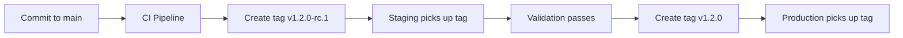

# How to Use Git Tags for Release Promotion with Flux CD

Author: [nawazdhandala](https://github.com/nawazdhandala)

Tags: Flux CD, GitOps, Kubernetes, Git Tags, release promotion, Semantic Versioning

Description: Learn how to use Git tags as release markers for promoting deployments across environments with Flux CD, enabling precise version control and rollback capabilities.

---

## Introduction

Git tags provide immutable reference points in your repository history, making them an excellent mechanism for release promotion with Flux CD. Unlike branches, tags are fixed snapshots that cannot be accidentally modified. This makes them ideal for production deployments where you want absolute certainty about what is being deployed.

This guide shows you how to implement a tag-based release promotion strategy with Flux CD.

## Why Use Git Tags for Promotion?

Tags offer several advantages over branch-based promotion:

- Immutable references that cannot be changed after creation
- Clear version numbering with semantic versioning
- Easy rollback by pointing to a previous tag
- Simple audit trail of what was deployed and when
- No merge conflict issues since tags are read-only snapshots

## The Promotion Flow



## Repository Structure

The repository uses a single branch with tags marking release points.

```text
fleet-repo/
├── infrastructure/
│   ├── sources/
│   │   ├── kustomization.yaml
│   │   └── helm-repos.yaml
│   └── components/
│       ├── kustomization.yaml
│       ├── cert-manager/
│       └── monitoring/
├── apps/
│   ├── kustomization.yaml
│   ├── api-server/
│   │   ├── deployment.yaml
│   │   ├── service.yaml
│   │   └── configmap.yaml
│   └── worker/
│       ├── deployment.yaml
│       └── service.yaml
├── environments/
│   ├── staging/
│   │   ├── kustomization.yaml
│   │   └── patches/
│   └── production/
│       ├── kustomization.yaml
│       └── patches/
└── clusters/
    ├── staging/
    │   └── flux-config.yaml
    └── production/
        └── flux-config.yaml
```

## Creating a Tagging Convention

Establish a clear tagging convention that Flux can use to select the right releases.

```bash
# Release candidates for staging validation
git tag v1.0.0-rc.1
git tag v1.0.0-rc.2

# Stable releases for production
git tag v1.0.0
git tag v1.1.0
git tag v1.2.0

# Hotfix releases
git tag v1.2.1
```

## Configuring Flux to Track Tags

### Staging Cluster - Track Release Candidates

```yaml
# clusters/staging/flux-config.yaml
# Staging cluster tracks release candidate tags
apiVersion: source.toolkit.fluxcd.io/v1
kind: GitRepository
metadata:
  name: fleet-repo
  namespace: flux-system
spec:
  interval: 1m
  url: https://github.com/myorg/fleet-repo.git
  ref:
    # Use semver to automatically pick up the latest release candidate
    semver: ">=1.0.0-rc.1"
  secretRef:
    name: git-credentials
---
apiVersion: kustomize.toolkit.fluxcd.io/v1
kind: Kustomization
metadata:
  name: infrastructure
  namespace: flux-system
spec:
  interval: 10m
  sourceRef:
    kind: GitRepository
    name: fleet-repo
  path: ./infrastructure/components
  prune: true
---
apiVersion: kustomize.toolkit.fluxcd.io/v1
kind: Kustomization
metadata:
  name: apps-staging
  namespace: flux-system
spec:
  dependsOn:
    - name: infrastructure
  interval: 5m
  sourceRef:
    kind: GitRepository
    name: fleet-repo
  path: ./environments/staging
  prune: true
  healthChecks:
    - apiVersion: apps/v1
      kind: Deployment
      name: api-server
      namespace: staging
```

### Production Cluster - Track Stable Releases Only

```yaml
# clusters/production/flux-config.yaml
# Production cluster only tracks stable release tags (no pre-releases)
apiVersion: source.toolkit.fluxcd.io/v1
kind: GitRepository
metadata:
  name: fleet-repo
  namespace: flux-system
spec:
  interval: 5m
  url: https://github.com/myorg/fleet-repo.git
  ref:
    # Semver range that excludes pre-release tags
    semver: ">=1.0.0 <2.0.0"
  secretRef:
    name: git-credentials
---
apiVersion: kustomize.toolkit.fluxcd.io/v1
kind: Kustomization
metadata:
  name: infrastructure
  namespace: flux-system
spec:
  interval: 10m
  sourceRef:
    kind: GitRepository
    name: fleet-repo
  path: ./infrastructure/components
  prune: true
---
apiVersion: kustomize.toolkit.fluxcd.io/v1
kind: Kustomization
metadata:
  name: apps-production
  namespace: flux-system
spec:
  dependsOn:
    - name: infrastructure
  interval: 10m
  sourceRef:
    kind: GitRepository
    name: fleet-repo
  path: ./environments/production
  prune: true
  timeout: 10m
  healthChecks:
    - apiVersion: apps/v1
      kind: Deployment
      name: api-server
      namespace: production
```

## Environment-Specific Overlays

Use Kustomize overlays to adjust configurations per environment without modifying the base.

```yaml
# environments/staging/kustomization.yaml
# Staging overlay with reduced replicas and debug settings
apiVersion: kustomize.config.k8s.io/v1beta1
kind: Kustomization
resources:
  - ../../apps
patches:
  - path: patches/replicas.yaml
  - path: patches/config-override.yaml
namespace: staging
```

```yaml
# environments/staging/patches/replicas.yaml
# Staging needs fewer replicas than production
apiVersion: apps/v1
kind: Deployment
metadata:
  name: api-server
spec:
  replicas: 2
---
apiVersion: apps/v1
kind: Deployment
metadata:
  name: worker
spec:
  replicas: 1
```

```yaml
# environments/production/kustomization.yaml
# Production overlay with full replicas and production settings
apiVersion: kustomize.config.k8s.io/v1beta1
kind: Kustomization
resources:
  - ../../apps
patches:
  - path: patches/replicas.yaml
  - path: patches/config-override.yaml
namespace: production
```

```yaml
# environments/production/patches/replicas.yaml
# Production runs at full scale
apiVersion: apps/v1
kind: Deployment
metadata:
  name: api-server
spec:
  replicas: 10
---
apiVersion: apps/v1
kind: Deployment
metadata:
  name: worker
spec:
  replicas: 5
```

## The Release Workflow

### Step 1: Develop on Main Branch

```bash
# Make changes on the main branch
git checkout main
git add apps/api-server/deployment.yaml
git commit -m "Update api-server with new caching layer"
git push origin main
```

### Step 2: Create a Release Candidate Tag

```bash
# Tag the commit as a release candidate
git tag -a v1.3.0-rc.1 -m "Release candidate 1 for v1.3.0"
git push origin v1.3.0-rc.1

# Flux on staging will automatically detect this tag
# and begin reconciliation
```

### Step 3: Validate in Staging

```bash
# Check that staging has picked up the new tag
flux get sources git -n flux-system

# Verify the deployment is healthy
flux get kustomizations -n flux-system

# Run integration tests against staging
# ... your test suite here ...
```

### Step 4: Fix Issues and Re-tag if Needed

```bash
# If issues are found, fix on main and create a new RC
git checkout main
git add apps/api-server/deployment.yaml
git commit -m "Fix cache invalidation bug in api-server"
git push origin main

# Create next release candidate
git tag -a v1.3.0-rc.2 -m "Release candidate 2 for v1.3.0 - cache fix"
git push origin v1.3.0-rc.2
```

### Step 5: Promote to Production

```bash
# Once staging is validated, create a stable tag
git tag -a v1.3.0 -m "Release v1.3.0 - new caching layer"
git push origin v1.3.0

# Flux on production will detect the new stable tag
# and begin reconciliation
```

## Rolling Back with Tags

One of the biggest advantages of tag-based promotion is easy rollbacks.

```yaml
# To roll back production, update the semver constraint to exclude the bad version
apiVersion: source.toolkit.fluxcd.io/v1
kind: GitRepository
metadata:
  name: fleet-repo
  namespace: flux-system
spec:
  interval: 5m
  url: https://github.com/myorg/fleet-repo.git
  ref:
    # Pin to the last known good version
    tag: v1.2.0
```

Or use the Flux CLI for a quick rollback:

```bash
# Suspend automatic reconciliation
flux suspend source git fleet-repo

# Update the GitRepository to point to the previous tag
kubectl patch gitrepository fleet-repo -n flux-system \
  --type merge \
  -p '{"spec":{"ref":{"tag":"v1.2.0","semver":null}}}'

# Resume reconciliation
flux resume source git fleet-repo
```

## Automating Tag Creation with CI

Integrate tag creation into your CI pipeline for a fully automated flow.

```yaml
# .github/workflows/release.yaml
# GitHub Actions workflow for automated release tagging
name: Release
on:
  workflow_dispatch:
    inputs:
      version:
        description: "Release version (e.g., 1.3.0)"
        required: true
      type:
        description: "Release type"
        required: true
        type: choice
        options:
          - rc
          - stable

jobs:
  tag-release:
    runs-on: ubuntu-latest
    steps:
      - uses: actions/checkout@v4
        with:
          fetch-depth: 0

      - name: Create release candidate tag
        if: inputs.type == 'rc'
        run: |
          # Find the next RC number
          LATEST_RC=$(git tag -l "v${{ inputs.version }}-rc.*" | sort -V | tail -1)
          if [ -z "$LATEST_RC" ]; then
            NEXT_RC=1
          else
            CURRENT_RC=$(echo "$LATEST_RC" | grep -oP 'rc\.\K[0-9]+')
            NEXT_RC=$((CURRENT_RC + 1))
          fi
          TAG="v${{ inputs.version }}-rc.${NEXT_RC}"
          git tag -a "$TAG" -m "Release candidate $TAG"
          git push origin "$TAG"

      - name: Create stable release tag
        if: inputs.type == 'stable'
        run: |
          TAG="v${{ inputs.version }}"
          git tag -a "$TAG" -m "Stable release $TAG"
          git push origin "$TAG"
```

## Monitoring Tag-Based Deployments

```bash
# Check which tag is currently reconciled
flux get source git fleet-repo -o yaml | grep -A5 "artifact"

# View all available tags
git tag -l --sort=-v:refname | head -20

# Check the status of all kustomizations
flux get kustomizations --all-namespaces
```

## Best Practices

### Use Annotated Tags

Always use annotated tags (`git tag -a`) rather than lightweight tags. Annotated tags store the tagger, date, and message, providing better audit trails.

### Follow Semantic Versioning

Stick to semantic versioning (major.minor.patch) so Flux's semver filtering works correctly.

### Never Delete or Move Tags

Tags should be immutable. If a tag has a problem, create a new one rather than deleting and recreating.

### Keep a CHANGELOG

Maintain a CHANGELOG file that documents what each version includes. This helps during promotion reviews.

## Conclusion

Git tag-based release promotion with Flux CD gives you precise, immutable version control over your deployments. By using semantic versioning and Flux's semver filtering, you can automatically deploy release candidates to staging and stable releases to production. The approach provides clean rollback capabilities and integrates naturally with CI/CD pipelines for automated release workflows.
