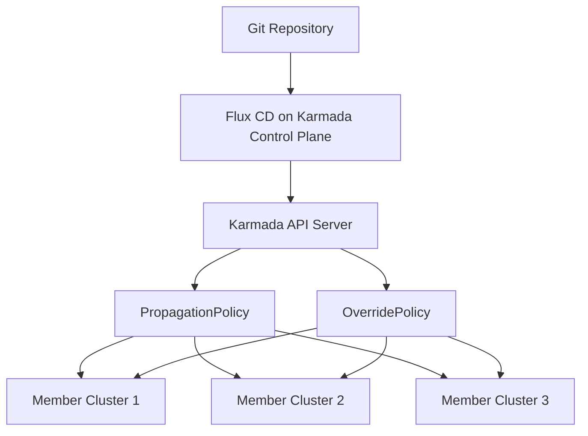

# How to Use Karmada with Flux CD for Multi-Cluster

Author: [nawazdhandala](https://github.com/nawazdhandala)

Tags: flux cd, karmada, multi-cluster, gitops, kubernetes, federation

Description: Learn how to combine Karmada's multi-cluster orchestration with Flux CD's GitOps capabilities for powerful multi-cluster management.

---

## Introduction

Karmada (Kubernetes Armada) is an open-source multi-cluster management system that propagates Kubernetes resources across clusters using policies. When combined with Flux CD, you get the best of both worlds: Flux handles the GitOps reconciliation loop while Karmada handles intelligent workload distribution, failover, and scheduling across clusters.

This guide walks you through setting up Karmada alongside Flux CD and deploying workloads across multiple clusters using policy-based placement.

## Prerequisites

- A Kubernetes cluster to serve as the Karmada control plane
- Two or more member clusters to join to Karmada
- kubectl and karmadactl CLI installed
- Flux CLI installed (v2.0 or later)
- A Git repository for your configurations
- Helm v3 installed

## Architecture Overview



Flux CD deploys resources to the Karmada control plane API, and Karmada propagates them to member clusters based on policies.

## Step 1: Install Karmada

Install Karmada on your control plane cluster:

```bash
# Install karmadactl
curl -s https://raw.githubusercontent.com/karmada-io/karmada/master/hack/install-cli.sh | sudo bash

# Initialize Karmada on the control plane cluster
kubectl config use-context control-plane
karmadactl init --kubeconfig=/path/to/control-plane-kubeconfig
```

Alternatively, install Karmada using Helm:

```yaml
# karmada-helm-values.yaml
# Helm values for Karmada installation
apiVersion: v1
kind: Namespace
metadata:
  name: karmada-system
---
# HelmRepository for Karmada charts
apiVersion: source.toolkit.fluxcd.io/v1
kind: HelmRepository
metadata:
  name: karmada
  namespace: karmada-system
spec:
  interval: 1h
  url: https://raw.githubusercontent.com/karmada-io/karmada/master/charts
---
# HelmRelease to install Karmada via Flux
apiVersion: helm.toolkit.fluxcd.io/v2
kind: HelmRelease
metadata:
  name: karmada
  namespace: karmada-system
spec:
  interval: 30m
  chart:
    spec:
      chart: karmada
      version: "1.8.x"
      sourceRef:
        kind: HelmRepository
        name: karmada
  values:
    # Enable the Karmada API server
    apiServer:
      replicas: 2
    # Enable the scheduler
    scheduler:
      replicas: 2
    # Enable the controller manager
    controllerManager:
      replicas: 2
```

## Step 2: Join Member Clusters

Register your member clusters with Karmada:

```bash
# Join member cluster 1 using push mode
karmadactl join member-cluster-1 \
  --kubeconfig=/path/to/karmada-kubeconfig \
  --cluster-kubeconfig=/path/to/member-1-kubeconfig

# Join member cluster 2
karmadactl join member-cluster-2 \
  --kubeconfig=/path/to/karmada-kubeconfig \
  --cluster-kubeconfig=/path/to/member-2-kubeconfig

# Verify member clusters are registered
kubectl --kubeconfig=/path/to/karmada-kubeconfig get clusters
```

## Step 3: Bootstrap Flux on the Karmada Control Plane

Bootstrap Flux targeting the Karmada API server so that all resources Flux creates are managed by Karmada:

```bash
# Bootstrap Flux on the Karmada control plane
flux bootstrap github \
  --owner=your-org \
  --repository=fleet-config \
  --branch=main \
  --path=clusters/karmada \
  --kubeconfig=/path/to/karmada-kubeconfig \
  --personal
```

## Step 4: Create PropagationPolicies

PropagationPolicies tell Karmada which resources to distribute and to which clusters.

```yaml
# base/policies/propagation-policy-all.yaml
# Propagate matching resources to all member clusters
apiVersion: policy.karmada.io/v1alpha1
kind: PropagationPolicy
metadata:
  name: propagate-to-all-clusters
  namespace: default
spec:
  # Select resources by label
  resourceSelectors:
    - apiVersion: apps/v1
      kind: Deployment
      labelSelector:
        matchLabels:
          fleet/scope: global
    - apiVersion: v1
      kind: Service
      labelSelector:
        matchLabels:
          fleet/scope: global
    - apiVersion: v1
      kind: ConfigMap
      labelSelector:
        matchLabels:
          fleet/scope: global
  placement:
    clusterAffinity:
      # Target all clusters with the "environment: production" label
      labelSelector:
        matchLabels:
          environment: production
    # Duplicate resources to all matching clusters
    replicaScheduling:
      replicaSchedulingType: Duplicated
```

```yaml
# base/policies/propagation-policy-weighted.yaml
# Distribute replicas across clusters with weighted scheduling
apiVersion: policy.karmada.io/v1alpha1
kind: PropagationPolicy
metadata:
  name: weighted-distribution
  namespace: default
spec:
  resourceSelectors:
    - apiVersion: apps/v1
      kind: Deployment
      labelSelector:
        matchLabels:
          fleet/distribution: weighted
  placement:
    clusterAffinity:
      clusterNames:
        - member-cluster-1
        - member-cluster-2
    replicaScheduling:
      replicaSchedulingType: Divided
      # 70% of replicas go to cluster-1, 30% to cluster-2
      weightPreference:
        staticWeightList:
          - targetCluster:
              clusterNames:
                - member-cluster-1
            weight: 7
          - targetCluster:
              clusterNames:
                - member-cluster-2
            weight: 3
```

## Step 5: Create OverridePolicies

OverridePolicies let you customize resources per cluster without duplicating manifests.

```yaml
# base/policies/override-policy.yaml
# Override resource values based on target cluster
apiVersion: policy.karmada.io/v1alpha1
kind: OverridePolicy
metadata:
  name: cluster-specific-overrides
  namespace: default
spec:
  targetCluster:
    clusterNames:
      - member-cluster-1
  overriders:
    # Override the container image registry for cluster-1
    imageOverrider:
      - component: Registry
        operator: replace
        value: registry.cluster-1.example.com
    # Override specific fields using JSON patch
    plaintext:
      - path: /spec/template/spec/containers/0/resources/limits/cpu
        operator: replace
        value: "500m"
      - path: /spec/template/spec/containers/0/resources/limits/memory
        operator: replace
        value: "512Mi"
---
# Different overrides for cluster-2
apiVersion: policy.karmada.io/v1alpha1
kind: OverridePolicy
metadata:
  name: cluster-2-overrides
  namespace: default
spec:
  targetCluster:
    clusterNames:
      - member-cluster-2
  overriders:
    imageOverrider:
      - component: Registry
        operator: replace
        value: registry.cluster-2.example.com
    plaintext:
      - path: /spec/template/spec/containers/0/resources/limits/cpu
        operator: replace
        value: "1000m"
      - path: /spec/template/spec/containers/0/resources/limits/memory
        operator: replace
        value: "1Gi"
```

## Step 6: Deploy Applications Through Flux and Karmada

Create a Flux Kustomization that deploys both the application and the Karmada policies.

```yaml
# clusters/karmada/apps.yaml
# Flux Kustomization that deploys apps to the Karmada API server
apiVersion: kustomize.toolkit.fluxcd.io/v1
kind: Kustomization
metadata:
  name: apps
  namespace: flux-system
spec:
  interval: 10m
  path: ./apps/production
  prune: true
  sourceRef:
    kind: GitRepository
    name: flux-system
  # Deploy policies before applications
  dependsOn:
    - name: policies
---
# Flux Kustomization for Karmada policies
apiVersion: kustomize.toolkit.fluxcd.io/v1
kind: Kustomization
metadata:
  name: policies
  namespace: flux-system
spec:
  interval: 10m
  path: ./base/policies
  prune: true
  sourceRef:
    kind: GitRepository
    name: flux-system
```

```yaml
# apps/production/deployment.yaml
# Application deployment that Karmada will propagate
apiVersion: apps/v1
kind: Deployment
metadata:
  name: web-app
  namespace: default
  labels:
    # This label matches the PropagationPolicy selector
    fleet/scope: global
spec:
  replicas: 6
  selector:
    matchLabels:
      app: web-app
  template:
    metadata:
      labels:
        app: web-app
    spec:
      containers:
        - name: web-app
          image: your-org/web-app:v1.2.0
          ports:
            - containerPort: 8080
          resources:
            requests:
              cpu: 100m
              memory: 128Mi
            limits:
              cpu: 200m
              memory: 256Mi
---
# Service for the web app
apiVersion: v1
kind: Service
metadata:
  name: web-app
  namespace: default
  labels:
    fleet/scope: global
spec:
  selector:
    app: web-app
  ports:
    - port: 80
      targetPort: 8080
  type: ClusterIP
```

## Step 7: Monitor Propagation Status

Check the status of workload propagation across clusters:

```bash
# Check resource binding status in Karmada
kubectl --kubeconfig=/path/to/karmada-kubeconfig \
  get resourcebindings -n default

# Check the detailed propagation status of a specific deployment
kubectl --kubeconfig=/path/to/karmada-kubeconfig \
  get deployment web-app -n default -o yaml | grep -A 20 "status:"

# View Karmada events
kubectl --kubeconfig=/path/to/karmada-kubeconfig \
  get events -n default --sort-by='.lastTimestamp'

# Check Flux reconciliation status
flux get kustomizations --kubeconfig=/path/to/karmada-kubeconfig
```

## Step 8: Set Up Karmada Failover

Configure Karmada to automatically reschedule workloads when a member cluster becomes unavailable.

```yaml
# base/policies/failover-policy.yaml
# PropagationPolicy with failover enabled
apiVersion: policy.karmada.io/v1alpha1
kind: PropagationPolicy
metadata:
  name: ha-deployment-policy
  namespace: default
spec:
  resourceSelectors:
    - apiVersion: apps/v1
      kind: Deployment
      labelSelector:
        matchLabels:
          fleet/ha: "true"
  placement:
    clusterAffinity:
      clusterNames:
        - member-cluster-1
        - member-cluster-2
        - member-cluster-3
    spreadConstraints:
      # Ensure workloads are spread across at least 2 clusters
      - spreadByField: cluster
        maxGroups: 3
        minGroups: 2
    replicaScheduling:
      replicaSchedulingType: Divided
  # Enable failover so Karmada reschedules when a cluster goes down
  failover:
    clusterFailoverPolicy:
      decisionConditions:
        tolerationSeconds: 300
      purgeMode: Graciously
```

## Step 9: Git Repository Structure

Here is the recommended repository structure for a Flux + Karmada setup:

```
fleet-config/
  clusters/
    karmada/
      flux-system/       # Flux bootstrap files
      apps.yaml          # Kustomization for apps
      policies.yaml      # Kustomization for policies
  base/
    policies/
      propagation-policy-all.yaml
      propagation-policy-weighted.yaml
      override-policy.yaml
      failover-policy.yaml
      kustomization.yaml
  apps/
    production/
      deployment.yaml
      service.yaml
      kustomization.yaml
    staging/
      deployment.yaml
      kustomization.yaml
```

## Troubleshooting

**Resources not propagating**: Check that the PropagationPolicy resource selectors match the labels on your resources. Use `karmadactl get` to inspect bindings.

**Member cluster not ready**: Verify the cluster status with `kubectl get clusters` on the Karmada API server. Ensure the cluster agent has network connectivity.

**Flux and Karmada conflict**: Make sure Flux is only deploying to the Karmada API server, not directly to member clusters. All propagation should go through Karmada policies.

```bash
# Debug propagation issues
karmadactl describe resourcebinding web-app-deployment -n default

# Check member cluster health
karmadactl get clusters -o wide
```

## Conclusion

Combining Karmada with Flux CD gives you a robust multi-cluster management solution. Flux CD handles the GitOps reconciliation and ensures your desired state is applied to the Karmada control plane, while Karmada takes care of distributing workloads across member clusters based on your policies. This separation of concerns makes it easy to manage complex multi-cluster deployments at scale.
