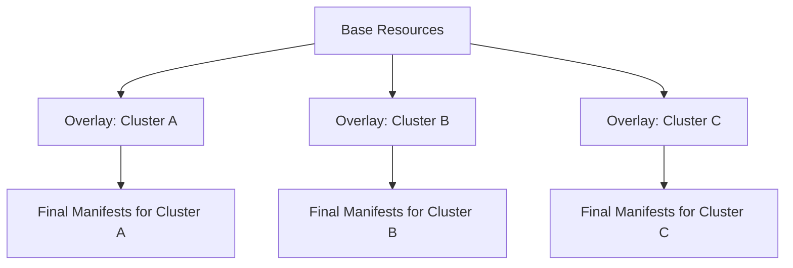

# How to Use Kustomize Overlays for Multi-Cluster with Flux CD

Author: [nawazdhandala](https://github.com/nawazdhandala)

Tags: Flux CD, Kustomize, Overlay, Multi-Cluster, GitOps, Kubernetes

Description: Learn how to use Kustomize overlays to manage Kubernetes configurations across multiple clusters with Flux CD, maintaining DRY principles while allowing per-cluster customization.

---

## Introduction

Kustomize overlays are the backbone of multi-cluster configuration management with Flux CD. The overlay pattern lets you define a base set of resources and then layer cluster-specific modifications on top, without modifying the original files. This approach keeps your configurations DRY while allowing each cluster to have its own identity. This guide demonstrates how to build and manage a multi-cluster Kustomize overlay structure with Flux CD.

## How Kustomize Overlays Work

Kustomize uses a base-and-overlay model:

- **Base**: Contains the canonical resource definitions shared across all targets
- **Overlay**: Contains modifications (patches, additions, transformations) specific to a target



## Prerequisites

- Flux CD installed on all target clusters
- A Git repository bootstrapped with Flux
- Basic familiarity with Kustomize concepts

## Repository Structure

```text
fleet-repo/
  base/
    apps/
      order-service/
        deployment.yaml
        service.yaml
        configmap.yaml
        hpa.yaml
        kustomization.yaml
      inventory-service/
        deployment.yaml
        service.yaml
        kustomization.yaml
    infrastructure/
      redis/
        helmrelease.yaml
        kustomization.yaml
  overlays/
    cluster-us-east/
      kustomization.yaml
      patches/
      extra-resources/
    cluster-us-west/
      kustomization.yaml
      patches/
    cluster-eu-west/
      kustomization.yaml
      patches/
  clusters/
    cluster-us-east/
      flux-system/
      apps.yaml
    cluster-us-west/
      flux-system/
      apps.yaml
    cluster-eu-west/
      flux-system/
      apps.yaml
```

## Defining the Base

The base contains all resource definitions in their default form.

```yaml
# base/apps/order-service/deployment.yaml
# Base order service deployment
apiVersion: apps/v1
kind: Deployment
metadata:
  name: order-service
  namespace: apps
  labels:
    app: order-service
    version: v1
spec:
  replicas: 2
  selector:
    matchLabels:
      app: order-service
  template:
    metadata:
      labels:
        app: order-service
        version: v1
    spec:
      serviceAccountName: order-service
      containers:
        - name: order-service
          image: your-org/order-service:v4.2.0
          ports:
            - containerPort: 8080
              name: http
            - containerPort: 9090
              name: grpc
          env:
            - name: DATABASE_URL
              valueFrom:
                secretKeyRef:
                  name: order-service-db
                  key: url
            - name: REDIS_HOST
              value: redis-master.cache.svc.cluster.local
            - name: LOG_LEVEL
              value: info
          readinessProbe:
            httpGet:
              path: /healthz
              port: http
            initialDelaySeconds: 5
            periodSeconds: 10
          livenessProbe:
            httpGet:
              path: /healthz
              port: http
            initialDelaySeconds: 15
            periodSeconds: 20
          resources:
            requests:
              cpu: 200m
              memory: 256Mi
            limits:
              cpu: 500m
              memory: 512Mi
```

```yaml
# base/apps/order-service/configmap.yaml
# Base configuration for the order service
apiVersion: v1
kind: ConfigMap
metadata:
  name: order-service-config
  namespace: apps
data:
  max-connections: "100"
  request-timeout: "30s"
  cache-ttl: "300s"
  feature-flags: "standard"
```

```yaml
# base/apps/order-service/hpa.yaml
# Base HPA for the order service
apiVersion: autoscaling/v2
kind: HorizontalPodAutoscaler
metadata:
  name: order-service
  namespace: apps
spec:
  scaleTargetRef:
    apiVersion: apps/v1
    kind: Deployment
    name: order-service
  minReplicas: 2
  maxReplicas: 10
  metrics:
    - type: Resource
      resource:
        name: cpu
        target:
          type: Utilization
          averageUtilization: 70
    - type: Resource
      resource:
        name: memory
        target:
          type: Utilization
          averageUtilization: 80
```

```yaml
# base/apps/order-service/kustomization.yaml
apiVersion: kustomize.config.k8s.io/v1beta1
kind: Kustomization
resources:
  - deployment.yaml
  - service.yaml
  - configmap.yaml
  - hpa.yaml
commonLabels:
  managed-by: flux
```

## Building Cluster Overlays

### US East Cluster (Primary Region)

```yaml
# overlays/cluster-us-east/kustomization.yaml
# US East overlay: primary region with highest resource allocation
apiVersion: kustomize.config.k8s.io/v1beta1
kind: Kustomization
resources:
  # Include all base applications
  - ../../base/apps/order-service
  - ../../base/apps/inventory-service
  # Include cluster-specific extra resources
  - extra-resources/pdb.yaml
  - extra-resources/service-monitor.yaml
# Add cluster-identifying labels to all resources
commonLabels:
  cluster: us-east
  region: us-east-1
# Add cluster-identifying annotations
commonAnnotations:
  fleet.example.com/cluster: cluster-us-east
patches:
  # Strategic merge patches for structural changes
  - path: patches/order-service-deployment.yaml
  - path: patches/order-service-hpa.yaml
  - path: patches/order-service-config.yaml
  # JSON patches for precise field modifications
  - target:
      kind: Deployment
      name: inventory-service
    patch: |
      - op: replace
        path: /spec/replicas
        value: 4
      - op: add
        path: /spec/template/spec/topologySpreadConstraints
        value:
          - maxSkew: 1
            topologyKey: topology.kubernetes.io/zone
            whenUnsatisfiable: DoNotSchedule
            labelSelector:
              matchLabels:
                app: inventory-service
```

```yaml
# overlays/cluster-us-east/patches/order-service-deployment.yaml
# US East needs more replicas and resources as the primary region
apiVersion: apps/v1
kind: Deployment
metadata:
  name: order-service
  namespace: apps
spec:
  replicas: 5
  template:
    spec:
      containers:
        - name: order-service
          env:
            - name: LOG_LEVEL
              value: warn
            - name: REDIS_HOST
              # US East uses its own regional Redis
              value: redis-master.cache-us-east.svc.cluster.local
          resources:
            requests:
              cpu: 500m
              memory: 512Mi
            limits:
              cpu: "1"
              memory: 1Gi
      # Spread across availability zones for HA
      topologySpreadConstraints:
        - maxSkew: 1
          topologyKey: topology.kubernetes.io/zone
          whenUnsatisfiable: DoNotSchedule
          labelSelector:
            matchLabels:
              app: order-service
```

```yaml
# overlays/cluster-us-east/patches/order-service-hpa.yaml
# US East needs higher scaling limits for peak traffic
apiVersion: autoscaling/v2
kind: HorizontalPodAutoscaler
metadata:
  name: order-service
  namespace: apps
spec:
  minReplicas: 5
  maxReplicas: 25
  metrics:
    - type: Resource
      resource:
        name: cpu
        target:
          type: Utilization
          # Scale at lower CPU threshold for faster response
          averageUtilization: 60
```

```yaml
# overlays/cluster-us-east/patches/order-service-config.yaml
# US East handles more connections due to higher traffic
apiVersion: v1
kind: ConfigMap
metadata:
  name: order-service-config
  namespace: apps
data:
  max-connections: "500"
  request-timeout: "15s"
  cache-ttl: "600s"
```

```yaml
# overlays/cluster-us-east/extra-resources/pdb.yaml
# PodDisruptionBudget for production HA in US East
apiVersion: policy/v1
kind: PodDisruptionBudget
metadata:
  name: order-service-pdb
  namespace: apps
spec:
  minAvailable: 3
  selector:
    matchLabels:
      app: order-service
```

```yaml
# overlays/cluster-us-east/extra-resources/service-monitor.yaml
# ServiceMonitor for Prometheus scraping in US East
apiVersion: monitoring.coreos.com/v1
kind: ServiceMonitor
metadata:
  name: order-service
  namespace: apps
spec:
  selector:
    matchLabels:
      app: order-service
  endpoints:
    - port: http
      path: /metrics
      interval: 15s
```

### EU West Cluster (Secondary Region)

```yaml
# overlays/cluster-eu-west/kustomization.yaml
# EU West overlay: secondary region with GDPR compliance requirements
apiVersion: kustomize.config.k8s.io/v1beta1
kind: Kustomization
resources:
  - ../../base/apps/order-service
  - ../../base/apps/inventory-service
  # EU-specific compliance resources
  - extra-resources/gdpr-network-policy.yaml
commonLabels:
  cluster: eu-west
  region: eu-west-1
patches:
  - path: patches/order-service-deployment.yaml
  - path: patches/order-service-config.yaml
```

```yaml
# overlays/cluster-eu-west/patches/order-service-deployment.yaml
# EU West has moderate traffic and GDPR logging requirements
apiVersion: apps/v1
kind: Deployment
metadata:
  name: order-service
  namespace: apps
spec:
  replicas: 3
  template:
    spec:
      containers:
        - name: order-service
          env:
            - name: LOG_LEVEL
              value: info
            - name: REDIS_HOST
              value: redis-master.cache-eu-west.svc.cluster.local
            # GDPR compliance: data residency enforcement
            - name: DATA_REGION
              value: eu
            - name: ENABLE_PII_MASKING
              value: "true"
          resources:
            requests:
              cpu: 300m
              memory: 384Mi
            limits:
              cpu: 750m
              memory: 768Mi
```

```yaml
# overlays/cluster-eu-west/extra-resources/gdpr-network-policy.yaml
# GDPR compliance: restrict data egress to EU-only endpoints
apiVersion: networking.k8s.io/v1
kind: NetworkPolicy
metadata:
  name: gdpr-egress-restriction
  namespace: apps
spec:
  podSelector:
    matchLabels:
      app: order-service
  policyTypes:
    - Egress
  egress:
    # Allow DNS
    - ports:
        - protocol: UDP
          port: 53
    # Allow egress only to EU database endpoints
    - to:
        - ipBlock:
            cidr: 10.0.0.0/8
      ports:
        - protocol: TCP
          port: 5432
        - protocol: TCP
          port: 6379
```

## Wiring Overlays to Flux Kustomizations

Each cluster's Flux Kustomization points to its overlay directory.

```yaml
# clusters/cluster-us-east/apps.yaml
# Flux Kustomization for US East cluster applications
apiVersion: kustomize.toolkit.fluxcd.io/v1
kind: Kustomization
metadata:
  name: apps
  namespace: flux-system
spec:
  interval: 10m
  # Point to the US East overlay
  path: ./overlays/cluster-us-east
  prune: true
  sourceRef:
    kind: GitRepository
    name: flux-system
  dependsOn:
    - name: infrastructure
  healthChecks:
    - apiVersion: apps/v1
      kind: Deployment
      name: order-service
      namespace: apps
    - apiVersion: apps/v1
      kind: Deployment
      name: inventory-service
      namespace: apps
  timeout: 10m
```

```yaml
# clusters/cluster-eu-west/apps.yaml
# Flux Kustomization for EU West cluster applications
apiVersion: kustomize.toolkit.fluxcd.io/v1
kind: Kustomization
metadata:
  name: apps
  namespace: flux-system
spec:
  interval: 10m
  path: ./overlays/cluster-eu-west
  prune: true
  sourceRef:
    kind: GitRepository
    name: flux-system
  dependsOn:
    - name: infrastructure
  healthChecks:
    - apiVersion: apps/v1
      kind: Deployment
      name: order-service
      namespace: apps
  timeout: 10m
```

## Testing Overlays Locally

Always validate overlays locally before pushing to Git.

```bash
# Build and preview the US East overlay output
kustomize build overlays/cluster-us-east

# Build and preview the EU West overlay output
kustomize build overlays/cluster-eu-west

# Diff between two cluster overlays to see differences
diff <(kustomize build overlays/cluster-us-east) <(kustomize build overlays/cluster-eu-west)

# Validate the output against Kubernetes schemas
kustomize build overlays/cluster-us-east | kubeval --strict

# Dry-run against a cluster to check for conflicts
kustomize build overlays/cluster-us-east | kubectl apply --dry-run=server -f -
```

## Advanced: Layered Overlays

For complex setups, you can create intermediate overlays that multiple clusters share.

```yaml
# overlays/aws-base/kustomization.yaml
# Intermediate overlay for all AWS clusters
apiVersion: kustomize.config.k8s.io/v1beta1
kind: Kustomization
resources:
  - ../../base/apps/order-service
  - ../../base/apps/inventory-service
patches:
  # AWS-specific patches shared by all AWS clusters
  - target:
      kind: Deployment
    patch: |
      - op: add
        path: /spec/template/spec/containers/0/env/-
        value:
          name: CLOUD_PROVIDER
          value: aws
      - op: add
        path: /spec/template/spec/containers/0/env/-
        value:
          name: SERVICE_MESH
          value: appmesh
```

```yaml
# overlays/cluster-us-east/kustomization.yaml
# US East builds on top of the AWS base overlay
apiVersion: kustomize.config.k8s.io/v1beta1
kind: Kustomization
resources:
  # Reference the intermediate AWS overlay instead of the base directly
  - ../aws-base
patches:
  - path: patches/order-service-deployment.yaml
  - path: patches/order-service-hpa.yaml
```

## Best Practices

1. **Keep bases immutable**: Never modify base files for a specific cluster. Always use overlays.
2. **Use strategic merge patches for complex changes**: When adding or modifying nested structures.
3. **Use JSON patches for precise modifications**: When you need to target specific array elements or paths.
4. **Test locally before pushing**: Always run `kustomize build` to verify overlay output.
5. **Add extra resources in overlays**: Cluster-specific resources like PDBs or NetworkPolicies belong in the overlay.
6. **Use commonLabels for identification**: Add cluster and region labels via the overlay's commonLabels field.
7. **Layer overlays when needed**: Use intermediate overlays for cloud-provider-specific shared configurations.
8. **Keep patches focused**: Each patch file should address one concern (resources, config, networking).

## Conclusion

Kustomize overlays are the natural fit for multi-cluster management with Flux CD. The base-and-overlay pattern lets you define resources once and customize them per cluster without duplication. By combining strategic merge patches, JSON patches, extra resources, and layered overlays, you can handle any level of cluster-specific customization while keeping your configuration repository maintainable and reviewable. Always test overlays locally before pushing, and use Flux health checks to verify that the rendered manifests deploy successfully on each cluster.
