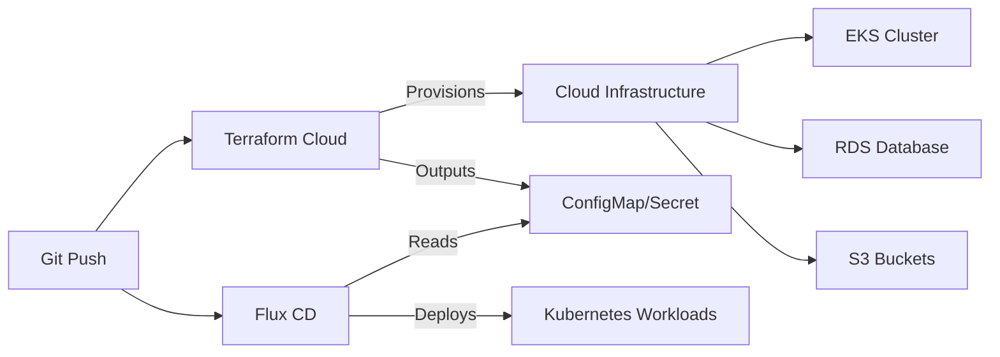

# How to Use Terraform Cloud with Flux CD

Author: [nawazdhandala](https://github.com/nawazdhandala)

Tags: Flux CD, Terraform Cloud, GitOps, Kubernetes, Infrastructure as Code, Automation

Description: Learn how to integrate Terraform Cloud with Flux CD to create a unified workflow for provisioning cloud infrastructure and deploying Kubernetes workloads.

---

## Introduction

Terraform Cloud provides remote state management, team collaboration features, and a run environment for Terraform. When integrated with Flux CD, you can build a workflow where Terraform Cloud provisions the cloud infrastructure (VPCs, clusters, databases) and Flux CD manages the Kubernetes workloads running on that infrastructure.

This guide covers setting up the integration, passing outputs from Terraform Cloud into Flux, and automating the full infrastructure-to-application pipeline.

## Prerequisites

- A Terraform Cloud account and organization
- A Kubernetes cluster (or Terraform will create one)
- Flux CD installed on the cluster
- Terraform CLI installed locally
- GitHub account with a personal access token

## Architecture Overview



## Setting Up Terraform Cloud Workspace

Create a workspace in Terraform Cloud for your infrastructure.

```hcl
# terraform-cloud/main.tf
# Configure the Terraform Cloud backend
terraform {
  cloud {
    organization = "my-org"

    workspaces {
      # Use tags to manage multiple environments
      tags = ["flux-infrastructure"]
    }
  }

  required_providers {
    aws = {
      source  = "hashicorp/aws"
      version = ">= 5.0.0"
    }
    kubernetes = {
      source  = "hashicorp/kubernetes"
      version = ">= 2.27.0"
    }
  }
}

# Variables managed through Terraform Cloud UI or API
variable "environment" {
  description = "Environment name"
  type        = string
}

variable "region" {
  description = "AWS region"
  type        = string
  default     = "us-east-1"
}

variable "cluster_name" {
  description = "EKS cluster name"
  type        = string
}

variable "db_instance_class" {
  description = "RDS instance class"
  type        = string
  default     = "db.t3.medium"
}
```

## Provisioning Infrastructure with Terraform Cloud

Define the cloud resources that Terraform Cloud will manage.

```hcl
# terraform-cloud/eks.tf
# Create an EKS cluster
module "eks" {
  source  = "terraform-aws-modules/eks/aws"
  version = "~> 20.0"

  cluster_name    = var.cluster_name
  cluster_version = "1.31"

  # VPC configuration
  vpc_id     = module.vpc.vpc_id
  subnet_ids = module.vpc.private_subnets

  # Managed node groups
  eks_managed_node_groups = {
    general = {
      instance_types = ["t3.medium"]
      min_size       = 2
      max_size       = 5
      desired_size   = 3

      labels = {
        environment = var.environment
        managed_by  = "terraform-cloud"
      }
    }
  }

  # Enable IRSA for pod-level IAM
  enable_irsa = true

  tags = {
    Environment = var.environment
    ManagedBy   = "terraform-cloud"
    GitOps      = "flux-cd"
  }
}

# Create a VPC for the cluster
module "vpc" {
  source  = "terraform-aws-modules/vpc/aws"
  version = "~> 5.0"

  name = "${var.cluster_name}-vpc"
  cidr = "10.0.0.0/16"

  azs             = ["${var.region}a", "${var.region}b", "${var.region}c"]
  private_subnets = ["10.0.1.0/24", "10.0.2.0/24", "10.0.3.0/24"]
  public_subnets  = ["10.0.101.0/24", "10.0.102.0/24", "10.0.103.0/24"]

  enable_nat_gateway   = true
  single_nat_gateway   = var.environment != "production"
  enable_dns_hostnames = true

  # Tags required for EKS
  public_subnet_tags = {
    "kubernetes.io/role/elb" = 1
  }
  private_subnet_tags = {
    "kubernetes.io/role/internal-elb" = 1
  }
}
```

```hcl
# terraform-cloud/rds.tf
# Create an RDS PostgreSQL database
module "rds" {
  source  = "terraform-aws-modules/rds/aws"
  version = "~> 6.0"

  identifier = "${var.cluster_name}-db"

  engine            = "postgres"
  engine_version    = "16"
  instance_class    = var.db_instance_class
  allocated_storage = 50

  db_name  = "application"
  username = "appadmin"
  port     = 5432

  # Place in the same VPC as EKS
  vpc_security_group_ids = [module.rds_sg.security_group_id]
  db_subnet_group_name   = module.vpc.database_subnet_group_name

  # Backup and maintenance
  backup_retention_period = var.environment == "production" ? 30 : 7
  skip_final_snapshot     = var.environment != "production"
  deletion_protection     = var.environment == "production"

  # Encryption
  storage_encrypted = true

  tags = {
    Environment = var.environment
    ManagedBy   = "terraform-cloud"
  }
}

# Security group for RDS
module "rds_sg" {
  source  = "terraform-aws-modules/security-group/aws"
  version = "~> 5.0"

  name        = "${var.cluster_name}-rds-sg"
  description = "Security group for RDS database"
  vpc_id      = module.vpc.vpc_id

  # Allow access from the EKS cluster nodes
  ingress_with_source_security_group_id = [
    {
      from_port                = 5432
      to_port                  = 5432
      protocol                 = "tcp"
      source_security_group_id = module.eks.node_security_group_id
      description              = "PostgreSQL from EKS nodes"
    }
  ]
}
```

## Passing Terraform Outputs to Flux

Create Kubernetes resources from Terraform outputs so Flux-managed workloads can consume them.

```hcl
# terraform-cloud/flux-integration.tf
# Configure the Kubernetes provider using EKS cluster data
provider "kubernetes" {
  host                   = module.eks.cluster_endpoint
  cluster_ca_certificate = base64decode(module.eks.cluster_certificate_authority_data)

  exec {
    api_version = "client.authentication.k8s.io/v1beta1"
    command     = "aws"
    args        = ["eks", "get-token", "--cluster-name", module.eks.cluster_name]
  }
}

# Create a ConfigMap with infrastructure outputs for Flux workloads
resource "kubernetes_config_map" "terraform_outputs" {
  metadata {
    name      = "terraform-outputs"
    namespace = "flux-system"
    labels = {
      "app.kubernetes.io/managed-by" = "terraform-cloud"
    }
  }

  data = {
    # Cluster information
    cluster_name     = module.eks.cluster_name
    cluster_endpoint = module.eks.cluster_endpoint
    cluster_region   = var.region
    environment      = var.environment

    # VPC information
    vpc_id          = module.vpc.vpc_id
    private_subnets = join(",", module.vpc.private_subnets)
    public_subnets  = join(",", module.vpc.public_subnets)
  }
}

# Create a Secret with sensitive infrastructure outputs
resource "kubernetes_secret" "terraform_outputs" {
  metadata {
    name      = "terraform-outputs"
    namespace = "flux-system"
    labels = {
      "app.kubernetes.io/managed-by" = "terraform-cloud"
    }
  }

  data = {
    # Database connection details
    database_host     = module.rds.db_instance_address
    database_port     = tostring(module.rds.db_instance_port)
    database_name     = module.rds.db_instance_name
    database_username = module.rds.db_instance_username
    database_password = module.rds.db_instance_password
  }

  type = "Opaque"
}
```

## Consuming Terraform Outputs in Flux

Configure Flux Kustomizations to use the outputs from Terraform Cloud.

```yaml
# clusters/production/apps.yaml
# Application Kustomization that consumes Terraform Cloud outputs
apiVersion: kustomize.toolkit.fluxcd.io/v1
kind: Kustomization
metadata:
  name: applications
  namespace: flux-system
spec:
  interval: 5m
  sourceRef:
    kind: GitRepository
    name: flux-system
  path: ./apps/production
  prune: true
  dependsOn:
    - name: infrastructure
  # Substitute values from Terraform Cloud outputs
  postBuild:
    substituteFrom:
      # Read non-sensitive values from ConfigMap
      - kind: ConfigMap
        name: terraform-outputs
      # Read sensitive values from Secret
      - kind: Secret
        name: terraform-outputs
```

```yaml
# apps/production/backend/deployment.yaml
# Application deployment using Terraform Cloud outputs
apiVersion: apps/v1
kind: Deployment
metadata:
  name: backend-api
  namespace: default
spec:
  replicas: 3
  selector:
    matchLabels:
      app: backend-api
  template:
    metadata:
      labels:
        app: backend-api
    spec:
      containers:
        - name: api
          image: my-org/backend-api:v2.0.0
          ports:
            - containerPort: 8080
          env:
            # These values are substituted from Terraform outputs
            - name: DATABASE_HOST
              value: "${database_host}"
            - name: DATABASE_PORT
              value: "${database_port}"
            - name: DATABASE_NAME
              value: "${database_name}"
            - name: DATABASE_USER
              value: "${database_username}"
            - name: DATABASE_PASSWORD
              value: "${database_password}"
            - name: CLUSTER_REGION
              value: "${cluster_region}"
            - name: ENVIRONMENT
              value: "${environment}"
          resources:
            requests:
              cpu: 200m
              memory: 256Mi
```

## Setting Up Terraform Cloud Notifications

Configure Terraform Cloud to notify when infrastructure changes are applied.

```hcl
# terraform-cloud/notifications.tf
# Create a notification to trigger Flux reconciliation
# after Terraform Cloud applies changes
resource "kubernetes_config_map" "tf_run_status" {
  metadata {
    name      = "terraform-run-status"
    namespace = "flux-system"
    annotations = {
      # Update this annotation on each apply to trigger Flux reconciliation
      "terraform-cloud/last-applied" = timestamp()
    }
  }

  data = {
    last_run_id    = "managed-by-terraform-cloud"
    workspace_name = terraform.workspace
  }
}
```

## Automating with Terraform Cloud Run Triggers

Set up run triggers so infrastructure changes automatically flow to applications.

```hcl
# terraform-cloud/workspace-config/main.tf
# Manage Terraform Cloud workspaces programmatically
resource "tfe_workspace" "infrastructure" {
  name         = "flux-infra-${var.environment}"
  organization = var.tfc_organization

  # Auto-apply after plan succeeds
  auto_apply = var.environment != "production"

  # VCS integration
  vcs_repo {
    identifier     = "${var.github_owner}/flux-terraform"
    branch         = "main"
    oauth_token_id = var.tfc_oauth_token_id
  }

  # Working directory in the repository
  working_directory = "terraform-cloud"

  # Terraform version to use
  terraform_version = "1.9.0"

  tag_names = ["flux-infrastructure", var.environment]
}

# Set workspace variables
resource "tfe_variable" "environment" {
  key          = "environment"
  value        = var.environment
  category     = "terraform"
  workspace_id = tfe_workspace.infrastructure.id
}

resource "tfe_variable" "cluster_name" {
  key          = "cluster_name"
  value        = "flux-${var.environment}"
  category     = "terraform"
  workspace_id = tfe_workspace.infrastructure.id
}

# AWS credentials as environment variables
resource "tfe_variable" "aws_access_key" {
  key          = "AWS_ACCESS_KEY_ID"
  value        = var.aws_access_key_id
  category     = "env"
  sensitive    = true
  workspace_id = tfe_workspace.infrastructure.id
}

resource "tfe_variable" "aws_secret_key" {
  key          = "AWS_SECRET_ACCESS_KEY"
  value        = var.aws_secret_access_key
  category     = "env"
  sensitive    = true
  workspace_id = tfe_workspace.infrastructure.id
}
```

## Using the tf-controller for Full GitOps

For a fully GitOps approach, use the Weave tf-controller to run Terraform from within Kubernetes, managed by Flux.

```yaml
# infrastructure/tf-controller/helmrelease.yaml
# Install the Terraform controller for Kubernetes
apiVersion: helm.toolkit.fluxcd.io/v2
kind: HelmRelease
metadata:
  name: tf-controller
  namespace: flux-system
spec:
  interval: 15m
  chart:
    spec:
      chart: tf-controller
      version: "0.16.x"
      sourceRef:
        kind: HelmRepository
        name: weaveworks
        namespace: flux-system
  values:
    resources:
      requests:
        cpu: 100m
        memory: 256Mi
```

```yaml
# infrastructure/terraform-resources/s3-bucket.yaml
# Define a Terraform resource managed by Flux and tf-controller
apiVersion: infra.contrib.fluxcd.io/v1alpha2
kind: Terraform
metadata:
  name: s3-bucket
  namespace: flux-system
spec:
  # Path to the Terraform module in Git
  path: ./terraform-modules/s3-bucket
  sourceRef:
    kind: GitRepository
    name: flux-system
  interval: 5m
  # Approve changes automatically (use "plan" for manual approval)
  approvePlan: auto
  # Terraform Cloud backend configuration
  backendConfig:
    customConfiguration: |
      backend "remote" {
        organization = "my-org"
        workspaces {
          name = "flux-s3-buckets"
        }
      }
  # Variables for the Terraform module
  vars:
    - name: bucket_name
      value: my-app-data
    - name: environment
      value: production
    - name: region
      value: us-east-1
  # Write outputs to a Kubernetes Secret
  writeOutputsToSecret:
    name: s3-bucket-outputs
```

## Running the Integration

Execute the full workflow.

```bash
# Step 1: Push Terraform code to trigger Terraform Cloud
git add terraform-cloud/
git commit -m "Add infrastructure configuration"
git push

# Step 2: Monitor Terraform Cloud run
# View in Terraform Cloud UI or via CLI
terraform login
cd terraform-cloud
terraform init
terraform plan

# Step 3: After Terraform Cloud applies, verify outputs in Kubernetes
kubectl get configmap terraform-outputs -n flux-system -o yaml
kubectl get secret terraform-outputs -n flux-system -o yaml

# Step 4: Flux automatically picks up the outputs and deploys applications
flux get kustomizations
kubectl get pods -n default
```

## Verifying the Integration

Confirm everything is connected and working.

```bash
# Check Terraform Cloud workspace status
# Via the Terraform Cloud UI or API
curl -s \
  --header "Authorization: Bearer $TFC_TOKEN" \
  "https://app.terraform.io/api/v2/organizations/my-org/workspaces/flux-infra-production" \
  | jq '.data.attributes["current-run"]'

# Verify Flux is using the Terraform outputs
flux get kustomization applications -o yaml | grep -A5 substituteFrom

# Check that applications have the correct environment variables
kubectl exec deploy/backend-api -- env | grep DATABASE

# Verify the full dependency chain
flux tree kustomization flux-system
```

## Conclusion

Integrating Terraform Cloud with Flux CD gives you a clean separation between infrastructure provisioning and application deployment while maintaining a connected pipeline. Terraform Cloud handles the heavy lifting of provisioning cloud resources with state management, plan approvals, and cost estimation. Flux CD handles continuous delivery of Kubernetes workloads, using Terraform's outputs to connect applications to their infrastructure dependencies. Together, they provide a complete GitOps workflow from cloud resources to running applications.
