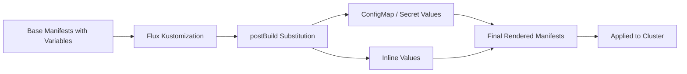

# How to Use Variable Substitution for Cluster-Specific Config in Flux CD

Author: [nawazdhandala](https://github.com/nawazdhandala)

Tags: flux cd, variable substitution, multi-cluster, configuration, gitops, kubernetes, kustomize

Description: Learn how to use Flux CD's postBuild variable substitution to manage cluster-specific configurations from a single set of base manifests.

---

## Introduction

When managing multiple clusters, you often need the same application deployed with slightly different configurations per cluster: different replicas, resource limits, domain names, or cloud provider settings. Flux CD's `postBuild` variable substitution feature lets you define base manifests with placeholder variables and substitute cluster-specific values at reconciliation time. This eliminates the need for maintaining separate copies of manifests for each cluster.

## Prerequisites

- Flux CD v2.0 or later installed on your clusters
- A Git repository for your configurations
- kubectl and Flux CLI installed
- Basic understanding of Kustomize

## How Variable Substitution Works



Flux processes variables in the format `${VAR_NAME}` after Kustomize builds the manifests but before applying them to the cluster.

## Step 1: Define Base Manifests with Variables

Create base manifests that use `${VARIABLE}` placeholders wherever cluster-specific values are needed.

```yaml
# base/apps/web-app/deployment.yaml
# Deployment with variable placeholders for cluster-specific values
apiVersion: apps/v1
kind: Deployment
metadata:
  name: web-app
  namespace: ${APP_NAMESPACE}
  labels:
    app: web-app
    cluster: ${CLUSTER_NAME}
    region: ${CLUSTER_REGION}
spec:
  # Replicas vary per cluster based on expected traffic
  replicas: ${APP_REPLICAS}
  selector:
    matchLabels:
      app: web-app
  template:
    metadata:
      labels:
        app: web-app
        cluster: ${CLUSTER_NAME}
    spec:
      containers:
        - name: web-app
          # Image registry varies per cluster/region
          image: ${CONTAINER_REGISTRY}/web-app:${APP_VERSION}
          ports:
            - containerPort: 8080
          env:
            - name: DATABASE_HOST
              value: "${DATABASE_HOST}"
            - name: DATABASE_NAME
              value: "${DATABASE_NAME}"
            - name: REDIS_HOST
              value: "${REDIS_HOST}"
            - name: LOG_LEVEL
              value: "${LOG_LEVEL}"
            - name: CLUSTER_NAME
              value: "${CLUSTER_NAME}"
          resources:
            requests:
              cpu: ${CPU_REQUEST}
              memory: ${MEMORY_REQUEST}
            limits:
              cpu: ${CPU_LIMIT}
              memory: ${MEMORY_LIMIT}
```

```yaml
# base/apps/web-app/service.yaml
apiVersion: v1
kind: Service
metadata:
  name: web-app
  namespace: ${APP_NAMESPACE}
spec:
  selector:
    app: web-app
  ports:
    - port: 80
      targetPort: 8080
  type: ClusterIP
```

```yaml
# base/apps/web-app/ingress.yaml
# Ingress with cluster-specific domain name
apiVersion: networking.k8s.io/v1
kind: Ingress
metadata:
  name: web-app
  namespace: ${APP_NAMESPACE}
  annotations:
    cert-manager.io/cluster-issuer: ${CERT_ISSUER}
spec:
  ingressClassName: nginx
  tls:
    - hosts:
        - ${APP_DOMAIN}
      secretName: web-app-tls
  rules:
    - host: ${APP_DOMAIN}
      http:
        paths:
          - path: /
            pathType: Prefix
            backend:
              service:
                name: web-app
                port:
                  number: 80
```

```yaml
# base/apps/web-app/kustomization.yaml
apiVersion: kustomize.config.k8s.io/v1beta1
kind: Kustomization
resources:
  - deployment.yaml
  - service.yaml
  - ingress.yaml
```

## Step 2: Use Inline Variable Substitution

The simplest approach is to define variables directly in the Flux Kustomization.

```yaml
# clusters/us-east/apps.yaml
# Flux Kustomization with inline variable substitution
apiVersion: kustomize.toolkit.fluxcd.io/v1
kind: Kustomization
metadata:
  name: web-app
  namespace: flux-system
spec:
  interval: 10m
  path: ./base/apps/web-app
  prune: true
  sourceRef:
    kind: GitRepository
    name: flux-system
  # postBuild substitution replaces ${VAR} placeholders
  postBuild:
    substitute:
      CLUSTER_NAME: "us-east-1"
      CLUSTER_REGION: "us-east"
      APP_NAMESPACE: "production"
      APP_REPLICAS: "5"
      CONTAINER_REGISTRY: "123456789.dkr.ecr.us-east-1.amazonaws.com"
      APP_VERSION: "v2.1.0"
      DATABASE_HOST: "db-us-east.example.com"
      DATABASE_NAME: "webapp_prod"
      REDIS_HOST: "redis-us-east.example.com"
      LOG_LEVEL: "info"
      CPU_REQUEST: "200m"
      MEMORY_REQUEST: "256Mi"
      CPU_LIMIT: "500m"
      MEMORY_LIMIT: "512Mi"
      APP_DOMAIN: "app-us-east.example.com"
      CERT_ISSUER: "letsencrypt-prod"
```

## Step 3: Use ConfigMaps for Variable Substitution

For better organization, store variables in ConfigMaps and reference them with `substituteFrom`.

```yaml
# clusters/us-east/cluster-config.yaml
# ConfigMap containing cluster-specific variables
apiVersion: v1
kind: ConfigMap
metadata:
  name: cluster-vars
  namespace: flux-system
data:
  # Cluster identity
  CLUSTER_NAME: "us-east-1"
  CLUSTER_REGION: "us-east"
  CLUSTER_ENVIRONMENT: "production"
  # Container registry for this region
  CONTAINER_REGISTRY: "123456789.dkr.ecr.us-east-1.amazonaws.com"
  # Network configuration
  APP_DOMAIN: "app-us-east.example.com"
  CERT_ISSUER: "letsencrypt-prod"
  # Infrastructure endpoints
  DATABASE_HOST: "db-us-east.example.com"
  REDIS_HOST: "redis-us-east.example.com"
```

```yaml
# clusters/us-east/app-config.yaml
# ConfigMap for application-specific variables
apiVersion: v1
kind: ConfigMap
metadata:
  name: app-vars
  namespace: flux-system
data:
  APP_NAMESPACE: "production"
  APP_REPLICAS: "5"
  APP_VERSION: "v2.1.0"
  DATABASE_NAME: "webapp_prod"
  LOG_LEVEL: "info"
  CPU_REQUEST: "200m"
  MEMORY_REQUEST: "256Mi"
  CPU_LIMIT: "500m"
  MEMORY_LIMIT: "512Mi"
```

```yaml
# clusters/us-east/apps.yaml
# Flux Kustomization referencing ConfigMaps for variables
apiVersion: kustomize.toolkit.fluxcd.io/v1
kind: Kustomization
metadata:
  name: web-app
  namespace: flux-system
spec:
  interval: 10m
  path: ./base/apps/web-app
  prune: true
  sourceRef:
    kind: GitRepository
    name: flux-system
  postBuild:
    # Load variables from multiple ConfigMaps
    substituteFrom:
      - kind: ConfigMap
        name: cluster-vars
      - kind: ConfigMap
        name: app-vars
    # Inline values override ConfigMap values
    substitute:
      # Override or add additional variables
      EXTRA_LABEL: "managed-by-flux"
```

## Step 4: Use Secrets for Sensitive Variables

For sensitive values like database passwords or API keys, use Secrets instead of ConfigMaps.

```yaml
# clusters/us-east/app-secrets.yaml
# Secret containing sensitive variables
apiVersion: v1
kind: Secret
metadata:
  name: app-secret-vars
  namespace: flux-system
type: Opaque
stringData:
  DATABASE_PASSWORD: "super-secret-password"
  API_KEY: "sk-1234567890abcdef"
  REDIS_PASSWORD: "redis-secret-password"
```

```yaml
# Reference both ConfigMaps and Secrets in substituteFrom
apiVersion: kustomize.toolkit.fluxcd.io/v1
kind: Kustomization
metadata:
  name: web-app
  namespace: flux-system
spec:
  interval: 10m
  path: ./base/apps/web-app
  prune: true
  sourceRef:
    kind: GitRepository
    name: flux-system
  postBuild:
    substituteFrom:
      # ConfigMaps for non-sensitive values
      - kind: ConfigMap
        name: cluster-vars
      - kind: ConfigMap
        name: app-vars
      # Secrets for sensitive values
      - kind: Secret
        name: app-secret-vars
```

Then use the secret variables in your manifests:

```yaml
# base/apps/web-app/secret.yaml
# Application secret created from substituted variables
apiVersion: v1
kind: Secret
metadata:
  name: web-app-credentials
  namespace: ${APP_NAMESPACE}
type: Opaque
stringData:
  database-password: "${DATABASE_PASSWORD}"
  api-key: "${API_KEY}"
  redis-password: "${REDIS_PASSWORD}"
```

## Step 5: Use Default Values

Provide default values to prevent errors when a variable is not defined.

```yaml
# base/apps/web-app/deployment.yaml
# Using default values with the :- syntax
apiVersion: apps/v1
kind: Deployment
metadata:
  name: web-app
  namespace: ${APP_NAMESPACE:=default}
spec:
  # Default to 2 replicas if not specified
  replicas: ${APP_REPLICAS:=2}
  selector:
    matchLabels:
      app: web-app
  template:
    spec:
      containers:
        - name: web-app
          image: ${CONTAINER_REGISTRY:=docker.io}/web-app:${APP_VERSION:=latest}
          resources:
            requests:
              cpu: ${CPU_REQUEST:=100m}
              memory: ${MEMORY_REQUEST:=128Mi}
            limits:
              cpu: ${CPU_LIMIT:=200m}
              memory: ${MEMORY_LIMIT:=256Mi}
```

## Step 6: Multi-Cluster Variable Comparison

Here is how the same base manifests look with different cluster configurations:

```yaml
# clusters/us-east/cluster-config.yaml
apiVersion: v1
kind: ConfigMap
metadata:
  name: cluster-vars
  namespace: flux-system
data:
  CLUSTER_NAME: "us-east-1"
  CLUSTER_REGION: "us-east"
  CONTAINER_REGISTRY: "123456789.dkr.ecr.us-east-1.amazonaws.com"
  APP_DOMAIN: "app-us-east.example.com"
  DATABASE_HOST: "db-us-east.example.com"
  REDIS_HOST: "redis-us-east.example.com"
  APP_REPLICAS: "5"
  CPU_LIMIT: "500m"
  MEMORY_LIMIT: "512Mi"
```

```yaml
# clusters/eu-west/cluster-config.yaml
apiVersion: v1
kind: ConfigMap
metadata:
  name: cluster-vars
  namespace: flux-system
data:
  CLUSTER_NAME: "eu-west-1"
  CLUSTER_REGION: "eu-west"
  CONTAINER_REGISTRY: "987654321.dkr.ecr.eu-west-1.amazonaws.com"
  APP_DOMAIN: "app-eu-west.example.com"
  DATABASE_HOST: "db-eu-west.example.com"
  REDIS_HOST: "redis-eu-west.example.com"
  APP_REPLICAS: "3"
  CPU_LIMIT: "300m"
  MEMORY_LIMIT: "384Mi"
```

```yaml
# clusters/ap-south/cluster-config.yaml
apiVersion: v1
kind: ConfigMap
metadata:
  name: cluster-vars
  namespace: flux-system
data:
  CLUSTER_NAME: "ap-south-1"
  CLUSTER_REGION: "ap-south"
  CONTAINER_REGISTRY: "111222333.dkr.ecr.ap-south-1.amazonaws.com"
  APP_DOMAIN: "app-ap-south.example.com"
  DATABASE_HOST: "db-ap-south.example.com"
  REDIS_HOST: "redis-ap-south.example.com"
  APP_REPLICAS: "2"
  CPU_LIMIT: "200m"
  MEMORY_LIMIT: "256Mi"
```

## Step 7: Variable Substitution for HelmReleases

Variables can also be used in HelmRelease values.

```yaml
# base/addons/ingress-nginx/helm-release.yaml
apiVersion: helm.toolkit.fluxcd.io/v1
kind: HelmRelease
metadata:
  name: ingress-nginx
  namespace: ingress-nginx
spec:
  interval: 30m
  chart:
    spec:
      chart: ingress-nginx
      version: "4.9.x"
      sourceRef:
        kind: HelmRepository
        name: ingress-nginx
  values:
    controller:
      replicaCount: ${INGRESS_REPLICAS:=2}
      service:
        annotations:
          # Cloud provider-specific annotations
          service.beta.kubernetes.io/aws-load-balancer-type: "${LB_TYPE:=nlb}"
          service.beta.kubernetes.io/aws-load-balancer-scheme: "${LB_SCHEME:=internet-facing}"
      config:
        # Cluster-specific configuration
        proxy-body-size: "${MAX_BODY_SIZE:=10m}"
      metrics:
        enabled: true
```

## Step 8: Debugging Variable Substitution

When variables are not being substituted correctly, use these debugging techniques.

```bash
# Check if the ConfigMap exists and has the expected values
kubectl get configmap cluster-vars -n flux-system -o yaml

# Check the Kustomization status for substitution errors
flux get kustomization web-app -o yaml

# Look for events related to substitution failures
kubectl get events -n flux-system \
  --field-selector reason=ReconciliationFailed

# Manually test what the substituted output looks like
flux build kustomization web-app \
  --path ./base/apps/web-app \
  --dry-run
```

Common issues:

```yaml
# WRONG: Missing dollar sign
replicas: {APP_REPLICAS}

# WRONG: Spaces inside braces
replicas: ${ APP_REPLICAS }

# CORRECT: Proper variable syntax
replicas: ${APP_REPLICAS}

# CORRECT: With default value
replicas: ${APP_REPLICAS:=2}
```

## Step 9: Variable Substitution Ordering

When using multiple `substituteFrom` sources, later entries override earlier ones.

```yaml
postBuild:
  substituteFrom:
    # 1. Base defaults (lowest priority)
    - kind: ConfigMap
      name: default-vars
    # 2. Cluster-specific values (override defaults)
    - kind: ConfigMap
      name: cluster-vars
    # 3. App-specific values (override cluster defaults)
    - kind: ConfigMap
      name: app-vars
    # 4. Secrets (override everything above)
    - kind: Secret
      name: app-secret-vars
  # 5. Inline substitute has the highest priority
  substitute:
    OVERRIDE_VAR: "highest-priority-value"
```

## Step 10: Organize Variables by Category

For large deployments, structure your ConfigMaps by category.

```yaml
# clusters/us-east/kustomization.yaml
apiVersion: kustomize.config.k8s.io/v1beta1
kind: Kustomization
resources:
  # Cluster identity and metadata
  - cluster-identity.yaml
  # Infrastructure endpoints (databases, caches, queues)
  - infrastructure-endpoints.yaml
  # Application tuning (replicas, resources, feature flags)
  - app-tuning.yaml
  # Network configuration (domains, certificates, load balancers)
  - network-config.yaml
```

This separation makes it easy to update one category without touching others, and different teams can own different ConfigMaps.

## Conclusion

Flux CD's variable substitution is a powerful feature for managing cluster-specific configurations without duplicating manifests. By defining base manifests with `${VARIABLE}` placeholders and providing values through ConfigMaps, Secrets, or inline substitution, you can maintain a single set of templates that adapt to each cluster's requirements. This approach scales well from a handful of clusters to hundreds, keeping your Git repository clean and your configurations DRY.
