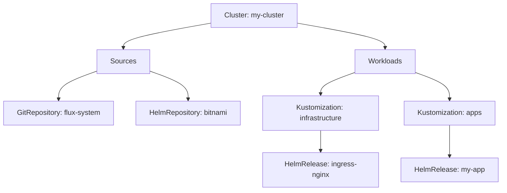

# How to Use VS Code GitOps Extension with Flux CD

Author: [nawazdhandala](https://github.com/nawazdhandala)

Tags: flux cd, vs code, gitops, extension, ide, developer tools, kubernetes

Description: A practical guide to installing and using the VS Code GitOps Extension to manage Flux CD resources directly from your IDE.

---

## Introduction

The VS Code GitOps Extension brings Flux CD management directly into your development environment. Instead of switching between your editor and the terminal, you can view Flux resources, check reconciliation status, and trigger syncs all from within VS Code.

This guide walks you through installing the extension, connecting it to your clusters, and using its features to streamline your GitOps workflow.

## Prerequisites

Before you begin, ensure you have:

- Visual Studio Code (v1.80 or later)
- A running Kubernetes cluster with Flux CD installed
- kubectl configured with a valid kubeconfig
- The Flux CLI installed locally

Verify your setup:

```bash
# Check kubectl connectivity
kubectl cluster-info

# Verify Flux installation
flux check
```

## Installing the VS Code GitOps Extension

### Step 1: Install from the Marketplace

Open VS Code and install the extension:

1. Open the Extensions panel (Ctrl+Shift+X or Cmd+Shift+X on macOS)
2. Search for "GitOps Tools for Flux"
3. Click Install on the extension published by Weaveworks

Alternatively, install from the command line:

```bash
# Install the GitOps extension via the VS Code CLI
code --install-extension weaveworks.vscode-gitops-tools
```

### Step 2: Install Recommended Dependencies

The GitOps extension works best with these companion extensions:

```bash
# Kubernetes extension for cluster browsing
code --install-extension ms-kubernetes-tools.vscode-kubernetes-tools

# YAML extension for schema validation
code --install-extension redhat.vscode-yaml
```

### Step 3: Verify the Installation

After installation, you should see a new GitOps icon in the VS Code Activity Bar (left sidebar). Click it to open the GitOps panel.

## Configuring the Extension

### Cluster Connection

The extension automatically detects clusters from your kubeconfig file. If you have multiple clusters:

1. Open the GitOps panel in the Activity Bar
2. Click the cluster selector at the top
3. Choose the cluster you want to manage

The extension reads from the default kubeconfig location (`~/.kube/config`). To use a custom path, add this to your VS Code settings:

```json
{
  // Point the extension to a custom kubeconfig file
  "vs-code-gitops.kubeConfigPath": "/path/to/custom/kubeconfig",

  // Set the default namespace for Flux resources
  "vs-code-gitops.defaultNamespace": "flux-system"
}
```

### Extension Settings

Configure the extension behavior through VS Code settings (Ctrl+, or Cmd+,):

```json
{
  // How often to refresh Flux resource status (in seconds)
  "vs-code-gitops.refreshInterval": 30,

  // Show notifications for reconciliation events
  "vs-code-gitops.showNotifications": true,

  // Enable automatic schema validation for Flux YAML files
  "vs-code-gitops.enableSchemaValidation": true,

  // Path to the Flux CLI binary (if not in PATH)
  "vs-code-gitops.fluxPath": "/usr/local/bin/flux"
}
```

## Using the GitOps Panel

### Sources View

The Sources section displays all Flux source resources:

- **GitRepositories** - Git repositories being tracked by Flux
- **HelmRepositories** - Helm chart repositories
- **OCIRepositories** - OCI artifact repositories
- **Buckets** - S3-compatible bucket sources

Each source shows:

- Name and namespace
- URL or address
- Current revision
- Ready status (green checkmark or red X)
- Last reconciliation time

### Workloads View

The Workloads section shows deployment resources:

- **Kustomizations** - All Kustomization resources
- **HelmReleases** - All HelmRelease resources

Each workload displays:

- Name and namespace
- Source reference
- Applied revision
- Ready/Not Ready status
- Suspended state

### Tree View Navigation

The extension organizes resources in a tree structure:



## Common Operations

### Viewing Resource Details

Right-click any resource in the GitOps panel to access:

- **Show YAML** - Opens the full resource YAML in a new editor tab
- **Show Events** - Displays Kubernetes events for the resource
- **Show Conditions** - Shows the status conditions
- **Copy Resource Name** - Copies the resource name to clipboard

### Triggering Reconciliation

To manually trigger a reconciliation:

1. Right-click the resource in the GitOps panel
2. Select "Reconcile" from the context menu
3. The extension runs `flux reconcile` and updates the status

You can also use the command palette:

1. Open Command Palette (Ctrl+Shift+P or Cmd+Shift+P)
2. Type "GitOps: Reconcile"
3. Select the resource to reconcile

### Suspending and Resuming Resources

To suspend a resource (pause reconciliation):

1. Right-click the resource
2. Select "Suspend"
3. The resource status changes to show it is suspended

To resume:

1. Right-click the suspended resource
2. Select "Resume"

### Creating New Flux Resources

The extension provides templates for creating new Flux resources:

1. Open Command Palette (Ctrl+Shift+P)
2. Type "GitOps: Create"
3. Choose the resource type (GitRepository, Kustomization, HelmRelease, etc.)
4. Fill in the prompted fields
5. The extension generates the YAML and opens it in a new editor tab

Example generated GitRepository:

```yaml
# Generated by VS Code GitOps Extension
apiVersion: source.toolkit.fluxcd.io/v1
kind: GitRepository
metadata:
  name: my-app
  namespace: flux-system
spec:
  # How often to check for new commits
  interval: 5m
  # Repository URL
  url: https://github.com/myorg/my-app
  ref:
    # Branch to track
    branch: main
```

## YAML Schema Validation

The extension provides schema validation for Flux CRDs. This catches errors before you apply resources:

### Enabling Schema Validation

Add Flux CRD schemas to your VS Code YAML settings:

```json
{
  "yaml.schemas": {
    // Flux source schemas
    "https://raw.githubusercontent.com/fluxcd/flux2/main/manifests/crds/source.toolkit.fluxcd.io_gitrepositories.yaml": [
      "**/gitrepository*.yaml",
      "**/gitrepository*.yml"
    ],
    // Flux kustomize schemas
    "https://raw.githubusercontent.com/fluxcd/flux2/main/manifests/crds/kustomize.toolkit.fluxcd.io_kustomizations.yaml": [
      "**/kustomization*.yaml"
    ],
    // Flux helm schemas
    "https://raw.githubusercontent.com/fluxcd/flux2/main/manifests/crds/helm.toolkit.fluxcd.io_helmreleases.yaml": [
      "**/helmrelease*.yaml"
    ]
  }
}
```

### Validation in Action

When editing Flux YAML files, the extension provides:

- Red underlines for invalid fields or values
- Autocomplete suggestions for valid field names
- Hover documentation for each field
- Warnings for deprecated fields

Example validation catching an error:

```yaml
# The extension will highlight the error on 'intervals' (should be 'interval')
apiVersion: source.toolkit.fluxcd.io/v1
kind: GitRepository
metadata:
  name: my-app
  namespace: flux-system
spec:
  # Error: 'intervals' is not a valid field, did you mean 'interval'?
  intervals: 5m
  url: https://github.com/myorg/my-app
  ref:
    branch: main
```

## Working with Multiple Clusters

The extension supports managing Flux across multiple clusters:

### Switching Clusters

1. Click the cluster name in the GitOps panel header
2. Select a different cluster from the dropdown
3. The panel refreshes to show resources from the selected cluster

### Comparing Resources Across Clusters

You can open resource YAML from different clusters side by side:

1. Open a resource YAML from cluster A
2. Switch to cluster B
3. Open the same resource from cluster B
4. Use VS Code split editor to compare

## Keyboard Shortcuts

Configure custom shortcuts for frequent operations:

```json
// keybindings.json
[
  {
    // Reconcile the selected resource
    "key": "ctrl+shift+r",
    "command": "gitops.flux.reconcile",
    "when": "view == gitops.views.workloads"
  },
  {
    // Refresh all Flux resources
    "key": "ctrl+shift+f",
    "command": "gitops.views.refreshAll"
  },
  {
    // Show YAML for selected resource
    "key": "ctrl+shift+y",
    "command": "gitops.flux.showYaml",
    "when": "view == gitops.views.workloads || view == gitops.views.sources"
  }
]
```

## Integrating with Git Workflow

### Editing Flux Manifests

The extension integrates with your Git workflow:

1. Edit Flux manifests in your repository
2. The YAML schema validation catches errors immediately
3. Commit and push changes
4. Watch the GitOps panel for reconciliation status updates
5. Click any failing resource to see the error details

### Using the Integrated Terminal

Combine the extension with terminal commands:

```bash
# Check Flux status from the integrated terminal
flux get all -A

# View detailed resource info
flux get kustomization my-app -n flux-system -o yaml

# Check recent events
flux events --for Kustomization/my-app
```

## Troubleshooting

### Extension Not Detecting Clusters

```bash
# Verify kubeconfig is valid
kubectl config view

# Check current context
kubectl config current-context

# Test cluster connectivity
kubectl get namespaces
```

### Resources Not Showing Up

If the GitOps panel is empty:

1. Verify Flux is installed: `flux check`
2. Click the refresh button in the panel header
3. Check the VS Code Output panel (select "GitOps" from the dropdown) for errors
4. Ensure your kubeconfig user has permissions to list Flux CRDs

### Extension Performance

For large clusters with many resources, adjust the refresh interval:

```json
{
  // Increase the interval to reduce API calls
  "vs-code-gitops.refreshInterval": 60
}
```

## Summary

The VS Code GitOps Extension brings Flux CD management into your daily development workflow. By providing resource visualization, schema validation, and quick actions directly in your IDE, it eliminates the need to constantly switch between your editor and the terminal. Combined with YAML schema validation, it helps catch configuration errors before they reach your cluster, making your GitOps workflow faster and more reliable.
