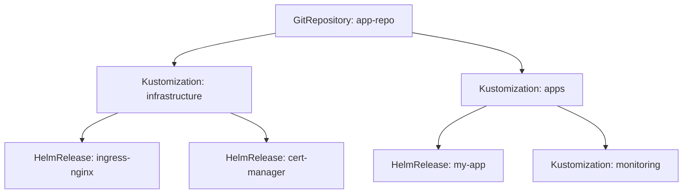

# How to Use Weave GitOps Dashboard with Flux CD

Author: [nawazdhandala](https://github.com/nawazdhandala)

Tags: Flux CD, Weave GitOps, Dashboard, Kubernetes, GitOps, Monitoring

Description: A practical guide to installing and using the Weave GitOps Dashboard for visualizing and managing Flux CD resources in your Kubernetes cluster.

---

## Introduction

Flux CD is a powerful GitOps toolkit, but managing it entirely through the command line can become challenging as your deployments grow. The Weave GitOps Dashboard provides a web-based UI that gives you full visibility into your Flux CD resources, reconciliation status, and deployment history.

In this guide, you will learn how to install the Weave GitOps Dashboard, connect it to your Flux CD installation, and use it to monitor and manage your GitOps workflows.

## Prerequisites

Before you begin, make sure you have the following:

- A running Kubernetes cluster (v1.26 or later)
- Flux CD installed and bootstrapped on your cluster
- kubectl configured to access your cluster
- Helm v3 installed

You can verify your Flux installation with:

```bash
# Check that Flux is running and healthy
flux check
```

## What Is Weave GitOps Dashboard

Weave GitOps is an open-source dashboard built specifically for Flux CD. It provides:

- A visual overview of all Flux resources (Kustomizations, HelmReleases, GitRepositories, etc.)
- Real-time reconciliation status and error details
- Dependency graphs showing relationships between resources
- Event logs and history for debugging
- Multi-tenant support with RBAC integration

## Installing Weave GitOps Dashboard

### Step 1: Add the Weave GitOps Helm Repository

First, create a HelmRepository resource for Weave GitOps:

```yaml
# weave-gitops-helmrepo.yaml
# Defines the Helm chart repository for Weave GitOps
apiVersion: source.toolkit.fluxcd.io/v1
kind: HelmRepository
metadata:
  name: weave-gitops
  namespace: flux-system
spec:
  # The official Weave GitOps Helm chart repository
  url: https://helm.gitops.weave.works
  interval: 1h
```

Apply this resource:

```bash
kubectl apply -f weave-gitops-helmrepo.yaml
```

### Step 2: Generate a Password for the Dashboard

The dashboard requires authentication. Generate a bcrypt-hashed password:

```bash
# Generate a bcrypt hash for your chosen password
PASSWORD="your-secure-password"
BCRYPT_HASH=$(echo -n "$PASSWORD" | gitops get bcrypt-hash)
echo $BCRYPT_HASH
```

Alternatively, use htpasswd:

```bash
# Use htpasswd to generate the hash
htpasswd -nbBC 10 "" "your-secure-password" | tr -d ':\n' | sed 's/$2y/$2a/'
```

### Step 3: Create a Secret for the Admin Password

```yaml
# weave-gitops-secret.yaml
# Stores the admin credentials for the Weave GitOps Dashboard
apiVersion: v1
kind: Secret
metadata:
  name: cluster-user-auth
  namespace: flux-system
type: Opaque
stringData:
  # The admin username for dashboard login
  username: admin
  # The bcrypt-hashed password (replace with your generated hash)
  password: "$2a$10$yourhashedpasswordhere"
```

Apply the secret:

```bash
kubectl apply -f weave-gitops-secret.yaml
```

### Step 4: Create the HelmRelease

```yaml
# weave-gitops-helmrelease.yaml
# Deploys the Weave GitOps Dashboard via Flux HelmRelease
apiVersion: helm.toolkit.fluxcd.io/v2
kind: HelmRelease
metadata:
  name: weave-gitops
  namespace: flux-system
spec:
  interval: 1h
  chart:
    spec:
      # The chart name in the Weave GitOps repository
      chart: weave-gitops
      version: "4.x"
      sourceRef:
        kind: HelmRepository
        name: weave-gitops
  values:
    # Reference the admin credentials secret
    adminUser:
      create: true
      username: admin
      # Use the secret created earlier
      createSecret: false
      createClusterRole: true
    # Configure resource limits for the dashboard pod
    resources:
      requests:
        cpu: 100m
        memory: 128Mi
      limits:
        cpu: 500m
        memory: 256Mi
    # Enable metrics collection
    metrics:
      enabled: true
```

Apply the HelmRelease:

```bash
kubectl apply -f weave-gitops-helmrelease.yaml
```

### Step 5: Verify the Installation

```bash
# Wait for the HelmRelease to reconcile
flux reconcile helmrelease weave-gitops -n flux-system

# Check the pod status
kubectl get pods -n flux-system -l app.kubernetes.io/name=weave-gitops
```

## Accessing the Dashboard

### Port Forwarding

The quickest way to access the dashboard is through port forwarding:

```bash
# Forward the dashboard service to localhost:9001
kubectl port-forward svc/weave-gitops -n flux-system 9001:9001
```

Open your browser and navigate to `http://localhost:9001`. Log in with the admin credentials you configured.

### Ingress Configuration

For production access, configure an Ingress resource:

```yaml
# weave-gitops-ingress.yaml
# Exposes the Weave GitOps Dashboard through an Ingress
apiVersion: networking.k8s.io/v1
kind: Ingress
metadata:
  name: weave-gitops
  namespace: flux-system
  annotations:
    # Use cert-manager for automatic TLS certificates
    cert-manager.io/cluster-issuer: letsencrypt-prod
    # Force HTTPS redirect
    nginx.ingress.kubernetes.io/force-ssl-redirect: "true"
spec:
  ingressClassName: nginx
  tls:
    - hosts:
        - gitops.example.com
      secretName: weave-gitops-tls
  rules:
    - host: gitops.example.com
      http:
        paths:
          - path: /
            pathType: Prefix
            backend:
              service:
                name: weave-gitops
                port:
                  number: 9001
```

## Using the Dashboard

### Viewing Flux Resources

Once logged in, the dashboard presents several views:

1. **Applications** - Shows all Kustomizations and HelmReleases with their reconciliation status
2. **Sources** - Displays GitRepositories, HelmRepositories, OCIRepositories, and Buckets
3. **Flux Runtime** - Shows the Flux controllers and their health

### Checking Reconciliation Status

Navigate to the Applications tab to see all your Kustomizations and HelmReleases. Each resource displays:

- Current status (Ready, Progressing, or Failed)
- Last applied revision
- Last reconciliation time
- Any error messages

### Viewing Resource Details

Click on any resource to see detailed information:

```yaml
# Example of what you see in the detail view for a Kustomization
# Status section shows reconciliation details
status:
  conditions:
    - type: Ready
      status: "True"
      lastTransitionTime: "2026-03-06T10:30:00Z"
      reason: ReconciliationSucceeded
      message: "Applied revision: main@sha1:abc123"
  lastAppliedRevision: "main@sha1:abc123"
  lastAttemptedRevision: "main@sha1:abc123"
```

### Exploring Dependencies

The dashboard shows dependency relationships between resources using a graph view. This helps you understand how your deployments are connected:



## Configuring RBAC for Multi-Tenant Access

Weave GitOps supports RBAC integration so different teams can see only their resources:

```yaml
# weave-gitops-rbac.yaml
# ClusterRole that grants read access to Flux resources
apiVersion: rbac.authorization.k8s.io/v1
kind: ClusterRole
metadata:
  name: gitops-reader
rules:
  - apiGroups: ["source.toolkit.fluxcd.io"]
    resources: ["*"]
    verbs: ["get", "list", "watch"]
  - apiGroups: ["kustomize.toolkit.fluxcd.io"]
    resources: ["*"]
    verbs: ["get", "list", "watch"]
  - apiGroups: ["helm.toolkit.fluxcd.io"]
    resources: ["*"]
    verbs: ["get", "list", "watch"]
---
# Bind the role to a specific team's service account
apiVersion: rbac.authorization.k8s.io/v1
kind: ClusterRoleBinding
metadata:
  name: team-alpha-gitops-reader
subjects:
  - kind: User
    name: team-alpha-lead
    apiGroup: rbac.authorization.k8s.io
roleRef:
  kind: ClusterRole
  name: gitops-reader
  apiGroup: rbac.authorization.k8s.io
```

## Enabling OIDC Authentication

For production environments, configure OIDC authentication:

```yaml
# weave-gitops-oidc-values.yaml
# HelmRelease values to enable OIDC authentication
apiVersion: helm.toolkit.fluxcd.io/v2
kind: HelmRelease
metadata:
  name: weave-gitops
  namespace: flux-system
spec:
  interval: 1h
  chart:
    spec:
      chart: weave-gitops
      version: "4.x"
      sourceRef:
        kind: HelmRepository
        name: weave-gitops
  values:
    # Configure OIDC provider (e.g., Dex, Keycloak, Okta)
    oidcSecret: oidc-auth
    additionalArgs:
      - --auth-methods=oidc
      - --oidc-issuer-url=https://dex.example.com
      - --oidc-client-id=weave-gitops
      - --oidc-redirect-url=https://gitops.example.com/oauth2/callback
```

Create the OIDC secret:

```yaml
# oidc-secret.yaml
# Stores the OIDC client credentials
apiVersion: v1
kind: Secret
metadata:
  name: oidc-auth
  namespace: flux-system
type: Opaque
stringData:
  # Your OIDC client ID
  clientID: weave-gitops
  # Your OIDC client secret
  clientSecret: "your-client-secret-here"
  # The OIDC issuer URL
  issuerURL: "https://dex.example.com"
  # The redirect URL after authentication
  redirectURL: "https://gitops.example.com/oauth2/callback"
```

## Monitoring Dashboard Health

Set up alerts for the Weave GitOps Dashboard itself:

```yaml
# weave-gitops-alert.yaml
# Alert configuration to notify when the dashboard has issues
apiVersion: notification.toolkit.fluxcd.io/v1
kind: Alert
metadata:
  name: weave-gitops-alert
  namespace: flux-system
spec:
  providerRef:
    name: slack-provider
  eventSeverity: error
  eventSources:
    - kind: HelmRelease
      name: weave-gitops
      namespace: flux-system
```

## Troubleshooting

### Dashboard Not Loading

If the dashboard is not accessible, check the pod logs:

```bash
# Check pod status
kubectl get pods -n flux-system -l app.kubernetes.io/name=weave-gitops

# View pod logs for errors
kubectl logs -n flux-system -l app.kubernetes.io/name=weave-gitops

# Check the HelmRelease status
flux get helmrelease weave-gitops -n flux-system
```

### Authentication Issues

If you cannot log in:

```bash
# Verify the secret exists and has the correct data
kubectl get secret cluster-user-auth -n flux-system -o yaml

# Regenerate the password hash and update the secret
kubectl delete secret cluster-user-auth -n flux-system
kubectl apply -f weave-gitops-secret.yaml

# Restart the dashboard pod to pick up the new secret
kubectl rollout restart deployment weave-gitops -n flux-system
```

## Summary

The Weave GitOps Dashboard transforms your Flux CD experience by providing a clear visual interface for monitoring and managing GitOps workflows. With features like dependency graphs, RBAC support, and OIDC integration, it is well suited for both small teams and large enterprise environments. By following this guide, you now have a fully functional dashboard that gives you complete visibility into your Flux CD deployments.
