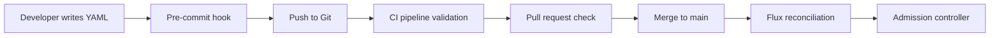

# How to Validate Flux CD Manifests Before Commit with Policy Engines

Author: [nawazdhandala](https://github.com/nawazdhandala)

Tags: Flux CD, Policy Engine, Validation, Pre-Commit, CI/CD, Kyverno, Gatekeeper, GitOps

Description: A practical guide to validating Flux CD manifests against policy engines before committing to Git, catching policy violations early in the development workflow.

---

## Introduction

Catching policy violations before they reach your cluster is far more efficient than dealing with rejected deployments. By integrating policy validation into your pre-commit hooks and CI pipelines, you shift policy enforcement left in the development cycle. This guide shows how to validate Flux CD manifests against Kyverno, Gatekeeper, and Kubewarden policies before they are committed to Git.

## Prerequisites

- Flux CD bootstrapped and connected to a Git repository
- A policy engine (Kyverno, Gatekeeper, or Kubewarden) configured
- A CI/CD system (GitHub Actions, GitLab CI, etc.)
- Local development tools: kubectl, kustomize, helm

## The Validation Pipeline

Policy validation should happen at multiple stages before reaching the cluster.



## Pre-Commit Validation with Kyverno CLI

Kyverno provides a CLI tool that can validate manifests locally without a running cluster.

### Installing the Kyverno CLI

```bash
# Install kyverno CLI using Homebrew
brew install kyverno

# Or download the binary directly
curl -LO https://github.com/kyverno/kyverno/releases/download/v1.12.0/kyverno-cli_v1.12.0_linux_amd64.tar.gz
tar -xzf kyverno-cli_v1.12.0_linux_amd64.tar.gz
sudo mv kyverno /usr/local/bin/
```

### Creating a Pre-Commit Hook

```bash
#!/bin/bash
# .git/hooks/pre-commit
# Validates Kubernetes manifests against Kyverno policies before commit

set -e

# Find all staged YAML files
STAGED_FILES=$(git diff --cached --name-only --diff-filter=ACM | grep -E '\.ya?ml$' || true)

if [ -z "$STAGED_FILES" ]; then
  echo "No YAML files staged, skipping policy validation."
  exit 0
fi

echo "Validating staged manifests against policies..."

# Path to your policy definitions
POLICY_DIR="policies/"

# Validate each staged file
FAILED=0
for file in $STAGED_FILES; do
  # Skip non-Kubernetes manifests
  if ! grep -q "apiVersion:" "$file" 2>/dev/null; then
    continue
  fi

  echo "Checking: $file"
  if ! kyverno apply "$POLICY_DIR" --resource "$file" 2>&1; then
    FAILED=1
  fi
done

if [ $FAILED -eq 1 ]; then
  echo ""
  echo "Policy validation failed. Fix the issues above before committing."
  exit 1
fi

echo "All policy checks passed."
```

### Using pre-commit Framework

```yaml
# .pre-commit-config.yaml
repos:
  # Validate YAML syntax
  - repo: https://github.com/adrienverge/yamllint
    rev: v1.35.0
    hooks:
      - id: yamllint
        args: [-c, .yamllint.yaml]

  # Validate Kubernetes manifests
  - repo: https://github.com/yannh/kubeconform
    rev: v0.6.6
    hooks:
      - id: kubeconform
        args:
          - -strict
          - -summary
          - -skip
          - CustomResourceDefinition

  # Custom hook for Kyverno policy validation
  - repo: local
    hooks:
      - id: kyverno-validate
        name: Kyverno Policy Validation
        entry: bash -c 'kyverno apply policies/ --resource "$@"' --
        language: system
        files: '\.ya?ml$'
        pass_filenames: true
```

## CI Pipeline Validation with GitHub Actions

### Full Validation Workflow

```yaml
# .github/workflows/validate-manifests.yaml
name: Validate Flux Manifests
on:
  pull_request:
    paths:
      - 'clusters/**'
      - 'apps/**'
      - 'infrastructure/**'

jobs:
  validate-manifests:
    runs-on: ubuntu-latest
    steps:
      - name: Checkout repository
        uses: actions/checkout@v4

      - name: Setup Flux CLI
        uses: fluxcd/flux2/action@main

      - name: Validate Flux manifests
        # Verify that all Flux custom resources are valid
        run: |
          find . -name '*.yaml' -o -name '*.yml' | while read file; do
            if grep -q 'toolkit.fluxcd.io' "$file"; then
              echo "Validating Flux resource: $file"
              flux check --pre 2>/dev/null || true
            fi
          done

      - name: Install Kyverno CLI
        run: |
          curl -LO https://github.com/kyverno/kyverno/releases/download/v1.12.0/kyverno-cli_v1.12.0_linux_amd64.tar.gz
          tar -xzf kyverno-cli_v1.12.0_linux_amd64.tar.gz
          sudo mv kyverno /usr/local/bin/

      - name: Build Kustomize overlays
        # Render all Kustomize overlays to validate the final output
        run: |
          for dir in clusters/*/; do
            echo "Building kustomize overlay: $dir"
            kustomize build "$dir" > "/tmp/rendered-$(basename $dir).yaml" 2>/dev/null || true
          done

      - name: Validate against Kyverno policies
        run: |
          echo "Validating rendered manifests against policies..."
          for rendered in /tmp/rendered-*.yaml; do
            if [ -f "$rendered" ]; then
              echo "Checking: $rendered"
              kyverno apply policies/ \
                --resource "$rendered" \
                --detailed-results \
                --output json | tee /tmp/policy-results.json

              # Fail if any violations found
              VIOLATIONS=$(jq '.results[] | select(.status == "fail")' /tmp/policy-results.json)
              if [ -n "$VIOLATIONS" ]; then
                echo "Policy violations found!"
                echo "$VIOLATIONS" | jq .
                exit 1
              fi
            fi
          done

      - name: Post results to PR
        if: failure()
        uses: actions/github-script@v7
        with:
          script: |
            const fs = require('fs');
            const results = fs.readFileSync('/tmp/policy-results.json', 'utf8');
            github.rest.issues.createComment({
              issue_number: context.issue.number,
              owner: context.repo.owner,
              repo: context.repo.repo,
              body: `## Policy Validation Failed\n\`\`\`json\n${results}\n\`\`\``
            });
```

## Validating with Gatekeeper (Conftest)

Gatekeeper policies written in Rego can be validated offline using Conftest.

### Installing Conftest

```bash
# Install conftest
brew install conftest

# Or download directly
curl -LO https://github.com/open-policy-agent/conftest/releases/download/v0.52.0/conftest_0.52.0_Linux_x86_64.tar.gz
tar -xzf conftest_0.52.0_Linux_x86_64.tar.gz
sudo mv conftest /usr/local/bin/
```

### Writing Conftest Policies

```rego
# policy/require_labels.rego
package main

# Deny resources without required labels
deny[msg] {
  input.kind == "Deployment"
  required := {"app.kubernetes.io/name", "team", "environment"}
  provided := {label | input.metadata.labels[label]}
  missing := required - provided
  count(missing) > 0
  msg := sprintf(
    "Deployment '%s' is missing required labels: %v",
    [input.metadata.name, missing]
  )
}

# Deny resources without resource limits
deny[msg] {
  input.kind == "Deployment"
  container := input.spec.template.spec.containers[_]
  not container.resources.limits
  msg := sprintf(
    "Container '%s' in Deployment '%s' must have resource limits",
    [container.name, input.metadata.name]
  )
}
```

### Running Conftest in CI

```yaml
# .github/workflows/conftest-validate.yaml
name: Conftest Policy Validation
on:
  pull_request:
    paths:
      - 'clusters/**'

jobs:
  conftest:
    runs-on: ubuntu-latest
    steps:
      - uses: actions/checkout@v4

      - name: Install Conftest
        run: |
          curl -LO https://github.com/open-policy-agent/conftest/releases/download/v0.52.0/conftest_0.52.0_Linux_x86_64.tar.gz
          tar -xzf conftest_0.52.0_Linux_x86_64.tar.gz
          sudo mv conftest /usr/local/bin/

      - name: Run Conftest validation
        run: |
          # Find and validate all Kubernetes manifests
          find clusters/ -name '*.yaml' | while read file; do
            if grep -q 'apiVersion:' "$file"; then
              echo "Testing: $file"
              conftest test "$file" \
                --policy policy/ \
                --output table \
                --all-namespaces || exit 1
            fi
          done
```

## Validating with Kubewarden (kwctl)

Kubewarden policies can be validated offline using the kwctl CLI.

```bash
# Install kwctl
curl -LO https://github.com/kubewarden/kwctl/releases/download/v1.14.0/kwctl-linux-amd64
chmod +x kwctl-linux-amd64
sudo mv kwctl-linux-amd64 /usr/local/bin/kwctl

# Pull a policy for local testing
kwctl pull registry://ghcr.io/kubewarden/policies/pod-privileged:v0.8.0

# Validate a manifest against the policy
kwctl run \
  registry://ghcr.io/kubewarden/policies/pod-privileged:v0.8.0 \
  --request-path test-pod.json \
  --settings-json '{}'
```

### Kubewarden CI Integration

```yaml
# .github/workflows/kwctl-validate.yaml
name: Kubewarden Policy Validation
on:
  pull_request:
    paths:
      - 'clusters/**'

jobs:
  kwctl-validate:
    runs-on: ubuntu-latest
    steps:
      - uses: actions/checkout@v4

      - name: Install kwctl
        run: |
          curl -LO https://github.com/kubewarden/kwctl/releases/download/v1.14.0/kwctl-linux-amd64
          chmod +x kwctl-linux-amd64
          sudo mv kwctl-linux-amd64 /usr/local/bin/kwctl

      - name: Pull policies
        run: |
          kwctl pull registry://ghcr.io/kubewarden/policies/pod-privileged:v0.8.0
          kwctl pull registry://ghcr.io/kubewarden/policies/trusted-repos:v0.3.0

      - name: Validate manifests
        run: |
          # Convert YAML manifests to admission review requests
          # and validate against Kubewarden policies
          for file in clusters/*/apps/*.yaml; do
            echo "Validating: $file"
            # Convert to AdmissionReview format and test
            kwctl run \
              registry://ghcr.io/kubewarden/policies/pod-privileged:v0.8.0 \
              --request-path "$file" \
              --settings-json '{}' || exit 1
          done
```

## Comprehensive Validation Script

A unified script that runs all validation tools together.

```bash
#!/bin/bash
# scripts/validate-all.sh
# Runs all policy validation tools against manifests

set -e

MANIFEST_DIR="${1:-clusters/}"
POLICY_DIR="${2:-policies/}"
ERRORS=0

echo "=== Starting comprehensive manifest validation ==="

# Step 1: YAML syntax validation
echo ""
echo "--- YAML Lint ---"
find "$MANIFEST_DIR" -name '*.yaml' -exec yamllint -c .yamllint.yaml {} + || ERRORS=$((ERRORS + 1))

# Step 2: Kubernetes schema validation
echo ""
echo "--- Kubeconform ---"
find "$MANIFEST_DIR" -name '*.yaml' -exec kubeconform -strict -summary {} + || ERRORS=$((ERRORS + 1))

# Step 3: Kyverno policy validation
echo ""
echo "--- Kyverno ---"
if command -v kyverno &>/dev/null; then
  kyverno apply "$POLICY_DIR" --resource "$MANIFEST_DIR" --detailed-results || ERRORS=$((ERRORS + 1))
else
  echo "kyverno CLI not found, skipping."
fi

# Step 4: Conftest/OPA validation
echo ""
echo "--- Conftest ---"
if command -v conftest &>/dev/null; then
  find "$MANIFEST_DIR" -name '*.yaml' -exec conftest test {} --policy policy/ + || ERRORS=$((ERRORS + 1))
else
  echo "conftest not found, skipping."
fi

# Summary
echo ""
echo "=== Validation Complete ==="
if [ $ERRORS -gt 0 ]; then
  echo "FAILED: $ERRORS validation step(s) had errors."
  exit 1
else
  echo "PASSED: All validation checks succeeded."
fi
```

## Conclusion

Validating Flux CD manifests before they are committed shifts policy enforcement to the earliest possible stage in your workflow. By using CLI tools from Kyverno, Conftest, and Kubewarden in pre-commit hooks and CI pipelines, developers get immediate feedback on policy violations. This reduces the feedback loop from minutes (waiting for Flux reconciliation) to seconds, improving developer productivity while maintaining security and compliance standards. The key is to use the same policies in your pre-commit validation as you enforce in your cluster, ensuring consistency across the entire deployment pipeline.
