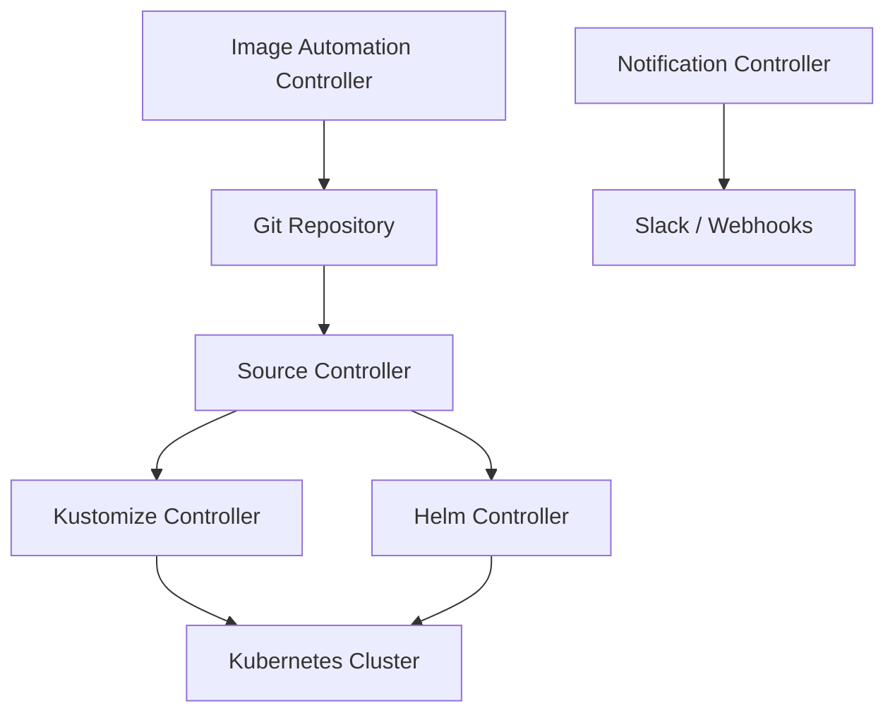

# When to Choose Flux CD Over ArgoCD

Author: [nawazdhandala](https://github.com/nawazdhandala)

Tags: Flux CD, ArgoCD, GitOps, Kubernetes, Decision guide, Comparison

Description: A practical decision guide for choosing Flux CD over ArgoCD based on architecture, team needs, and deployment patterns.

---

Flux CD and ArgoCD are the two leading GitOps tools for Kubernetes. Both are CNCF projects, both deliver continuous delivery from Git repositories, and both have strong communities. Yet they differ significantly in architecture and philosophy. This guide helps you understand when Flux CD is the better choice.

## Understanding the Core Architectural Differences

Before comparing features, it helps to understand how each tool is built.

Flux CD follows a composable, controller-based architecture. Each component (source-controller, kustomize-controller, helm-controller, notification-controller, image-automation-controller) runs independently. You can install only what you need.

ArgoCD follows a monolithic application-server architecture. It provides a unified API server, a repo server, and a UI - all tightly coupled.



## Choose Flux CD When You Need Native Helm Support

Flux CD treats Helm as a first-class citizen through HelmRelease custom resources. You define your Helm releases declaratively and Flux manages the full lifecycle.

```yaml
# HelmRelease with advanced configuration
apiVersion: helm.toolkit.fluxcd.io/v2
kind: HelmRelease
metadata:
  name: my-application
  namespace: production
spec:
  interval: 10m
  # Chart source reference
  chart:
    spec:
      chart: my-app
      version: ">=1.0.0 <2.0.0"
      sourceRef:
        kind: HelmRepository
        name: my-charts
      # Automatically use the latest matching version
      interval: 5m
  # Values from multiple sources
  valuesFrom:
    - kind: ConfigMap
      name: app-shared-values
    - kind: Secret
      name: app-secret-values
  # Inline values
  values:
    replicaCount: 3
    resources:
      requests:
        cpu: 100m
        memory: 128Mi
  # Rollback on failure
  install:
    remediation:
      retries: 3
  upgrade:
    remediation:
      retries: 3
      remediateLastFailure: true
```

ArgoCD supports Helm too, but it renders Helm templates and applies the output as plain manifests. This means you lose Helm lifecycle hooks and native Helm rollback capabilities.

## Choose Flux CD When You Want a CLI-First, No-UI Approach

Flux CD has no built-in web UI. This is intentional. If your team is comfortable with CLI tools and prefers infrastructure-as-code patterns, Flux fits naturally.

```bash
# Bootstrap Flux into a cluster
flux bootstrap github \
  --owner=my-org \
  --repository=fleet-infra \
  --branch=main \
  --path=clusters/production \
  --personal

# Check the status of all Flux resources
flux get all -A

# Reconcile a specific resource immediately
flux reconcile kustomization apps --with-source

# Suspend reconciliation during maintenance
flux suspend kustomization apps

# Resume reconciliation
flux resume kustomization apps
```

## Choose Flux CD When You Need Image Automation

Flux CD can automatically detect new container images and update your Git repository. This closes the GitOps loop completely - no external CI pipeline needed to bump image tags.

```yaml
# Define which container registry to watch
apiVersion: image.toolkit.fluxcd.io/v1
kind: ImageRepository
metadata:
  name: my-app
  namespace: flux-system
spec:
  image: ghcr.io/my-org/my-app
  interval: 5m
  # Optional: authenticate to private registries
  secretRef:
    name: ghcr-credentials
---
# Define a policy for selecting image tags
apiVersion: image.toolkit.fluxcd.io/v1
kind: ImagePolicy
metadata:
  name: my-app
  namespace: flux-system
spec:
  imageRepositoryRef:
    name: my-app
  policy:
    semver:
      # Only use stable semver tags
      range: ">=1.0.0"
---
# Automate Git updates when new images are found
apiVersion: image.toolkit.fluxcd.io/v1
kind: ImageUpdateAutomation
metadata:
  name: my-app
  namespace: flux-system
spec:
  interval: 5m
  sourceRef:
    kind: GitRepository
    name: fleet-infra
  git:
    checkout:
      ref:
        branch: main
    commit:
      author:
        name: fluxbot
        email: fluxbot@my-org.com
      messageTemplate: "chore: update {{.AutomationObject}} images"
    push:
      branch: main
  update:
    path: ./clusters/production
    strategy: Setters
```

## Choose Flux CD When You Manage Multiple Clusters

Flux CD excels at multi-cluster management because each cluster runs its own Flux instance, pulling configuration from Git. There is no central server to become a bottleneck.

```yaml
# Repository structure for multi-cluster management
# fleet-infra/
#   clusters/
#     staging/
#       infrastructure.yaml
#       apps.yaml
#     production/
#       infrastructure.yaml
#       apps.yaml
#   infrastructure/
#     sources/
#     controllers/
#   apps/
#     base/
#     staging/
#     production/

# clusters/production/apps.yaml
apiVersion: kustomize.toolkit.fluxcd.io/v1
kind: Kustomization
metadata:
  name: apps
  namespace: flux-system
spec:
  interval: 10m
  # Depends on infrastructure being ready first
  dependsOn:
    - name: infrastructure
  sourceRef:
    kind: GitRepository
    name: fleet-infra
  path: ./apps/production
  prune: true
  # Health checks ensure apps are actually running
  healthChecks:
    - apiVersion: apps/v1
      kind: Deployment
      name: my-app
      namespace: production
  # Timeout for health checks
  timeout: 5m
```

## Choose Flux CD When You Need Deep Kustomize Integration

Flux CD uses Kustomize natively. Its kustomize-controller applies Kustomize overlays directly, with support for post-build variable substitution.

```yaml
# Kustomization with variable substitution
apiVersion: kustomize.toolkit.fluxcd.io/v1
kind: Kustomization
metadata:
  name: apps
  namespace: flux-system
spec:
  interval: 10m
  sourceRef:
    kind: GitRepository
    name: fleet-infra
  path: ./apps/production
  prune: true
  # Substitute variables from ConfigMaps and Secrets
  postBuild:
    substitute:
      CLUSTER_NAME: production
      REGION: us-east-1
    substituteFrom:
      - kind: ConfigMap
        name: cluster-settings
      - kind: Secret
        name: cluster-secrets
```

## Choose Flux CD When Security Is a Priority

Flux CD has a minimal attack surface. It runs inside the cluster with no externally exposed API server or UI. There are no stored credentials for cluster access - Flux uses in-cluster service accounts.

```yaml
# Restrict Flux's permissions using a service account
apiVersion: kustomize.toolkit.fluxcd.io/v1
kind: Kustomization
metadata:
  name: tenant-apps
  namespace: flux-system
spec:
  interval: 10m
  sourceRef:
    kind: GitRepository
    name: fleet-infra
  path: ./tenants/team-alpha
  prune: true
  # Run reconciliation as a specific service account
  serviceAccountName: team-alpha-reconciler
  # Limit which namespaces Flux can manage
  targetNamespace: team-alpha
```

## Decision Matrix Summary

| Criteria | Choose Flux CD | Choose ArgoCD |
|---|---|---|
| Helm lifecycle support | Yes | No |
| Web UI required | No | Yes |
| Image automation | Built-in | External |
| Multi-cluster scale | Decentralized | Centralized |
| Kustomize native | Yes | Partial |
| Security posture | Minimal surface | API server exposed |
| Team prefers CLI | Yes | Prefers UI |
| Composable architecture | Yes | Monolithic |

## Getting Started with Your Decision

If the factors above align with your needs, bootstrap Flux CD in a test cluster and evaluate it with a real workload.

```bash
# Install Flux CLI
curl -s https://fluxcd.io/install.sh | sudo bash

# Verify prerequisites
flux check --pre

# Bootstrap with GitHub
flux bootstrap github \
  --owner=my-org \
  --repository=fleet-infra \
  --branch=main \
  --path=clusters/staging \
  --personal

# Verify installation
flux check
```

The best way to decide is to prototype with both tools using your actual workloads. But if your team values composability, CLI-first workflows, native Helm support, and decentralized multi-cluster management, Flux CD is likely the right choice.
