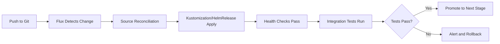

# How to Write Integration Tests for Flux CD Deployments

Author: [nawazdhandala](https://github.com/nawazdhandala)

Tags: Flux CD, GitOps, Integration Testing, Kubernetes, CI/CD, Testing, DevOps, Automation

Description: A practical guide to writing and running integration tests for Flux CD deployments, covering test frameworks, assertions, and CI pipeline integration.

---

## Introduction

Integration tests for Flux CD deployments verify that your GitOps pipeline works end-to-end: from Git commit to running workloads in a Kubernetes cluster. Unlike unit tests that validate individual manifests, integration tests confirm that Flux reconciles resources correctly, dependencies resolve properly, and deployed applications function as expected. This guide covers how to write, structure, and automate integration tests for Flux CD.

## Integration Test Strategy

Integration tests for Flux CD should validate:

- Flux reconciles GitRepository and Kustomization resources successfully
- HelmReleases install and upgrade correctly
- Dependencies between Kustomizations resolve in the right order
- Health checks pass for deployed workloads
- Notifications fire on success and failure
- Drift detection and remediation work correctly



## Setting Up the Test Framework

### Using Bash with kubectl Assertions

```bash
#!/bin/bash
# test-framework.sh
# Simple test framework for Flux CD integration tests

TESTS_PASSED=0
TESTS_FAILED=0

# Assert function: check a condition and report result
assert() {
  local description="$1"
  local command="$2"
  local expected="$3"

  actual=$(eval "$command" 2>&1)

  if [ "$actual" = "$expected" ]; then
    echo "PASS: $description"
    TESTS_PASSED=$((TESTS_PASSED + 1))
  else
    echo "FAIL: $description"
    echo "  Expected: $expected"
    echo "  Actual:   $actual"
    TESTS_FAILED=$((TESTS_FAILED + 1))
  fi
}

# Assert that a resource exists
assert_resource_exists() {
  local kind="$1"
  local name="$2"
  local namespace="${3:-default}"

  if kubectl get "$kind" "$name" -n "$namespace" > /dev/null 2>&1; then
    echo "PASS: $kind/$name exists in $namespace"
    TESTS_PASSED=$((TESTS_PASSED + 1))
  else
    echo "FAIL: $kind/$name not found in $namespace"
    TESTS_FAILED=$((TESTS_FAILED + 1))
  fi
}

# Assert that a deployment is ready
assert_deployment_ready() {
  local name="$1"
  local namespace="${2:-default}"
  local timeout="${3:-120}"

  if kubectl wait --for=condition=available deployment/"$name" \
    -n "$namespace" --timeout="${timeout}s" > /dev/null 2>&1; then
    echo "PASS: Deployment $name is ready in $namespace"
    TESTS_PASSED=$((TESTS_PASSED + 1))
  else
    echo "FAIL: Deployment $name is not ready in $namespace"
    TESTS_FAILED=$((TESTS_FAILED + 1))
  fi
}

# Assert Flux Kustomization is ready
assert_kustomization_ready() {
  local name="$1"
  local namespace="${2:-flux-system}"

  local status=$(kubectl get kustomization "$name" -n "$namespace" \
    -o jsonpath='{.status.conditions[?(@.type=="Ready")].status}')

  if [ "$status" = "True" ]; then
    echo "PASS: Kustomization $name is Ready"
    TESTS_PASSED=$((TESTS_PASSED + 1))
  else
    local msg=$(kubectl get kustomization "$name" -n "$namespace" \
      -o jsonpath='{.status.conditions[?(@.type=="Ready")].message}')
    echo "FAIL: Kustomization $name is not Ready: $msg"
    TESTS_FAILED=$((TESTS_FAILED + 1))
  fi
}

# Print test summary
print_summary() {
  echo ""
  echo "=== Test Summary ==="
  echo "Passed: $TESTS_PASSED"
  echo "Failed: $TESTS_FAILED"
  echo "Total:  $((TESTS_PASSED + TESTS_FAILED))"

  if [ $TESTS_FAILED -gt 0 ]; then
    exit 1
  fi
}
```

### Using Go with the Flux SDK

```go
// flux_test.go
package integration

import (
    "context"
    "testing"
    "time"

    kustomizev1 "github.com/fluxcd/kustomize-controller/api/v1"
    sourcev1 "github.com/fluxcd/source-controller/api/v1"
    "k8s.io/apimachinery/pkg/types"
    "sigs.k8s.io/controller-runtime/pkg/client"
)

// TestGitRepositoryReconciliation verifies that a GitRepository
// resource reconciles successfully
func TestGitRepositoryReconciliation(t *testing.T) {
    ctx, cancel := context.WithTimeout(context.Background(), 5*time.Minute)
    defer cancel()

    // Get the Kubernetes client
    k8sClient := getK8sClient(t)

    // Check that the GitRepository exists and is ready
    gitRepo := &sourcev1.GitRepository{}
    err := k8sClient.Get(ctx, types.NamespacedName{
        Name:      "fleet-repo",
        Namespace: "flux-system",
    }, gitRepo)
    if err != nil {
        t.Fatalf("Failed to get GitRepository: %v", err)
    }

    // Verify the Ready condition
    for _, condition := range gitRepo.Status.Conditions {
        if condition.Type == "Ready" {
            if condition.Status != "True" {
                t.Errorf("GitRepository is not Ready: %s", condition.Message)
            }
            return
        }
    }
    t.Error("GitRepository has no Ready condition")
}

// TestKustomizationReconciliation verifies that Kustomizations
// reconcile and create expected resources
func TestKustomizationReconciliation(t *testing.T) {
    ctx, cancel := context.WithTimeout(context.Background(), 5*time.Minute)
    defer cancel()

    k8sClient := getK8sClient(t)

    // Check that the Kustomization is ready
    ks := &kustomizev1.Kustomization{}
    err := k8sClient.Get(ctx, types.NamespacedName{
        Name:      "apps",
        Namespace: "flux-system",
    }, ks)
    if err != nil {
        t.Fatalf("Failed to get Kustomization: %v", err)
    }

    // Wait for Ready condition
    waitForCondition(t, ctx, k8sClient, ks, "Ready", "True", 5*time.Minute)
}
```

## Writing Test Cases

### Test 1: Source Reconciliation

```bash
#!/bin/bash
# tests/test-source-reconciliation.sh
# Verify that all GitRepository sources reconcile successfully

source ./test-framework.sh

echo "=== Test: Source Reconciliation ==="

# Test that all GitRepository objects are ready
for repo in $(kubectl get gitrepositories -n flux-system -o jsonpath='{.items[*].metadata.name}'); do
  status=$(kubectl get gitrepository "$repo" -n flux-system \
    -o jsonpath='{.status.conditions[?(@.type=="Ready")].status}')
  assert "GitRepository $repo is Ready" "echo $status" "True"
done

# Test that all HelmRepository objects are ready
for repo in $(kubectl get helmrepositories -n flux-system -o jsonpath='{.items[*].metadata.name}'); do
  status=$(kubectl get helmrepository "$repo" -n flux-system \
    -o jsonpath='{.status.conditions[?(@.type=="Ready")].status}')
  assert "HelmRepository $repo is Ready" "echo $status" "True"
done

# Test that artifacts are available
for repo in $(kubectl get gitrepositories -n flux-system -o jsonpath='{.items[*].metadata.name}'); do
  artifact=$(kubectl get gitrepository "$repo" -n flux-system \
    -o jsonpath='{.status.artifact.url}')
  if [ -n "$artifact" ] && [ "$artifact" != "null" ]; then
    echo "PASS: GitRepository $repo has artifact: $artifact"
    TESTS_PASSED=$((TESTS_PASSED + 1))
  else
    echo "FAIL: GitRepository $repo has no artifact"
    TESTS_FAILED=$((TESTS_FAILED + 1))
  fi
done

print_summary
```

### Test 2: Kustomization Dependencies

```bash
#!/bin/bash
# tests/test-kustomization-dependencies.sh
# Verify that Kustomization dependencies resolve correctly

source ./test-framework.sh

echo "=== Test: Kustomization Dependencies ==="

# Test that infrastructure is reconciled before apps
# Infrastructure should be ready first
assert_kustomization_ready "infrastructure" "flux-system"

# Then apps should be ready (depends on infrastructure)
assert_kustomization_ready "apps" "flux-system"

# Verify the dependency order was respected
infra_time=$(kubectl get kustomization infrastructure -n flux-system \
  -o jsonpath='{.status.lastAppliedRevision}')
apps_time=$(kubectl get kustomization apps -n flux-system \
  -o jsonpath='{.status.lastAppliedRevision}')

echo "Infrastructure revision: $infra_time"
echo "Apps revision: $apps_time"

# Verify that namespaces created by infrastructure exist
# before apps try to deploy into them
assert_resource_exists "namespace" "monitoring"
assert_resource_exists "namespace" "ingress-nginx"

print_summary
```

### Test 3: HelmRelease Deployment

```bash
#!/bin/bash
# tests/test-helmrelease-deployment.sh
# Verify that HelmReleases install and configure correctly

source ./test-framework.sh

echo "=== Test: HelmRelease Deployment ==="

# Test that all HelmReleases are ready
for hr in $(kubectl get helmreleases -A -o jsonpath='{range .items[*]}{.metadata.namespace}/{.metadata.name}{" "}{end}'); do
  namespace=$(echo "$hr" | cut -d'/' -f1)
  name=$(echo "$hr" | cut -d'/' -f2)

  status=$(kubectl get helmrelease "$name" -n "$namespace" \
    -o jsonpath='{.status.conditions[?(@.type=="Ready")].status}')
  assert "HelmRelease $namespace/$name is Ready" "echo $status" "True"
done

# Verify Helm release history exists
for hr in $(kubectl get helmreleases -A -o jsonpath='{range .items[*]}{.metadata.namespace}/{.metadata.name}{" "}{end}'); do
  namespace=$(echo "$hr" | cut -d'/' -f1)
  name=$(echo "$hr" | cut -d'/' -f2)

  # Check that the Helm release was actually created
  release_count=$(kubectl get secrets -n "$namespace" \
    -l "owner=helm,name=$name" --no-headers 2>/dev/null | wc -l)

  if [ "$release_count" -gt 0 ]; then
    echo "PASS: Helm release $name has $release_count revision(s)"
    TESTS_PASSED=$((TESTS_PASSED + 1))
  else
    echo "FAIL: No Helm release found for $name"
    TESTS_FAILED=$((TESTS_FAILED + 1))
  fi
done

print_summary
```

### Test 4: Application Health

```bash
#!/bin/bash
# tests/test-application-health.sh
# Verify that deployed applications are healthy and functional

source ./test-framework.sh

echo "=== Test: Application Health ==="

# Test that key deployments are available
assert_deployment_ready "my-app" "default" 120
assert_deployment_ready "nginx-ingress-controller" "ingress-nginx" 120

# Test that services have endpoints
for svc in $(kubectl get services -n default -o jsonpath='{.items[*].metadata.name}'); do
  endpoints=$(kubectl get endpoints "$svc" -n default \
    -o jsonpath='{.subsets[*].addresses[*].ip}' 2>/dev/null)

  if [ -n "$endpoints" ]; then
    echo "PASS: Service $svc has endpoints: $endpoints"
    TESTS_PASSED=$((TESTS_PASSED + 1))
  else
    echo "WARN: Service $svc has no endpoints (may be expected for ExternalName/LoadBalancer)"
  fi
done

# Test pod health via readiness
not_ready=$(kubectl get pods -n default --field-selector=status.phase!=Running \
  --no-headers 2>/dev/null | wc -l)
assert "All pods in default namespace are Running" "echo $not_ready" "0"

# Test connectivity to application
# Port-forward and make HTTP request
kubectl port-forward -n default svc/my-app 8888:80 &
PF_PID=$!
sleep 3

http_status=$(curl -s -o /dev/null -w "%{http_code}" http://localhost:8888/ 2>/dev/null || echo "000")
assert "Application responds with HTTP 200" "echo $http_status" "200"

kill $PF_PID 2>/dev/null

print_summary
```

### Test 5: Drift Detection

```bash
#!/bin/bash
# tests/test-drift-detection.sh
# Verify that Flux detects and corrects drift

source ./test-framework.sh

echo "=== Test: Drift Detection ==="

# Save current replica count
ORIGINAL_REPLICAS=$(kubectl get deployment my-app -n default \
  -o jsonpath='{.spec.replicas}')
echo "Original replicas: $ORIGINAL_REPLICAS"

# Introduce drift by manually scaling
kubectl scale deployment my-app -n default --replicas=99

# Wait for Flux to detect and correct the drift
echo "Waiting for Flux to detect drift..."
sleep 10

# Force reconciliation
flux reconcile kustomization apps --with-source 2>/dev/null || true

# Wait for reconciliation to complete
sleep 30

# Check that replicas were restored
CURRENT_REPLICAS=$(kubectl get deployment my-app -n default \
  -o jsonpath='{.spec.replicas}')

assert "Drift corrected: replicas restored" \
  "echo $CURRENT_REPLICAS" "$ORIGINAL_REPLICAS"

print_summary
```

## Running the Complete Test Suite

### Test Runner Script

```bash
#!/bin/bash
# run-integration-tests.sh
# Run all integration tests in order

set -e

SCRIPT_DIR="$(cd "$(dirname "${BASH_SOURCE[0]}")" && pwd)"
TEST_DIR="$SCRIPT_DIR/tests"

TOTAL_PASSED=0
TOTAL_FAILED=0

echo "========================================="
echo "  Flux CD Integration Test Suite"
echo "========================================="
echo ""

# Wait for all Flux reconciliations to complete
echo "Waiting for Flux reconciliation..."
flux reconcile kustomization flux-system --with-source --timeout=5m 2>/dev/null || true
sleep 10

# Run each test file
for test_file in "$TEST_DIR"/test-*.sh; do
  echo ""
  echo "-----------------------------------------"
  echo "Running: $(basename "$test_file")"
  echo "-----------------------------------------"

  if bash "$test_file"; then
    echo "Suite PASSED"
  else
    echo "Suite FAILED"
    TOTAL_FAILED=$((TOTAL_FAILED + 1))
  fi
done

echo ""
echo "========================================="
echo "  Overall Results"
echo "========================================="
echo "Test suites with failures: $TOTAL_FAILED"

if [ $TOTAL_FAILED -gt 0 ]; then
  echo "RESULT: FAILED"

  # Collect diagnostic information on failure
  echo ""
  echo "=== Diagnostic Information ==="
  flux logs --all-namespaces --since=10m 2>/dev/null | tail -50
  kubectl get events -A --sort-by='.lastTimestamp' | tail -20

  exit 1
else
  echo "RESULT: PASSED"
fi
```

## CI Pipeline Integration

### GitHub Actions Workflow

```yaml
# .github/workflows/integration-tests.yaml
name: Flux Integration Tests
on:
  pull_request:
    branches: [main]
  push:
    branches: [main]

jobs:
  integration-test:
    runs-on: ubuntu-latest
    timeout-minutes: 30
    steps:
      - uses: actions/checkout@v4

      - name: Setup Flux CLI
        uses: fluxcd/flux2/action@main

      - name: Create Kind cluster
        uses: helm/kind-action@v1
        with:
          cluster_name: flux-integration-test

      - name: Install Flux
        run: |
          flux install
          kubectl wait --for=condition=available deployments --all \
            -n flux-system --timeout=120s

      - name: Apply test configurations
        run: |
          kubectl apply -f clusters/test/sources.yaml
          kubectl apply -f clusters/test/kustomizations.yaml
          # Wait for initial reconciliation
          sleep 30
          flux reconcile kustomization flux-system --with-source --timeout=5m

      - name: Run integration tests
        run: |
          chmod +x ./scripts/run-integration-tests.sh
          ./scripts/run-integration-tests.sh

      - name: Collect Flux logs on failure
        if: failure()
        run: |
          echo "=== Flux Logs ==="
          flux logs --all-namespaces
          echo "=== Pod Status ==="
          kubectl get pods -A
          echo "=== Events ==="
          kubectl get events -A --sort-by='.lastTimestamp'

      - name: Cleanup
        if: always()
        run: kind delete cluster --name flux-integration-test
```

## Best Practices Summary

1. **Test the full pipeline** - From Git push to running application
2. **Use disposable clusters** - Create fresh Kind clusters for each test run
3. **Test dependencies explicitly** - Verify ordering between infrastructure and apps
4. **Include drift detection tests** - Confirm Flux corrects manual changes
5. **Set appropriate timeouts** - Allow enough time for reconciliation but fail fast
6. **Collect diagnostics on failure** - Capture Flux logs, events, and pod status
7. **Run tests in CI** - Automate on every pull request and merge
8. **Test upgrade scenarios** - Verify that changes apply cleanly over existing state

## Conclusion

Integration tests for Flux CD deployments provide confidence that your GitOps pipeline works correctly end-to-end. By combining source reconciliation checks, dependency validation, application health tests, and drift detection verification, you can catch issues before they reach production. Automate these tests in your CI pipeline using Kind clusters for fast, reproducible test runs that validate every configuration change.
