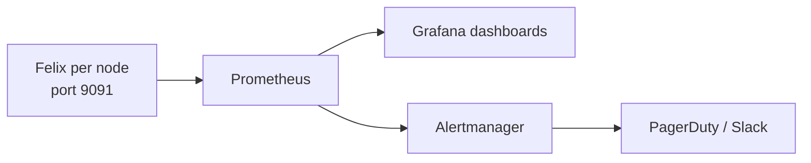

# How to Alert on the Calico Flow Logs API

Author: [nawazdhandala](https://github.com/nawazdhandala)

Tags: Calico, Kubernetes, Networking, Observability

Description: Configure alerts based on Calico Flow Logs API data to detect sustained denied traffic patterns, unusual cross-namespace connection attempts, and policy enforcement failures.

---

## Introduction

The Flow Logs API enables rich alerting based on flow patterns. Unlike Prometheus metric alerts that show rates, API-based alerts can include specific source/destination context in alert payloads, making them more actionable. A 'high deny rate' alert can include the specific source pod and denied destination as alert attributes.

## Key Commands

```bash
# Enable Felix metrics (if not already enabled)
kubectl patch felixconfiguration default   --type=merge   -p '{"spec":{"prometheusMetricsEnabled":true,"prometheusMetricsPort":9091}}'

# Test Felix metrics endpoint
CALICO_POD=$(kubectl get pods -n calico-system -l k8s-app=calico-node   -o jsonpath='{.items[0].metadata.name}')

kubectl exec -n calico-system "${CALICO_POD}" -c calico-node --   wget -qO- http://localhost:9091/metrics | head -30

# Key Felix metrics to check:
kubectl exec -n calico-system "${CALICO_POD}" -c calico-node --   wget -qO- http://localhost:9091/metrics | grep -E   "^felix_int_dataplane_failures|^felix_calc_graph"
```

## ServiceMonitor for Felix

```yaml
apiVersion: monitoring.coreos.com/v1
kind: ServiceMonitor
metadata:
  name: calico-felix-metrics
  namespace: calico-system
spec:
  selector:
    matchLabels:
      k8s-app: calico-node
  endpoints:
    - port: http-metrics
      path: /metrics
      interval: 30s
```

## Architecture



## Conclusion

Felix metrics provide the deepest operational visibility into the Calico data plane. Enable the Prometheus endpoint via FelixConfiguration, configure a ServiceMonitor to scrape all calico-node pods, and build dashboards focused on dataplane failures and policy calculation latency. These two metric categories detect the most impactful Calico failure modes before they cause visible pod connectivity issues.
