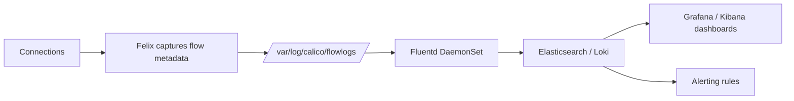

# How to Alert on Calico Flow Logs

Author: [nawazdhandala](https://github.com/nawazdhandala)

Tags: Calico, Kubernetes, Networking, Observability

Description: Configure alerts based on Calico flow log data to detect unusual denied traffic rates, new connection patterns from unexpected sources, and potential network security incidents.

---

## Introduction

Flow log-based alerts complement Prometheus metric alerts by providing connection-level context. Rate-based alerts on denied traffic detect policy misconfigurations. Threshold-based alerts on new connection sources detect unexpected access patterns. Both require the flow logs to be aggregated in a system that supports alerting queries.

## Key Commands

```bash
# View file-based flow logs directly from a calico-node pod when they are enabled

CALICO_POD=$(kubectl get pods -n calico-system -l k8s-app=calico-node   -o jsonpath='{.items[0].metadata.name}')

kubectl exec -n calico-system "${CALICO_POD}" -c calico-node --   tail -20 /var/log/calico/flowlogs/flows.log 2>/dev/null

# Filter for denied flows
kubectl exec -n calico-system "${CALICO_POD}" -c calico-node --   grep "deny\|Deny" /var/log/calico/flowlogs/flows.log | tail -10

# Check flow log configuration
kubectl get felixconfiguration default -o yaml |   grep -i "flowLog"
```

## Flow Log Format

Example flow log entry after parsing/indexing:

```json
{
  "start_time": 1773396000,
  "end_time": 1773396015,
  "source_ip": "192.168.1.5",
  "dest_ip": "192.168.2.10",
  "proto": "tcp",
  "source_port": 54321,
  "dest_port": 8080,
  "num_flows": 12,
  "bytes_in": 1500,
  "bytes_out": 3200,
  "action": "allow",
  "source_namespace": "default",
  "source_name": "frontend-abc",
  "dest_namespace": "production",
  "dest_name": "backend"
}
```

## Architecture


```mermaid
flowchart LR
    A[Connections] --> B[Felix captures flow metadata]
    B --> C[/var/log/calico/flowlogs/]
    C --> D[Fluentd DaemonSet]
    D --> E[Elasticsearch / Loki]
    E --> F[Grafana / Kibana dashboards]
    E --> G[Alerting rules]
```

## Conclusion

Calico flow logs provide connection-level detail for network activity. The most valuable operational use case is denied traffic analysis - flow logs show which connections are being blocked, and can include policy details when policy information is enabled in the flow log configuration, enabling rapid policy debugging. Validate the flow log pipeline periodically by generating known test connections and verifying they appear with the correct attributes in your aggregation system.
