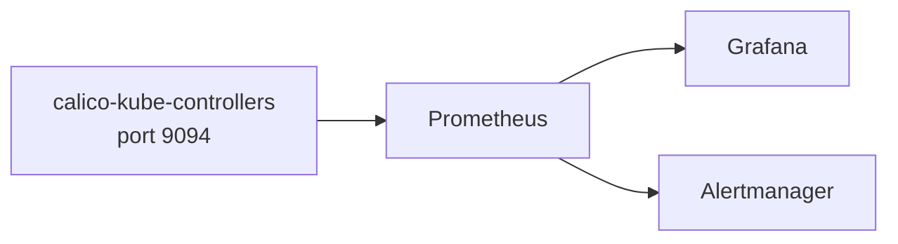

# How to Alert on Calico Kube-Controllers Metrics

Author: [nawazdhandala](https://github.com/nawazdhandala)

Tags: Calico, Kubernetes, Networking, Observability

Description: Configure Prometheus alerts for Calico kube-controllers metrics to detect distribution failures early.

---

## Introduction

Calico kube-controllers exposes Prometheus metrics on port 9094 that provide visibility into the policy distribution layer. These metrics are essential for monitoring the health of Calico's control plane in large clusters.

## Enable Metrics Collection

```bash
# Test kube-controllers metrics endpoint
POD=$(kubectl get pods -n calico-system -l app=calico-kube-controllers   -o jsonpath='{.items[0].metadata.name}')

kubectl exec -n calico-system "${POD}" --   wget -qO- http://localhost:9094/metrics | head -30
```

## ServiceMonitor

```yaml
apiVersion: monitoring.coreos.com/v1
kind: ServiceMonitor
metadata:
  name: calico-kube-controllers-metrics
  namespace: calico-system
spec:
  selector:
    matchLabels:
      app: calico-kube-controllers
  endpoints:
    - port: metrics
      path: /metrics
      interval: 30s
```

## Alert Rules

```yaml
apiVersion: monitoring.coreos.com/v1
kind: PrometheusRule
metadata:
  name: calico-kube-controllers-alerts
  namespace: calico-system
spec:
  groups:
    - name: calico.kube-controllers
      rules:
        - alert: CalicoKube-ControllersMetricsDown
          expr: up{job="calico-kube-controllers-metrics"} == 0
          for: 5m
          annotations:
            summary: "Calico kube-controllers metrics endpoint is unreachable"
```

## Architecture



## Conclusion

Calico kube-controllers metrics provide visibility into the kube-controllers distribution layer. Enable metrics via ServiceMonitor, build dashboards focused on key kube-controllers health indicators, and alert on metrics endpoint availability and key performance thresholds. These metrics complement Felix per-node metrics to provide complete Calico observability.
