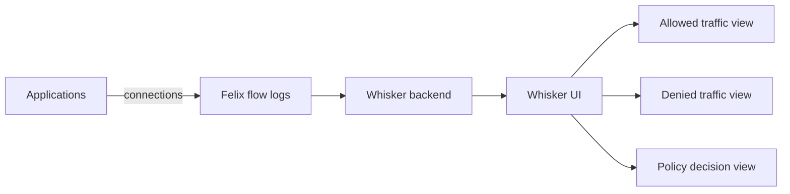

# How to Alert on Whisker in Calico

Author: [nawazdhandala](https://github.com/nawazdhandala)

Tags: Calico, Kubernetes, Networking, Observability

Description: Configure alerts based on Calico Whisker flow data to detect unusual denied traffic patterns, unexpected new connections, and policy enforcement failures.

---

## Introduction

Whisker flow data can drive Prometheus alerts for network security monitoring. High denied traffic rates indicate network policy issues or potential network scanning activity. New connections from unexpected sources indicate policy drift or security incidents. Whisker's flow data makes these patterns detectable without deep packet inspection.

## Key Operations

```bash
# Verify Whisker is running
kubectl get pods -n calico-system | grep whisker

# Access Whisker UI
kubectl port-forward -n calico-system svc/whisker 8081:8081
# Open: http://localhost:8081

# Check Whisker logs for issues
kubectl logs -n calico-system -l k8s-app=whisker --tail=50

# Check flow log configuration (affects what Whisker shows)
kubectl get felixconfiguration default -o jsonpath='{.spec.flowLogsFlushInterval}'
```

## Architecture



## Common Whisker Queries

```
# In Whisker UI - common investigation patterns:

# Find all denied connections to a service:
# Filter: destination=<service-name>, action=Deny

# Find all traffic from a specific pod:
# Filter: source=<pod-name>

# Find recently started connections:
# Sort by: timestamp descending

# Find policy drop sources:
# Filter: action=Deny, group by: source namespace
```

## Conclusion

Whisker provides the fastest path to understanding Calico network policy behavior in a running cluster. The denied traffic view replaces hours of log analysis with seconds of UI interaction. Validate Whisker periodically by cross-checking its view against known application connection patterns — this ensures the observability pipeline is functioning correctly before you rely on it during an incident.
