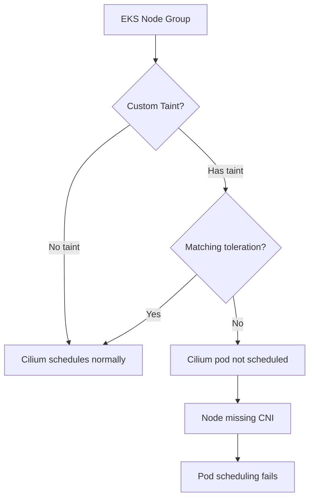

# How to Apply Tolerations to the Cilium EKS Add-On

Author: [nawazdhandala](https://github.com/nawazdhandala)

Tags: Cilium, Kubernetes, EKS, Tolerations, AWS, Operations

Description: Configure custom tolerations for the Cilium EKS add-on to allow Cilium agents to schedule on tainted nodes including Windows nodes, GPU nodes, and spot instances.

---

## Introduction

The Cilium EKS add-on deploys Cilium as a managed DaemonSet on your EKS cluster. When you add specialized node groups with taints—such as GPU nodes, spot instance groups, Windows nodes, or dedicated infrastructure nodes—the Cilium DaemonSet needs matching tolerations to schedule on those nodes.

Without proper tolerations, Cilium agents won't run on tainted nodes, leaving those nodes without network policy enforcement and potentially causing CNI failures when pods try to schedule there.

## Prerequisites

- EKS cluster with Cilium add-on installed
- Node groups with custom taints
- AWS CLI and `kubectl` configured

## Understand the Problem

The default Cilium agent DaemonSet toleration is a single wildcard entry:

```yaml
tolerations:
  - operator: Exists
```

This tolerates all taints by default. However, if you customize tolerations (e.g., via Helm values), the defaults are replaced, which may cause Cilium to stop scheduling on some tainted nodes.

## View Current Cilium DaemonSet Tolerations

```bash
kubectl get ds -n kube-system cilium -o jsonpath='{.spec.template.spec.tolerations}' | jq .
```

## Architecture



## Add Tolerations via Helm Values

Cilium is not an AWS-managed EKS addon and must be installed via Helm. To apply tolerations, update your Helm values:

```bash
helm upgrade cilium cilium/cilium \
  --namespace kube-system \
  --set tolerations[0].key=dedicated \
  --set tolerations[0].value=gpu \
  --set tolerations[0].effect=NoSchedule \
  --set tolerations[0].operator=Equal \
  --set tolerations[1].key=spot \
  --set tolerations[1].effect=NoSchedule \
  --set tolerations[1].operator=Exists
```

## Add Tolerations via Helm

If managing Cilium via Helm instead of EKS add-on:

```bash
helm upgrade cilium cilium/cilium \
  --namespace kube-system \
  --reuse-values \
  --set tolerations[0].key=dedicated \
  --set tolerations[0].value=gpu \
  --set tolerations[0].effect=NoSchedule \
  --set tolerations[0].operator=Equal
```

## Verify Scheduling on Tainted Nodes

```bash
# Check which nodes have taints
kubectl get nodes -o custom-columns=NAME:.metadata.name,TAINTS:.spec.taints

# Verify Cilium is running on all nodes
kubectl get pods -n kube-system -l k8s-app=cilium -o wide
```

Every node should have a corresponding Cilium pod.

## Node Selector vs Tolerations

Tolerations allow scheduling on tainted nodes but don't require it. If you want Cilium on ALL nodes including tainted ones, verify there is no `nodeSelector` restriction that excludes them:

```bash
kubectl get ds -n kube-system cilium \
  -o jsonpath='{.spec.template.spec.nodeSelector}'
```

## Conclusion

Applying tolerations to the Cilium EKS add-on ensures that all node types—GPU, spot, Windows, and custom tainted nodes—have the Cilium agent running. Missing Cilium agents on nodes causes CNI failures for pods scheduled there and leaves those nodes without network policy enforcement.
