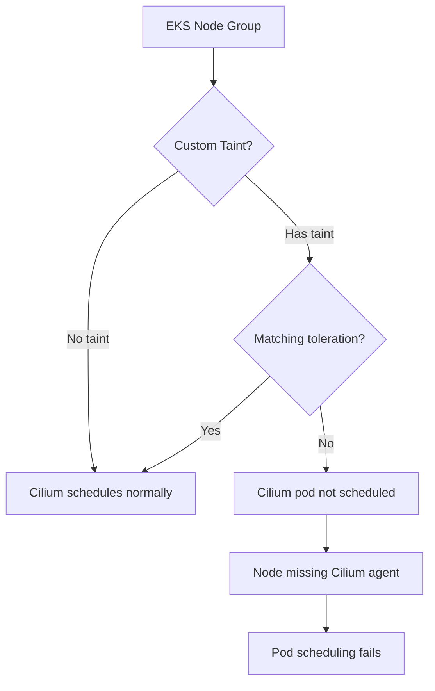

# How to Apply Tolerations to the Cilium EKS Add-On

Author: [nawazdhandala](https://github.com/nawazdhandala)

Tags: Cilium, Kubernetes, EKS, Toleration, AWS, Operation

Description: Configure custom tolerations for the Cilium EKS add-on to allow Cilium agents to schedule on tainted nodes including Windows nodes, GPU nodes, and spot instances.

---

## Introduction

Cilium deploys the Cilium agent as a DaemonSet on your EKS cluster. When you add specialized Linux node groups with taints-such as GPU nodes, spot instance groups, or dedicated infrastructure nodes-the Cilium DaemonSet needs matching tolerations to schedule on those nodes.

Without proper tolerations, Cilium agents won't run on tainted nodes, leaving those nodes without network policy enforcement and potentially causing CNI failures when pods try to schedule there.

## Prerequisites

- EKS cluster with Cilium installed
- Node groups with custom taints
- Helm and `kubectl` configured

## Understand the Problem

The default Cilium agent DaemonSet toleration is a single wildcard entry:

```yaml
tolerations:
  - operator: Exists
```

This tolerates all taints by default. However, if you customize tolerations (e.g., via Helm values), the defaults are replaced, which may cause Cilium to stop scheduling on some tainted nodes.

## View Current Cilium DaemonSet Tolerations

```bash
kubectl get ds -n kube-system cilium -o jsonpath='{.spec.template.spec.tolerations}' | jq .
```

## Architecture


```mermaid
flowchart TD
    A[EKS Node Group] --> B{Custom Taint?}
    B -->|No taint| C[Cilium schedules normally]
    B -->|Has taint| D{Matching toleration?}
    D -->|Yes| C
    D -->|No| E[Cilium pod not scheduled]
    E --> F[Node missing Cilium agent]
    F --> G[Pod scheduling fails]
```

## Add Tolerations via Helm Values

Cilium is not an Amazon EKS managed add-on for cloud nodes and is commonly installed via Helm. AWS supports Cilium for EKS Hybrid Nodes through AWS-maintained Helm charts. To apply tolerations with Helm, include the default wildcard toleration if you still want Cilium to tolerate all taints:

```bash
helm upgrade cilium cilium/cilium \
  --namespace kube-system \
  --reuse-values \
  --set tolerations[0].operator=Exists \
  --set tolerations[1].key=dedicated \
  --set tolerations[1].value=gpu \
  --set tolerations[1].effect=NoSchedule \
  --set tolerations[1].operator=Equal \
  --set tolerations[2].key=spot \
  --set tolerations[2].effect=NoSchedule \
  --set tolerations[2].operator=Exists
```

## Add Tolerations via Helm

If you want to replace the default wildcard toleration with a narrower set, specify every taint that Cilium must tolerate:

```bash
helm upgrade cilium cilium/cilium \
  --namespace kube-system \
  --reuse-values \
  --set tolerations[0].key=dedicated \
  --set tolerations[0].value=gpu \
  --set tolerations[0].effect=NoSchedule \
  --set tolerations[0].operator=Equal
```

## Verify Scheduling on Tainted Nodes

```bash
# Check which nodes have taints

kubectl get nodes -o custom-columns=NAME:.metadata.name,TAINTS:.spec.taints

# Verify Cilium is running on all nodes
kubectl get pods -n kube-system -l k8s-app=cilium -o wide
```

Every Linux node that Cilium manages should have a corresponding Cilium pod.

## Node Selector vs Tolerations

Tolerations allow scheduling on tainted nodes but don't require it. If you want Cilium on all managed Linux nodes including tainted ones, verify there is no `nodeSelector` restriction that excludes them:

```bash
kubectl get ds -n kube-system cilium \
  -o jsonpath='{.spec.template.spec.nodeSelector}'
```

## Conclusion

Applying tolerations to Cilium on EKS ensures that all managed Linux node types-GPU, spot, and custom tainted nodes-have the Cilium agent running. Missing Cilium agents on nodes can cause CNI failures for pods scheduled there and leaves those nodes without network policy enforcement.
