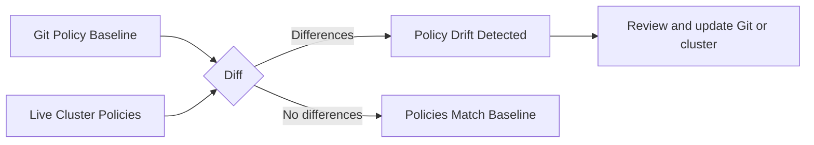

# Audit Calico NetworkPolicy Resources

Author: [nawazdhandala](https://github.com/nawazdhandala)

Tags: Calico, Kubernetes, Networking, NetworkPolicy, Security, Audit, Compliance

Description: A guide to auditing Calico NetworkPolicy resources for security compliance, policy drift detection, and ensuring all workloads have appropriate network segmentation.

---

## Introduction

Auditing Calico NetworkPolicy resources answers the question: "Is our network security posture as intended?" Over time, policies may drift from their intended state due to manual changes, upgrades, or emergency modifications. Workloads may be deployed without network policies, or policies may have been weakened to troubleshoot an issue and never restored.

A systematic audit identifies unprotected workloads, overly permissive rules, policy inconsistencies across environments, and compliance gaps for frameworks like SOC2, PCI-DSS, or internal security standards.

## Prerequisites

- `calicoctl` and `kubectl` with cluster admin access
- A defined security policy baseline for your environment
- Version control access (if policies are managed as code)

## Audit Check 1: Identify Pods Without Network Policy

Every production pod should have at least one NetworkPolicy:

```bash
#!/bin/bash
# find-unprotected-pods.sh
for ns in $(kubectl get namespaces -o name | cut -d/ -f2); do
  # Skip system namespaces
  [[ "$ns" =~ ^(kube-system|calico-system|monitoring)$ ]] && continue

  echo "=== Namespace: $ns ==="
  for pod in $(kubectl get pods -n $ns -o name | cut -d/ -f2); do
    labels=$(kubectl get pod $pod -n $ns -o jsonpath='{.metadata.labels}')
    # Check if any NetworkPolicy selects this pod
    policy_count=$(calicoctl get networkpolicies -n $ns -o json 2>/dev/null | \
      python3 -c "
import json, sys
data = json.load(sys.stdin)
# Simple check - does any policy exist for this namespace?
print(len(data.get('items', [])))
")
    if [ "$policy_count" = "0" ]; then
      echo "  UNPROTECTED: $pod (no policies in namespace)"
    fi
  done
done
```

## Audit Check 2: Identify Overly Permissive Rules

```bash
# Find policies that allow all traffic (overly broad)
calicoctl get networkpolicies -A -o json | python3 -c "
import json, sys
data = json.load(sys.stdin)
for policy in data.get('items', []):
    for rule in policy['spec'].get('ingress', []):
        if rule.get('action') == 'Allow' and 'source' not in rule:
            name = policy['metadata']['name']
            ns = policy['metadata']['namespace']
            print(f'WIDE OPEN: {ns}/{name} - ingress allow with no source restriction')
"
```

## Audit Check 3: Policy Drift Detection



```bash
# Export current policies to compare with Git baseline
calicoctl get networkpolicies -A -o yaml > current-policies.yaml
diff policies-baseline.yaml current-policies.yaml
```

## Audit Check 4: Compliance Checks

For PCI-DSS compliance, verify cardholder data environment (CDE) pods are isolated:

```bash
# Check CDE namespace policies
calicoctl get networkpolicies -n cde -o wide

# Verify no wildcard egress to non-approved destinations
calicoctl get networkpolicies -n cde -o json | python3 -c "
import json, sys
data = json.load(sys.stdin)
for p in data['items']:
    for rule in p['spec'].get('egress', []):
        if rule['action'] == 'Allow' and not rule.get('destination', {}).get('nets'):
            print(f'WARNING: {p[\"metadata\"][\"name\"]} has broad egress allow')
"
```

## Audit Check 5: Verify Default Deny Policies Exist

```bash
# Every production namespace should have a default-deny policy
for ns in $(kubectl get namespaces -l env=production -o name | cut -d/ -f2); do
  count=$(calicoctl get networkpolicies -n $ns | grep "default-deny" | wc -l)
  if [ "$count" = "0" ]; then
    echo "MISSING default-deny in namespace: $ns"
  fi
done
```

## Audit Report Template

```markdown
## Calico NetworkPolicy Audit Report - $(date)

### Summary
| Check | Result | Count |
|-------|--------|-------|
| Namespaces without policies | WARN | 3 |
| Overly permissive allow rules | WARN | 2 |
| Policy drift from baseline | WARN | 5 changes |
| Missing default-deny policies | FAIL | 1 |

### Findings
1. [HIGH] Namespace 'legacy-app' has no NetworkPolicy resources
2. [MEDIUM] Policy 'allow-all-ingress' in namespace 'staging' has no source restriction
3. [LOW] 5 policies differ from Git baseline (possible emergency changes)
```

## Conclusion

Regular Calico NetworkPolicy audits catch security gaps before they become incidents. The most critical checks are identifying unprotected workloads, finding overly permissive allow rules, and comparing live policies against a Git-managed baseline to detect drift. Automate these checks as part of a scheduled CI pipeline or security scanning workflow to maintain continuous visibility into your network security posture.
