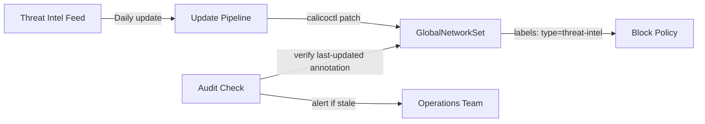

# Audit Calico NetworkSet Resources

Author: [nawazdhandala](https://github.com/nawazdhandala)

Tags: Calico, Kubernetes, Networking, NetworkSet, Security, Audit, Compliance

Description: A guide to auditing Calico NetworkSet resources for security compliance, ensuring IP lists are current, detecting stale entries, and verifying NetworkSets are correctly referenced by network policies.

---

## Introduction

Auditing Calico NetworkSet resources ensures that IP allowlists and blocklists remain accurate and operationally current. NetworkSets that reference outdated IP ranges can lead to two failure modes: blocking legitimate traffic (stale allowlist entries removed from service) or failing to block malicious traffic (blocklist entries not updated from threat intelligence feeds).

A NetworkSet audit verifies that all NetworkSets are referenced by active policies, that IP ranges are current and justified, and that automation pipelines maintaining dynamic IP lists are functioning correctly.

## Prerequisites

- `calicoctl` and `kubectl` with cluster admin access
- Access to the source of truth for IP lists (threat intelligence feeds, cloud provider IP range APIs, partner contact records)
- Version control access if NetworkSets are managed as code

## Audit Check 1: List All NetworkSets and GlobalNetworkSets

```bash
# List all namespace-scoped NetworkSets
calicoctl get networksets -A -o wide

# List all cluster-scoped GlobalNetworkSets
calicoctl get globalnetworksets -o wide

# Count totals
echo "NetworkSets: $(calicoctl get networksets -A -o json | python3 -c 'import json,sys; print(len(json.load(sys.stdin)["items"]))')"
echo "GlobalNetworkSets: $(calicoctl get globalnetworksets -o json | python3 -c 'import json,sys; print(len(json.load(sys.stdin)["items"]))')"
```

## Audit Check 2: Find Unreferenced NetworkSets

NetworkSets not referenced by any policy are dead configuration - they consume resources and create confusion:

```bash
#!/bin/bash
# find-unreferenced-networksets.sh
echo "=== Checking for unreferenced GlobalNetworkSets ==="

for ns_name in $(calicoctl get globalnetworksets -o json | python3 -c '
import json, sys
data = json.load(sys.stdin)
for item in data["items"]:
    for k, v in item["metadata"].get("labels", {}).items():
        print(f"{k}=={v}")
' | sort -u); do
  key=$(echo $ns_name | cut -d= -f1)
  val=$(echo $ns_name | cut -d= -f3)
  refs=$(calicoctl get globalnetworkpolicies -o json 2>/dev/null | \
    python3 -c "
import json, sys
data = json.load(sys.stdin)
count = 0
for p in data.get('items', []):
    spec = json.dumps(p.get('spec', {}))
    if '${key}' in spec and '${val}' in spec:
        count += 1
print(count)
")
  if [ "$refs" = "0" ]; then
    echo "UNREFERENCED label: $ns_name"
  fi
done
```

## Audit Check 3: Verify Threat Intelligence Blocklist Currency

```bash
# Check last-modified annotation on threat intel NetworkSets
calicoctl get globalnetworksets -o json | python3 -c "
import json, sys
from datetime import datetime, timezone
data = json.load(sys.stdin)
for item in data['items']:
    labels = item['metadata'].get('labels', {})
    if labels.get('type') == 'threat-intel':
        name = item['metadata']['name']
        annotations = item['metadata'].get('annotations', {})
        last_updated = annotations.get('last-updated', 'UNKNOWN')
        net_count = len(item['spec'].get('nets', []))
        print(f'{name}: {net_count} IPs, last updated: {last_updated}')
"
```



## Audit Check 4: Validate IP Range Accuracy

Check for obviously incorrect or suspicious entries:

```bash
calicoctl get globalnetworksets -o json | python3 -c "
import json, sys, ipaddress
data = json.load(sys.stdin)
for item in data['items']:
    name = item['metadata']['name']
    for net in item['spec'].get('nets', []):
        try:
            network = ipaddress.ip_network(net, strict=False)
            # Flag overly broad ranges
            if network.prefixlen < 8:
                print(f'WARNING: {name} contains very broad range: {net} (/{network.prefixlen})')
            # Flag RFC 1918 in a GlobalNetworkSet labeled for external use
            if network.is_private and 'external' in name.lower():
                print(f'SUSPICIOUS: {name} contains private IP in externally-labeled set: {net}')
        except ValueError as e:
            print(f'INVALID: {name} has malformed CIDR: {net} ({e})')
"
```

## Audit Check 5: Verify Policy-NetworkSet Label Alignment

```bash
# Extract all selector expressions from policies and verify corresponding NetworkSets have matching labels
calicoctl get globalnetworkpolicies -o json | python3 -c "
import json, sys, re
data = json.load(sys.stdin)
selectors = set()
for p in data.get('items', []):
    spec_str = json.dumps(p.get('spec', {}))
    # Find selector patterns in source/destination
    matches = re.findall(r'\"selector\": \"([^\"]+)\"', spec_str)
    selectors.update(matches)
print('Policy selectors referencing NetworkSets:')
for s in sorted(selectors):
    print(f'  {s}')
"
```

## Audit Report Template

```markdown
## Calico NetworkSet Audit Report - $(date)

### Summary
| Check | Status | Details |
|-------|--------|---------|
| Total NetworkSets | INFO | 12 namespace-scoped, 4 global |
| Unreferenced NetworkSets | WARN | 2 unreferenced |
| Stale threat intel feeds | FAIL | 1 not updated in 48h |
| Invalid CIDRs | PASS | None |
| Overly broad ranges | WARN | 1 range wider than /8 |

### Findings
1. [HIGH] GlobalNetworkSet 'threat-intel-blocklist' not updated in 72 hours
2. [MEDIUM] NetworkSet 'legacy-partners' in namespace 'integrations' unreferenced by any policy
3. [LOW] NetworkSet 'aws-s3-ranges' contains /7 supernet - verify intent
```

## Conclusion

NetworkSet audits focus on currency and relevance: are IP lists up to date, are all sets referenced by active policies, and do IP ranges match their stated purpose? Threat intelligence blocklists require the most frequent review - a blocklist that isn't updated is worse than no blocklist, as it creates false confidence. Automate currency checks by requiring a `last-updated` annotation on all NetworkSets and alerting when the timestamp exceeds the expected refresh interval.
