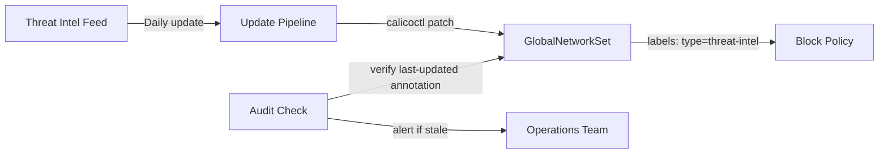

# Audit Calico NetworkSet Resources

Author: [nawazdhandala](https://github.com/nawazdhandala)

Tags: Calico, Kubernetes, Networking, NetworkSet, Security, Audit, Compliance

Description: A guide to auditing Calico NetworkSet resources for security compliance, ensuring IP lists are current, detecting stale entries, and verifying NetworkSets are correctly referenced by network policies.

---

## Introduction

Auditing Calico NetworkSet resources ensures that IP allowlists and blocklists remain accurate and operationally current. NetworkSets that reference outdated IP ranges can lead to two failure modes: blocking legitimate traffic (stale allowlist entries removed from service) or failing to block malicious traffic (blocklist entries not updated from threat intelligence feeds).

A NetworkSet audit verifies that all NetworkSets are referenced by active policies, that IP ranges are current and justified, and that automation pipelines maintaining dynamic IP lists are functioning correctly.

## Prerequisites

- `calicoctl` and `kubectl` with cluster admin access
- Access to the source of truth for IP lists (threat intelligence feeds, cloud provider IP range APIs, partner contact records)
- Version control access if NetworkSets are managed as code

## Audit Check 1: List All NetworkSets and GlobalNetworkSets

```bash
# List all namespace-scoped NetworkSets

calicoctl get networksets -A -o wide

# List all cluster-scoped GlobalNetworkSets
calicoctl get globalnetworksets -o wide

# Count totals
echo "NetworkSets: $(calicoctl get networksets -A -o json | python3 -c 'import json,sys; print(len(json.load(sys.stdin)["items"]))')"
echo "GlobalNetworkSets: $(calicoctl get globalnetworksets -o json | python3 -c 'import json,sys; print(len(json.load(sys.stdin)["items"]))')"
```

## Audit Check 2: Find Unreferenced NetworkSets

NetworkSets not referenced by any policy are dead configuration - they consume resources and create confusion. The example below checks GlobalNetworkSets against GlobalNetworkPolicies and NetworkPolicies that use `namespaceSelector: global()`:

```bash
#!/bin/bash
# find-unreferenced-networksets.sh
echo "=== Checking for unreferenced GlobalNetworkSets ==="

sets_json=$(mktemp)
gnp_json=$(mktemp)
np_json=$(mktemp)
trap 'rm -f "$sets_json" "$gnp_json" "$np_json"' EXIT

calicoctl get globalnetworksets -o json > "$sets_json"
calicoctl get globalnetworkpolicies -o json > "$gnp_json"
calicoctl get networkpolicies -A -o json > "$np_json"

python3 - "$sets_json" "$gnp_json" "$np_json" <<'PY'
import json, re, sys

sets = json.load(open(sys.argv[1])).get("items", [])
global_policies = json.load(open(sys.argv[2])).get("items", [])
network_policies = json.load(open(sys.argv[3])).get("items", [])

def entity_selectors(policy):
    spec = policy.get("spec", {})
    for direction in ("ingress", "egress"):
        for rule in spec.get(direction, []) or []:
            for side in ("source", "destination"):
                entity = rule.get(side, {}) or {}
                for field in ("selector", "notSelector"):
                    selector = entity.get(field)
                    if selector:
                        yield selector, entity.get("namespaceSelector", "")

def selector_matches_label(selector, key, value):
    key_re = re.escape(key)
    value_re = re.escape(value)
    quoted = rf"{key_re}\s*==\s*['\"]{value_re}['\"]"
    in_set = rf"{key_re}\s+in\s+\{{[^}}]*['\"]{value_re}['\"][^}}]*\}}"
    return re.search(quoted, selector) or re.search(in_set, selector)

def references_global_set(policy, labels, requires_global_namespace):
    for selector, namespace_selector in entity_selectors(policy):
        if requires_global_namespace and "global()" not in namespace_selector:
            continue
        if any(selector_matches_label(selector, k, v) for k, v in labels.items()):
            return True
    return False

for item in sets:
    name = item["metadata"]["name"]
    labels = item["metadata"].get("labels", {})
    if not labels:
        print(f"UNREFERENCED GlobalNetworkSet with no labels: {name}")
        continue
    refs = sum(
        references_global_set(policy, labels, requires_global_namespace=False)
        for policy in global_policies
    )
    refs += sum(
        references_global_set(policy, labels, requires_global_namespace=True)
        for policy in network_policies
    )
    if refs == 0:
        label_list = ", ".join(f"{k}={v}" for k, v in labels.items())
        print(f"UNREFERENCED GlobalNetworkSet: {name} ({label_list})")
PY
```

## Audit Check 3: Verify Threat Intelligence Blocklist Currency

```bash
# Check last-modified annotation on threat intel NetworkSets
calicoctl get globalnetworksets -o json | python3 -c "
import json, sys
from datetime import datetime, timezone
data = json.load(sys.stdin)
for item in data['items']:
    labels = item['metadata'].get('labels', {})
    if labels.get('type') == 'threat-intel':
        name = item['metadata']['name']
        annotations = item['metadata'].get('annotations', {})
        last_updated = annotations.get('last-updated', 'UNKNOWN')
        net_count = len(item['spec'].get('nets', []))
        print(f'{name}: {net_count} IPs, last updated: {last_updated}')
"
```


```mermaid
graph LR
    A[Threat Intel Feed] -->|Daily update| B[Update Pipeline]
    B -->|calicoctl patch| C[GlobalNetworkSet]
    C -->|labels: type=threat-intel| D[Block Policy]
    E[Audit Check] -->|verify last-updated annotation| C
    E -->|alert if stale| F[Operations Team]
```

## Audit Check 4: Validate IP Range Accuracy

Check for obviously incorrect or suspicious entries:

```bash
calicoctl get globalnetworksets -o json | python3 -c "
import json, sys, ipaddress
data = json.load(sys.stdin)
for item in data['items']:
    name = item['metadata']['name']
    for net in item['spec'].get('nets', []):
        try:
            network = ipaddress.ip_network(net, strict=False)
            # Flag overly broad ranges
            if network.prefixlen < 8:
                print(f'WARNING: {name} contains very broad range: {net} (/{network.prefixlen})')
            # Flag RFC 1918 in a GlobalNetworkSet labeled for external use
            if network.is_private and 'external' in name.lower():
                print(f'SUSPICIOUS: {name} contains private IP in externally-labeled set: {net}')
        except ValueError as e:
            print(f'INVALID: {name} has malformed CIDR: {net} ({e})')
"
```

## Audit Check 5: Verify Policy-NetworkSet Label Alignment

```bash
# Extract simple label selectors from GlobalNetworkPolicies and verify at least one
# GlobalNetworkSet has a matching label.
sets_json=$(mktemp)
policies_json=$(mktemp)
trap 'rm -f "$sets_json" "$policies_json"' EXIT

calicoctl get globalnetworksets -o json > "$sets_json"
calicoctl get globalnetworkpolicies -o json > "$policies_json"

python3 - "$sets_json" "$policies_json" <<'PY'
import json, re, sys

sets = json.load(open(sys.argv[1])).get("items", [])
policies = json.load(open(sys.argv[2])).get("items", [])

labels = {}
for item in sets:
    for key, value in item["metadata"].get("labels", {}).items():
        labels.setdefault((key, value), []).append(item["metadata"]["name"])

selector_re = re.compile(r"([\w./-]+)\s*==\s*['\"]([^'\"]+)['\"]")
for policy in policies:
    spec = policy.get("spec", {})
    for direction in ("ingress", "egress"):
        for rule in spec.get(direction, []) or []:
            for side in ("source", "destination"):
                selector = (rule.get(side, {}) or {}).get("selector", "")
                for key, value in selector_re.findall(selector):
                    matches = labels.get((key, value), [])
                    if matches:
                        print(f"OK: {key} == {value} matches {', '.join(matches)}")
                    else:
                        print(f"WARN: no GlobalNetworkSet has label {key}={value}")
PY
```

## Audit Report Template

```markdown
## Calico NetworkSet Audit Report - $(date)

### Summary
| Check | Status | Details |
|-------|--------|---------|
| Total NetworkSets | INFO | 12 namespace-scoped, 4 global |
| Unreferenced NetworkSets | WARN | 2 unreferenced |
| Stale threat intel feeds | FAIL | 1 not updated in 48h |
| Invalid CIDRs | PASS | None |
| Overly broad ranges | WARN | 1 range wider than /8 |

### Findings
1. [HIGH] GlobalNetworkSet 'threat-intel-blocklist' not updated in 72 hours
2. [MEDIUM] NetworkSet 'legacy-partners' in namespace 'integrations' unreferenced by any policy
3. [LOW] NetworkSet 'aws-s3-ranges' contains /7 supernet - verify intent
```

## Conclusion

NetworkSet audits focus on currency and relevance: are IP lists up to date, are all sets referenced by active policies, and do IP ranges match their stated purpose? Threat intelligence blocklists require the most frequent review - a blocklist that isn't updated is worse than no blocklist, as it creates false confidence. Automate currency checks by requiring a `last-updated` annotation on all NetworkSets and alerting when the timestamp exceeds the expected refresh interval.
