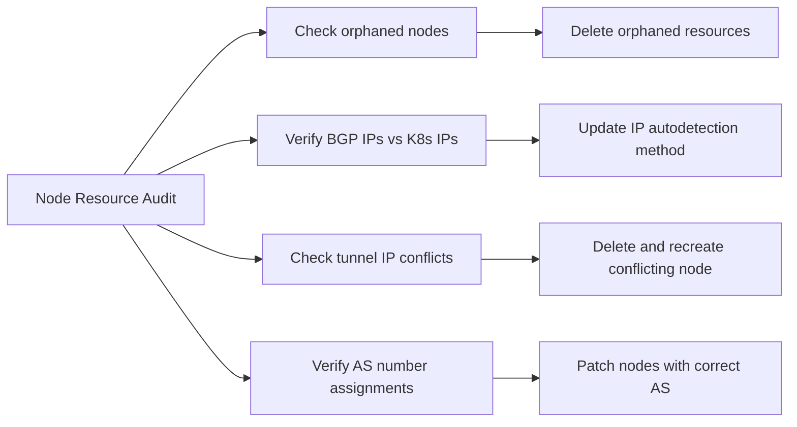

# Audit Calico Node Resources

Author: [nawazdhandala](https://github.com/nawazdhandala)

Tags: Calico, Kubernetes, Networking, Node, Audit, Compliance

Description: A guide to auditing Calico Node resources to detect stale entries, verify BGP configuration consistency, identify IP address conflicts, and ensure all active nodes have correct network identities.

---

## Introduction

Calico Node resource audits catch configuration drift and stale state that accumulates over time in dynamic clusters. Common audit findings include orphaned Node resources from decommissioned nodes, nodes with incorrect IP addresses from failed auto-detection, tunnel IP conflicts from nodes that were replaced without proper cleanup, and AS number inconsistencies in clusters with routing policies dependent on specific AS assignments.

Regular audits prevent these configuration artifacts from causing hard-to-diagnose connectivity issues.

## Prerequisites

- `calicoctl` and `kubectl` with cluster admin access
- Access to cluster topology documentation (expected AS numbers, interface naming conventions)

## Audit Check 1: Identify Orphaned Node Resources

```bash
#!/bin/bash
# find-orphaned-calico-nodes.sh
echo "=== Checking for orphaned Calico Node resources ==="

K8S_NODES=$(kubectl get nodes -o name | sed 's|node/||' | sort)
CALICO_NODES=$(calicoctl get nodes -o json | python3 -c '
import json, sys
for n in json.load(sys.stdin)["items"]:
    print(n["metadata"]["name"])
' | sort)

# Find Calico nodes with no corresponding Kubernetes node
while IFS= read -r calico_node; do
  if ! echo "$K8S_NODES" | grep -q "^${calico_node}$"; then
    echo "ORPHANED: Calico Node '$calico_node' has no matching Kubernetes node"
  fi
done <<< "$CALICO_NODES"
```

## Audit Check 2: Verify BGP IP Addresses Match Node Network

```bash
# Compare each node's Calico BGP IP with actual Kubernetes node internal IP
calicoctl get nodes -o json | python3 -c "
import json, sys, subprocess
data = json.load(sys.stdin)
for node in data['items']:
    name = node['metadata']['name']
    calico_ip = node['spec'].get('bgp', {}).get('ipv4Address', '').split('/')[0]

    # Get k8s internal IP
    result = subprocess.run(
        ['kubectl', 'get', 'node', name, '-o', 'jsonpath={.status.addresses[?(@.type==\"InternalIP\")].address}'],
        capture_output=True, text=True
    )
    k8s_ip = result.stdout.strip()

    if calico_ip != k8s_ip:
        print(f'MISMATCH: {name} - Calico BGP IP: {calico_ip}, K8s InternalIP: {k8s_ip}')
    else:
        print(f'OK: {name} - {calico_ip}')
"
```

## Audit Check 3: Detect Tunnel IP Conflicts

```bash
calicoctl get nodes -o json | python3 -c "
import json, sys
data = json.load(sys.stdin)
seen_ips = {}
for node in data['items']:
    name = node['metadata']['name']
    for field in ['ipv4VXLANTunnelAddr', 'ipv4IPIPTunnelAddr']:
        ip = node['spec'].get(field)
        if ip:
            if ip in seen_ips:
                print(f'CONFLICT: {field} {ip} shared by {name} and {seen_ips[ip]}')
            else:
                seen_ips[ip] = name
print(f'Total unique tunnel IPs: {len(seen_ips)}')
"
```



## Audit Check 4: Verify AS Number Assignments

```bash
# Check AS number consistency with expected topology
calicoctl get nodes -o json | python3 -c "
import json, sys
data = json.load(sys.stdin)
# Expected: control-plane nodes should have ASN 65001, workers 65002
for node in data['items']:
    name = node['metadata']['name']
    asn = node['spec'].get('bgp', {}).get('asNumber')
    if asn:
        print(f'{name}: AS {asn}')
    else:
        print(f'{name}: using global default AS')
"
```

## Audit Report Template

```markdown
## Calico Node Resource Audit - $(date)

### Summary
| Check | Status | Count |
|-------|--------|-------|
| Kubernetes nodes | INFO | 12 |
| Calico Node resources | INFO | 13 |
| Orphaned Calico nodes | FAIL | 1 |
| BGP IP mismatches | WARN | 0 |
| Tunnel IP conflicts | PASS | 0 |
| AS number anomalies | WARN | 2 |

### Findings
1. [HIGH] Calico Node 'decommissioned-worker-3' has no matching Kubernetes node
2. [LOW] 2 worker nodes using global default AS instead of expected AS 65002
```

## Conclusion

Node resource audits primarily target configuration drift: orphaned resources from incomplete node decommissioning, IP address mismatches from auto-detection changes, and tunnel IP conflicts from node replacement without cleanup. Schedule audits after any node scaling operation and as part of quarterly security reviews. Orphaned Node resources are harmless to BGP routing but can trigger false alerts in monitoring systems that count expected vs actual node entries.
