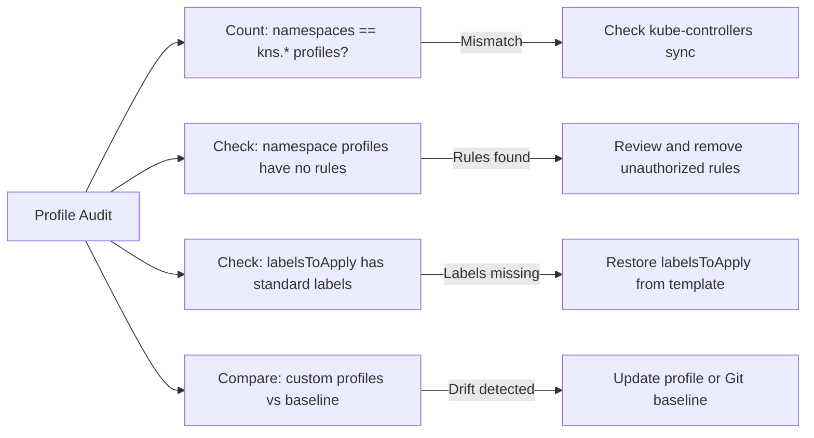

# Audit Calico Profile Resources

Author: [nawazdhandala](https://github.com/nawazdhandala)

Tags: Calico, Kubernetes, Networking, Profiles, Audit, Compliance

Description: A guide to auditing Calico Profile resources to detect unauthorized modifications, verify namespace label synchronization, identify profiles with overly permissive rules, and ensure profile...

---

## Introduction

Calico Profile audits in Kubernetes focus primarily on detecting unauthorized modifications to auto-generated namespace profiles. Because calico-kube-controllers generates and maintains namespace profiles, any manual change is either overwritten on the next sync or, if the sync is broken, represents untracked configuration drift. Either scenario is a compliance and security concern.

Beyond Kubernetes namespace profiles, audits should verify that custom profiles (used for non-Kubernetes workloads) match their intended specifications and that no profiles have accumulated overly permissive rules.

## Prerequisites

- `calicoctl` with cluster admin access
- Access to version control if profiles are managed as code
- Understanding of expected namespace label conventions

## Audit Check 1: Verify Profile Count Matches Namespace Count

```bash
#!/bin/bash
# Every namespace should have a corresponding kns.* profile
NS_COUNT=$(kubectl get namespaces --no-headers | wc -l)
PROFILE_COUNT=$(calicoctl get profiles | grep "^kns\." | wc -l)

echo "Kubernetes namespaces: $NS_COUNT"
echo "Calico namespace profiles: $PROFILE_COUNT"

if [ "$NS_COUNT" != "$PROFILE_COUNT" ]; then
  echo "WARNING: Mismatch detected"
  # Find missing profiles
  kubectl get namespaces -o name | sed 's|namespace/|kns.|' | while read profile; do
    if ! calicoctl get profile $profile &>/dev/null 2>&1; then
      echo "MISSING profile: $profile"
    fi
  done
fi
```

## Audit Check 2: Check for Manually Modified Namespace Profiles

```bash
# Namespace profiles should only contain labelsToApply with standard Kubernetes namespace labels
# Any ingress/egress rules in namespace profiles are suspicious unless intentionally set
calicoctl get profiles -o json | python3 -c "
import json, sys
data = json.load(sys.stdin)
for p in data['items']:
    name = p['metadata']['name']
    if not name.startswith('kns.'):
        continue
    spec = p.get('spec', {})
    # Flag profiles with ingress/egress rules (unusual for namespace profiles)
    if spec.get('ingress') or spec.get('egress'):
        print(f'MODIFIED: {name} has ingress/egress rules (may be unauthorized)')
    # Verify standard labels are present
    labels = spec.get('labelsToApply', {})
    if 'pcns.projectcalico.org/name' not in labels:
        print(f'MISSING LABEL: {name} missing pcns.projectcalico.org/name in labelsToApply')
"
```

## Audit Check 3: Verify Custom Profiles Match Baseline

```bash
# Export current custom (non-namespace) profiles
calicoctl get profiles -o json | python3 -c "
import json, sys
data = json.load(sys.stdin)
custom = [p for p in data['items'] if not p['metadata']['name'].startswith('kns.')]
print(json.dumps({'items': custom}, indent=2))
" > current-custom-profiles.yaml

# Compare with version-controlled baseline
diff profiles-baseline.yaml current-custom-profiles.yaml
```



## Audit Check 4: Verify Profile Assignments on Workload Endpoints

```bash
# Check that every workload endpoint has the correct namespace profile
calicoctl get workloadendpoints -A -o json | python3 -c "
import json, sys
data = json.load(sys.stdin)
for ep in data['items']:
    ns = ep['metadata']['namespace']
    name = ep['metadata']['name']
    profiles = ep['spec'].get('profiles', [])
    expected = f'kns.{ns}'
    if expected not in profiles:
        print(f'MISSING PROFILE: {ns}/{name} does not have {expected}')
"
```

## Audit Report Template

```markdown
## Calico Profile Audit Report - $(date)

### Summary
| Check | Status | Details |
|-------|--------|---------|
| Namespace profile count | PASS | 15 namespaces, 15 kns.* profiles |
| Unauthorized rule additions | WARN | 1 namespace profile with egress rules |
| Missing standard labels | PASS | All profiles have pcns labels |
| Custom profile drift | PASS | No changes from baseline |

### Findings
1. [MEDIUM] Profile 'kns.staging' has custom egress rule added outside automation
```

## Conclusion

Profile audits enforce that the namespace profile sync loop is healthy and that no profiles have been manually modified outside approved change processes. In Kubernetes, namespace profiles should be read-only artifacts managed by calico-kube-controllers - any modification is either unauthorized or indicates a broken sync loop. Custom profiles for non-Kubernetes workloads should be version-controlled and compared against baselines as part of regular security audits.
