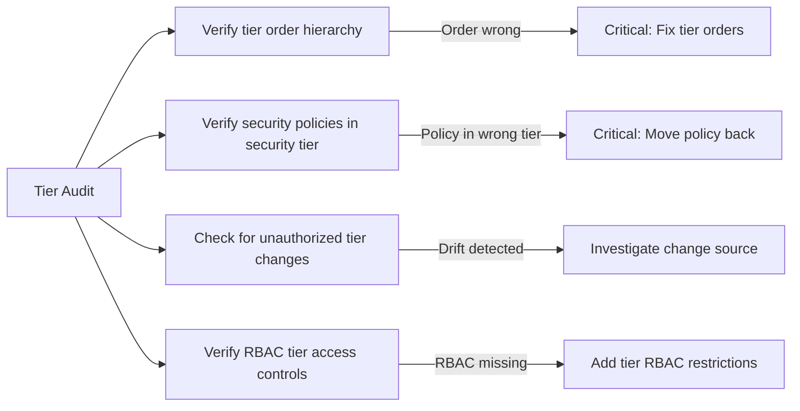

# Audit Calico Tier Resources

Author: [nawazdhandala](https://github.com/nawazdhandala)

Tags: Calico, Kubernetes, Networking, Tier, Audit, Compliance

Description: A guide to auditing Calico Tier resources to verify the security policy hierarchy is correctly ordered, policies are in their intended tiers, RBAC controls are enforced, and no policies have been...

---

## Introduction

Calico Tier audits verify the integrity of the policy governance model. The audit answers: Are tiers in the correct order? Are security-critical policies in the security tier and not in lower-priority tiers? Has any policy been moved from a high-priority tier to a lower one (intentionally or accidentally)? And does RBAC prevent unauthorized tier manipulation?

A compromised tier hierarchy - where security policies are moved to lower-priority tiers - is equivalent to disabling those security controls, since application-tier Allow policies would take precedence.

## Prerequisites

- `calicoctl` with cluster admin access
- Version control access for policy baselines
- Documentation of expected tier hierarchy and ownership

## Audit Check 1: Verify Tier Order Hierarchy

```bash
# Verify tier orders match the documented security hierarchy
calicoctl get tiers -o json | python3 -c "
import json, sys
data = json.load(sys.stdin)
tiers = sorted(data['items'], key=lambda t: t['spec'].get('order', 9999))
expected = {'security': 100, 'platform': 500, 'default': 1000}
print('=== Tier Order Audit ===')
for tier in tiers:
    name = tier['metadata']['name']
    actual_order = tier['spec'].get('order', 'N/A')
    expected_order = expected.get(name, 'custom')
    status = 'OK' if str(actual_order) == str(expected_order) else f'UNEXPECTED (expected {expected_order})'
    print(f'{name}: order={actual_order} [{status}]')
"
```

## Audit Check 2: Verify Security Policies Remain in Security Tier

```bash
# Check that critical security policies haven't been moved to lower-priority tiers
calicoctl get globalnetworkpolicies -o json | python3 -c "
import json, sys
data = json.load(sys.stdin)
# Policies that MUST be in the security tier
required_in_security = ['security.block-threat-intel', 'security.allow-security-tooling']
for p in data['items']:
    name = p['metadata']['name']
    if any(name.endswith(req.split('.')[1]) for req in required_in_security):
        tier = p['spec'].get('tier', 'default')
        if tier != 'security':
            print(f'CRITICAL: {name} is in tier={tier}, expected tier=security')
        else:
            print(f'OK: {name} is in tier=security')
"
```

## Audit Check 3: Detect Unauthorized Tier Modifications

```bash
# Compare current tiers against version-controlled baseline
calicoctl get tiers -o yaml > current-tiers.yaml
diff tiers-baseline.yaml current-tiers.yaml

# Any changes to tier order values are high-severity findings
```



## Audit Check 4: Verify RBAC Prevents Unauthorized Tier Access

```bash
#!/bin/bash
# Check that non-security-team service accounts cannot modify security tier policies
echo "=== RBAC Tier Access Audit ==="

# Get all service accounts in application namespaces
for sa in $(kubectl get serviceaccounts -A -o json | python3 -c '
import json, sys
for sa in json.load(sys.stdin)["items"]:
    ns = sa["metadata"]["namespace"]
    name = sa["metadata"]["name"]
    if ns not in ["kube-system", "calico-system", "monitoring"]:
        print(f"system:serviceaccount:{ns}:{name}")
'); do
  can_modify=$(kubectl auth can-i create globalnetworkpolicies.crd.projectcalico.org \
    --as=$sa 2>/dev/null)
  if [ "$can_modify" = "yes" ]; then
    echo "WARNING: $sa can create GlobalNetworkPolicies (including security tier)"
  fi
done
```

## Audit Report Template

```markdown
## Calico Tier Audit Report - $(date)

### Summary
| Check | Status | Details |
|-------|--------|---------|
| Tier order hierarchy | PASS | security=100, platform=500, default=1000 |
| Security policies in security tier | PASS | All 3 required policies in security tier |
| Tier configuration drift | WARN | platform tier order changed from 500 to 400 |
| RBAC unauthorized access | PASS | No app service accounts can modify policies |

### Findings
1. [MEDIUM] platform tier order changed from 500 to 400 - investigate if intentional
```

## Conclusion

Tier audits are high-value security controls because a misconfigured tier hierarchy silently undermines all policies in affected tiers. The most critical checks are verifying tier order (security must evaluate before default) and verifying that security-critical policies remain in the security tier. Treat any unauthorized modification to tier order or security tier policies as a security incident requiring immediate investigation.
