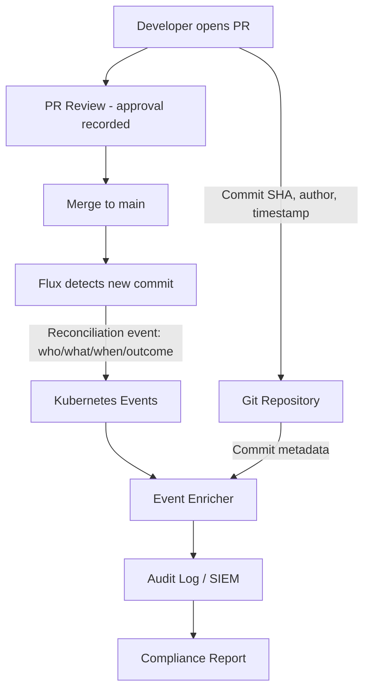

# How to Create Audit Trail for All Deployments with Flux CD

Author: [nawazdhandala](https://github.com/nawazdhandala)

Tags: Flux CD, GitOps, Kubernetes, Audit Trail, Compliance, Logging, Events

Description: Use Git history and Flux CD events together to create a complete, tamper-evident deployment audit trail that satisfies compliance requirements for change traceability.

---

## Introduction

An audit trail for deployments must answer four questions: what changed, when it changed, who authorized the change, and what was the outcome. In a GitOps workflow with Flux CD, these questions have clear answers: what changed is in the Git diff, when it changed is in the commit timestamp, who authorized it is in the PR approval record, and the outcome is in the Flux reconciliation events.

The challenge is collecting and retaining this information in a form that auditors can query. Git history provides the change and authorization record, but Flux events - which record reconciliation outcomes - live in Kubernetes and are ephemeral by default. To create a complete audit trail you need to export Flux events to a persistent storage system that retains them for the required period.

This guide shows how to export Flux events, combine them with Git history to create deployment records, and query the combined audit trail for compliance evidence.

## Prerequisites

- Flux CD bootstrapped on Kubernetes
- A log aggregation system (Elasticsearch, Loki, or a SIEM)
- Git repository with protected branches and PR review history
- `flux` CLI and `kubectl` installed

## Step 1: Configure Flux Event Alerting to a Persistent Store

Flux emits Kubernetes Events and also sends notifications via its alerting system. Configure a webhook to forward all events to your log aggregation system:

```yaml
# clusters/production/monitoring/audit-provider.yaml
apiVersion: notification.toolkit.fluxcd.io/v1
kind: Provider
metadata:
  name: audit-log
  namespace: flux-system
spec:
  type: generic        # Generic webhook - compatible with any HTTP endpoint
  address: https://log-ingestion.example.com/flux-events
  secretRef:
    name: audit-webhook-secret
---
# clusters/production/monitoring/audit-alert.yaml
apiVersion: notification.toolkit.fluxcd.io/v1
kind: Alert
metadata:
  name: deployment-audit-trail
  namespace: flux-system
spec:
  summary: "Deployment event"
  providerRef:
    name: audit-log
  # Capture both successes and failures for a complete trail
  eventSeverity: info
  eventSources:
    - kind: Kustomization    # All Kustomization reconciliation events
    - kind: HelmRelease      # All HelmRelease reconciliation events
    - kind: GitRepository    # Source fetch events
```

Each event sent by Flux includes:
- `involvedObject.name` - which Kustomization or HelmRelease changed
- `reason` - ReconciliationSucceeded, ReconciliationFailed, etc.
- `message` - what revision was applied
- `lastTimestamp` - when it happened

## Step 2: Enrich Events with Git Commit Metadata

Flux events include the Git commit SHA in the message. Use a Lambda function, Logstash pipeline, or similar to enrich events with the full commit metadata from the Git API:

```yaml
# infrastructure/audit/event-enricher.yaml
apiVersion: apps/v1
kind: Deployment
metadata:
  name: flux-event-enricher
  namespace: flux-system
spec:
  replicas: 1
  selector:
    matchLabels:
      app: flux-event-enricher
  template:
    metadata:
      labels:
        app: flux-event-enricher
    spec:
      containers:
        - name: enricher
          image: my-registry/flux-event-enricher:1.0.0
          env:
            - name: GITHUB_TOKEN
              valueFrom:
                secretKeyRef:
                  name: github-token
                  key: token
            - name: GITHUB_REPO
              value: "your-org/fleet-infra"
            - name: ELASTICSEARCH_URL
              value: "http://elasticsearch.logging:9200"
          resources:
            requests:
              cpu: 50m
              memory: 64Mi
            limits:
              cpu: 200m
              memory: 256Mi
```

The enricher reads Flux events, extracts the commit SHA from the message, calls the GitHub API to get commit details (author, PR number, reviewers), and writes an enriched record to Elasticsearch.

## Step 3: Query the Audit Trail

With events in Elasticsearch (or Loki), query for deployment history:

```bash
# Using Elasticsearch query DSL (via curl)
curl -X GET "http://elasticsearch.logging:9200/flux-events-*/_search" \
  -H 'Content-Type: application/json' \
  -d '{
    "query": {
      "bool": {
        "filter": [
          {"term": {"involvedObject.kind": "Kustomization"}},
          {"term": {"reason": "ReconciliationSucceeded"}},
          {"range": {"lastTimestamp": {"gte": "2026-03-01", "lte": "2026-03-31"}}}
        ]
      }
    },
    "sort": [{"lastTimestamp": "desc"}],
    "_source": ["lastTimestamp", "involvedObject.name", "message", "git.author", "git.pr_number"]
  }'
```

For a quick audit trail from the Kubernetes API (ephemeral but useful for recent events):

```bash
# View all reconciliation events from the past 24 hours
kubectl get events -n flux-system \
  --sort-by='.lastTimestamp' \
  --field-selector reason=ReconciliationSucceeded \
  | grep -v "^LAST"

# Combined Flux event list across all resource types
flux events --all-namespaces
```

## Step 4: Generate a Deployment Audit Report

Combine Git history with Flux events to produce a human-readable audit report:

```bash
#!/bin/bash
# scripts/deployment-audit-report.sh
# Generates a deployment audit report for a date range

START_DATE=${1:-"30 days ago"}
END_DATE=${2:-"now"}

echo "# Deployment Audit Report"
echo "Period: $START_DATE to $END_DATE"
echo "Generated: $(date -u)"
echo ""

echo "## Deployments (from Git merge history)"
echo "| Date | Author | Change | Commit SHA |"
echo "|------|--------|--------|------------|"

git log --merges \
  --pretty=format:"| %ad | %an | %s | [%H](...) |" \
  --date=short \
  --since="$START_DATE" \
  --until="$END_DATE" \
  -- apps/ clusters/

echo ""
echo "## Flux Reconciliation Events (last 24h from cluster)"
kubectl get events -n flux-system \
  --sort-by='.lastTimestamp' \
  | grep -E "Reconciliation(Succeeded|Failed)"
```

## Step 5: Implement Tamper Detection

Flux's Git-based model provides tamper detection: if someone modifies the cluster directly (bypassing Flux), Flux detects drift on the next reconciliation and either corrects it (if `prune: true`) or alerts on it:

```yaml
# clusters/production/apps/my-app.yaml
apiVersion: kustomize.toolkit.fluxcd.io/v1
kind: Kustomization
metadata:
  name: my-app
  namespace: flux-system
spec:
  interval: 5m         # Check every 5 minutes for drift
  prune: true          # Remove unauthorized resources automatically
  sourceRef:
    kind: GitRepository
    name: flux-system
  path: ./apps/production
```

```yaml
# Alert when Flux detects and corrects drift
apiVersion: notification.toolkit.fluxcd.io/v1
kind: Alert
metadata:
  name: drift-correction-alert
  namespace: flux-system
spec:
  summary: "AUDIT: Unauthorized change detected and corrected by Flux"
  providerRef:
    name: audit-log
  eventSeverity: warning
  eventSources:
    - kind: Kustomization
  inclusionList:
    - ".*pruned.*"      # Flux pruned an unauthorized resource
```

## Step 6: Visualize the Audit Trail



## Best Practices

- Set Kubernetes event retention to a long TTL using `--event-ttl` flag on the API server, or export events immediately - they expire in 1 hour by default.
- Retain the exported event log for at least as long as your compliance framework requires (typically 1-7 years).
- Include the Flux event SHA (the reconciled revision) in your audit records - this allows you to reconstruct exactly what was running at any point in time.
- Test your audit trail completeness quarterly by selecting a random past deployment and verifying you can reconstruct the full change record (what, when, who, outcome).
- Use Git tags to mark significant baselines (quarterly releases, security patches) so they are easy to find in audit queries.

## Conclusion

A complete deployment audit trail for Flux CD requires two sources: Git history (for authorization and change records) and Flux events (for reconciliation outcomes). By exporting Flux events to a persistent store, enriching them with Git commit metadata, and combining both sources into a unified query interface, you can answer every question an auditor might ask about any deployment that has ever occurred in your cluster - with evidence derived entirely from your normal GitOps workflow.
