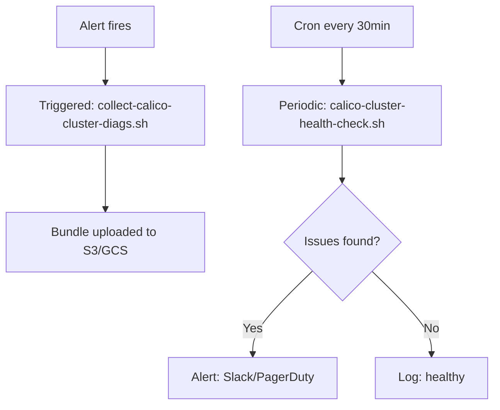

# How to Automate Calico Cluster Diagnostics

Author: [nawazdhandala](https://github.com/nawazdhandala)

Tags: Calico, Kubernetes, Networking, Diagnostics, Automation

Description: Automate Calico cluster-wide diagnostic collection including TigeraStatus snapshots, IPAM consistency checks, and comprehensive calicoctl cluster diags bundles for incident response and periodic health verification.

---

## Introduction

Automating cluster-wide Calico diagnostics ensures that when incidents occur, comprehensive cluster state is captured in the first few minutes rather than after manual investigation. Two key automation patterns are: triggered diagnostics (run when an alert fires) and scheduled snapshots (run periodically to capture baseline state for trend analysis).

## Automated Cluster Diagnostic Bundle

```bash
#!/bin/bash
# collect-calico-cluster-diags.sh
set -euo pipefail
BUNDLE="calico-cluster-$(date +%Y%m%d-%H%M%S)"
mkdir -p "${BUNDLE}"

# Operator state
kubectl get tigerastatus -o yaml > "${BUNDLE}/tigerastatus.yaml"
kubectl get installation -o yaml > "${BUNDLE}/installation.yaml"
kubectl get pods -n calico-system -o wide > "${BUNDLE}/calico-pods.txt"
kubectl get pods -n tigera-operator > "${BUNDLE}/tigera-operator-pods.txt"

# Calico CRD state
for resource in felixconfiguration bgpconfiguration bgppeer \
                globalnetworkpolicy networkpolicy ippool ipreservation; do
  calicoctl get "${resource}" -o yaml \
    > "${BUNDLE}/${resource}.yaml" 2>/dev/null || true
done

# IPAM state
calicoctl ipam show --show-blocks > "${BUNDLE}/ipam-blocks.txt" 2>/dev/null || true
calicoctl ipam check > "${BUNDLE}/ipam-check.txt" 2>/dev/null || true

# Component logs
kubectl logs -n calico-system -l app=calico-node \
  -c calico-node --tail=200 --prefix=true > "${BUNDLE}/calico-node.log"
kubectl logs -n calico-system -l app=calico-typha \
  --tail=200 --prefix=true > "${BUNDLE}/calico-typha.log"
kubectl logs -n calico-system -l app=calico-kube-controllers \
  --tail=100 > "${BUNDLE}/calico-kube-controllers.log"
kubectl logs -n tigera-operator -l app=tigera-operator \
  --tail=100 > "${BUNDLE}/tigera-operator.log"

tar -czf "${BUNDLE}.tar.gz" "${BUNDLE}/"
echo "Cluster diagnostic bundle: ${BUNDLE}.tar.gz"
```

## Periodic Cluster Health Check

```bash
#!/bin/bash
# calico-cluster-health-check.sh
EXIT_CODE=0

# Check TigeraStatus
NOT_AVAILABLE=$(kubectl get tigerastatus --no-headers 2>/dev/null | \
  awk '$2 != "True"' | wc -l)
echo "TigeraStatus degraded components: ${NOT_AVAILABLE}"
[ "${NOT_AVAILABLE}" -gt 0 ] && EXIT_CODE=$((EXIT_CODE + 1))

# Check IPAM consistency
calicoctl ipam check > /tmp/ipam-check.txt 2>&1
IPAM_ISSUES=$(grep -c "inconsistency" /tmp/ipam-check.txt || echo 0)
echo "IPAM inconsistencies: ${IPAM_ISSUES}"
[ "${IPAM_ISSUES}" -gt 0 ] && EXIT_CODE=$((EXIT_CODE + 1))

# Check calico-system pod health
NOT_RUNNING=$(kubectl get pods -n calico-system --no-headers | \
  grep -cv "Running" || echo 0)
echo "Non-running calico-system pods: ${NOT_RUNNING}"
[ "${NOT_RUNNING}" -gt 0 ] && EXIT_CODE=$((EXIT_CODE + 1))

exit ${EXIT_CODE}
```

## Automation Architecture



## Conclusion

Automating cluster diagnostic collection reduces the time between alert and actionable data from 15 minutes to under 2 minutes. The triggered bundle script captures point-in-time state that changes after remediation starts, making it critical to run as the first automated action when an alert fires. The periodic health check catches degraded TigeraStatus and IPAM inconsistencies before they become P1 incidents.
