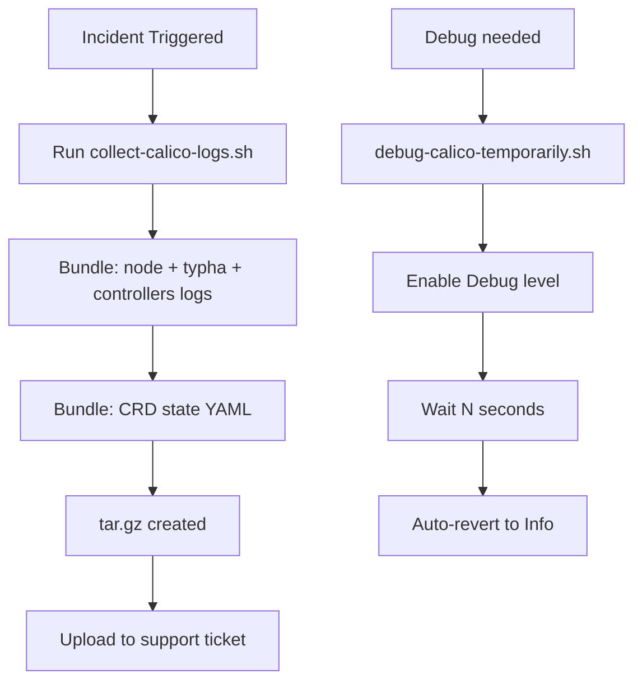

# How to Automate Calico Component Log Collection

Author: [nawazdhandala](https://github.com/nawazdhandala)

Tags: Calico, Kubernetes, Networking, Logging, Automation

Description: Automate Calico log collection with scripts that gather component logs across all nodes, package them for support tickets, and enable temporary debug logging with automatic reversion.

---

## Introduction

Automating Calico log collection ensures consistent diagnostic data across all nodes without manual effort. Two key automation scenarios are: collecting a point-in-time log bundle for support tickets, and temporarily enabling debug logging for a specific component with automatic reversion to Info level after a timeout.

## Automated Log Bundle Collection

```bash
#!/bin/bash
# collect-calico-logs.sh
set -euo pipefail

BUNDLE_DIR="calico-logs-$(date +%Y%m%d-%H%M%S)"
mkdir -p "${BUNDLE_DIR}"

echo "Collecting Calico component logs..."

# calico-node logs from all nodes
kubectl logs -n calico-system -l app=calico-node -c calico-node \
  --tail=1000 --prefix=true > "${BUNDLE_DIR}/calico-node.log"

# calico-typha logs
kubectl logs -n calico-system -l app=calico-typha \
  --tail=500 --prefix=true > "${BUNDLE_DIR}/calico-typha.log"

# calico-kube-controllers logs
kubectl logs -n calico-system -l app=calico-kube-controllers \
  --tail=500 --prefix=true > "${BUNDLE_DIR}/calico-kube-controllers.log"

# calico-apiserver logs (if Enterprise/EE)
kubectl logs -n calico-system -l app=calico-apiserver \
  --tail=500 --prefix=true > "${BUNDLE_DIR}/calico-apiserver.log" 2>/dev/null || true

# Calico resource state
kubectl get tigerastatus -o yaml > "${BUNDLE_DIR}/tigerastatus.yaml"
kubectl get installation default -o yaml > "${BUNDLE_DIR}/installation.yaml"
kubectl get felixconfiguration -o yaml > "${BUNDLE_DIR}/felixconfiguration.yaml"

tar -czf "${BUNDLE_DIR}.tar.gz" "${BUNDLE_DIR}/"
echo "Log bundle: ${BUNDLE_DIR}.tar.gz"
```

## Temporary Debug Logging with Auto-Reversion

```bash
#!/bin/bash
# debug-calico-temporarily.sh
# Enable debug logging for N seconds, then revert to Info

DURATION="${1:-120}"  # Default 2 minutes

echo "Enabling Calico debug logging for ${DURATION} seconds..."
kubectl patch felixconfiguration default \
  --type=merge -p '{"spec":{"logSeverityScreen":"Debug"}}'

# Wait for the specified duration
sleep "${DURATION}"

echo "Reverting to Info log level..."
kubectl patch felixconfiguration default \
  --type=merge -p '{"spec":{"logSeverityScreen":"Info"}}'

echo "Debug logging session complete."
```

## Automation Architecture



## CronJob for Periodic Log Archival

```yaml
apiVersion: batch/v1
kind: CronJob
metadata:
  name: calico-log-archiver
  namespace: calico-system
spec:
  schedule: "0 * * * *"  # Hourly
  jobTemplate:
    spec:
      template:
        spec:
          serviceAccountName: calico-log-collector
          containers:
            - name: log-archiver
              image: bitnami/kubectl:latest
              command:
                - /bin/sh
                - -c
                - |
                  kubectl logs -n calico-system -l app=calico-node \
                    -c calico-node --tail=500 --prefix=true \
                    > /archive/calico-node-$(date +%Y%m%d%H).log
              volumeMounts:
                - name: archive
                  mountPath: /archive
          restartPolicy: OnFailure
          volumes:
            - name: archive
              persistentVolumeClaim:
                claimName: calico-log-archive
```

## Conclusion

Automating Calico log collection with the bundle script ensures that every support ticket includes the same consistent set of logs and CRD state. The temporary debug script with auto-reversion prevents engineers from forgetting to revert log levels after troubleshooting — a common cause of log pipeline saturation. For long-term operational maturity, the CronJob approach maintains a rolling hourly archive that lets you review Calico behavior up to 24 hours before an incident.
