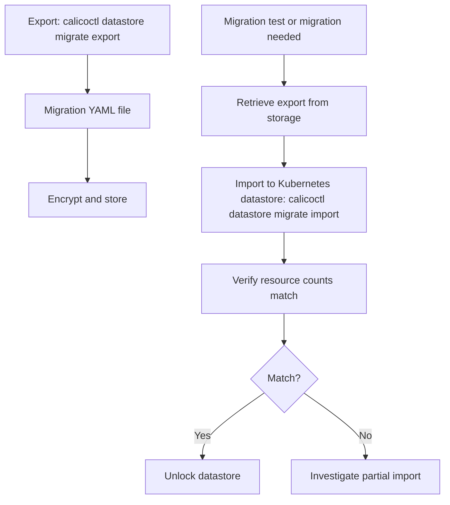

# How to Automate Calico Datastore Export and Import

Author: [nawazdhandala](https://github.com/nawazdhandala)

Tags: Calico, Kubernetes, Networking, Operation

Description: Automate Calico datastore exports with scheduled backup CronJobs, versioned backup storage, and automated import testing to ensure backup integrity.

---

## Introduction

For clusters that still use a Calico etcdv3 datastore, automating datastore migration exports ensures a regular capture cadence without manual intervention. A weekly export CronJob with versioned storage in S3 or GCS provides the migration data foundation, while a monthly automated import test into a Kubernetes-datastore staging environment validates that the exported data is actually importable. The `calicoctl datastore migrate` subcommands are for etcdv3-to-Kubernetes datastore migration, not a generic Kubernetes-datastore backup and restore mechanism.

## Key Commands

```bash
# Export Calico etcdv3 datastore for migration

BACKUP_FILE="calico-backup-$(date +%Y%m%d).yaml"
calicoctl datastore migrate export > "$BACKUP_FILE"

# Verify export content
echo "Resources in backup: $(grep -c '^kind:' "$BACKUP_FILE")"
grep "^kind:" "$BACKUP_FILE" | sort | uniq -c

# Lock source datastore before migration
calicoctl datastore migrate lock

# Import to destination Kubernetes datastore
calicoctl datastore migrate import -f "$BACKUP_FILE"

# Verify import before unlocking
calicoctl get felixconfiguration
calicoctl get globalnetworkpolicy | wc -l

# Unlock destination datastore after migration verification
calicoctl datastore migrate unlock
```

## Operation Flow



## Operational Checklist

```markdown
Before export:
[ ] Confirm source datastore connectivity
[ ] Confirm source kubeconfig or etcd credentials
[ ] Verify sufficient disk space for export file
[ ] Note current resource counts for post-export verification

After import, before unlocking:
[ ] Compare resource counts: source vs destination
[ ] Verify Calico components are operational
[ ] Test pod connectivity (cross-namespace, cross-node)
[ ] Verify network policies are being enforced
```

## Conclusion

Calico datastore migration export and import operations require careful verification at both ends: confirm resource counts before and after, verify connectivity and policy enforcement after import, and store exports encrypted in access-controlled storage. Regular automated exports with monthly import testing ensure that datastore migration is not just theoretically possible but practically verified.
