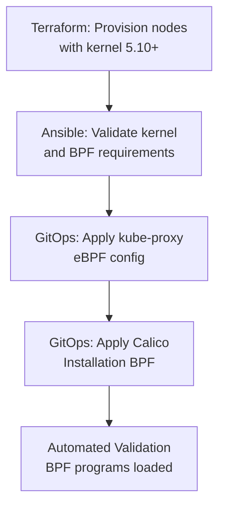

# How to Automate Calico eBPF Mode

Author: [nawazdhandala](https://github.com/nawazdhandala)

Tags: Calico, Kubernetes, Networking, eBPF, Automation, GitOps

Description: Automate Calico eBPF mode enablement across multiple clusters using Infrastructure as Code, node bootstrapping scripts, and GitOps delivery.

---

## Introduction

Automating Calico eBPF mode enablement across multiple clusters requires handling both infrastructure concerns (kernel version requirements, kube-proxy configuration) and Kubernetes configuration (Installation CR, FelixConfiguration). Manual enablement across many clusters is error-prone and doesn't scale.

The automation strategy combines node provisioning (ensuring the right kernel version), cluster bootstrapping (kube-proxy configuration), and GitOps delivery (Installation and FelixConfiguration changes). By automating each layer independently, you ensure eBPF mode is consistently enabled across all target clusters.

## Prerequisites

- Calico v3.20+ with Tigera Operator
- Nodes with kernel 5.3+ (ideally 5.10+)
- Terraform or similar for infrastructure
- Flux CD or ArgoCD for GitOps

## Automation Architecture



## Infrastructure Automation: Node Kernel Version

```hcl
# terraform/modules/k8s-node/variables.tf
variable "node_ami" {
  description = "AMI with kernel 5.10+ for eBPF support"
  # Ubuntu 22.04 LTS: kernel 5.15 (meets eBPF requirements)
  default = "ami-0123456789abcdef0"
}

# User data to verify eBPF support on boot
resource "aws_launch_template" "ebpf_node" {
  user_data = base64encode(<<-EOF
    #!/bin/bash
    # Verify BPF filesystem is mounted
    if ! mount | grep -q 'bpffs'; then
      mount -t bpf bpffs /sys/fs/bpf
      echo 'bpffs /sys/fs/bpf bpf defaults 0 0' >> /etc/fstab
    fi

    # Verify kernel version meets minimum
    KERNEL_MAJOR=$(uname -r | cut -d. -f1)
    KERNEL_MINOR=$(uname -r | cut -d. -f2)
    if [[ "${KERNEL_MAJOR}" -lt 5 ]] || \
       ([[ "${KERNEL_MAJOR}" -eq 5 ]] && [[ "${KERNEL_MINOR}" -lt 3 ]]); then
      echo "ERROR: Kernel $(uname -r) does not support Calico eBPF"
      exit 1
    fi
    echo "Kernel $(uname -r) supports Calico eBPF mode"
  EOF
  )
}
```

## GitOps Configuration for eBPF

```yaml
# gitops/clusters/production/calico/kube-proxy-config.yaml
# Disable kube-proxy (Calico eBPF handles service routing)
apiVersion: apps/v1
kind: DaemonSet
metadata:
  name: kube-proxy
  namespace: kube-system
spec:
  template:
    spec:
      nodeSelector:
        # This selector ensures no nodes match, effectively disabling kube-proxy
        non-calico-ebpf: "true"
```

```yaml
# gitops/clusters/production/calico/installation.yaml
apiVersion: operator.tigera.io/v1
kind: Installation
metadata:
  name: default
spec:
  calicoNetwork:
    linuxDataplane: BPF
    hostPorts: Disabled
    ipPools:
      - cidr: 192.168.0.0/16
        encapsulation: VXLAN
```

```yaml
# gitops/clusters/production/calico/k8s-api-configmap.yaml
apiVersion: v1
kind: ConfigMap
metadata:
  name: kubernetes-services-endpoint
  namespace: tigera-operator
data:
  KUBERNETES_SERVICE_HOST: "${CLUSTER_API_IP}"
  KUBERNETES_SERVICE_PORT: "6443"
```

## Automated eBPF Enablement Script

```bash
#!/bin/bash
# enable-calico-ebpf.sh
set -euo pipefail

CLUSTER="${1:?Provide cluster context}"
API_SERVER_IP="${2:?Provide API server IP}"
CALICO_CIDR="${3:-192.168.0.0/16}"

log() { echo "[$(date +%H:%M:%S)] $*"; }

# Switch to target cluster
kubectl config use-context "${CLUSTER}"

# Pre-flight: Check kernel versions
log "Checking kernel versions..."
KERNEL_FAILURES=0
for node in $(kubectl get nodes -o jsonpath='{.items[*].metadata.name}'); do
  kernel_major=$(kubectl debug node/${node} --image=alpine -it --quiet -- \
    sh -c 'uname -r | cut -d. -f1' 2>/dev/null | tr -d '\r')
  if [[ "${kernel_major}" -lt 5 ]]; then
    log "FAIL: Node ${node} kernel version too old"
    KERNEL_FAILURES=$((KERNEL_FAILURES + 1))
  fi
done
[[ "${KERNEL_FAILURES}" -eq 0 ]] || { log "Kernel check failed. Aborting."; exit 1; }

# Disable kube-proxy
log "Disabling kube-proxy..."
kubectl patch ds kube-proxy -n kube-system \
  -p '{"spec":{"template":{"spec":{"nodeSelector":{"non-calico-ebpf":"true"}}}}}'

# Configure API server endpoint
log "Configuring direct API server access..."
kubectl apply -f - <<EOF
apiVersion: v1
kind: ConfigMap
metadata:
  name: kubernetes-services-endpoint
  namespace: tigera-operator
data:
  KUBERNETES_SERVICE_HOST: "${API_SERVER_IP}"
  KUBERNETES_SERVICE_PORT: "6443"
EOF

# Enable eBPF
log "Enabling eBPF data plane..."
kubectl patch installation default --type=merge -p '{
  "spec": {
    "calicoNetwork": {
      "linuxDataplane": "BPF",
      "hostPorts": "Disabled"
    }
  }
}'

# Wait for rollout
log "Waiting for eBPF rollout..."
kubectl rollout status ds/calico-node -n calico-system --timeout=300s

# Validate
log "Validating eBPF is active..."
bpf_programs=$(kubectl exec -n calico-system ds/calico-node -c calico-node -- \
  bpftool prog list 2>/dev/null | wc -l)

if [[ "${bpf_programs}" -gt 10 ]]; then
  log "OK: eBPF mode active (${bpf_programs} BPF programs loaded)"
else
  log "WARNING: Only ${bpf_programs} BPF programs. Check if eBPF is really active."
fi

log "eBPF enablement complete for ${CLUSTER}!"
```

## Conclusion

Automating Calico eBPF mode enablement requires handling infrastructure, cluster configuration, and validation as separate automation layers. By using Terraform to ensure correct kernel versions, GitOps to manage the eBPF configuration as code, and automated validation scripts to confirm BPF programs are loaded, you can enable eBPF mode consistently across dozens of clusters. Always run the automation against non-production clusters first and integrate the validation step into your deployment pipeline before promoting to production.
