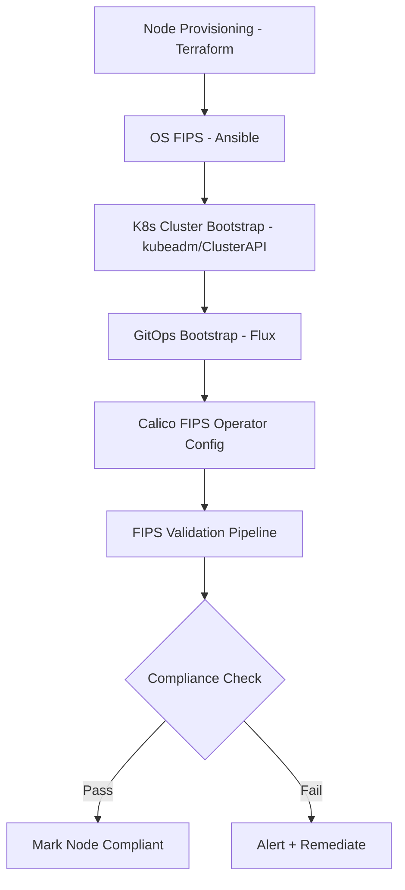

# How to Automate Calico FIPS Mode

Author: [nawazdhandala](https://github.com/nawazdhandala)

Tags: Calico, Kubernetes, Networking, FIPS, Automation, Compliance

Description: Automate Calico FIPS mode deployment and compliance verification using Infrastructure as Code, configuration management, and CI/CD pipelines.

---

## Introduction

Manually configuring FIPS mode across multiple Kubernetes clusters is error-prone and time-consuming. A missed FIPS configuration on even one node or component can invalidate your compliance posture. Automating FIPS mode setup ensures consistency across environments, makes compliance audits straightforward, and reduces the risk of misconfiguration. Calico FIPS mode is deprecated in current Calico documentation and will be removed in a future release, so verify that it is still supported for the Calico version you plan to deploy.

Automation for Calico FIPS mode spans multiple layers: OS-level FIPS configuration (typically via Ansible or Terraform), Kubernetes cluster bootstrapping with FIPS options, and Calico operator configuration via GitOps. Each layer must be automated independently and then validated together.

This guide provides automation patterns for each layer, culminating in a fully automated Calico FIPS-mode deployment pipeline.

## Prerequisites

- Ansible (for OS-level FIPS)
- Terraform or Cluster API (for cluster provisioning)
- Flux CD or ArgoCD (for GitOps delivery)
- Access to a Calico release and image source that supports Calico FIPS mode

## Automation Architecture


```mermaid
flowchart TD
    A[Node Provisioning - Terraform] --> B[OS FIPS - Ansible]
    B --> C[K8s Cluster Bootstrap - kubeadm/ClusterAPI]
    C --> D[GitOps Bootstrap - Flux]
    D --> E[Calico FIPS Operator Config]
    E --> F[FIPS Validation Pipeline]
    F --> G{Compliance Check}
    G -->|Pass| H[Mark Node Compliant]
    G -->|Fail| I[Alert + Remediate]
```

## Step 1: Ansible Role for OS FIPS

```yaml
# roles/fips-enable/tasks/main.yaml

---
- name: Check if FIPS is already enabled
  command: cat /proc/sys/crypto/fips_enabled
  register: fips_check
  changed_when: false
  failed_when: false

- name: Enable FIPS mode (RHEL)
  command: fips-mode-setup --enable
  when:
    - ansible_os_family == "RedHat"
    - fips_check.stdout != "1"
  notify: reboot host

- name: Enable FIPS mode (Ubuntu)
  command: pro enable fips-updates --assume-yes
  when:
    - ansible_distribution == "Ubuntu"
    - fips_check.stdout != "1"
  notify: reboot host

- name: Reboot immediately if FIPS was enabled
  meta: flush_handlers

- name: Verify FIPS after reboot
  command: cat /proc/sys/crypto/fips_enabled
  register: fips_status
  until: fips_status.stdout == "1"
  retries: 3
  delay: 10
```

## Step 2: Terraform Module for FIPS Nodes

```hcl
# modules/fips-node/main.tf
resource "aws_launch_template" "fips_node" {
  name_prefix   = "calico-fips-node-"
  image_id      = var.fips_ami_id  # Use FIPS-enabled AMI

  user_data = base64encode(templatefile("${path.module}/fips-userdata.sh.tpl", {
    calico_version = var.calico_version
    registry       = var.private_registry
  }))

  # Use instance type that supports AES-NI for performance
  instance_type = var.instance_type

  metadata_options {
    http_tokens = "required"  # Require IMDSv2 as a node hardening baseline
  }
}

# fips-userdata.sh.tpl
#!/bin/bash
set -euo pipefail

if [[ "$(cat /proc/sys/crypto/fips_enabled 2>/dev/null || echo 0)" != "1" ]]; then
  fips-mode-setup --enable
  reboot
fi
```

## Step 3: GitOps Configuration for Calico FIPS

```yaml
# gitops/clusters/production-fips/calico/installation.yaml
apiVersion: operator.tigera.io/v1
kind: Installation
metadata:
  name: default
spec:
  fipsMode: Enabled
  registry: ${FIPS_REGISTRY} # Must end with /
  calicoNetwork:
    ipPools:
      - cidr: 192.168.0.0/16
        encapsulation: VXLAN
```

```yaml
# gitops/clusters/production-fips/flux/kustomization.yaml
apiVersion: kustomize.toolkit.fluxcd.io/v1
kind: Kustomization
metadata:
  name: calico-fips
  namespace: flux-system
spec:
  interval: 5m
  path: ./clusters/production-fips/calico
  prune: true
  postBuild:
    substituteFrom:
      - kind: ConfigMap
        name: cluster-vars
  sourceRef:
    kind: GitRepository
    name: cluster-config
```

## Step 4: Automated FIPS Validation

```bash
#!/bin/bash
# validate-fips-compliance.sh
set -euo pipefail

echo "=== FIPS Compliance Validation ==="
failures=0

# 1. Check OS FIPS
echo "Checking OS FIPS..."
for node in $(kubectl get nodes -o jsonpath='{.items[*].metadata.name}'); do
  fips_status=$(kubectl debug node/${node} --attach=true --quiet --image=busybox -- \
    cat /host/proc/sys/crypto/fips_enabled 2>/dev/null | tr -d '\r')
  if [[ "${fips_status}" == "1" ]]; then
    echo "  OK: Node ${node} FIPS enabled"
  else
    echo "  FAIL: Node ${node} FIPS NOT enabled"
    failures=$((failures + 1))
  fi
done

# 2. Check Calico Installation fipsMode
echo "Checking Calico FIPS mode..."
fips_mode=$(kubectl get installation default -o jsonpath='{.spec.fipsMode}')
if [[ "${fips_mode}" == "Enabled" ]]; then
  echo "  OK: Installation fipsMode=Enabled"
else
  echo "  FAIL: Installation fipsMode=${fips_mode}"
  failures=$((failures + 1))
fi

# 3. Record Calico pod images for audit evidence
echo "Recording Calico images..."
kubectl get pods -n calico-system \
  -o jsonpath='{range .items[*]}{.metadata.name}{"\t"}{range .spec.containers[*]}{.image}{"\n"}{end}{end}'

echo "=== Validation Complete ==="
exit "${failures}"
```

## Step 5: CI/CD Pipeline Integration

```yaml
# .github/workflows/fips-compliance-check.yaml
name: FIPS Compliance Validation

on:
  schedule:
    - cron: '0 2 * * *'  # Daily compliance check
  push:
    paths:
      - 'clusters/*/calico/**'

jobs:
  validate-fips:
    runs-on: ubuntu-latest
    steps:
      - uses: actions/checkout@v4
      - name: Install kubectl
        uses: azure/setup-kubectl@v4
      - name: Configure kubeconfig
        run: |
          mkdir -p ~/.kube
          echo "${KUBECONFIG_B64}" | base64 -d > ~/.kube/config
        env:
          KUBECONFIG_B64: ${{ secrets.KUBECONFIG_B64 }}
      - name: Run FIPS validation
        run: |
          set -o pipefail
          chmod +x validate-fips-compliance.sh
          ./validate-fips-compliance.sh | tee compliance-report.txt
      - name: Upload compliance report
        uses: actions/upload-artifact@v4
        with:
          name: fips-compliance-report
          path: compliance-report.txt
```

## Conclusion

Automating Calico FIPS mode deployment reduces the risk of manual misconfiguration and helps keep FIPS-related settings consistent across clusters. By combining Ansible for OS-level FIPS, Terraform for infrastructure provisioning, GitOps for Calico configuration, and automated validation pipelines, you can monitor FIPS-related configuration as a continuous property of your infrastructure rather than a point-in-time audit result. Run the validation pipeline daily to detect any drift from the expected state.
