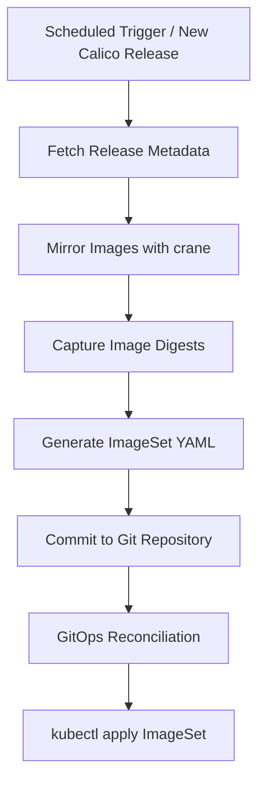

# How to Automate Calico ImageSet Management

Author: [nawazdhandala](https://github.com/nawazdhandala)

Tags: Calico, Kubernetes, Networking, ImageSet, Automation, CI/CD

Description: Learn how to automate Calico ImageSet creation, image mirroring, and registry synchronization using CI/CD pipelines and scripting tools.

---

## Introduction

Manually managing Calico ImageSets becomes unsustainable as your Calico version cadence increases. Each upgrade requires re-mirroring images, recalculating digests, and updating the `ImageSet` resource. Automating this process reduces human error, speeds up upgrades, and ensures consistency across environments.

Automation of ImageSet management typically involves three phases: detecting new Calico versions, mirroring images to the private registry, and generating and applying the updated `ImageSet` manifest. These phases can be orchestrated with CI/CD tools like GitHub Actions, GitLab CI, or Jenkins, making upgrades a pull-request-based workflow.

This guide shows how to build a complete automation pipeline that handles image mirroring, digest capture, and Kubernetes manifest generation, with GitOps delivery via a repository commit.

## Prerequisites

- Calico installed via the Tigera Operator (v3.25+), with the Installation resource configured to use your private registry or image path
- CI/CD platform (GitHub Actions, GitLab CI, or Jenkins)
- `crane` CLI available in your CI runner
- Private container registry with push access
- `kubectl` access to apply resources

## Automation Pipeline Architecture


```mermaid
flowchart TD
    A[Scheduled Trigger / New Calico Release] --> B[Fetch Release Metadata]
    B --> C[Mirror Images with crane]
    C --> D[Capture Image Digests]
    D --> E[Generate ImageSet YAML]
    E --> F[Commit to Git Repository]
    F --> G[GitOps Reconciliation]
    G --> H[kubectl apply ImageSet]
```

## Step 1: Image Mirror Script

```bash
#!/bin/bash
# mirror-calico-images.sh

set -euo pipefail

CALICO_VERSION="${1:-v3.32.0}"
OPERATOR_IMAGE="${OPERATOR_IMAGE:-quay.io/tigera/operator:v1.42.0}"
REGISTRY="${REGISTRY:-registry.internal.example.com/calico}"

IMAGES=(
  "quay.io/calico/cni|calico/cni|${CALICO_VERSION}"
  "quay.io/calico/node|calico/node|${CALICO_VERSION}"
  "quay.io/calico/kube-controllers|calico/kube-controllers|${CALICO_VERSION}"
  "quay.io/calico/typha|calico/typha|${CALICO_VERSION}"
  "quay.io/calico/pod2daemon-flexvol|calico/pod2daemon-flexvol|${CALICO_VERSION}"
  "quay.io/calico/apiserver|calico/apiserver|${CALICO_VERSION}"
  "quay.io/calico/node-windows|calico/node-windows|${CALICO_VERSION}"
  "quay.io/calico/key-cert-provisioner|calico/key-cert-provisioner|${CALICO_VERSION}"
  "${OPERATOR_IMAGE%:*}|tigera/operator|${OPERATOR_IMAGE##*:}"
)

DIGEST_FILE="imageset-digests.env"
> "${DIGEST_FILE}"

for entry in "${IMAGES[@]}"; do
  IFS="|" read -r src_image imageset_image image_tag <<< "${entry}"
  image_name=$(basename "${imageset_image}")
  src="${src_image}:${image_tag}"
  dest="${REGISTRY}/${image_name}:${image_tag}"

  echo "Mirroring ${src} -> ${dest}"
  crane copy "${src}" "${dest}"

  digest=$(crane digest "${dest}")
  var_name="${image_name//-/_}"
  echo "${var_name}=${digest}" >> "${DIGEST_FILE}"
  echo "${var_name}_image=${imageset_image}" >> "${DIGEST_FILE}"
  echo "  Digest: ${digest}"
done

echo "Mirroring complete. Digests saved to ${DIGEST_FILE}"
```

## Step 2: ImageSet Generator Script

```bash
#!/bin/bash
# generate-imageset.sh
set -euo pipefail

CALICO_VERSION="${1:-v3.32.0}"
source imageset-digests.env

cat > "calico-imageset-${CALICO_VERSION}.yaml" <<EOF
apiVersion: operator.tigera.io/v1
kind: ImageSet
metadata:
  name: calico-${CALICO_VERSION}
spec:
  images:
    - image: "${cni_image}"
      digest: "${cni}"
    - image: "${node_image}"
      digest: "${node}"
    - image: "${kube_controllers_image}"
      digest: "${kube_controllers}"
    - image: "${typha_image}"
      digest: "${typha}"
    - image: "${pod2daemon_flexvol_image}"
      digest: "${pod2daemon_flexvol}"
    - image: "${apiserver_image}"
      digest: "${apiserver}"
    - image: "${node_windows_image}"
      digest: "${node_windows}"
    - image: "${key_cert_provisioner_image}"
      digest: "${key_cert_provisioner}"
    - image: "${operator_image}"
      digest: "${operator}"
EOF

echo "Generated: calico-imageset-${CALICO_VERSION}.yaml"
```

## Step 3: GitHub Actions Workflow

```yaml
# .github/workflows/calico-imageset-sync.yaml
name: Sync Calico ImageSet

on:
  schedule:
    - cron: '0 6 * * 1'  # Weekly on Monday
  workflow_dispatch:
    inputs:
      calico_version:
        description: 'Calico version to mirror'
        required: true
        default: 'v3.32.0'
      operator_image:
        description: 'Tigera operator image for this Calico release'
        required: true
        default: 'quay.io/tigera/operator:v1.42.0'

jobs:
  mirror-and-generate:
    runs-on: ubuntu-latest
    env:
      REGISTRY: ${{ secrets.REGISTRY_URL }}
      CALICO_VERSION: ${{ inputs.calico_version || 'v3.32.0' }}
      OPERATOR_IMAGE: ${{ inputs.operator_image || 'quay.io/tigera/operator:v1.42.0' }}
    steps:
      - uses: actions/checkout@v4

      - name: Install crane
        run: |
          curl -sL https://github.com/google/go-containerregistry/releases/latest/download/go-containerregistry_Linux_x86_64.tar.gz | tar -xz
          sudo mv crane /usr/local/bin/

      - name: Login to registry
        run: |
          echo "${{ secrets.REGISTRY_PASSWORD }}" | crane auth login \
            "${REGISTRY}" -u "${{ secrets.REGISTRY_USERNAME }}" --password-stdin

      - name: Mirror images
        run: |
          chmod +x mirror-calico-images.sh
          ./mirror-calico-images.sh "${CALICO_VERSION}"

      - name: Generate ImageSet
        run: |
          chmod +x generate-imageset.sh
          ./generate-imageset.sh "${CALICO_VERSION}"

      - name: Commit and push
        run: |
          git config user.email "ci@example.com"
          git config user.name "CI Bot"
          git add "calico-imageset-*.yaml"
          git commit -m "chore: sync Calico ImageSet ${CALICO_VERSION}"
          git push
```

## Step 4: Automated Application via Flux

```yaml
# flux/calico-imageset-kustomization.yaml
apiVersion: kustomize.toolkit.fluxcd.io/v1
kind: Kustomization
metadata:
  name: calico-imageset
  namespace: flux-system
spec:
  interval: 5m
  path: ./calico/imagesets
  prune: true
  sourceRef:
    kind: GitRepository
    name: cluster-config
```

## Step 5: Validate Automation

```bash
# Check the active ImageSet after automation runs
kubectl get imagesets.operator.tigera.io -o wide

# Verify operator used the new ImageSet
kubectl get installation default -o yaml | grep imageSet

# Check pod image sources
kubectl get pods -n calico-system -o jsonpath='{range .items[*]}{.spec.containers[*].image}{"\n"}{end}'
```

## Conclusion

Automating Calico ImageSet management transforms a manual, error-prone process into a reliable, auditable CI/CD workflow. By combining image mirroring scripts, digest capture, manifest generation, and GitOps delivery, every Calico upgrade becomes a tracked pull request with full history. This approach scales well across multiple clusters and ensures your private registry stays synchronized with upstream Calico releases without manual intervention.
