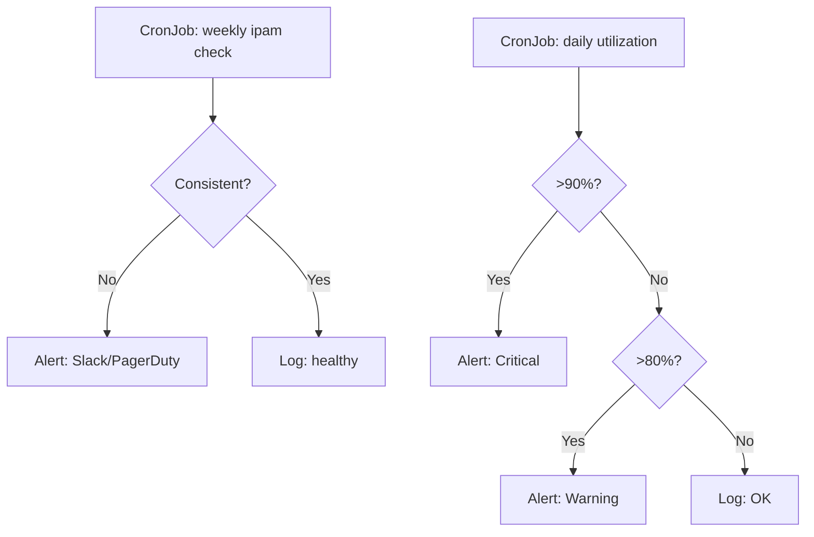

# How to Automate Calico IPAM Checks

Author: [nawazdhandala](https://github.com/nawazdhandala)

Tags: Calico, Kubernetes, Networking, IPAM, Automation

Description: Automate Calico IPAM consistency checks and utilization monitoring with CronJobs that detect IP leaks early and alert when utilization approaches critical thresholds.

---

## Introduction

Running `calicoctl ipam check` manually every week is easy to forget, especially during busy operational periods. Automating IPAM checks as Kubernetes CronJobs ensures consistent execution and alerts before IP exhaustion becomes a crisis. Two automation patterns cover the full IPAM health picture: consistency checks (weekly) and utilization monitoring (daily or continuous).

## Automated IPAM Check CronJob

```yaml
apiVersion: batch/v1
kind: CronJob
metadata:
  name: calico-ipam-check
  namespace: calico-system
spec:
  schedule: "0 6 * * 1"  # Every Monday at 6am
  jobTemplate:
    spec:
      template:
        spec:
          serviceAccountName: calico-diagnostics
          containers:
            - name: ipam-check
              image: calico/ctl:v3.27.0
              command:
                - /bin/sh
                - -c
                - |
                  echo "=== Calico IPAM Check $(date) ===" && \
                  calicoctl ipam check && \
                  echo "IPAM check passed" || \
                  echo "IPAM check FAILED - review output above"
              env:
                - name: DATASTORE_TYPE
                  value: kubernetes
          restartPolicy: OnFailure
```

## IPAM Utilization Exporter

```bash
#!/bin/bash
# ipam-utilization-exporter.sh
# Export IPAM utilization as Prometheus metrics on port 9099

while true; do
  TOTAL=$(calicoctl ipam show 2>/dev/null | grep "IPs in use" | \
    awk '{print $(NF-1)}' | tr -d '(' || echo 0)
  USED=$(calicoctl ipam show 2>/dev/null | grep "IPs in use" | \
    awk '{print $NF}' | tr -d '%' || echo 0)

  cat > /tmp/ipam-metrics.txt << METRICS
# HELP calico_ipam_utilization_percent IPAM IP utilization percentage
# TYPE calico_ipam_utilization_percent gauge
calico_ipam_utilization_percent ${USED}
METRICS

  echo "$(date): IPAM utilization ${USED}%"
  sleep 300  # Every 5 minutes
done
```

## Automated IPAM Alert Script

```bash
#!/bin/bash
# check-ipam-and-alert.sh
SLACK_WEBHOOK="${SLACK_WEBHOOK_URL}"
WARN_THRESHOLD=80
CRIT_THRESHOLD=90

USED=$(calicoctl ipam show 2>/dev/null | grep "IPs in use" | \
  awk '{print $NF}' | tr -d '%' || echo 0)

if [ "${USED}" -ge "${CRIT_THRESHOLD}" ]; then
  MSG="CRITICAL: Calico IPAM at ${USED}% utilization - pod scheduling may fail"
  curl -X POST "${SLACK_WEBHOOK}" \
    -H 'Content-type: application/json' \
    --data "{\"text\":\"${MSG}\"}"
  exit 2
elif [ "${USED}" -ge "${WARN_THRESHOLD}" ]; then
  MSG="WARNING: Calico IPAM at ${USED}% utilization - consider adding IPPool"
  curl -X POST "${SLACK_WEBHOOK}" \
    -H 'Content-type: application/json' \
    --data "{\"text\":\"${MSG}\"}"
  exit 1
fi
echo "IPAM utilization OK: ${USED}%"
```

## Automation Architecture



## Conclusion

Automating Calico IPAM checks with a weekly consistency CronJob and a daily utilization check CronJob provides complete IPAM visibility without manual effort. The consistency check catches leaked IPs that won't appear in utilization metrics. The utilization check provides early warning before exhaustion. Both should be configured from day one in production - not after the first IPAM-related incident.
