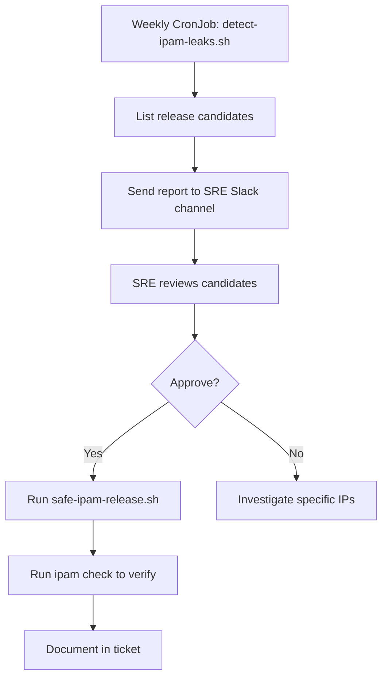

# How to Automate Calico IPAM Release Workflows

Author: [nawazdhandala](https://github.com/nawazdhandala)

Tags: Calico, Kubernetes, Networking, IPAM, Automation

Description: Automate Calico IPAM leak detection and safe release workflows with scripts that cross-check IPAM allocations against running pods and generate release candidates for human approval.

---

## Introduction

Automating IPAM release workflows requires a careful approach: the detection and verification steps can be fully automated, but the actual `calicoctl ipam release` command should require human approval except in very controlled environments. The recommended automation pattern generates a list of release candidates with verification results, which an engineer reviews before executing the releases.

## Automated IPAM Leak Detection Script

```bash
#!/bin/bash
# detect-ipam-leaks.sh
# Finds IPs allocated in IPAM but with no corresponding running pod

echo "=== Calico IPAM Leak Detection $(date) ==="

# Get all allocated IPs from IPAM
ALLOCATED_IPS=$(calicoctl ipam check --show-all-ips 2>/dev/null | \
  grep -oP '\d+\.\d+\.\d+\.\d+' | sort -u)

# Get all pod IPs currently running
RUNNING_IPS=$(kubectl get pods --all-namespaces -o wide --no-headers | \
  awk '{print $7}' | grep -oP '\d+\.\d+\.\d+\.\d+' | sort -u)

# Find IPs in IPAM but not in running pods
LEAKED_IPS=$(comm -23 \
  <(echo "${ALLOCATED_IPS}") \
  <(echo "${RUNNING_IPS}"))

if [ -z "${LEAKED_IPS}" ]; then
  echo "No leaked IPs detected"
  exit 0
fi

echo "Potential leaked IPs:"
echo "${LEAKED_IPS}" | while read ip; do
  # Verify against endpoints too
  IN_ENDPOINTS=$(kubectl get endpoints --all-namespaces | grep -c "${ip}" || echo 0)
  if [ "${IN_ENDPOINTS}" -eq 0 ]; then
    echo "  RELEASE CANDIDATE: ${ip}"
  else
    echo "  IN USE (endpoint): ${ip}"
  fi
done
```

## Semi-Automated Release with Human Approval

```bash
#!/bin/bash
# safe-ipam-release.sh
# Presents candidates for human review before release

CANDIDATES_FILE="/tmp/ipam-release-candidates-$(date +%Y%m%d).txt"

# Run detection
./detect-ipam-leaks.sh | grep "RELEASE CANDIDATE" | \
  awk '{print $NF}' > "${CANDIDATES_FILE}"

COUNT=$(wc -l < "${CANDIDATES_FILE}")
echo "Found ${COUNT} release candidates. Review: ${CANDIDATES_FILE}"
cat "${CANDIDATES_FILE}"

echo ""
read -p "Proceed with releasing all candidates? (yes/no): " CONFIRM
if [ "${CONFIRM}" = "yes" ]; then
  while IFS= read -r ip; do
    echo "Releasing: ${ip}"
    calicoctl ipam release --ip="${ip}"
  done < "${CANDIDATES_FILE}"
  echo "Release complete. Running ipam check..."
  calicoctl ipam check
fi
```

## Automation Architecture



## Conclusion

IPAM release automation works best as a detection-first, human-approval model: automate the detection and candidate generation, but require human review before executing releases. This prevents automated systems from accidentally releasing IPs that appear leaked but are actually in use by infrastructure components not tracked as regular pods. Run the detection script weekly, send the candidate list to the SRE Slack channel, and process releases as a routine maintenance task rather than an emergency procedure.
