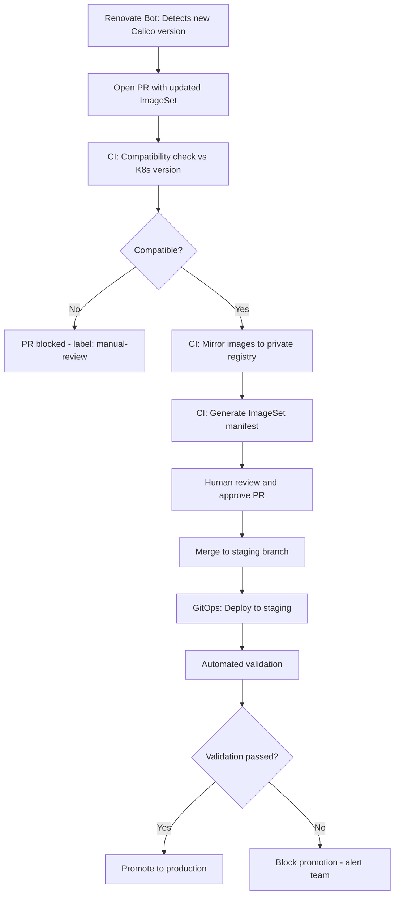

# How to Automate Calico on Kubernetes Upgrades

Author: [nawazdhandala](https://github.com/nawazdhandala)

Tags: Calico, Kubernetes, Networking, Upgrades, Automation, GitOps

Description: Automate Calico upgrades on Kubernetes using GitOps pipelines, automated compatibility checking, and staged rollout with automated validation at each stage.

---

## Introduction

Automating Calico upgrades reduces the time engineers spend on routine upgrade tasks and eliminates the risk of manual errors during the upgrade process. A good Calico upgrade automation pipeline handles version discovery, compatibility checking, ImageSet generation, staged rollout, and post-upgrade validation.

## Upgrade Automation Architecture



## Renovate Configuration for Calico

```json
// renovate.json
{
  "extends": ["config:base"],
  "packageRules": [
    {
      "matchDepTypes": ["calico"],
      "automerge": false,
      "reviewers": ["platform-team"],
      "labels": ["calico-upgrade"]
    }
  ],
  "customDatasources": {
    "calico": {
      "defaultRegistryUrlTemplate": "https://github.com/projectcalico/calico",
      "transformTemplates": [
        "{\"releases\": $.releases.map(r => {\"version\": r.version})}"
      ]
    }
  }
}
```

## Automated Compatibility Check Script

```bash
#!/bin/bash
# check-calico-k8s-compatibility.sh
CALICO_VERSION="${1:?Provide Calico version}"
K8S_VERSION=$(kubectl version -o json | jq -r '.serverVersion.gitVersion')

# Compatibility matrix (simplified)
declare -A COMPAT_MAP
COMPAT_MAP["v3.27"]="1.26 1.27 1.28 1.29"
COMPAT_MAP["v3.28"]="1.27 1.28 1.29 1.30"

# Extract minor version
K8S_MINOR=$(echo "${K8S_VERSION}" | grep -oP "(?<=v1\.)\d+")
CALICO_MINOR=$(echo "${CALICO_VERSION}" | grep -oP "(?<=v3\.)\d+")

# Check compatibility
COMPATIBLE_K8S="${COMPAT_MAP[v3.${CALICO_MINOR}]}"
if echo "${COMPATIBLE_K8S}" | grep -q "1.${K8S_MINOR}"; then
  echo "COMPATIBLE: Calico ${CALICO_VERSION} supports Kubernetes v1.${K8S_MINOR}"
  exit 0
else
  echo "INCOMPATIBLE: Calico ${CALICO_VERSION} not tested with Kubernetes v1.${K8S_MINOR}"
  echo "Supported K8s versions for this Calico: ${COMPATIBLE_K8S}"
  exit 1
fi
```

## Complete Upgrade CI Pipeline

```yaml
# .github/workflows/calico-upgrade.yaml
name: Calico Upgrade Pipeline

on:
  pull_request:
    paths:
      - 'clusters/*/calico/imageset*.yaml'
      - 'clusters/*/calico/installation.yaml'

jobs:
  validate-upgrade:
    runs-on: ubuntu-latest
    steps:
      - uses: actions/checkout@v4

      - name: Extract target version
        id: version
        run: |
          VERSION=$(grep "name: calico-" clusters/staging/calico/imageset*.yaml | \
            head -1 | awk -F'calico-' '{print $2}' | tr -d '"')
          echo "version=${VERSION}" >> $GITHUB_OUTPUT

      - name: Check compatibility
        run: |
          ./scripts/check-calico-k8s-compatibility.sh ${{ steps.version.outputs.version }}

      - name: Deploy to staging
        if: success()
        run: |
          flux reconcile kustomization calico --with-source

      - name: Run validation
        run: |
          sleep 120  # Wait for rollout
          ./scripts/validate-calico-upgrade.sh ${{ steps.version.outputs.version }}
```

## Automated Post-Upgrade Validation

```bash
#!/bin/bash
# validate-calico-upgrade.sh
TARGET_VERSION="${1:?Provide target version}"
FAILURES=0

echo "=== Post-Upgrade Calico Validation ==="

# Version check
RUNNING_VERSION=$(kubectl get installation default \
  -o jsonpath='{.status.calicoVersion}')
if [[ "${RUNNING_VERSION}" == "${TARGET_VERSION}" ]]; then
  echo "OK:   Version ${TARGET_VERSION} running"
else
  echo "FAIL: Expected ${TARGET_VERSION}, got ${RUNNING_VERSION}"
  FAILURES=$((FAILURES + 1))
fi

# All pods running
NOT_RUNNING=$(kubectl get pods -n calico-system --no-headers | grep -v Running | wc -l)
[[ "${NOT_RUNNING}" -eq 0 ]] && echo "OK:   All calico-system pods running" || \
  { echo "FAIL: ${NOT_RUNNING} pods not running"; FAILURES=$((FAILURES + 1)); }

# TigeraStatus Available
STATUS=$(kubectl get tigerastatus calico \
  -o jsonpath='{.status.conditions[?(@.type=="Available")].status}')
[[ "${STATUS}" == "True" ]] && echo "OK:   TigeraStatus Available" || \
  { echo "FAIL: TigeraStatus not Available"; FAILURES=$((FAILURES + 1)); }

echo "Validation: ${FAILURES} failure(s)"
exit ${FAILURES}
```

## Conclusion

Automating Calico upgrades through a CI/CD pipeline with compatibility checking, staged rollout, and automated validation transforms a manual, risky process into a reliable, repeatable workflow. Renovate Bot handles version detection, the CI pipeline handles validation and staging deployment, and human approval is required only for production promotion. This balances automation efficiency with human oversight for production changes.
