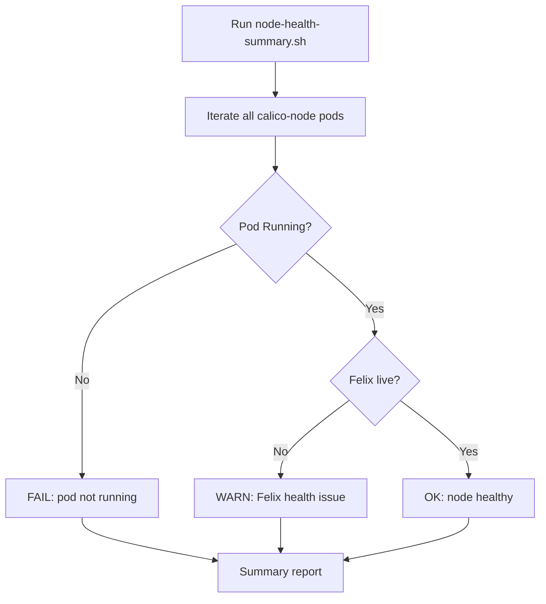

# How to Automate Calico Node Diagnostics

Author: [nawazdhandala](https://github.com/nawazdhandala)

Tags: Calico, Kubernetes, Networking, Diagnostics, Automation

Description: Automate Calico per-node diagnostic collection across all cluster nodes, including Felix health status, BGP peer state, and node-level diag bundles, for rapid multi-node incident analysis.

---

## Introduction

When a networking issue affects multiple nodes, manually running diagnostics on each node one at a time is too slow. Automating node diagnostics means running the same set of checks across all calico-node pods in parallel and aggregating the results, so you can quickly identify which nodes are healthy and which have problems.

## Automated Multi-Node Diagnostic Collection

```bash
#!/bin/bash
# collect-calico-node-diags.sh
set -euo pipefail

BUNDLE_DIR="calico-node-diags-$(date +%Y%m%d-%H%M%S)"
mkdir -p "${BUNDLE_DIR}"

for pod in $(kubectl get pods -n calico-system -l app=calico-node \
  -o jsonpath='{.items[*].metadata.name}'); do

  NODE=$(kubectl get pod -n calico-system "${pod}" \
    -o jsonpath='{.spec.nodeName}')
  NODE_DIR="${BUNDLE_DIR}/${NODE}"
  mkdir -p "${NODE_DIR}"

  echo "Collecting diagnostics from ${NODE}..."

  # Felix health
  kubectl exec -n calico-system "${pod}" -c calico-node -- \
    calico-node -felix-live > "${NODE_DIR}/felix-live.txt" 2>&1 || \
    echo "Felix not live" > "${NODE_DIR}/felix-live.txt"

  # BGP state
  kubectl exec -n calico-system "${pod}" -c calico-node -- \
    calicoctl node status > "${NODE_DIR}/bgp-status.txt" 2>/dev/null || \
    echo "BGP status unavailable" > "${NODE_DIR}/bgp-status.txt"

  # Recent logs
  kubectl logs -n calico-system "${pod}" -c calico-node \
    --tail=200 > "${NODE_DIR}/calico-node.log" 2>/dev/null || true

done

tar -czf "${BUNDLE_DIR}.tar.gz" "${BUNDLE_DIR}/"
echo "Node diagnostic bundle: ${BUNDLE_DIR}.tar.gz"
```

## Automated Node Health Summary

```bash
#!/bin/bash
# calico-node-health-summary.sh
echo "=== Calico Node Health Summary $(date) ==="
echo ""

TOTAL=0
HEALTHY=0
ISSUES=0

for pod in $(kubectl get pods -n calico-system -l app=calico-node \
  -o jsonpath='{.items[*].metadata.name}'); do

  NODE=$(kubectl get pod -n calico-system "${pod}" \
    -o jsonpath='{.spec.nodeName}')
  POD_STATUS=$(kubectl get pod -n calico-system "${pod}" \
    -o jsonpath='{.status.phase}')
  TOTAL=$((TOTAL + 1))

  if [ "${POD_STATUS}" = "Running" ]; then
    LIVE=$(kubectl exec -n calico-system "${pod}" -c calico-node -- \
      calico-node -felix-live 2>&1 | grep -c "Calico is live" || echo 0)
    if [ "${LIVE}" -gt 0 ]; then
      echo "OK  : ${NODE} (${pod})"
      HEALTHY=$((HEALTHY + 1))
    else
      echo "WARN: ${NODE} (${pod}) - Felix not live"
      ISSUES=$((ISSUES + 1))
    fi
  else
    echo "FAIL: ${NODE} (${pod}) - Pod status: ${POD_STATUS}"
    ISSUES=$((ISSUES + 1))
  fi
done

echo ""
echo "Nodes: ${TOTAL} total, ${HEALTHY} healthy, ${ISSUES} with issues"
exit ${ISSUES}
```

## Automation Architecture



## Conclusion

Automating Calico node diagnostics across all nodes turns a 20-minute manual process into a 2-minute automated collection. The health summary script provides a quick pass/fail signal for each node, and the full diagnostic collection script provides the detailed data needed for root cause analysis. Run the health summary as the first step in any Calico networking incident to immediately identify which nodes are affected.
